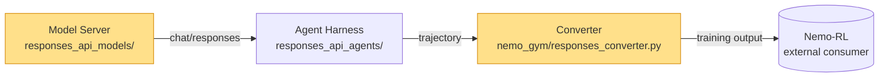

# Agent Team PR Review — NVIDIA-NeMo/Gym

Review a pull request using a coordinated team of specialized agents.

**Repo**: `NVIDIA-NeMo/Gym`

> For reviewing your *local working diff* (uncommitted changes), prefer the
> built-in `/code-review` skill. This skill is for **GitHub PRs** and uses a
> team of agents for broad, parallel coverage.

## Coordination model (this harness)

### Side-panel layout (preferred when available)

If `TeamCreate` appears in your available tools, use it — each teammate opens in its
own tmux pane, giving the user a side-panel view with the leader on the left and
agents on the right.

**Requirements** (already configured in this repo's `.claude/settings.json`):
```json
{ "enableExperimentalFeatures": { "agentTeams": true }, "teammateMode": "tmux" }
```

With `TeamCreate` available:

- **Spawn** each Wave 1 agent with `TeamCreate` (one call per agent). Each teammate
  appears in its own pane. Pass the full prompt as the `initialMessage`.
- **Communicate** with running teammates via `SendMessage` (by name or ID).
- **Tear down** teammates after collation with `TeamDelete` (see Phase 7).
- Agent findings arrive via `SendMessage` from the teammate back to the leader.

### Background-task fallback (when TeamCreate is unavailable)

If `TeamCreate` is NOT in your tool list, fall back to the `Agent` tool:

- **Spawn** each wave-1 agent with the `Agent` tool using `run_in_background: true`
  and a stable `description`/name. You are notified when each finishes; its final
  message is the agent's findings (returned to you, not shown to the user).
- **Continue / question** an already-spawned agent with `SendMessage` addressed to
  that agent's ID or name — its context is preserved.
- **Lost findings**: an agent's idle notification can arrive WITHOUT its findings
  message (only the summary line). If TaskList shows its task completed but no content
  reached you, `SendMessage` the agent asking it to resend (split across multiple
  messages if long) — its context is preserved and it responds quickly.

### Common to both modes

- Use `TaskCreate` / `TaskUpdate` / `TaskList` to maintain a shared, visible task
  list so the user can follow progress. The leader (you) owns orchestration; agents
  do NOT poll — they report back on completion and you push follow-ups.
- Pick `subagent_type: "general-purpose"` for the analysis agents (they need Bash,
  Read, Grep, Glob, WebFetch, SendMessage). Use `Explore` only for read-only scouting.

**Sandbox**: Pass `dangerouslyDisableSandbox: true` on Bash calls that need the
network (`gh`, `git fetch`, `uv sync`) or that run in worktree/container
environments where bubblewrap fails to initialize
(`bwrap: loopback: Failed RTM_NEWADDR: Operation not permitted`). When in doubt for
this skill's `gh`/`git`/`uv` calls, set it to avoid a wasted round-trip.

---

## Phase 0: Parse & Validate

Extract `$PRNUM` from `$ARGUMENTS`. A PR number is required.

```bash
gh pr view $PRNUM --repo NVIDIA-NeMo/Gym --json number
```

If invalid, ask the user for a valid PR number.

---

## Phase 1: Setup & Context

### 1.1 Checkout PR in a dedicated worktree

Run the review in its **own git worktree** — a sibling checkout — so the user's main
working tree (and any in-progress edits, running servers, or branch they have checked out)
is never disturbed. This mirrors `claude --worktree`: the whole review happens against an
isolated copy of the repo, then the worktree is torn down in Phase 7.

Fetch the PR head into a review branch, then create the sibling worktree for it:

```bash
# Fetch the PR head into a local review branch (no checkout in the main worktree).
# pull/$PRNUM/head works for fork-based PRs too.
git fetch origin pull/$PRNUM/head:pr-$PRNUM-team-review

# Create a sibling worktree checked out to the review branch: <repo>-pr-<PRNUM>-team-review
REPO_ROOT="$(git rev-parse --show-toplevel)"
WORKTREE_PATH="$(dirname "$REPO_ROOT")/$(basename "$REPO_ROOT")-pr-$PRNUM-team-review"
# If a stale worktree/branch from a previous run exists, remove it first:
#   git worktree remove "$WORKTREE_PATH" --force 2>/dev/null; git branch -D pr-$PRNUM-team-review 2>/dev/null
git worktree add "$WORKTREE_PATH" pr-$PRNUM-team-review
```

Record `$WORKTREE_PATH`. (NeMo Gym has no git submodules — no `git submodule update`
needed.)

**Switch the session into the worktree** so every subsequent tool call — and every agent
you spawn in Phase 2 — operates against the isolated checkout, exactly like
`claude --worktree`:

- **If `EnterWorktree` is available** (preferred): call
  `EnterWorktree(path="$WORKTREE_PATH")`. This switches the session's working directory
  into the worktree and clears CWD-dependent caches, so the review — including agents
  spawned afterward, which inherit this cwd — runs entirely inside it. Because the session
  cwd is now the worktree, agents need no special path handling: their `Read`/`Grep`/`git`
  calls already resolve against the isolated checkout.
- **If `EnterWorktree` is NOT available** (fallback): treat `$WORKTREE_PATH` as the review
  root. Do NOT `git checkout` in the main worktree. Fold `$WORKTREE_PATH` into the common
  preamble (`WORKTREE_PATH`) and instruct every agent to run its local file/`git`
  operations against that path (e.g. `git -C "$WORKTREE_PATH" ...`, and Read/Glob/Grep on
  paths under it).

Teardown of the worktree happens in Phase 7.

### 1.2 Gather PR metadata (parallel)

Run these in parallel:

```bash
# PR metadata (include mergeable to detect conflicts)
gh pr view $PRNUM --repo NVIDIA-NeMo/Gym \
  --json title,body,author,baseRefName,headRefOid,labels,files,comments,reviews,reviewRequests,mergeable,mergeStateStatus

# Full diff
gh pr diff $PRNUM --repo NVIDIA-NeMo/Gym

# Inline review comments
gh api repos/NVIDIA-NeMo/Gym/pulls/$PRNUM/comments
```

Record: `$TITLE`, `$AUTHOR`, `$BASE_BRANCH`, `$HEAD_SHA`, changed files list, existing
comments, existing reviews.

**Merge conflict check**: If `mergeable` is `"CONFLICTING"` or `mergeStateStatus` is
`"DIRTY"`, include a prominent note asking the author to rebase onto `$BASE_BRANCH` and
resolve conflicts. Add this as the first item in the review body.

**Read the PR description (`body`) carefully.** It contains the author's intent,
motivation, and test plan. Parse it for linked issues (`Fixes #123`, `Closes #456`,
`Related: #789`). For each, fetch:

```bash
gh issue view <ISSUE_NUM> --repo NVIDIA-NeMo/Gym --json title,body,comments,labels
```

The PR description + linked issues + diff together form the full context. Pass this
context to every agent so they understand *why* the change is being made.

**Summarize what the PR is about (share with the user, then carry it through).** Before
spawning agents, post a short plain-language summary to the user so they know what's
being reviewed without reading the diff themselves. Cover: (1) **what the PR does** in
1-3 sentences (the feature/fix and its motivation), (2) the **components touched** and
rough size (files / +/− lines), (3) any **upfront flags** worth surfacing immediately
(merge conflict, no tests added, dependency on unmerged/external work, `verified: true`
without evidence). Keep this summary on hand — restate the "what this PR does" line at
the top of the Phase 4 preview so the findings are read in context. Every agent prompt
already receives this context via the common preamble; the summary is the user-facing
version of it.

Pair this plain-language summary with the **end-to-end system context and diagram** from
§1.3a (where the PR sits in the architecture, the data-flow path, and the touched
modules) — share both together so the user (and every agent) understands not just *what*
the PR does but *where in the system* it lives.

### 1.2a Reward-profiling / baselining evidence check

NeMo Gym benchmarks are baselined before they're trusted. New `verified: true` configs
and changes to verifier/reward logic should be backed by **reward-profiling evidence**.

- **New resources server / benchmark**: the author should report baseline reward numbers
  from a profiling run (e.g. `ng_collect_rollouts` + `ng_reward_profile`, the
  `*_aggregate_metrics.json` summary), demonstrating the verifier produces sensible
  rewards on known-good and known-bad trajectories.
- **Verifier / reward modification**: expect a before/after comparison or proof the
  reward distribution didn't silently shift.
- A pre-commit hook (`add-verified-flag`) sets new resources-server YAMLs to
  `verified: false`. If a PR flips a config to `verified: true`, it MUST cite the
  baselining evidence. Flag missing evidence as a `[BASELINE]` finding with a specific
  ask (which profiling numbers to provide).

Record `$BASELINE_EVIDENCE_FOUND` (yes/no/not-applicable) and pass to the
`resources-server-expert` and `gym-core-expert`.

### 1.2b Documentation check

NeMo Gym docs live in `fern/` (see the `nemo-gym-docs` skill) and the resources-server
table in root `README.md` is auto-maintained by the `update-readme-table` pre-commit hook.

1. New user-facing feature / benchmark → check `fern/versions/latest/pages/` for a
   matching page or tutorial. If a notable feature is undocumented, flag `[DOC]`.
2. New resources server → confirm the README table row exists (the hook adds it; if the
   PR hand-edited the table or the row is missing, flag it).

Record `$HAS_DOCS` (yes/no) and pass to agents.

### 1.3 Determine touched components

```bash
gh pr diff $PRNUM --repo NVIDIA-NeMo/Gym --name-only
```

Map top-level paths to which experts to spawn (conditional — only spawn an expert when
its area is touched):

| Path prefix | Spawn agent |
|-------------|-------------|
| `nemo_gym/` (core library, CLI, server_utils) | `gym-core-expert` |
| `resources_servers/` | `resources-server-expert` |
| `responses_api_agents/` | `agent-harness-expert` |
| `responses_api_models/` | `model-server-expert` |
| `tests/`, any `*/tests/` | `test-agent` (always spawn) |
| `fern/` | fold into `gym-core-expert` (docs review) |
| `benchmarks/`, `resources_servers/` (verifier/reward), datasets, training configs | `research-reviewer` (AI-research lens) |

`bug-finder`, `test-agent`, and `comment-reviewer` are always spawned. If only one
component area is touched, still spawn `gym-core-expert` as the generalist owner of the
cross-cutting guidelines.

**Spawn `research-reviewer` (the AI-research / benchmark-methodology lens) whenever the
PR affects what is measured or how well** — i.e. it adds/changes a benchmark, dataset,
verifier/reward logic, scoring, evaluation config, or reports baseline numbers. The other
agents cover engineering *correctness*; `research-reviewer` covers *research validity*
(does the change faithfully and rigorously measure what it claims?), which engineering
review alone misses. Skip it only for purely infra/plumbing PRs with no measurement
impact (e.g. CI, logging, refactors with no reward/dataset effect).

### 1.3a Situate the PR in the system (end-to-end context + diagram) — ALWAYS

ALWAYS produce a short "where does this PR sit in the big picture" briefing **and a
diagram**, and share both with the user alongside the Phase 1.2 summary. A reviewer
(human or agent) judges a change far better when they can see which part of the system it
touches and how data flows through the modules it changes — a diff in isolation hides
that. This is not optional and not conditional on PR size.

NeMo Gym decomposes into the four components in `CLAUDE.md` — **Dataset** (JSONL) →
**Agent Harness** (`responses_api_agents/`) ↔ **Model Server** (`responses_api_models/`),
scored by a **Resources Server** (`resources_servers/`), all wired by the **core library**
(`nemo_gym/`: BaseServer/SimpleServer, `server_utils`, `responses_converter`, Hydra
config). For deeper architecture read `fern/versions/latest/pages/about/`.

Build the briefing from the ACTUAL repo, not from memory:
1. **Component map**: for each touched top-level path (from 1.3), name its component and
   its one-line role in the system.
2. **Data-flow path**: trace the path the change participates in — what *produces* the
   data, what *transforms* it, what *consumes* it — citing `file:line`. Name external
   producers/consumers when the flow crosses the repo boundary (e.g. an inference
   provider upstream, a training framework like Nemo-RL downstream).
3. **Position / blast radius**: note whether the change sits on a hot path, a startup
   path, a serialization boundary, a shared schema/contract, etc. — i.e. what a mistake
   here would ripple into.
4. **Background references**: for each domain term the PR introduces (benchmark, method,
   external framework — e.g. a paper-backed technique or dataset suite), collect a
   canonical link (paper + repo). VERIFY every reference before citing — resolve arXiv
   IDs via the API (`curl -sL "https://export.arxiv.org/api/query?search_query=..."` —
   note: must be **https**; http 301s to an empty body) or fetch the repo README; never
   cite paper IDs from memory. These links go in a "Background" section at the top of
   the review body so readers unfamiliar with the domain can follow the findings. Also
   be precise about external endpoints in the briefing and diagram (e.g. "NVIDIA hosted
   inference endpoint, integrate.api.nvidia.com" rather than a bare product acronym).

**Render a diagram** (Mermaid `flowchart` preferred; ASCII fallback if Mermaid is
unsuitable) showing the relevant components and the data flow, with the PR's touched
modules **highlighted**. Show only the slice the PR lives in plus one hop of context on
each side — do NOT redraw the whole system. Skeleton to adapt:

````

````

Keep this briefing on hand:
- Pass it to EVERY agent (it is folded into the common preamble as `SYSTEM CONTEXT`) so
  reviewers anchor findings to the right component and understand cross-module impact.
- Restate the diagram + the "what this PR does" line at the top of the Phase 4 preview so
  findings are read in context.

Record `$SYSTEM_CONTEXT` (the briefing text + diagram) for reuse.

### 1.4 Read root context (load coding guidelines)

- Read `CLAUDE.md` from the repo root — it is the canonical source of NeMo Gym
  conventions (async patterns, aiohttp-not-httpx, error handling, pre-commit hooks,
  code style, HPC gotchas).
- Glob `.claude/skills/*/SKILL.md` — read every match (e.g. `add-benchmark`,
  `nemo-gym-debugging`, `nemo-gym-docs`, `nemo-gym-reward-profiling`,
  `nemo-gym-pivot-datasets`). Do NOT hardcode skill names; skills may be added or renamed.
- Glob `.claude/review-memory/*.md` — if any exist, read them.

### 1.5 Detect local test capability

```bash
# GPU presence (some servers/tests need GPUs, e.g. vllm_model, functional tests)
nvidia-smi --query-gpu=name,memory.total --format=csv,noheader 2>/dev/null | head -1
# Is there a populated venv to reuse for ng_dev_test?
ls -d .venv 2>/dev/null
```

Set `$GPU_TESTING_AVAILABLE` (true/false). Most NeMo Gym unit tests are CPU-only
(`pytest tests/unit_tests/`); functional GPU tests live in
`tests/functional_tests/L2_Functional_Tests_GPU.sh`. Agents note "not verified — no GPU
environment" when a check needs GPUs.

### 1.6 Create the shared task list

Use `TaskCreate` to register every task below so the user can watch progress. Update
status with `TaskUpdate` as waves complete.

---

## Phase 2: Create Tasks & Spawn Agents

### 2.1 Tasks

**Wave 1 (parallel, no blockers):**

| Task | Owner | Description |
|------|-------|-------------|
| `analyze-core` | `gym-core-expert` | Analyze `nemo_gym/` + cross-cutting guidelines (async, HTTP, config, docs). Report ALL findings. |
| `analyze-resources` | `resources-server-expert` | (conditional) Verifier/state/tool/YAML correctness, `verified` flag, baselining. |
| `analyze-agents` | `agent-harness-expert` | (conditional) Agent harness correctness, Responses API format, `/run` async. |
| `analyze-models` | `model-server-expert` | (conditional) Model server correctness, chat_completions/responses, token-id handling. |
| `review-existing-comments` | `comment-reviewer` | Review all PR comment threads; identify responses needed. |
| `review-and-suggest-tests` | `test-agent` | Review tests; suggest+verify new tests; run locally where possible. |
| `scan-for-bugs` | `bug-finder` | Independently scan the diff for bugs; write tests when uncertain. |
| `analyze-research-methodology` | `research-reviewer` | (conditional — measurement-affecting PRs) Reward/scoring fidelity, evaluation semantics, statistical rigor, baselining sufficiency. Report ALL findings. |

**Wave 2 (blocked by ALL Wave 1 tasks):**

| Task | Owner | Description |
|------|-------|-------------|
| `challenge-findings` | `devil-advocate` | Stress-test ALL Wave 1 findings. Up to 2 rounds per agent. Waits for the leader to push consolidated findings via `SendMessage`. |

**Wave 3 (leader):**

| Task | Owner | Description |
|------|-------|-------------|
| `collate-review` | leader | Merge findings, apply verdicts, deduplicate, present to user. |

**Wave 4 (conditional, after user approves posting):**

| Task | Owner | Description |
|------|-------|-------------|
| `run-validation` | `validation-runner` | (only if requested) Run lint + unit tests + targeted server tests locally; report results. |

Set `challenge-findings` blockedBy all Wave 1 task IDs; `collate-review` blockedBy
`challenge-findings`.

### 2.2 Spawn agents

**If `TeamCreate` is available** (side-panel mode): call `TeamCreate` once per agent,
passing the full agent prompt as `initialMessage` and a short unique `name`. Each
teammate opens in its own tmux pane. Spawn all Wave 1 agents before proceeding.

**If `TeamCreate` is unavailable** (fallback): spawn all Wave 1 agents in a single
message with multiple `Agent` calls (`run_in_background: true`,
`subagent_type: "general-purpose"`), each with a unique `description`/name.

---

## Agent Prompt Specifications

### Common preamble (include in EVERY agent prompt)

```
You are a member of the PR #$PRNUM review team for NVIDIA-NeMo/Gym (NeMo Gym).

PR: #$PRNUM "$TITLE" by $AUTHOR (base: $BASE_BRANCH, head: $HEAD_SHA)

PR Description:
$PR_BODY

Related Issues:
$RELATED_ISSUES (title, body, key comments for each linked issue)

System Context (where this PR sits in NeMo Gym — components touched, data-flow path,
producers/consumers, and a diagram):
$SYSTEM_CONTEXT

Instructions:
- Read and understand the PR description, related issues, AND the System Context FIRST —
  they explain the author's intent, motivation, test plan, and where the change lives in
  the system. Review the code in that context, and anchor each finding to the affected
  component / data-flow stage.
- Claim your task with TaskUpdate(status="in_progress") and mark it completed when done.
- Use Read, Glob, Grep for local lookups (faster than gh CLI). The PR is checked out on
  branch pr-$PRNUM-team-review in a dedicated worktree. If the session was switched into
  the worktree (via EnterWorktree), your working directory already IS the worktree — use
  ordinary relative paths. Otherwise the worktree root is $WORKTREE_PATH — run all local
  file/`git` operations against it (`git -C "$WORKTREE_PATH" ...`; Read/Glob/Grep under it).
- Do NOT git checkout other commits or switch the worktree's branch — use
  `git show <sha>:<path>` for history lookups.
- Include GitHub permalinks in ALL findings:
  https://github.com/NVIDIA-NeMo/Gym/blob/$HEAD_SHA/<path>#L<line>
- External reference claims: when claiming "library X does Y" or citing upstream/OpenAI
  Responses API behavior, fetch the actual source (WebFetch on a raw GitHub URL at a
  pinned SHA, or curl) and link the exact line. Never claim from memory alone.
- Report ALL findings — never cap, truncate, or summarize. Every issue must be reported.
- When done, mark your task completed with TaskUpdate and send your findings to the
  leader via SendMessage. Your final message IS your findings (raw data, not prose for
  a human).
```

### `gym-core-expert`

```
You are the NeMo Gym core-library and conventions expert.

Scope: nemo_gym/ (BaseServer/SimpleServer hierarchy, server_utils, ServerClient, CLI,
Hydra config), root config files, and fern/ docs touched by this PR.

FIRST: load ALL guidelines:
1. Read CLAUDE.md at the repo root.
2. Glob `.claude/skills/*/SKILL.md` — read every match. Do NOT hardcode skill names.

Check the diff against NeMo Gym's cross-cutting rules (cite CLAUDE.md):
1. HTTP: async HTTP MUST go through nemo_gym.server_utils.request() (global aiohttp
   client). Flag any httpx.AsyncClient usage — httpx/httpcore has O(n^2) pooling that
   hangs at high concurrency. If wrapping a library that uses httpx internally, it must
   use an aiohttp adapter (see resources_servers/tavily_search/app.py).
2. Async: the /run endpoint must be async; bound concurrent subprocess/external calls
   with asyncio.Semaphore.
3. Sessions: stateful environments must propagate request.cookies through downstream calls.
4. Ray in async: `await future` (Ray futures are awaitable); never `ray.get()` in async.
5. Subprocess output decoded with errors="replace".
6. Guard optional nested fields: (body.field or {}).get("key", default).
7. External-tool auto-install pattern (setup_<tool>.py / ensure_<tool>() in
   model_post_init + conftest pytest_configure) when a new external tool is required.
8. Code style: line length 119, Python 3.12+, double quotes, isort; ruff clean.
9. Coverage: test coverage must stay >= 96%.
10. Pre-commit hooks that auto-modify files (add-verified-flag, update-readme-table,
    ruff-format) — confirm the PR is consistent with their output, not fighting them.

Categorize findings as [BUG], [ASYNC], [GUIDELINE], [CONFIG], [DOC], [DOCSTRING] with
file:line and permalink.

DOCSTRING REVIEW: for any new/modified public function/class/method missing a docstring,
draft it as a GitHub ```suggestion``` block; confer with the relevant component expert
via SendMessage to verify params/returns before finalizing. Tag [DOCSTRING].

DOCS: if a notable user-facing feature is undocumented in fern/, or the README resources
table row is missing/hand-edited, tag [DOC].

You also answer questions from other agents via SendMessage.
```

### `resources-server-expert` (conditional)

```
You are the resources-server (verifier + state + tools) expert.

Scope: resources_servers/ paths in the diff.

FIRST: Read CLAUDE.md and the `add-benchmark` and `nemo-gym-reward-profiling` SKILL.md
files (Glob `.claude/skills/*/SKILL.md`).

Tasks:
1. Verify the verify() implementation: correct reward semantics, graceful handling of
   tool failures and bad model outputs (no crashes — meaningful error responses), and
   per-task state isolation.
2. Verify YAML config wiring (Hydra): resources server + agent + model composed correctly.
3. `verified` flag: new server YAMLs should be `verified: false` (set by the
   add-verified-flag hook). If the PR sets `verified: true`, it MUST cite reward-profiling
   / baselining evidence — flag missing evidence as [BASELINE] with a specific ask.
4. Dataset rows: responses_create_params.input is valid Responses API format;
   verifier_metadata carries the task-specific data the verifier needs.
5. Async/subprocess/HTTP rules (see core expert) for any I/O the server does.

Report findings with file:line and permalink, categories [BUG], [CONFIG], [BASELINE],
[GUIDELINE], [TEST]. Answer rl/agent/test agents' questions via SendMessage.
```

### `agent-harness-expert` (conditional)

```
You are the agent-harness expert.

Scope: responses_api_agents/ paths in the diff.

FIRST: Read CLAUDE.md. Read the base class: tests/unit_tests/test_base_responses_api_agent.py
and the SimpleResponsesAPIAgent contract (implement responses(), run()).

Tasks:
1. Verify the /run endpoint is async and handles tool failures / bad model outputs
   gracefully (no crashes).
2. Verify Responses API trajectory handling (multi-turn, tool-calling) is correct.
3. Verify HTTP goes through the global aiohttp client and cookies propagate.
4. Check concurrency control (asyncio.Semaphore) for any subprocess/external calls.

Report findings with file:line and permalink; categories [BUG], [ASYNC], [GUIDELINE],
[TEST]. Answer other agents via SendMessage.
```

### `model-server-expert` (conditional)

```
You are the model-server expert.

Scope: responses_api_models/ paths in the diff.

FIRST: Read CLAUDE.md and tests/unit_tests/test_base_responses_api_model.py
(SimpleResponsesAPIModel contract: chat_completions(), responses()).

Tasks:
1. Verify provider adapters return the common format correctly and manage token IDs
   needed for training.
2. Verify the Anthropic/OpenAI/vLLM conversion paths (see test_anthropic_converter*.py)
   if touched — request/response field mapping, streaming, tool calls.
3. HTTP/async rules (global aiohttp client; no httpx.AsyncClient; await Ray futures).

Report findings with file:line and permalink; categories [BUG], [ASYNC], [GUIDELINE],
[TEST]. Answer other agents via SendMessage.
```

### `test-agent`

```
You are the test reviewer and test author.

Scope: tests/ and any test files in the PR.

FIRST:
1. Glob `.claude/skills/*/SKILL.md` — read relevant ones (testing guidance in CLAUDE.md).
2. Read CLAUDE.md "Common Commands for Building & Testing Environments".
3. Read tests/conftest.py to understand fixtures and marks.

TEST COMMANDS (NeMo Gym):
  Core unit tests:        pytest tests/unit_tests/ -x
  Single unit file:       pytest tests/unit_tests/test_<x>.py -x
  Server tests (no venv): ng_dev_test +entrypoint=resources_servers/<name>
  Server tests (venv):    ng_test +entrypoint=resources_servers/<name>   (slow first run)
  Functional GPU tests:   tests/functional_tests/L2_Functional_Tests_GPU.sh  (GPUs only)
  Lint:                   ruff check --fix . ; ruff format .
On long Lustre paths set RAY_TMPDIR=/tmp before ng_test / ray.init().

GPU WORK: if $GPU_TESTING_AVAILABLE=true you may run GPU-needing tests; otherwise run
only CPU-only checks (grep, read, collect-only, CPU unit tests) and note "not verified —
no GPU environment".

Tasks:
1. REVIEW existing tests: correctness, edge cases, assertions, cleanup, skip guards for
   missing external tools (pytest.mark.skipif(shutil.which("tool") is None, ...)).
2. COVERAGE: the repo requires coverage >= 96%. Before suggesting a new test, Grep
   tests/ to confirm the path isn't already covered; if covered, note the existing
   test file:line instead of suggesting a redundant test.
3. SUGGEST tests where coverage is genuinely missing; match weight to risk and follow
   nearby test conventions. Provide as ```suggestion``` blocks.
4. VERIFY: run every suggested test locally with the matching command above. Only
   include a suggestion if it PASSES. If it fails, fix and re-run.

Ask component experts for domain knowledge via SendMessage.
```

### `comment-reviewer`

```
You are the comment reviewer.

Tasks:
1. Read ALL existing PR comment threads (in the PR metadata).
2. For each, decide if action is needed (author replied and needs an answer; a coworker
   raised a point to affirm/challenge; or no action).
3. For threads needing a response, get technical context from the relevant expert via
   SendMessage before drafting.
4. Every response MUST include permalink references.

Report: list of (thread_comment_id, action, draft_reply_text, permalinks).
```

### `bug-finder`

```
You are the bug finder. Scan the entire diff for bugs beyond what other experts found.

FIRST: Read CLAUDE.md; Glob `.claude/skills/*/SKILL.md`.

Tasks:
1. Scan for: logic errors, None refs, race conditions, type errors, missing imports,
   incorrect API usage, resource leaks, off-by-one, and NeMo Gym-specific hazards
   (httpx.AsyncClient usage, blocking calls in async endpoints, ray.get() in async,
   undecoded subprocess output, unguarded nested-field access, missing Semaphore).
2. Read surrounding context for each changed file.
3. When uncertain, write a self-contained test to validate (run with `pytest -x` or
   `ng_dev_test` as appropriate; note GPU-not-available where relevant).
4. Delegate domain questions to expert agents via SendMessage.
```

### `research-reviewer` (conditional — measurement-affecting PRs)

```
You are the AI-research / benchmark-methodology reviewer. Engineering correctness is
covered by other agents — YOUR lens is RESEARCH VALIDITY: does this change faithfully and
rigorously measure what it claims to measure? Evaluate the science, not the plumbing.

FIRST: Glob `.claude/skills/*/SKILL.md` and read the measurement-relevant ones (e.g.
`add-benchmark`, `nemo-gym-reward-profiling`, `nemo-gym-blade-analysis`,
`nemo-gym-pivot-datasets`). These define how NeMo Gym expects benchmarks to be baselined
and what counts as a faithful, trustworthy reward.

Evaluate (whichever apply to the diff):
1. REWARD / SCORING FIDELITY: Does the verifier/reward reproduce the canonical benchmark's
   reward? If the PR reports a standalone-vs-Gym comparison, scrutinize per-cell gaps —
   are outliers within run-to-run noise or evidence of a systematic integration
   discrepancy (tool execution, user-simulator drift, prompt/message reconstruction)?
   Trace where reward is computed vs surfaced verbatim from upstream.
2. EVALUATION SEMANTICS: Does the integration silently change WHAT is scored — dropping or
   adding reward components, changing evaluation_type, filtering trajectories, altering the
   metric? Any divergence from the published/canonical definition must be intentional and
   documented, not incidental. Flag silent reward-definition changes.
3. STATISTICAL RIGOR: Is num_repeats / sample size adequate for the reward regime? Are
   reported deltas within noise? Are N (tasks per cell), confidence intervals, and the
   sampling/seed/determinism protocol (temperature, greedy vs sampled) stated? Flag
   over-interpreted small deltas and missing variance reporting.
4. METHODOLOGY / COVERAGE: If the benchmark has an independent variable (retrieval mode,
   difficulty tier, tool set), does the PR baseline a representative slice or risk
   cherry-picking? Is the choice of what to ship first justified?
5. BASELINING SUFFICIENCY: Per the reward-profiling / add-benchmark skills, are the
   artifacts behind any reported numbers durable and in-repo (aggregate_metrics.json,
   per-task reward distributions, sample rollouts) — or do they live only in the PR
   description and vanish on merge? Is there a machine-readable trust marker (`verified`)?

For EACH finding give a concrete, constructive, community-friendly ASK for the author
(frame as a question, not an accusation) and distinguish "blocking for a trustworthy
benchmark" vs "good-to-report". Anchor to file:line + permalink where code-relevant; for
claims about pre-existing code NOT in the diff, cite the permalink and let the leader
place it in the review body. Categories: [REWARD-FIDELITY], [EVAL-SEMANTICS], [STATS],
[METHODOLOGY], [BASELINE]. Ask component/test agents for domain facts via SendMessage.
```

### `devil-advocate`

```
You are the devil's advocate. Stress-test ALL findings from ALL other agents.

Wait for the leader to send you the consolidated Wave 1 findings via SendMessage. Do NOT
poll TaskList in a loop — stay idle until that message arrives.

For EACH finding:
1. Demand the source/reference/permalink. If missing, challenge it.
2. Independently verify by reading the actual code yourself.
3. Challenge whether it matters — real problem or noise?
4. UP TO 2 ROUNDS of challenge per agent (via SendMessage), then render a final verdict.

ALSO challenge whether the PR is even needed (trivial/whitespace/formatting-only with no
functional change).

Report ALL verdicts — each finding gets: CONFIRMED (with justification),
DISPUTED (with what's wrong), or DOWNGRADED (over-rated severity).
```

### `validation-runner` (spawned conditionally, after approval)

```
You are the local validation runner.

Tasks:
1. SAFETY CHECK: inspect the diff for malicious patterns (crypto miners, data
   exfiltration, credential theft, supply-chain attacks). If anything is suspicious,
   report to the leader via SendMessage and STOP.
2. If clean, run locally and report results to the leader:
   - pre-commit run --files <changed files>   (or: ruff check . ; ruff format --check .)
   - pytest tests/unit_tests/ -x
   - For each touched resources server: ng_dev_test +entrypoint=resources_servers/<name>
     (set RAY_TMPDIR=/tmp on long paths). Skip GPU-only servers if no GPU.
3. Report pass/fail with the relevant output excerpts. The leader stages results for
   user review before posting.
```

---

## Phase 3: Collation (leader)

### Wave 1 → Wave 2 handoff

When ALL Wave 1 tasks are completed (you receive each agent's completion with findings),
send a single consolidated `SendMessage` to `devil-advocate` containing the full set of
Wave 1 findings grouped by source agent. This push unblocks the otherwise-idle
devil-advocate.

### Brokering devil-advocate challenges

When devil-advocate challenges another agent, that agent may go idle. The leader brokers:
on a devil-advocate peer-DM summary, `SendMessage` a nudge to the target agent to check
its inbox and respond — preventing deadlocks.

### Tone guidelines

Review comments represent the team — constructive and helpful, especially for community
contributors:

- **Question-first, confirm intent**: open each inline comment by asking whether the
  behavior was deliberate BEFORE presenting the evidence — "Was it intentional that
  the returned rollout carries only the last action?", "Is `num_repeats: 1` a
  placeholder for the example, or the intended protocol?" Keep all technical evidence,
  permalinks, and suggestions after the question; never water down the facts.
- **Ask, don't accuse**: "It would help to include baseline reward numbers" not "The PR
  contains no evidence."
- **Suggest, don't demand**: "Consider adding..." / "This could be improved by..."
- **Don't single out the author**; frame references positively.
- **Acknowledge the work** before listing issues.
- **Be specific**: "Could you share the aggregate reward on the eval split before/after?"
  beats "Please add numbers."

After all Wave 2 agents complete:

1. Gather ALL findings. Categories: `[BUG]`, `[ASYNC]`, `[TEST]`, `[GUIDELINE]`,
   `[CONFIG]`, `[DOC]`, `[DOCSTRING]`, `[BASELINE]`, and the research-reviewer's
   `[REWARD-FIDELITY]`, `[EVAL-SEMANTICS]`, `[STATS]`, `[METHODOLOGY]`.
2. Apply devil-advocate verdicts: remove DISPUTED, adjust DOWNGRADED.
3. Deduplicate: same file + same line range + same core issue = one finding.
4. Confidence threshold: discard anything scoring below 80.
5. **Show ALL surviving findings** — no caps, no "top N", no summarization.
6. For each finding, construct the comment:
   - Concise (2-3 sentences max), starting with a permalink to the code.
   - Evidence permalinks for any claim about external/library code (pin the SHA).
   - Include a ```suggestion``` block when the fix is known.
7. Incorporate test-agent's verified suggestions and comment-reviewer's thread drafts.

---

## Phase 4: Preview & Confirm

Display ALL findings using the card layout, grouped by severity:

```markdown
## Review: PR #$PRNUM — $TITLE
by @$AUTHOR | <count> files changed | <count> agents

**What this PR does:** <restate the 1-line summary from §1.2>

**Where it sits:** <restate the §1.3a system-context one-liner + the diagram, so findings
are read against the architecture they touch>

### Critical (<count>)

> **BUG** `nemo_gym/server_utils.py:42` [confidence: 95]
> <concise description>
> [view on GitHub](https://github.com/NVIDIA-NeMo/Gym/blob/$HEAD_SHA/nemo_gym/server_utils.py#L42)
>
> ```suggestion
> corrected code here
> ```
>
> _bug-finder, confirmed by devil-advocate_

### Suggestions (<count>)

> **ASYNC** `resources_servers/foo/app.py:15` [confidence: 88]
> Uses httpx.AsyncClient — route through nemo_gym.server_utils.request() (CLAUDE.md).
> [view on GitHub](https://github.com/NVIDIA-NeMo/Gym/blob/$HEAD_SHA/resources_servers/foo/app.py#L15)
>
> _gym-core-expert_

> **BASELINE** `resources_servers/foo/configs/foo.yaml:1` [confidence: 85]
> Config sets verified: true without cited reward-profiling evidence.
> [view on GitHub](https://github.com/NVIDIA-NeMo/Gym/blob/$HEAD_SHA/resources_servers/foo/configs/foo.yaml#L1)
>
> _resources-server-expert_

> **DOCSTRING** `nemo_gym/x.py:30` [confidence: 90]
> `function_name` missing docstring.
> [view on GitHub](https://github.com/NVIDIA-NeMo/Gym/blob/$HEAD_SHA/nemo_gym/x.py#L30)
>
> ```suggestion
> def function_name(self, ...):
>     """Brief description.
>
>     Args:
>         param: Description.
>     """
> ```
>
> _gym-core-expert_

> **TEST** `tests/unit_tests/test_foo.py` [confidence: 88]
> Suggest test for <feature> (verified passing locally).
> [view on GitHub](https://github.com/NVIDIA-NeMo/Gym/blob/$HEAD_SHA/tests/unit_tests/test_foo.py)
>
> ```suggestion
> def test_feature():
>     ...
> ```
>
> _test-agent_

### Threads (<count>)

> **Reply** to @author on `file.py:10`
> <draft reply with permalinks>
>
> _comment-reviewer_

_or: No responses needed._

### Devil's Advocate
<N> confirmed | <N> disputed | <N> downgraded
PR necessity: **<verdict>** — <one-line justification>

---
_<N> findings filtered (scored <80)_
```

Then use `AskUserQuestion`:
- **(1) Stage all** — stage everything as a PENDING review for preview on GitHub
- **(2) Discuss individually** — iterate through each item before staging
- **(3) Cancel** — do nothing
- **(4) Stage + Run validation** — stage review AND run local lint/tests via
  `validation-runner`

If "Discuss individually", walk each finding: approve, edit text, or skip; then stage
approved items as PENDING.

---

## Phase 5: Post Review

**IMPORTANT**: Post everything as a single review. Never post separate standalone
comments via the issues API.

### Known GitHub limitation: PENDING review bodies get wiped on UI submit

When a PENDING review is created via the API with a `body`, the GitHub UI's "Submit
review" dialog defaults its text area to empty and **overwrites** the API-set body on
submit. Only inline `comments` survive. **Fix**: don't ask the user to submit from the
UI — submit via API (below).

### Step 1: Create PENDING review with body + inline comments

Omit `event` to create a PENDING review.

**Do NOT reference the agent team, the review tooling, or AI generation in any posted
content** (review body, inline comments, or thread replies). No "reviewed by a team of
agents", no agent/attribution names, no "Generated by Claude Code" footer. Posted text
should read as a single reviewer's voice. (Agent attributions belong only in the Phase 4
preview shown to the user, never on the PR.)

**All actionable findings MUST be inline comments**, not body text. The body is for
general context (PR summary, merge-conflict note, non-actionable observations).
Exception: a longer **architecture/design proposal** that spans several findings belongs
in the body as its own section, explicitly framed as optional ("a sketch, not a demand",
ideally with a phased plan); the related inline comment keeps only the finding + a
pointer like "(a concrete architecture sketch is in the review summary)". Tie
"general" findings to the most relevant diff line:
- Bug in a file not in the diff → comment on the diff line that introduces the
  requirement; reference the external file in the body.
- Missing test coverage → comment on the most relevant test file in the diff, listing
  untested functions with permalinks.

**ALWAYS lead the review body with the end-to-end system context from §1.3a** — a short
**Background** bullet list (the verified paper/repo links from §1.3a item 4, one line
per domain term), then a 1-2 sentence "where this PR sits" framing followed by the
**diagram** (Mermaid fenced block; GitHub renders Mermaid in review/comment markdown). This gives every reader the
big-picture map of which components and data-flow stages the PR touches before they read
the inline findings. Keep it to the PR's slice (the same focused diagram from §1.3a), and
keep the single-reviewer voice — no agent-team / AI-generation references. The system
context is non-actionable framing, so the body is its home; do not duplicate it as an
inline comment. (Because a UI submit can wipe the body — see the limitation note above —
submit via the API in Step 2 so the context survives.)

Use Python `json.dump` to build the review JSON (avoids shell-escaping issues with
backticks/markdown):

```bash
cat <<'REVIEW_JSON' > "$TMPDIR/review.json"
{
  "commit_id": "$HEAD_SHA",
  "body": "<Background links FIRST (verified paper/repo refs), then system context: 'where this PR sits' framing + the §1.3a Mermaid diagram (```mermaid ... ``` fenced) — then a brief summary of what the PR does, merge-conflict note, any architecture proposal section, and non-actionable observations. No agent-team / AI-generation references.>",
  "comments": [
    {"path": "<file>", "line": <line>, "side": "RIGHT", "body": "[`<file>:<line>`](<permalink>)\n\n<comment with evidence permalinks>"}
  ]
}
REVIEW_JSON

gh api repos/NVIDIA-NeMo/Gym/pulls/$PRNUM/reviews --method POST --input "$TMPDIR/review.json"
```

Save the returned review `id` as `$REVIEW_ID` and `node_id` as `$REVIEW_NODE_ID`. Print
the pending review URL:

```
https://github.com/NVIDIA-NeMo/Gym/pull/$PRNUM#pullrequestreview-$REVIEW_ID
```

If the POST is blocked by permissions, print the exact command for the user to run
(prefixed with `!`), then parse the returned `id`.

### Step 1a: Add more comments to a PENDING review

Use the GraphQL `addPullRequestReviewThread` mutation (REST cannot add comments to an
existing pending review). Use the review **node_id** (e.g. `PRR_kw...`), NOT the integer
id. The mutation is `addPullRequestReviewThread` (not `addPullRequestReviewComment`).

```python
import json
gql = {
  "query": ("mutation($reviewId: ID!, $body: String!, $path: String!, $line: Int!) {"
            " addPullRequestReviewThread(input: {pullRequestReviewId: $reviewId,"
            " body: $body, path: $path, line: $line, side: RIGHT})"
            " { thread { id comments(first:1){ nodes { id url } } } } }"),
  "variables": {"reviewId": "$REVIEW_NODE_ID", "body": "<comment>", "path": "<file>", "line": 42},
}
json.dump(gql, open("$TMPDIR/add_comment.json", "w"))
```
```bash
gh api graphql --input "$TMPDIR/add_comment.json"
```

### Step 1b: Edit an existing PENDING comment

REST `PATCH /pulls/comments/$COMMENT_ID` returns **404** for comments of a PENDING
review — use the GraphQL `updatePullRequestReviewComment` mutation with the comment's
**node_id** (`PRRC_...`):

```python
import json
gql = {
  "query": ("mutation($id: ID!, $body: String!) {"
            " updatePullRequestReviewComment(input: {pullRequestReviewCommentId: $id,"
            " body: $body}) { pullRequestReviewComment { id } } }"),
  "variables": {"id": "<PRRC_node_id>", "body": "<new comment body>"},
}
json.dump(gql, open("$TMPDIR/edit_comment.json", "w"))
```
```bash
gh api graphql --input "$TMPDIR/edit_comment.json"
```

Get node_ids from `GET /pulls/$PRNUM/reviews/$REVIEW_ID/comments` — but note that
listing returns `line: null` for pending comments, so match a comment to its finding by
**creation order or body content**, not by line. (The review *body* CAN be updated via
REST: `PUT /pulls/$PRNUM/reviews/$REVIEW_ID` with `{"body": ...}`.)

### Step 1.5: Preview and confirm

Show the user the pending-review URL and ask them to preview on GitHub. Use
`AskUserQuestion`: **Publish**, **Edit comments**, **Cancel**.

- **Edit comments**: ask which comment, update via the GraphQL mutation in Step 1b
  (REST PATCH 404s on pending comments), then re-ask.
- **Cancel**: delete the pending review
  (`gh api repos/NVIDIA-NeMo/Gym/pulls/$PRNUM/reviews/$REVIEW_ID --method DELETE`) and stop.

**CRITICAL**: Do NOT submit immediately after creating. The Phase 4 "Stage all" only
stages — it does NOT authorize publishing. Wait for explicit "Publish".

### Step 2: Submit after "Publish"

```bash
gh api repos/NVIDIA-NeMo/Gym/pulls/$PRNUM/reviews/$REVIEW_ID/events \
  --method POST -f event=COMMENT
```

### Step 3: Post thread replies (after the review is submitted)

Thread replies can't be posted while a PENDING review exists (422: one pending review per
PR). Post after Step 2:

```bash
gh api repos/NVIDIA-NeMo/Gym/pulls/$PRNUM/comments/$COMMENT_ID/replies \
  --method POST -f body="<reply text>"
```

Then tell the user: "Review published with <N> inline comments and a summary."

---

## Phase 6: Post-Review Actions

If the user selected "Stage + Run validation", spawn `validation-runner` and stage its
results for user review before posting as a PR comment.

### Follow-up issues for platform gaps

When a finding reveals a **platform gap** rather than a PR defect (e.g. a missing
capability in the core library or Model Server that forces the PR's workaround), don't
leave it as a rhetorical "would it be worth opening an issue?" in the comment — propose
filing the issue to the user, and on approval create it while the review is still
pending:

1. Search for an existing issue first (`gh issue list --search`, `gh search issues`).
2. Use the repo's issue template (`.github/ISSUE_TEMPLATE/feature.md`: use cases,
   description, design with concrete file paths, out-of-scope, acceptance criteria),
   citing the PR as the motivating case.
3. Update the pending review (Step 1b) to link the created issue ("tracked in #NNNN")
   instead of the rhetorical ask, in both the inline comment and the body.

---

## Phase 7: Teardown

### Shut down the agents

**If `TeamCreate` was used**: call `TeamDelete` for each teammate by name/ID to close
their panes.

**If `Agent` fallback was used**: send shutdown to each agent individually:
```
SendMessage(to="<agent-name>", message={"type": "shutdown_request"})
```
After all confirm, stop any remaining background tasks with `TaskStop`.

### Tear down the worktree

Leave the session's cwd back where it started, then remove the review worktree so no
sibling checkout is left lying around. Confirm with the user before deleting if there are
uncommitted changes in the worktree you might want to keep.

**If the session was switched into the worktree** (`EnterWorktree`): call
`ExitWorktree(action="keep")` first to return to the original directory. (ExitWorktree
will NOT remove a worktree entered via `path` — it only leaves it — so removal is the
manual step below.)

Then remove the worktree and its branch (both the `EnterWorktree` and the fallback path
end here):
```bash
git worktree remove "$WORKTREE_PATH" --force
git branch -D pr-$PRNUM-team-review
```
(`--force` discards any scratch files agents left in the worktree; drop it and inspect
first if the user may have staged work there.)