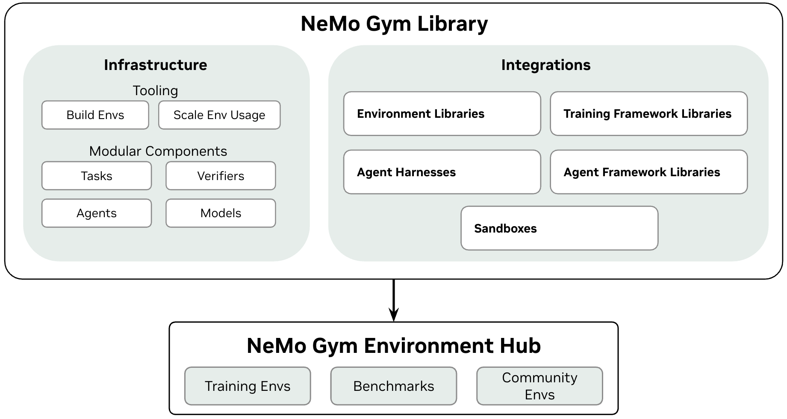

# NeMo Gym

[](https://pypi.org/project/nemo-gym/)
[](https://pypi.org/project/nemo-gym/)
[](https://opensource.org/licenses/Apache-2.0)
[](https://github.com/NVIDIA-NeMo/Gym/actions/workflows/unit-tests.yml)
[](https://docs.nvidia.com/nemo/gym/main/about/)

**[Requirements](#-requirements)** • **[Quick Start](#-quick-start)** • **[Environment Tutorials](#-environment-tutorials)** • **[Available Environments](#-available-environments)** • **[Documentation & Resources](#-documentation--resources)** • **[Community & Support](#-community--support)** • **[Citations](#-citations)**

NeMo Gym is a library for evaluating and improving models and agents using environments. NeMo Gym provides infrastructure to develop environments, scalably run evaluation and training, and a collection of popular benchmarks and training environments.

An environment is the complete system an agent interacts with to complete a task. It consists of a dataset (tasks to solve), an agent harness (how the model interacts with the world), a verifier (task completion scoring), and state (per-task execution context).

## 🎯 When to Use NeMo Gym

- You need to **evaluate models or agents** in stateful environments (e.g. code execution, tool calling, sandboxes)
- You want **reproducible evaluation** across teams using shared environments and verifiers
- You need to use environments **at scale** — multiple repeats per task, or thousands of concurrent requests for training
- You want to **seamlessly transition** between evaluation, agent optimization, and training

If you're scoring model outputs with a stateless check and don't need scale or training, a script is probably sufficient.

## 🏆 What NeMo Gym Provides

- Modular, extensible interfaces for agents, environments, tasks, and verifiers
- Environment hub of popular benchmarks and training environments
- Use your own agents or choose from built-in harnesses
- Scale to thousands of concurrent environments
- Train with the RL framework of your choice
- Battle-tested in production Nemotron training



## 🌎 Ecosystem

NeMo Gym is a component of [NVIDIA NeMo](https://docs.nvidia.com/nemo/gym/main/about/ecosystem#related-nemo-libraries), a GPU-accelerated platform for training generative AI models and optimizing AI agents. NeMo Gym is integrated with the broader agentic ecosystem - see the [Ecosystem](https://docs.nvidia.com/nemo/gym/main/about/ecosystem) page for more details.

**Environment Libraries:** Seamlessly combine environments and benchmarks from other libraries alongside NeMo Gym environments. Examples: 
[Aviary](https://github.com/NVIDIA-NeMo/Gym/tree/main/resources_servers/aviary) • [Harbor](https://github.com/NVIDIA-NeMo/Gym/tree/main/responses_api_agents/harbor_agent) • [OpenEnv](https://github.com/NVIDIA-NeMo/Gym/tree/main/resources_servers/openenv) • [Reasoning Gym](https://github.com/NVIDIA-NeMo/Gym/tree/main/resources_servers/reasoning_gym) • [Verifiers](https://github.com/NVIDIA-NeMo/Gym/tree/main/responses_api_agents/verifiers_agent)

**Training Framework Libraries:** Use environments for SFT and RL training.
[NeMo RL](https://docs.nvidia.com/nemo/gym/main/training-tutorials/nemo-rl-grpo) • [Unsloth](https://docs.nvidia.com/nemo/gym/main/training-tutorials/unsloth) • [VeRL](https://docs.nvidia.com/nemo/gym/main/training-tutorials)

**Agent Harnesses:** Agent harnesses for evaluation and training available out of the box. Examples:
[OpenHands](https://github.com/NVIDIA-NeMo/Gym/tree/main/responses_api_agents/swe_agents) • [Mini SWE Agent](https://github.com/NVIDIA-NeMo/Gym/tree/main/responses_api_agents/mini_swe_agent) • [LangGraph](https://github.com/NVIDIA-NeMo/Gym/tree/main/responses_api_agents/langgraph_agent)

> [!IMPORTANT]
> NeMo Gym is currently in early development. You should expect evolving APIs, incomplete documentation, and occasional bugs. We welcome contributions and feedback - for any changes, please open an issue first to kick off discussion!

## 📋 Requirements

NeMo Gym is designed to run on standard development machines:

| Hardware Requirements | Software Requirements |
| --------------------- | --------------------- |
| **GPU**: Not required for NeMo Gym library operation<br>• GPU may be needed for specific resources servers or model inference (see individual server documentation) | **Operating System**:<br>• Linux (Ubuntu 20.04+, or equivalent)<br>• macOS (11.0+ for x86_64, 12.0+ for Apple Silicon)<br>• Windows (via WSL2) |
| **CPU**: Any modern x86_64 or ARM64 processor (e.g., Intel, AMD, Apple Silicon) | **Python**: 3.12 or higher |
| **RAM**: Minimum 8 GB (16 GB+ recommended for larger environments) | **Git**: For cloning the repository |
| **Storage**: Minimum 5 GB free disk space for installation and basic usage | **Internet Connection**: Required for downloading dependencies and API access |

**Additional Requirements**

- **API Keys**: OpenAI API key with available credits (for the quickstart examples)
  - Other model providers supported (Azure OpenAI, self-hosted models via vLLM)
- **Ray**: Automatically installed as a dependency (no separate setup required)

## 🚀 Quick Start

Requires Python 3.12+ on x86_64 or ARM64 (Linux, macOS, Windows via WSL2). No GPU required. See the [Getting Started](https://docs.nvidia.com/nemo/gym/main/get-started) docs for a more comprehensive walkthrough.

**Install NeMo Gym:**

Requires [uv](https://docs.astral.sh/uv/getting-started/installation/) and Python 3.12+.

```bash
git clone git@github.com:NVIDIA-NeMo/Gym.git
cd Gym
uv venv --python 3.12 && source .venv/bin/activate
uv sync
```

**Configure your model:**

This quickstart uses OpenAI. NeMo Gym supports local and hosted inference — see [Configure Model](https://docs.nvidia.com/nemo/gym/main/model-server) for vLLM, Fireworks, OpenRouter, and others.

Create `env.yaml` in the project root:
```yaml
policy_base_url: https://api.openai.com/v1
policy_api_key: <your-openai-api-key>
policy_model_name: gpt-4.1-2025-04-14
```

### Run Evaluation

Run your agent on a set of tasks and score the results. This example uses a simple tool calling agent [`simple_agent`](responses_api_agents/simple_agent/README.md) with the [`mcqa`](resources_servers/mcqa/README.md) (multiple-choice Q&A) environment and its included example data.

**1. Start servers**

NeMo Gym uses local servers to coordinate your model, agent, and task verification. Start them first:

```bash
environment_config="resources_servers/mcqa/configs/mcqa.yaml"
model_config="responses_api_models/openai_model/configs/openai_model.yaml"

ng_run "+config_paths=[${environment_config},${model_config}]"
```

You should see three server instances starting:

```text
[1] mcqa (resources_servers/mcqa)
[2] mcqa_simple_agent (responses_api_agents/simple_agent)
[3] policy_model (responses_api_models/openai_model)
```

**2. Evaluate your agent** 

In a new terminal, run your agent on a single task to verify everything works:

```bash
source .venv/bin/activate

ng_collect_rollouts \
    +agent_name=mcqa_simple_agent \
    +input_jsonl_fpath=resources_servers/mcqa/data/example.jsonl \
    +output_jsonl_fpath=results/mcqa_rollouts.jsonl \
    +limit=5 \
    +num_repeats=1
```

You should see a progress bar followed by aggregate metrics:

```text
Collecting rollouts: 100%|██████| 5/5 [01:22<00:00, 16.44s/it]

Key metrics for mcqa_simple_agent:
{
    "mean/reward": 0.8,
    "pass@1[avg-of-1]/accuracy": 80.0,
    "pass@1/accuracy": 80.0
}
Finished rollout collection! View results at:
Fully materialized inputs: results/mcqa_rollouts_materialized_inputs.jsonl
Rollouts: results/mcqa_rollouts.jsonl
Aggregate metrics: results/mcqa_rollouts_aggregate_metrics.json
```

For per-task pass rates, see the [`ng_reward_profile`](https://docs.nvidia.com/nemo/gym/main/reference/cli-commands) command.

### Next Steps

- **[Browse Environments](https://docs.nvidia.com/nemo/gym/main/environments)** — Browse available environments for evaluation and training, or run `ng_list_envs` from the terminal.
- **[Agents](https://docs.nvidia.com/nemo/gym/main/agent-server)** — Explore available agent harnesses and learn how to integrate your own.
- **[Training](https://docs.nvidia.com/nemo/gym/main/training-tutorials)** — Improve your agent or model with RL or fine-tuning.
- **[Build Custom Environments](https://docs.nvidia.com/nemo/gym/main/environment-tutorials)** — Create your own evaluation or training environments.

## 🧭 Environment Tutorials

Learn how to build custom environments through hands-on tutorials. Here are popular starting points:

| Name | Demonstrates |
| ---- | ------------ |
| [Single Step](https://docs.nvidia.com/nemo/gym/main/environment-tutorials/single-step-environment) | Basic single-step tool calling |
| [Multi Step](https://docs.nvidia.com/nemo/gym/main/environment-tutorials/multi-step-environment) | Multi-step tool calling |
| [Session State](https://docs.nvidia.com/nemo/gym/main/environment-tutorials/stateful-environment) | Session state management (in-memory) |

See all [environment tutorials](https://docs.nvidia.com/nemo/gym/main/environment-tutorials) for additional patterns and advanced topics.

## 📦 Available Environments

NeMo Gym includes environments across math, coding, agent, knowledge, safety, and more domains.

**[Browse the full list →](https://docs.nvidia.com/nemo/gym/main/environments)**

Or from the terminal:

```bash
ng_list_envs
```


## 📖 Documentation & Resources

- **[Documentation](https://docs.nvidia.com/nemo/gym/main)** - Technical reference docs
- **[Environment Tutorials](https://docs.nvidia.com/nemo/gym/main/environment-tutorials)** - Build custom environments
- **[Training Tutorials](https://docs.nvidia.com/nemo/gym/main/training-tutorials)** - Train with NeMo Gym environments
- **[API Reference](https://docs.nvidia.com/nemo/gym/main/api/reference/api-reference)** - Complete class and function reference
 

## 🤝 Community & Support

We'd love your contributions! Here's how to get involved:

- **[Report Issues](https://github.com/NVIDIA-NeMo/Gym/issues)** - Bug reports and feature requests
- **[Contributing Guide](https://docs.nvidia.com/nemo/gym/main/contribute)** - How to contribute code, docs, new environments, or training framework integrations

## 📚 Citations

If you use NeMo Gym in your research, please cite it using the following BibTeX entry:

```bibtex
@misc{nemo-gym,
  title = {NeMo Gym: An Open Source Library for Scaling Reinforcement Learning Environments for LLM},
  howpublished = {\url{https://github.com/NVIDIA-NeMo/Gym}},
  author={NVIDIA},
  year = {2025},
  note = {GitHub repository},
}
```
