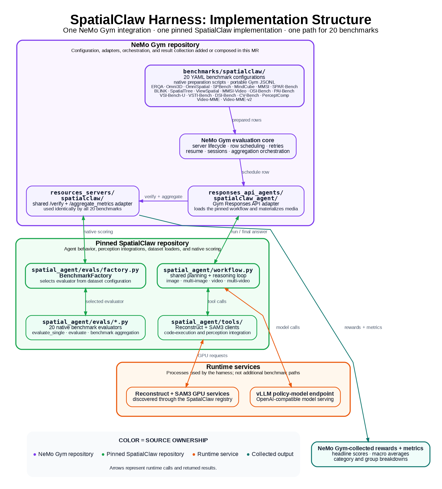

# SpatialClaw evaluation harness

SpatialClaw is a reusable evaluation harness for spatial reasoning, not a
Video-MME variant. The NeMo Gym integration runs the pinned SpatialClaw agent
and perception-tool loop while Gym owns serving, row scheduling, retry/resume,
verification, and metric aggregation.

The suite entry point is `benchmarks/spatialclaw/config.yaml`. It composes all
20 benchmark presets represented by the pinned SpatialClaw source revision.
Each preset can also be prepared and run independently.

This is the direct port of [GitLab Gym MR !471](https://gitlab-master.nvidia.com/dl/nemo/gym/-/merge_requests/471)
at `229815ecfddab961dc36806bad73fa2159df0462`. It retains that MR's external
SpatialClaw pin, native workflow, dataset configurations, and evaluators.
The pinned source is hosted on NVIDIA GitLab and requires access; it is not
vendored into Gym.



Current Gym compatibility changes add environment-server routing, worker
entrypoint discovery, Python 3.13 dependencies, and a persistent HTTP loop for
native Jupyter visual queries. The Video-MME preset retains 256 key frames at
up to 2 FPS, one repeat, and the original Nano role configuration.

## Architecture

A preset binds three benchmark-specific pieces to one shared agent:

1. A SpatialClaw dataset configuration selects the loader, prompt, frame
   sampling policy, and tools.
2. A preparation script converts the native samples to portable Gym JSONL
   rows. Images and videos remain paths; preparation does not pre-decode video.
3. A resource server scores predictions with the native SpatialClaw evaluator
   and reports its aggregate protocol.

The shared agent lives in
`responses_api_agents/spatialclaw_agent`. It supports single-image,
multi-image, single-video, multi-video, grouped-frame, and reference-image
samples. Relative media paths are resolved from `SPATIALCLAW_DATA_ROOT`.

All 20 configurations use `resources_servers/spatialclaw`, which calls the
evaluator selected by the pinned SpatialClaw dataset configuration.
Video-MME-v2 therefore retains SpatialClaw's native group-aware aggregation
without introducing a separate Gym execution or verification path. CV-Bench
here is SpatialClaw's multi-video CVBench dataset; it is distinct from Gym's
existing single-image `benchmarks/cvbench` integration.

## Included benchmarks

| Category | Benchmark | Preset | SpatialClaw dataset config | Scorer |
|---|---|---|---|---|
| Single-image spatial | ERQA | `erqa.yaml` | `erqa_spatialclaw` | Native |
| Single-image spatial | Omni3D | `omni3d.yaml` | `omni3d_spatialclaw` | Native |
| Single-image spatial | OmniSpatial | `omnispatial.yaml` | `omnispatial_spatialclaw_256f` | Native |
| Single-image spatial | SPBench | `spbench.yaml` | `spbench_spatialclaw_256f` | Native |
| Multi-view spatial | MindCube | `mindcube.yaml` | `mindcube_spatialclaw_256f` | Native |
| Multi-view spatial | MMSI | `mmsi.yaml` | `mmsi_spatialclaw_256f` | Native |
| Multi-view spatial | SPAR-Bench | `sparbench.yaml` | `sparbench_spatialclaw_256f` | Native |
| General spatial | BLINK | `blink.yaml` | `blink_spatialclaw_256f` | Native |
| General spatial | SpatialTree | `spatialtree.yaml` | `spatialtree_spatialclaw_256f` | Native |
| General spatial | ViewSpatial | `viewspatial.yaml` | `viewspatial_spatialclaw_256f` | Native |
| Video spatial / 4D | MMSI-Video | `mmsivideo.yaml` | `mmsivideo_spatialclaw_256f` | Native |
| Video spatial / 4D | OSI-Bench | `osibench.yaml` | `osibench_spatialclaw_256f` | Native |
| Video spatial / 4D | PAI-Bench | `paibench.yaml` | `paibench_spatialclaw_256f` | Native |
| Video spatial / 4D | VSI-Bench-U | `vsibench_unbiased.yaml` | `vsibench_unbiased_spatialclaw_256f` | Native |
| Video spatial / 4D | VSTI-Bench | `vstibench.yaml` | `vstibench_spatialclaw_256f` | Native |
| Video spatial / 4D | DSI-Bench | `dsibench.yaml` | `dsibench_spatialclaw_256f` | Native |
| General video | CV-Bench | `cvbench.yaml` | `cvbench_spatialclaw_256f` | Native |
| General video | PerceptComp | `perceptioncomp.yaml` | `perceptioncomp_spatialclaw_256f` | Native |
| General video | Video-MME | `videomme.yaml` | `videomme_spatialclaw` | Native |
| General video | Video-MME-v2 | `videomme2.yaml` | `videommev2_spatialclaw_256f` | Native |

The `_256f` configurations use the frame and FPS limits encoded in the
SpatialClaw source configuration. The preset does not independently redefine
those sampling rules.

## Source and data setup

The agent and native scorer require the same pinned SpatialClaw checkout. Set
these variables before preparing or running a preset:

```bash
export SPATIALCLAW_ROOT=/path/to/spatial_claw
export SPATIALCLAW_DATA_ROOT=/path/to/spatial_claw/data
```

`SPATIALCLAW_ROOT` must be a Git worktree at the commit pinned in
`responses_api_agents/spatialclaw_agent/app.py`. If it is not set, the agent
and resource server clone that revision into their component-local source
cache. `SPATIALCLAW_DATA_ROOT` is required because prepared rows deliberately
store media paths relative to the shared `data/` directory.

The expected directory names are defined by
`spatial_agent/evals/factory.py` in the pinned checkout, including
`ERQA/`, `Omni3D-Bench/`, `MMSI-Video-Bench/`, `Video-MME/`, and
`Video-MME-v2/`. Dataset download and license requirements remain those of
the upstream benchmark and SpatialClaw repository.

Reconstruct and SAM3 are external SpatialClaw GPU services. Start them from the
same checkout or set `SPATIALCLAW_GPU_SERVER_REGISTRY` to a live
`spatial_agent/logs/gpu_server.json`. See
`responses_api_agents/spatialclaw_agent/README.md` for the runtime contract.

## Prepare a benchmark

For example, prepare ERQA with the native loader:

```bash
gym eval prepare --config benchmarks/spatialclaw/erqa.yaml
```

This writes
`benchmarks/spatialclaw/data/erqa_benchmark.jsonl`. All other configurations
follow the same naming convention and native preparation path. The first
preparation creates the SpatialClaw resource-server environment; later
configurations reuse it.

Preparing `benchmarks/spatialclaw/config.yaml` prepares the entire suite and
can be expensive. Prefer an individual preset unless all datasets are already
staged.

## Run a benchmark

Compose the benchmark preset with a policy-model server. For example:

```bash
gym eval run \
  --config benchmarks/spatialclaw/erqa.yaml \
  --config responses_api_models/vllm_model/configs/vllm_model.yaml
```

Replace `erqa.yaml` with any preset from the table. Model endpoint,
checkpoint, GPU allocation, and model-specific vLLM overrides belong in the
policy-model configuration, not in the benchmark preset.

To make all benchmark definitions available in one resolved configuration, use:

```bash
gym eval run \
  --config benchmarks/spatialclaw/config.yaml \
  --config responses_api_models/vllm_model/configs/vllm_model.yaml
```

That command schedules every composed benchmark. Use an individual YAML for
normal development and smoke tests.

## Metrics

Each native verifier returns the row's SpatialClaw `evaluate_single` score
when that benchmark supports per-sample scoring. At aggregation time the
resource server calls the benchmark's full `evaluate` method on the evaluated
rows, preserving benchmark-specific macro averages, mean-relative-accuracy
calculations, category breakdowns, and other native headline metrics. A native
evaluator may mark a row unscored; such a row remains visible and is not
silently converted into a successful result.
