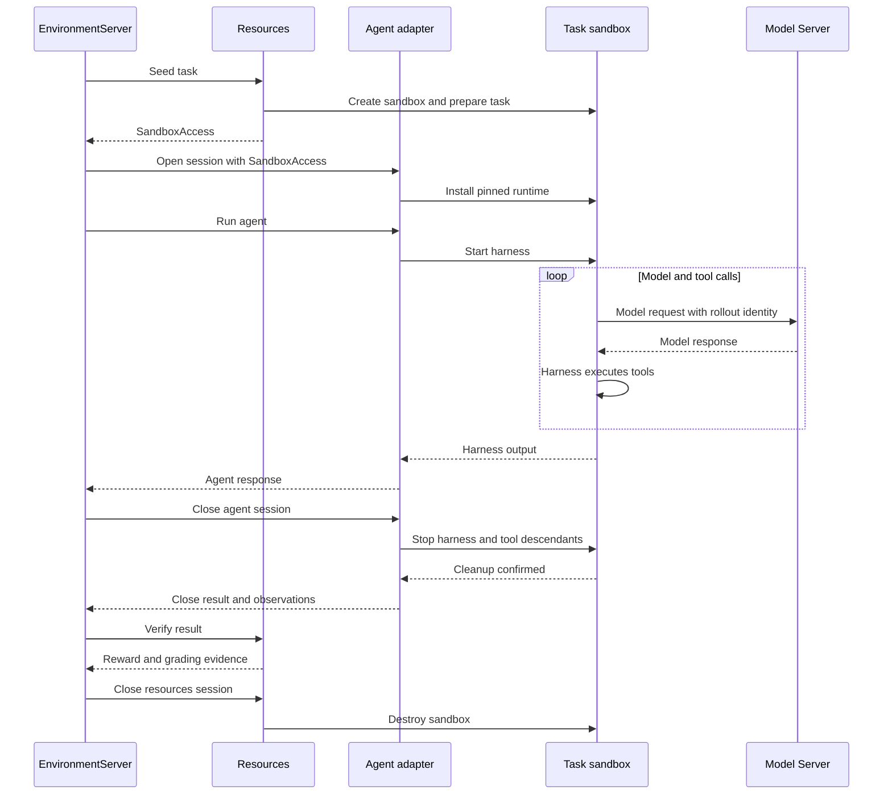

# Add or Update a Harness

Use this checklist to add or update a sandboxed harness. The Agent Server stays outside as an adapter; the harness and its tools run inside the task sandbox.

<Note>
Session support varies by adapter. The [Hermes](https://github.com/NVIDIA-NeMo/Gym/pull/3554) and [Pi](https://github.com/NVIDIA-NeMo/Gym/pull/3626) references are under review; check their status and your checkout before reuse.
</Note>

## 1. Keep components independent

Keep task data, preparation, verification, and sandbox requirements with the benchmark; keep the execution loop, runtime, and harness settings with the agent. Configure and launch each independently.

Bind their references through [EnvironmentServer](https://github.com/NVIDIA-NeMo/Gym/tree/main/environment_servers/single_agent_turn) and submit episodes to its `/run`. A compatible pairing should require only composition changes, without a pair-specific launcher, adapter, or preset.

The single-agent flow through EnvironmentServer `/run` is:

Resources owns the sandbox. The agent borrows it. **Agent close must succeed before verification.**

## 2. Prepare the runtime during session setup

Implement the shared [agent-session API](https://github.com/NVIDIA-NeMo/Gym/blob/main/nemo_gym/base_responses_api_agent.py) using the supplied `SandboxAccess`.

- Pin the harness version and task image digest. Check the image's runtime, utilities, certificates, platform, and permissions.
- Install in the supplied sandbox during setup. Check bootstrap dependencies; retain failed commands, exit codes, and stderr.
- Keep runtime files, HOME, and caches outside the task repository. Preserve task dependencies; pass only necessary credentials and configuration.
- Publish the session after successful setup. On failure, release connections and retain state for unfinished cleanup retries.

Never fall back to a host CLI or replacement sandbox.

## 3. Preserve inputs, outputs, and errors

Run in `SandboxAccess.workdir`. Route model calls through a sandbox-reachable Gym endpoint with rollout identity. The agent's `/v1/responses` interface does not dictate the harness's model API.

Apply instructions, sampling, and limits, or reject unsupported options. Check effective model requests after overrides; distinguish per-call limits from episode budgets. Preserve prompt semantics and reasoning/tool history across upgrades.

Return `NeMoGymResponse` with text, reasoning, tool calls/results, usage, and status where available. Collect [rollout evidence](/main/observability/rollout-evidence#add-evidence-to-a-custom-agent): tool timing, model-call references, aggregated usage, and explicit evidence gaps.

Preserve model HTTP status and error bodies for context-limit handling and retries. Separate execution health from reward:

| Outcome | Handling |
| --- | --- |
| Model or configured execution limit | Preserve partial work as incomplete; it may remain gradable. |
| Setup, provider, API, or runtime failure | Propagate the error without benchmark verification. |
| Completed verification | Report the score, including valid zeros. |
| Missing or inconclusive verification | Report missing measurement separately from scored attempts. |

Reward `1` or HTTP `200` alone does not prove a healthy episode.

## 4. Make retries and close safe

Validate identity and cookies. In a single-activation session, identical retries join or replay the invocation; conflicting requests are rejected. Disconnected waiters must not cancel shared work.

Confirm the harness and all tool descendants have stopped, including detached processes. Fence delayed launches. Missing handles or timeouts do not prove cleanup: retain retry state and block verification until cleanup is confirmed.

Serialize close requests, retain successful receipts for a documented bounded retry window, and reject stale activations. Remove only adapter-owned files and disconnect; Resources destroys the sandbox.

## 5. Validate each supported pairing

- Test setup failures, request mapping, unsupported controls, isolation, retries, cancellation, close races, and cleanup failures. Use real Linux processes for detached-child cleanup.
- Run a real model/task smoke with tools and verification. Confirm sandbox execution, agent close before verification, and owner cleanup afterward. Inspect failures, traces, artifacts, and grading coverage.
- Demonstrate a second compatible pairing through composition alone. Record versions and unsupported combinations.
- For upgrades, compare the same harness before/after with fixed model, tasks, prompts, sampling, limits, images, verifier, and concurrency. Compare scores and failures; different harnesses need not score identically.
- Measure setup time, memory, process count, and close latency before scaling. Validate [training support](/main/tutorials/training-tutorials/external-agent-harnesses) separately from inference.

Include commands, versions, evidence, limitations, tests, and pre-commit results in the PR.
