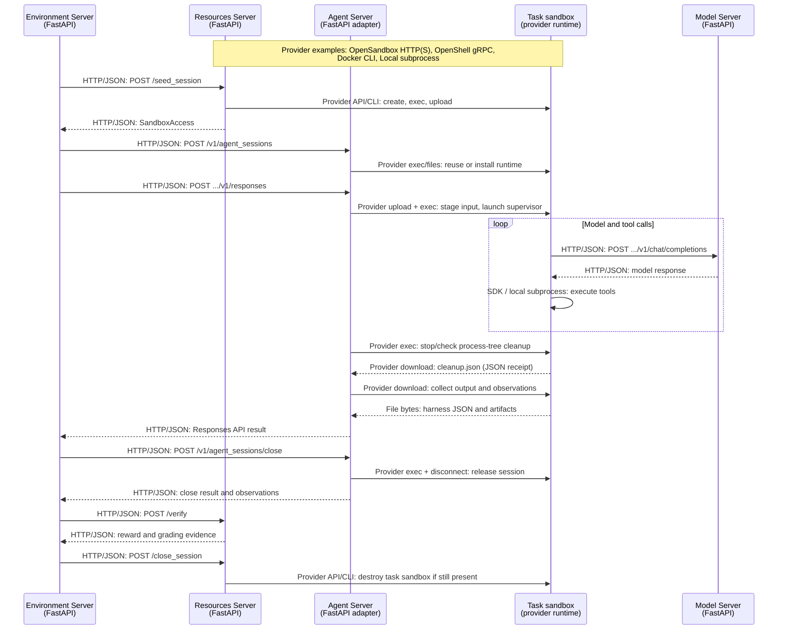
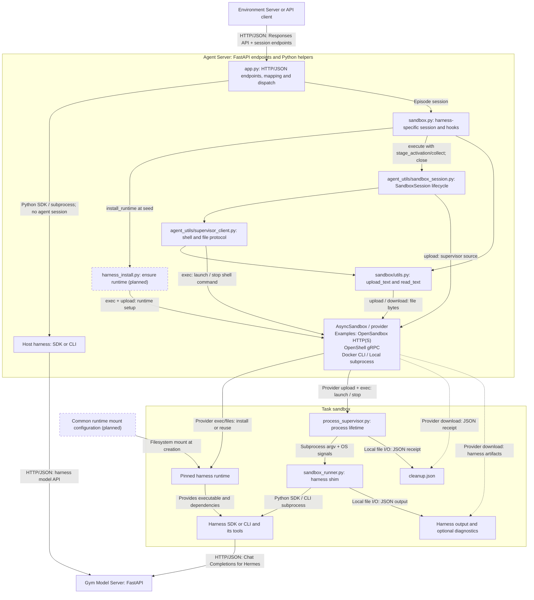

# Add or Update a Harness

Use this checklist to add or update a harness. For sandbox execution, the Agent Server stays outside as an adapter; the harness and its tools run inside the task sandbox. Adapters that also support host execution must preserve and test that path independently.

<Note>
Session support varies by adapter. Check the adapter's README for supported features and limitations.
</Note>

## 1. Keep components independent

Keep task data, preparation, verification, and sandbox requirements with the benchmark; keep the execution loop, runtime, and harness settings with the agent. Configure and launch each independently.

Bind their references through [EnvironmentServer](https://github.com/NVIDIA-NeMo/Gym/tree/main/environment_servers/single_agent_turn) and submit episodes to its `/run`. A compatible pairing should require only composition changes, without a pair-specific launcher, adapter, or preset.

Use this single-agent flow when Resources supplies a task sandbox through EnvironmentServer `/run` (Hermes's model API is shown). FastAPI implements the Gym server endpoints, which exchange JSON over HTTP. Sandbox execution and file transfer use the selected provider's transport.



Resources owns the sandbox. The agent borrows it. **Agent close must succeed before verification.**

Resources may retire the task sandbox during verification. For example, SWE-Pro exports the patch, stops the task sandbox, and grades in a fresh sandbox; final Resources close releases any remaining resources.

The `...` in agent and model routes represents Gym's rollout and optional token-capture prefix; preserve it when forwarding requests.

On interruption, close joins or retries finalization: confirm cleanup, capture available artifacts, then release resources. Output collection must finish before deleting session files or stopping an agent-owned sandbox.

### Select execution mode explicitly

Hermes, Pi, and Codex distinguish the following paths. Check the adapter's README and configuration before selecting one.

| Request path | Execution location | Cleanup owner |
| --- | --- | --- |
| Episode session seeded with `SandboxAccess` | The supplied task sandbox | Agent stops its harness work and disconnects; Resources destroys the sandbox. |
| Episode session without `SandboxAccess`, with an explicitly configured `sandbox_provider` | A sandbox created by the agent | Agent stops the sandbox it created. Task requirements must be compatible with this mode. |
| Episode session without either sandbox access or a provider | Rejected during seed | No implicit host execution or replacement environment. |
| `/v1/responses` without an agent-session binding | Agent-server host, when supported by the adapter | Adapter cleans up its local invocation and temporary files. |

The compatibility Agent `/run` requires an explicit `resources_server` binding and uses the adapter's host path. An agent's default `resources_server: null` does not disable direct host `/v1/responses`. Configuring `sandbox_provider` enables agent-owned episode sessions; it does not by itself redirect sessionless calls into a sandbox. A stale or invalid session binding must be rejected rather than treated as a host request.

When a Resources-owned sandbox was supplied, setup or connection failure must propagate. Never silently run the task on the host or in a different sandbox. Host execution is a separately selected mode; it does not provide task-sandbox isolation. Initialize host CLI dependencies only for the host path, and keep episode-session runtime preparation in seed.

### Separate adapter, lifecycle, transport, and harness code

Use these responsibilities when organizing a new adapter under `responses_api_agents/<harness>/`. A `sandbox.py` module runs on the Agent Server; a `sandbox_runner.py` shim runs inside the sandbox.

<Note>
The shared lifecycle below follows [Hermes #3961 at `a309dfb9a`](https://github.com/NVIDIA-NeMo/Gym/tree/a309dfb9a5cb8c65b6bd7366260c189c3dcd3284). [Pi #3626 at `d91469b81`](https://github.com/NVIDIA-NeMo/Gym/tree/d91469b81aa9d0f3178026e469fe119f10a6f316) and [Codex #3640 at `5151a3a74`](https://github.com/NVIDIA-NeMo/Gym/tree/5151a3a746b9846995435a99c5b0e403abddf22b) now use the same `agent_utils` session API, `session_dir` and `stage_activation` names, simplified `SandboxCommand`, and adapter-local runtime metadata. These revisions establish the code layout; validate installation and runtime support for each pairing separately. Test host-only startup too, because these modules are imported before dispatch.
</Note>

Dashed boxes mark planned installation and mount helpers; the host path is selected by a sessionless request. Edges inside the Agent Server represent Python calls unless labeled otherwise. Cross-process edges identify HTTP/JSON, provider transport, subprocess/signals, or file I/O.



The supervisor's cleanup receipt and the harness's output return through separate contracts. A valid output does not bypass cleanup confirmation before verification.

| File | Responsibility |
| --- | --- |
| `app.py` | Gym endpoints and configuration, request validation and mapping, session hooks, response and observation conversion, and dispatch to host or sandbox execution. |
| `sandbox.py` | A harness-specific session object composing `SandboxSession`; `install_runtime()` at seed, `stage_activation()` for input, artifact collection, and harness-specific state and diagnostics. |
| `sandbox_runner.py` | Read staged input, invoke the harness SDK or CLI, collect native output and optional process diagnostics, and preserve partial output where supported. |
| `install_runtime.sh` or an existing harness-specific installer | Install the pinned harness and its private dependencies, then check that they run. Keep installation out of the activation loop. |
| `tests/` | Host dispatch, episode setup, request semantics, output parsing, installation, and lifecycle regressions. |

The shared files under `nemo_gym/` have separate responsibilities. The agent utilities run on the Agent Server; only their `process_supervisor.py` is uploaded into the sandbox. Provider APIs and general file transport remain under `sandbox/`.

| File | Responsibility |
| --- | --- |
| `agent_utils/sandbox_session.py` | `SandboxSession` owns the connection, ownership flag, workdir, `session_dir`, execution/finalization tasks, cleanup receipt, artifacts, and retryable close state. It uploads the supervisor before launch. `SandboxCommand` carries harness argv and the installed supervisor interpreter. |
| `agent_utils/supervisor_client.py` | Build launch/stop shell commands, define control-file names and timeout budgets, validate cleanup acknowledgement, and retire session directories safely. |
| `sandbox/utils.py` | `upload_text()` and `read_text()` use `AsyncSandbox.upload()` / `download()` for UTF-8 file transport. Binary files use those underlying file APIs directly. |
| `agent_utils/process_supervisor.py` | Run inside the Linux sandbox, supervise the harness process and its descendants, enforce deadlines, and write the cleanup receipt. |

Keep harness-specific response parsing and model/tool behavior in the adapter. Session identity, activation retries, and retained close responses belong to the shared agent-session API; `SandboxSession` handles the execution lifecycle underneath that API.

Wire `SandboxSession.execute(stage_activation=..., collect=..., timeout=..., close_timeout=...)` with two adapter hooks. `stage_activation` stages input and returns `SandboxCommand(argv=..., python=...)`; install the runtime earlier, during seed. The shared session then uploads `process_supervisor.py` into `session_dir`; adapters do not upload it or pass `supervisor_path`. Keep `session_dir` separate from `workdir`, which is the task repository.

`collect` copies artifacts to the Agent Server after confirmed cleanup, including partial output from interrupted runs. It may run a bounded snapshot command, but must not restart the harness. Convert captured artifacts into responses and observations in the adapter, and make them available to close even if activation was interrupted.

## 2. Prepare the runtime during session setup

Implement the shared [agent-session API](https://github.com/NVIDIA-NeMo/Gym/blob/main/nemo_gym/base_responses_api_agent.py) using the supplied `SandboxAccess`.

- Pin the harness version and task image digest. Check the image's runtime, utilities, certificates, platform, and permissions.
- Install in the supplied sandbox during setup. Check bootstrap dependencies; retain failed commands, exit codes, and stderr.
- Keep runtime files, HOME, and caches outside the task repository. Preserve task dependencies; pass only necessary credentials and configuration.
- Publish the session after successful setup. On failure, release connections and retain state for unfinished cleanup retries.

Never fall back to a host CLI or replacement sandbox.

### Installation contract

Run the installation check on each seed and reuse a compatible runtime when it is already available. Keep reusable runtime files separate from writable per-session input, output, logs, HOME, and caches; session close must not remove a shared runtime.

1. Detect the target sandbox's OS, CPU architecture, libc, runtime prerequisites, and execution permissions. Select artifacts for that target; an executable found on the agent-server host may be incompatible.
2. Check a preinstalled, mounted, or previously installed runtime against the pinned version and a runnable health check. Directory existence alone does not establish readiness.
3. Verify pinned artifact checksums on the agent-server host, upload through the sandbox file API, and invoke the harness's installer in a private directory outside the task repository. Preserve task interpreters and libraries.
4. Publish readiness only after installation and its health check succeed. Handle partial installs and concurrent setup without exposing an incomplete runtime; retain commands, exit codes, and logs on failure.
5. For offline support, provide the complete dependency set, including bootstrap interpreters, package dependencies, and native libraries. Uploading a CLI or ripgrep alone does not make an installer that still downloads dependencies offline-capable.

Every supervised harness needs a compatible **Python 3 interpreter inside the sandbox**, including standalone binaries such as Codex and OpenCode. Select it explicitly as `SandboxCommand.python`. Hermes supplies Python through its private runtime; installation for a binary harness must provision or validate a supervisor interpreter too. The launch helper checks that interpreter can load the uploaded supervisor before claiming launch. The supervisor uses only the standard library, so it does not require Gym or the agent-server environment inside the sandbox.

The proposed shared installer must avoid system package managers and root requirements. Existing adapter installers do not all meet this target yet; declare supported images and remaining prerequisites until they migrate.

At the Hermes revision linked above, seed reuses a pin-keyed private virtual environment after checking that `run_agent` and `mcp` import. Cold setup uploads the host's `uv`, creates a private Python 3.13 environment, and installs the same pinned Hermes with its MCP extra. This requires a compatible host/target executable platform and dependency-download access. Seed also uploads harness support files into the runtime directory, so this implementation does not yet establish offline installation or read-only runtime-mount support.

<Note>
The [shared installation proposal](https://github.com/NVIDIA-NeMo/Gym/pull/3961#issuecomment-6003983236) would add an agent-server `harness_install.py` with `ensure_harness_installed(...)`. This helper would detect the platform, reuse or stage verified artifacts, invoke the adapter's installer at seed, and return the runtime location, including the supervisor interpreter. Its implementation and package location remain follow-ups; no shared installer API exists in the revision above.

A common runtime mount configuration across providers and a convention such as `/opt/nemo-gym-runtimes` remain follow-ups; Enroot already supports its own `exec.default_mounts`. Defaults must be applied when the sandbox is created, with defined destination-conflict and unsupported-provider behavior. The installer discovers an already mounted runtime at seed. Read-only runtime mounts require separate writable session state.
</Note>

## 3. Preserve inputs, outputs, and errors

Run in `SandboxAccess.workdir`. Route model calls through a sandbox-reachable Gym endpoint with rollout identity. The agent's `/v1/responses` interface does not dictate the harness's model API.

### Separate process control from model requests

| Connection | Protocol and responsibility |
| --- | --- |
| Environment Server to Agent or Resources Server | HTTP/JSON endpoints implemented with FastAPI: seed/close, the agent's Responses API contract, and Resources verification. |
| Agent Server to task sandbox | `AsyncSandbox.exec()` and `upload()` / `download()` delegate to the configured provider. For command execution, OpenSandbox uses HTTP(S) with SSE or background polling, OpenShell uses streaming gRPC, Docker invokes its CLI, and Local uses a subprocess. File transfer follows the provider's implementation. The supervisor client implements a shell-and-file protocol, without a Responses API endpoint. |
| Process supervisor to harness | Starts the harness subprocess, enforces its deadline, signals and reaps its process tree, and writes `cleanup.json`. It does not send model requests or parse model responses. |
| Harness to Model Server | The harness's model HTTP protocol. The current Hermes adapter uses Chat Completions (`.../v1/chat/completions`); other harnesses may use Responses. Preserve the rollout-qualified base URL passed by Gym. |

For Hermes, the adapter uploads episode input to `input.json` and supplies argv containing its private Python, `sandbox_runner.py`, and the input/output paths. The supervisor starts that command without interpreting the input. The shim reads the adapter-specific JSON, invokes Hermes, and writes `output.json`; this is a file exchange, not another Responses API call.

The Hermes shim constructs the harness with `model_base_url` and points its auxiliary clients at the same Model Server. The adapter converts the harness's output back into `NeMoGymResponse`. This model traffic is independent of the supervisor's cleanup files.

Apply instructions, sampling, and limits, or reject unsupported options. Check effective model requests after overrides; distinguish per-call limits from episode budgets. Preserve prompt semantics and reasoning/tool history across upgrades.

Return `NeMoGymResponse` with text, reasoning, tool calls/results, usage, and status where available. Collect [rollout evidence](/main/observability/rollout-evidence#add-evidence-to-a-custom-agent): tool timing, model-call references, aggregated usage, and explicit evidence gaps.

Preserve model HTTP status and error bodies for context-limit handling and retries. Separate execution health from reward:

| Outcome | Handling |
| --- | --- |
| Model or configured execution limit | Preserve partial work as incomplete; it may remain gradable. |
| Setup, provider, API, or runtime failure | Preserve failure evidence; sandbox sessions propagate the error without benchmark verification. |
| Completed verification | Report the score, including valid zeros. |
| Missing or inconclusive verification | Report missing measurement separately from scored attempts. |

Local compatibility paths can have a different evidence contract. For example, [Hermes's local `/run`](https://github.com/NVIDIA-NeMo/Gym/blob/77509af61efe53e6bb01244209e2a6e9c9e8a403/responses_api_agents/hermes_agent/README.md#local-compatibility) retains terminal provider failures through verification, then returns `mask_sample: true` and `failure_kind: agent_request_failed`, even if the verifier awards a positive reward. These failed rollouts remain excluded from scores; Hermes sandbox sessions keep their retryable failure path.

Reward `1` or HTTP `200` alone does not prove a healthy episode.

## 4. Make retries and close safe

Validate identity and cookies. In a single-activation session, identical retries join or replay the invocation; conflicting requests are rejected. Disconnected waiters must not cancel shared work.

Confirm the harness and all tool descendants have stopped, including detached processes. Fence delayed launches. Missing handles or timeouts do not prove cleanup: retain retry state and block verification until cleanup is confirmed.

Serialize close requests, retain successful receipts for a documented bounded retry window, and reject stale activations. For borrowed sandboxes, remove only adapter-owned files and disconnect; Resources destroys the sandbox.

### Reuse process supervision

The shared Linux `nemo_gym/agent_utils/process_supervisor.py` runs inside the sandbox using the standard library. It enforces the harness deadline, reaps tool descendants, and atomically writes `cleanup.json`; the task sandbox does not need the full Gym installation for supervision.

The shared lifecycle calls `supervisor_client.py`; adapters normally use `SandboxSession` rather than duplicating its launch/stop/collect/release sequence. When migrating from `runner.py` or the earlier `sandbox/session.py`, update imports, hook arguments, control-file assumptions, test doubles, and tests together: these modules can be imported at startup even for host calls.

| Shared helper or contract | Purpose |
| --- | --- |
| `utils.upload_text(sandbox, *, path, text)` / `read_text(sandbox, *, path)` | Transfer UTF-8 text through upload/download APIs without interpolating contents into shell commands; reads replace invalid UTF-8, and the adapter validates the decoded payload. These are standalone helpers, not `AsyncSandbox` methods. |
| `supervised_launch_command()` (previously `supervisor_command()`) | Require an explicit supervisor interpreter, check it can load the supervisor before claiming launch, and build a quoted command with an atomic claim that fences delayed execution. Hermes selects its private Python runtime. |
| `stop_and_confirm_cleanup()` (previously `confirm_runner_cleanup()`) | Fence a pending launch or request supervisor stop and require explicit cleanup acknowledgement. Read receipts before signaling a stored PID, which may have been reused. |
| `remove_session_directory()` | Retire the session directory atomically before deletion so its launch fence remains effective; remove only adapter-owned session files after confirmed cleanup and artifact collection. |
| `parse_cleanup_receipt()` | Require literal `cleanup_confirmed: true`; normalize malformed optional diagnostics with a warning. A fenced launch that never ran has no harness exit code; missing diagnostics must not invent a successful exit. |
| `SandboxSession.stop_harness()` | Confirm process-tree cleanup before cancelling provider exec. Normal execution and close call it through shared finalization. |
| `SandboxSession.read_output_log()` / `stop_request_path` | Expose combined supervisor/harness diagnostics and the cancellation marker without adapters hard-coding control-file names. A missing log must not mask the original error. |
| `supervision_timeouts()` | Derive both the per-cleanup-phase budget and provider exec timeout together: reserve TERM grace, process reaping, descendant draining, and an additional 30 seconds for startup, polling, and receipt I/O. Uses `process_supervisor.exec_timeout()` and the shared phase count. |

All control files live under `session_dir`; names are centralized in `supervisor_client.py`:

| File | Writer and purpose |
| --- | --- |
| `process_supervisor.py` | Shared session uploads it after input staging and before launch. |
| `launch.claim` | Launch or stop shell atomically claims execution or fences a delayed launch. |
| `supervisor.pid` | Launch shell records the PID that becomes the supervisor when the shell executes it. |
| `stop.request` | Stop shell writes a cancellation marker before signalling the supervisor. |
| `cleanup.json` | Supervisor confirms cleanup; if stop wins before launch, the stop shell writes the same receipt shape with `return_code: null` and `timed_out: false`. |
| `output.log` | Launch shell redirects supervisor and harness diagnostics here. Task output remains a separate adapter-owned artifact. |

Keep three contracts independent: the cleanup receipt establishes whether harness processes were cleaned up; process metadata identifies the harness process; harness output carries task results and observations. A valid output file does not confirm cleanup, and confirmed cleanup does not establish task success. Parsing failures must not discard a confirmed receipt.

`HarnessProcessInfo` and `parse_runtime_info()` now live in Hermes's `sandbox.py`; they are not requirements of the shared supervisor protocol. They validate optional hostname, harness-process PID, and interpreter metadata, returning `None` with a warning on malformed input. Hermes records `runtime_info_unavailable` for this gap. Output errors still propagate independently. Artifact capture errors are retained separately and must not prevent resource release after confirmed cleanup or replace the original execution error.

For both borrowed and agent-owned sandboxes, finalize in this order: confirm remote cleanup, collect artifacts once, then release the provider exec. Cancelling provider exec too early may kill the supervisor. Concurrent close joins finalization; retries after failed cleanup or release retain the handle without duplicating capture. Each stop, collection, and release phase has a timeout; the shared timeout is a per-phase budget, not a total close deadline.

Borrowed close retires session paths and disconnects. Agent-owned close attempts the same graceful finalization before stopping the sandbox; if graceful cleanup fails, confirmed provider teardown remains its cleanup authority, with unavailable artifacts recorded as such. Failed teardown retains state for retry. Preserve launch fences and reject late activation in either mode.

Execution completion retains the sandbox until explicit close; `closed` means resource release succeeded. For agent-server crashes, arrange provider-enforced expiry or an external cleanup mechanism for owned sandboxes, with time for installation, execution, and cleanup. When `sandbox_config` omits `ttl_s`, Hermes now supplies `sandbox_install_timeout_seconds + sandbox_runner_timeout_seconds + 600`. An explicit value, including `null`, is preserved. This default applies only when Hermes creates the sandbox; borrowed sandboxes retain their owner's lifetime policy. Check that the chosen provider actually enforces the configured lifetime.

These receipts coordinate lifecycle behavior; files writable by the model are not a trusted channel for training trajectories. Validate training support separately.

## 5. Validate each supported pairing

### Observability

Use [Harness Conformance](/main/observability/harness-conformance) to validate trajectory evidence. Follow the [runner guide](https://github.com/NVIDIA-NeMo/Gym/blob/main/scripts/harness_conformance/README.md) to register a new harness and install its dependencies. Run the probes in a fresh output directory (Pi shown):

```bash
python scripts/run_harness_conformance.py \
    --harness pi --output results/pi-conformance
```

The runner uses scripted model replies and real local tools, then runs the evidence checker automatically. Review `conformance_report.md`, fix missing or inconsistent evidence, and rerun. The P0 gate requires every applicable individual P0 check to pass, including ownership and call-to-step attribution; TE labels group results rather than granting exemptions.

Also check saved rollouts from each target sandbox pairing:

```bash
python scripts/inspect_harness_conformance.py \
    --bundle results/my-harness/rollouts.jsonl \
    --output results/my-harness/evidence
```

Record evidence conformance and sandbox lifecycle validation separately; the local probes do not exercise remote sandbox setup or cleanup.

### Runtime and compatibility

- Test host calls with no sandbox access or provider, borrowed episode sessions, explicitly configured agent-owned sessions, and rejection of episode seed without either. Assert that host calls do not create a sandbox and sandbox failures never invoke a host fallback. Test compatibility `/run` with and without a Resources binding.
- Exercise cold installation, runtime reuse, failed/partial installation, and unsupported platforms. Include a binary harness in an image without Python, and require setup to provision or explicitly reject the missing supervisor interpreter. Claim offline or read-only mounted-runtime support only after testing those deployment paths.
- Test setup failures, request mapping, unsupported controls, isolation, retries, cancellation, close races, and cleanup failures. Include supervisor upload failure or close during upload, interpreter/supervisor bootstrap failures before launch, cleanup before transport cancellation, artifact capture before teardown, capture failures, and malformed optional diagnostics. Use real Linux processes for detached-child cleanup.
- Run a real model/task smoke with tools and verification. Confirm sandbox execution, agent close before verification, and sandbox cleanup by its owner. Inspect failures, traces, artifacts, and grading coverage.
- Demonstrate a second compatible pairing through composition alone. Record versions and unsupported combinations.
- For upgrades, compare the same harness before/after with fixed model, tasks, prompts, sampling, limits, images, verifier, and concurrency. Compare scores and failures; different harnesses need not score identically.
- Measure setup time, memory, process count, and close latency before scaling. Validate [training support](/main/tutorials/training-tutorials/external-agent-harnesses) separately from inference.

Include commands, versions, evidence, limitations, tests, and pre-commit results in the PR.
