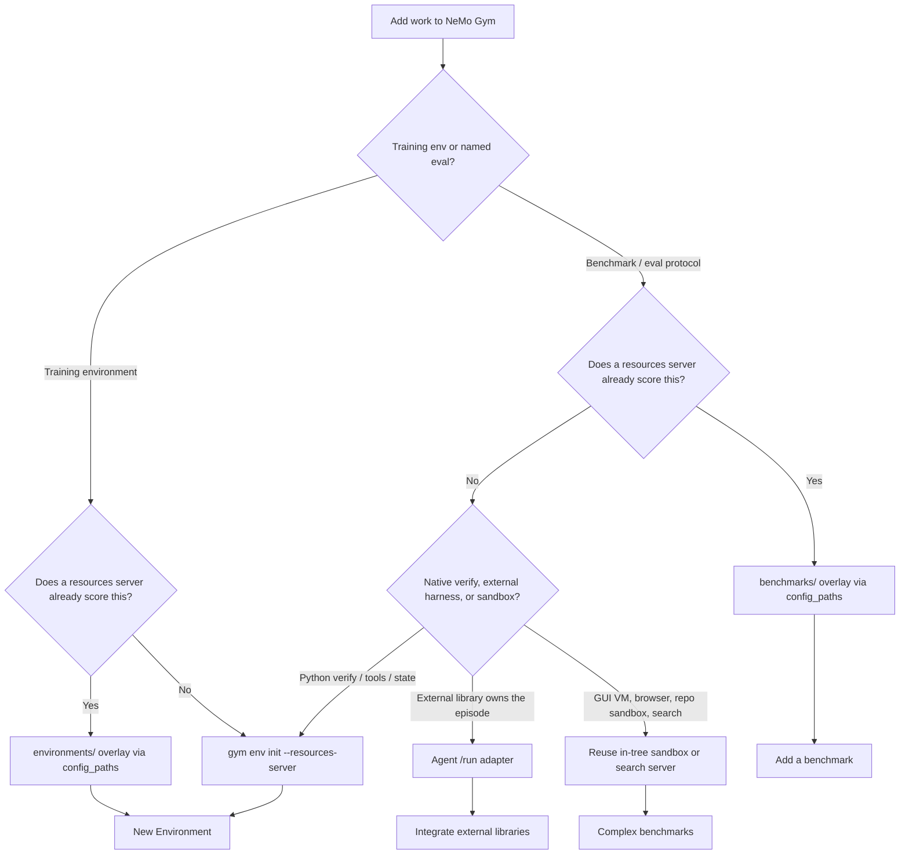

A **resources server** implements scoring, tools, and per-task state. An **environment** is that measurement surface composed with an agent, a model, and datasets. A **benchmark** is a versioned evaluation protocol on top of a resources server: canonical split, prompt, `prepare_script`, and documented repeats.

You do not always need a new environment. You need a new resources server only when no existing server can score the task.

<Tip>
Search the catalog before you scaffold anything:

```bash
gym search "grade school math"
gym list resources-servers
gym list benchmarks
gym list environments
```

`gym list environments` is the unified catalog (in-tree workloads are labeled `no-manifest` until they grow a `manifest.yaml`). `gym list resources-servers` lists config selectors under `resources_servers/*/configs/`, which is a different namespace.
</Tip>

## Which guide to follow

| You are… | Follow |
| --- | --- |
| Reusing an existing scorer with a new dataset, prompt, or repeats | [Add a benchmark](/contribute/environments/adding-a-benchmark) |
| Building a new scorer, tools, or session state | [New Environment](/contribute/environments/new-environment) and [Single-Step Environment](/environment-tutorials/single-step-environment) |
| Wrapping a third-party runner that owns the episode | [Integrate external libraries](/environment-tutorials/integrate-external-environments) |
| Needing a GUI VM, browser, repo sandbox, or search stack | [Complex benchmarks](/contribute/environments/adding-a-benchmark#complex-benchmarks) |
| Changing only prompts or data on an existing bench | Same overlay; bump the documented version if the change affects comparison |



## Catalog path vs experimental manifest path

In-tree workloads today are YAML configs under `benchmarks/`, `environments/`, and `resources_servers/`. None of them ship a `manifest.yaml`.

| Path | Commands | Use when |
| --- | --- | --- |
| **Catalog (default)** | Copy an overlay such as `benchmarks/gsm8k`, or `gym env init --resources-server` | Contributing to this repository |
| **Manifest (experimental)** | `gym env init --environment` / `--benchmark`, `gym env validate`, `gym env test NAME`, `gym env publish` | Trying the new scaffold; requires a `VERIFIER_FIXTURE` the catalog does not yet export |

`gym env init --benchmark --reuse-verifier` fails against production scorers such as `math_with_judge` because they do not export `VERIFIER_FIXTURE`. Reuse them with `config_paths` and `_inherit_from` instead — see [Add a benchmark](/contribute/environments/adding-a-benchmark#reuse-an-existing-resources-server).

## Composition patterns

| Pattern | What to copy | Example |
| --- | --- | --- |
| Inherit resources server and agent | `config_paths` plus `_inherit_from` on both | [`benchmarks/gsm8k/config.yaml`](https://github.com/NVIDIA-NeMo/Gym/blob/main/benchmarks/gsm8k/config.yaml) |
| Inherit resources server, swap agent | Chain the server YAML and an agent YAML | [`benchmarks/swebench/verified/opencode.yaml`](https://github.com/NVIDIA-NeMo/Gym/blob/main/benchmarks/swebench/verified/opencode.yaml) |
| Bundled server config | Resources-server YAML already includes agent and datasets | `tavily_search` (not under `benchmarks/`) |
| Inline resources server | Benchmark `config.yaml` defines the server | [`benchmarks/browsecomp/config.yaml`](https://github.com/NVIDIA-NeMo/Gym/blob/main/benchmarks/browsecomp/config.yaml) |

## Related Topics

- [Environments vs Benchmarks](/about/concepts/evaluation#environments-vs-benchmarks)
- [How Benchmarks Relate to Environments](/evaluation/benchmarks#how-benchmarks-relate-to-environments)
- [CLI commands](/reference/cli-commands)
