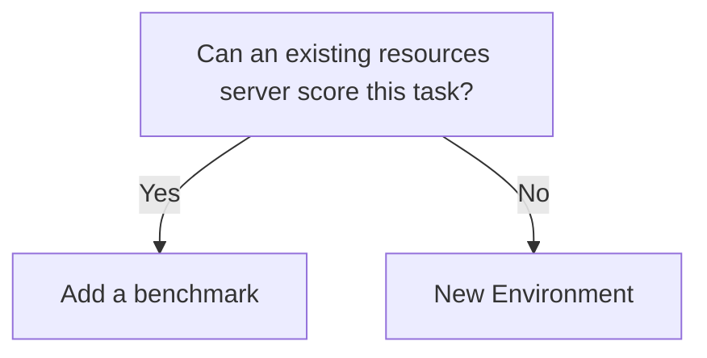

You do not always need a new environment. Most benchmarks reuse a scorer that already exists.

Search first:

```bash
gym search "grade school math"
```

Then pick a path:



| Path | When | Guide |
| --- | --- | --- |
| Reuse | Same verifier, new data, prompt, or repeats | [Add a benchmark](/contribute/environments/adding-a-benchmark) |
| New scorer | You need new `verify()`, tools, or state | [New Environment](/contribute/environments/new-environment) |

Copy [`benchmarks/gsm8k`](https://github.com/NVIDIA-NeMo/Gym/tree/main/benchmarks/gsm8k) when reusing a scorer such as `math_with_judge`, `mcqa`, or `code_gen`.

<Note>
Need a GUI VM, browser, repo sandbox, or a third-party runner? See [Complex benchmarks](/contribute/environments/adding-a-benchmark#complex-benchmarks) and [Integrate external libraries](/environment-tutorials/integrate-external-environments). Do not use `gym env init --benchmark --reuse-verifier` against in-tree servers; they do not export `VERIFIER_FIXTURE`.
</Note>
