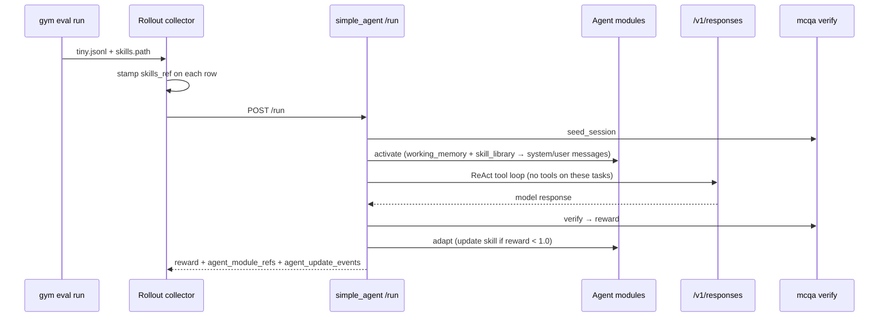

This walkthrough runs the **Agent modules** reference implementation end-to-end: a `working_memory` module injects the answer format, a `skill_library` module injects skill content into the system message, and optional **adaptation** appends lessons to skills after failed rollouts.

Use it to see the `activate` → harness → `verify` → `adapt` flow before scaling to GEPA, ACE, or full benchmarks.

<Info>

This tutorial uses `simple_agent`, which has no native skill discovery. Skills are injected via `injection_mode: context`. Claude Code agents use `injection_mode: none` and `stage_skills` instead — see [Agent Skills](/agent-server/agent-skills).

</Info>

## What This Tutorial Runs

| Component | Value |
| --- | --- |
| Resources server | `agent_modules_tutorial_mcqa` (inherits [mcqa](/environment-tutorials/mcp-resources-server)) |
| Agent | `agent_modules_tutorial_simple_agent` |
| Config | `benchmarks/agent_modules_tutorial/config.yaml` |
| Dataset | `benchmarks/agent_modules_tutorial/data/tiny.jsonl` (2 MCQ tasks, no pre-baked prompts) |
| Skills | `benchmarks/skills/variant_a/` (`cot_enhanced`, `baseline`) |
| Prompt module | `benchmarks/prompts/eval/aai/mcq-4choices.yaml` |
| Pass score | `reward: 1.0` when the model answer matches `expected_answer` |

## Flow (what happens per rollout)



## Prerequisites

1. Complete [Installation](/get-started/installation).
2. Configure a model endpoint in `env.yaml` at the repo root (same as [Quickstart](/get-started/quickstart)):

```yaml
policy_base_url: https://api.openai.com/v1
policy_api_key: <your-api-key>
policy_model_name: gpt-4.1-2025-04-14
```

Or use another supported backend from [Configure Model](/model-server).

## Step 1 — Copy skills to a writable directory

Adaptation **mutates** `SKILL.md` in place when a rollout fails. Copy the sample skills so the repo stays clean:

```bash
cp -r benchmarks/skills/variant_a /tmp/agent_modules_skills_variant_a
```

To compare skill variants later without adaptation, copy `variant_b` or edit skills under `/tmp/…` only.

## Step 2 — Start servers

From the repository root:

```bash
source .venv/bin/activate

gym env start \
  --config benchmarks/agent_modules_tutorial/config.yaml \
  --resources-server agent_modules_tutorial_mcqa \
  --model-type openai_model
```

You should see three instances, including `agent_modules_tutorial_simple_agent` and `policy_model`.

Leave this terminal running.

## Step 3 — Collect rollouts

In a second terminal:

```bash
source .venv/bin/activate
mkdir -p results

gym eval run --no-serve \
  +agent_name=agent_modules_tutorial_simple_agent \
  +input_jsonl_fpath=benchmarks/agent_modules_tutorial/data/tiny.jsonl \
  +output_jsonl_fpath=results/agent_modules_tutorial_rollouts.jsonl \
  +skills.path=/tmp/agent_modules_skills_variant_a \
  +limit=2 \
  +num_repeats=1
```

The run stamps `skills_ref` on each row during rollout collection and applies Agent modules inside `/run`.

## Step 4 — Inspect outputs

**Aggregate metrics** (terminal summary):

```text
Key metrics for agent_modules_tutorial_simple_agent:
{
    "mean/reward": ...
}
```

**Single rollout row** — provenance and adaptation:

```bash
head -1 results/agent_modules_tutorial_rollouts.jsonl | python -m json.tool
```

Look for these fields:

| Field | Meaning |
| --- | --- |
| `reward` | Environment verifier score (`1.0` = correct MCQ answer) |
| `skills_ref` | Run-level skills directory + content hash stamped by rollout collection |
| `agent_module_refs` | Active module refs (`working_memory` hash, `skill_library` hash) |
| `agent_update_events` | Skill adaptations after failed rollouts (`before_hash` → `after_hash`) |

Example `agent_module_refs` entry:

```json
{
  "type": "skill_library",
  "name": "tutorial_skills",
  "hash": "a1b2c3d4e5f6",
  "path": "/tmp/agent_modules_skills_variant_a"
}
```

If any rollout had `reward < 1.0`, check whether adaptation ran:

```bash
grep -o '"agent_update_events":\[[^]]*\]' results/agent_modules_tutorial_rollouts.jsonl | head -1
cat /tmp/agent_modules_skills_variant_a/cot_enhanced/SKILL.md
```

A `## Lesson` section at the bottom of `cot_enhanced/SKILL.md` means `adapt` appended an adaptation stub.

## Step 5 — Compare skill variants (optional)

Re-run with the same tasks but a different skills directory (no code changes):

```bash
cp -r benchmarks/skills/variant_a /tmp/agent_modules_skills_variant_b
# Edit /tmp/agent_modules_skills_variant_b/cot_enhanced/SKILL.md if you like

gym eval run --no-serve \
  +agent_name=agent_modules_tutorial_simple_agent \
  +input_jsonl_fpath=benchmarks/agent_modules_tutorial/data/tiny.jsonl \
  +output_jsonl_fpath=results/agent_modules_tutorial_variant_b.jsonl \
  +skills.path=/tmp/agent_modules_skills_variant_b \
  +limit=2 \
  +num_repeats=1
```

Compare `skills_ref.hash` or `agent_module_refs[].hash` between files — different skill bytes produce different hashes even at the same path pattern ([#1256](https://github.com/NVIDIA-NeMo/Gym/issues/1256)).

## Step 6 — Prompt-only baseline (optional)

To see modules in isolation, temporarily disable skills on the command line by omitting `+skills.path` and removing the `skill_library` block from `benchmarks/agent_modules_tutorial/config.yaml`, then restart servers. The `working_memory` module alone still materializes `responses_create_params.input` from each row's `problem` field.

## Files to read in the repo

| Path | Role |
| --- | --- |
| `nemo_gym/agent_modules.py` | `AgentModule`, `activate` / `adapt`, `module_refs` |
| `responses_api_agents/simple_agent/app.py` | `/run` wiring |
| `nemo_gym/skills.py` | `format_skills_for_context`, `apply_skill_adaptation` |
| `benchmarks/agent_modules_tutorial/config.yaml` | Tutorial server + module config |
| [Agent Modules research note](/researchnotes/agent-modules) | Design rationale |

## Next steps

- Scale up: [GPQA](/evaluation/environment-list) with the same module pattern on a full benchmark config.
- Native skills: [Claude Code agent](https://github.com/NVIDIA-NeMo/Gym/tree/main/responses_api_agents/claude_code_agent) + `injection_mode: none`.
- Optimizers: replace rule-based `adaptation` with GEPA (working memory) or ACE (skill/playbook) drivers — see [Agent Modules research note](/researchnotes/agent-modules).
