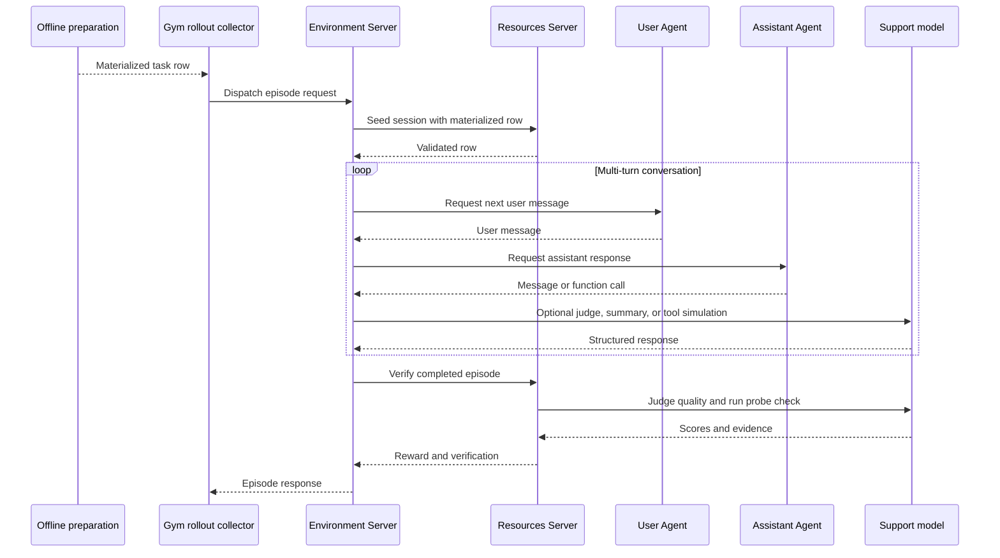

<Info>
**Goal:** Generate the 14-task NeMo User Sim validation set, run one conversation with the assistant you want
to evaluate, and confirm that the rollout contains a conversation and score.
</Info>

[NeMo User Sim](https://github.com/NVIDIA-NeMo/UserSim) supplies simulated users and conversation scenarios.
NeMo Gym runs each scenario through your configured assistant and uses NeMo User Sim's evaluation components
inside the Resources Server to score the assistant's responses and tool choices.

The rollout has two participants:

- The **User Agent** generates messages for the sampled user persona.
- The **Assistant Agent** invokes the assistant you are evaluating through `policy_model`.

A third endpoint, `support_model`, handles structured internal work such as judging response quality, producing
summaries, simulating selected tool results, and running probe-specific checks.



## Prerequisites

Install NeMo Gym as described in [Installation](/get-started/installation), activate its environment, and
run commands from the repository root:

```bash
source .venv/bin/activate
```

NeMo User Sim samples personas from the extended Nemotron-Personas dataset on NGC. If `en_US` is not already
cached under `~/.data-designer/managed-assets/datasets/`, configure the NGC CLI:

```bash
uvx --from "git+https://github.com/NVIDIA-NeMo/UserSim.git@a5f676bf6dc5a73914c8a0860f97c10dd2c214ee" \
  usersim setup-ngc
export NGC_CLI_API_KEY="<your-ngc-key>"
```

See the [NGC CLI installation guide](https://docs.nvidia.com/ngc/latest/ngc-catalog-user-guide.html#installing-ngc-catalog-cli)
and [API key guide](https://docs.nvidia.com/ngc/latest/ngc-catalog-user-guide.html#ngc-api-keys) if setup needs
manual credentials.

Create or update `env.yaml` in the repository root:

```yaml
user_model_base_url: https://your-user-model-endpoint.example.com/v1
user_model_api_key: ${oc.env:USER_MODEL_API_KEY}
user_model_name: your-user-simulation-model

policy_base_url: https://your-policy-endpoint.example.com/v1
policy_api_key: ${oc.env:POLICY_API_KEY}
policy_model_name: your-assistant-model

support_model_base_url: https://your-support-endpoint.example.com/v1
support_model_api_key: ${oc.env:SUPPORT_MODEL_API_KEY}
support_model_name: your-structured-output-model
```

All three URLs must expose an OpenAI-compatible Chat Completions API. The support endpoint must also accept
`json_schema` response formats. If it rejects the scorer schema, verification is masked with
`verifier_error`.

Export the referenced secrets:

```bash
export USER_MODEL_API_KEY="<your-api-key>"
export POLICY_API_KEY="<your-api-key>"
export SUPPORT_MODEL_API_KEY="<your-api-key>"
```

## Generate the validation tasks

Ask Gym to run the validation dataset's declared preparation script:

```bash
gym eval prepare --environment nemo_user_sim
```

The script runs the pinned NeMo User Sim materializer in an isolated dependency environment and writes
`environments/nemo_user_sim/data/nemo_user_sim.jsonl`. Its 14 deterministic rows contain one task for each
first-party probe. NeMo User Sim resolves the persona, scenario, tools, seed, trajectory identity, and provenance
before rollout collection begins.

Confirm that all probe tasks were generated and inspect them:

```bash
wc -l environments/nemo_user_sim/data/nemo_user_sim.jsonl
jq '.resolved_row | {
  probe_type, trajectory_id, usersim_provenance, usersim_config
}' environments/nemo_user_sim/data/nemo_user_sim.jsonl
```

The Resources Server validates required fields and the pinned NeMo User Sim revision when it seeds a session.
It stores a digest and compares it during verification, proving that the materialized row did not change during
the episode.

## Collect one rollout

Start with one task and one repeat:

```bash
mkdir -p results/nemo_user_sim/model-calls
capture_dir="$(pwd)/results/nemo_user_sim/model-calls"

gym eval run \
  --environment nemo_user_sim \
  --split validation \
  --output results/nemo_user_sim/rollouts.jsonl \
  --limit 1 \
  --num-repeats 1 \
  +user_model_uses_reasoning_parser=false \
  +policy_uses_reasoning_parser=false \
  +support_model_uses_reasoning_parser=false \
  ++observability_enabled=true \
  ++model_call_capture_dir="${capture_dir}"
```

The parser flags above use the configuration defaults. Set one to `true` only when that endpoint returns a
separate reasoning field that Gym must parse.

A successful run writes:

- `results/nemo_user_sim/rollouts.jsonl`: completed episodes and scores.
- `results/nemo_user_sim/rollouts_materialized_inputs.jsonl`: the exact input used for each attempt.
- `results/nemo_user_sim/rollouts_failures.jsonl`: attempts that failed before a completed episode was saved.
- `results/nemo_user_sim/model-calls/`: captured participant model calls.

## Inspect the result

Read the ordered conversation:

```bash
jq '{
  probe_type: .verification.verifier_data.probe_type,
  conversation: .usersim_result.conversation_messages,
  reward,
  mask_sample
}' results/nemo_user_sim/rollouts.jsonl
```

`reward` is the mean of normalized helpfulness, accuracy, and coherence when `scenario_completed` is `true`
and all three axes are available; otherwise it is `0.0`. `mask_sample: false` includes the reward in aggregate
metrics. A masked rollout remains available for diagnosis but is excluded from aggregation.

Inspect the exact participant requests and responses:

```bash
jq '.invocations[]
  | select(.role == "user" or .role == "assistant")
  | {sequence, role, request, response, termination_reason}' \
  results/nemo_user_sim/rollouts.jsonl
```

The smoke run is complete when the rollout contains alternating User and Assistant messages, a non-error
verification object, and the expected `mask_sample` value.

## Run all validation tasks

After the smoke rollout succeeds, remove `--limit 1` to run all 14 generated probe tasks:

```bash
gym eval run \
  --environment nemo_user_sim \
  --split validation \
  --output results/nemo_user_sim/all-probes.jsonl \
  --num-repeats 1 \
  +user_model_uses_reasoning_parser=false \
  +policy_uses_reasoning_parser=false \
  +support_model_uses_reasoning_parser=false \
  ++observability_enabled=true \
  ++model_call_capture_dir="${capture_dir}"
```

## Next steps

- [Inspect NeMo User Sim rollouts](/tutorials/evaluation-tutorials/nemo-user-sim-rollout-inspection) for
  conversations, tools, scores, invocations, and model-call captures.
- [Troubleshoot NeMo User Sim rollouts](/tutorials/evaluation-tutorials/nemo-user-sim-rollout-troubleshooting) for
  collection, simulation, and grading failures.
- [NeMo User Sim integration reference](/tutorials/evaluation-tutorials/nemo-user-sim-integration-reference) for
  architecture, ownership, contracts, and field semantics.
