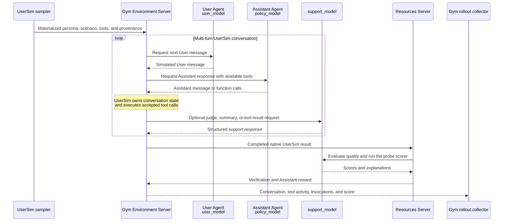

# Run Multi-turn User Simulation with NeMo UserSim

Use this tutorial when you want to evaluate an assistant through realistic multi-turn conversations instead of
independent, single-turn prompts. NeMo UserSim creates synthetic users with varied backgrounds and goals, while
NeMo Gym runs their conversations with your assistant at scale and records the results for evaluation.

The rollout has two participant Agents because both sides of the conversation must be generated independently:

- The **User Agent** acts as the sampled synthetic person and produces realistic follow-up messages.
- The **Assistant Agent** routes each activation to `policy_model`. UserSim evaluates the resulting Assistant
  messages and tool choices, not the Agent Server process itself.



The Environment Server drives UserSim's native conversation loop. The User and Assistant Agents supply the
two participant messages, the support model handles structured internal calls, and the Resources Server
verifies the completed episode before Gym saves it.

By the end of this tutorial, you will:

1. Materialize canonical UserSim episode inputs.
2. Run one multi-turn conversation against your model endpoint.
3. Inspect the conversation, score, and underlying model calls.
4. Optionally expand the run across 14 included evaluation scenarios.

## Understand the workflow

At a conceptual level, a UserSim rollout has four stages:

1. **Resolve episode inputs:** UserSim's canonical sampler resolves persona, probe, theme, toolset, locale,
   configuration, trajectory identity, and provenance. A **probe** tests a behavior such as answering
   educational questions, using tools, or maintaining safety boundaries.
2. **Wrap Gym tasks:** Gym places each unchanged UserSim row in a task envelope without resampling it.
3. **Hold a conversation:** A simulated user and the assistant exchange messages over multiple dialogue rounds.
   UserSim decides when the user's goal has been met or the conversation should stop.
4. **Verify the result:** Gym stores the complete episode and UserSim's probe-specific evidence and score.

In this tutorial, a **task** specifies what to simulate, and an **episode** is one attempt to run that task. The
included UserSim environment contains an example suite with one task for each of UserSim's 14 first-party
probes. The suite demonstrates and tests the integration.

<Note>
To run the tutorial, configure the model endpoints and provide NGC access for the first persona-dataset
download. You do not need to understand the internal two-Agent topology or support-model routing. The optional
architecture section later on explains it for readers who want to customize models, roles, or observability.
</Note>

<Info>
You do not need to install UserSim separately. The preparation and runtime commands automatically install the
public [NVIDIA-NeMo/UserSim](https://github.com/NVIDIA-NeMo/UserSim) repository over HTTPS, pinned to revision
`a5f676bf6dc5a73914c8a0860f97c10dd2c214ee` for reproducible results. No SSH credentials or repository access
approval is required.
</Info>

## Prerequisites

Install NeMo Gym and activate its environment as described in [Installation](/get-started/installation):

```bash
source .venv/bin/activate
```

Preparation runs the pinned UserSim revision in a preparation-only isolated environment. Runtime servers
install the same revision into their own environments. Neither step modifies the Gym environment.

UserSim samples personas from the extended Nemotron-Personas dataset on NGC. Unless the `en_US` dataset is
already cached under `~/.data-designer/managed-assets/datasets/`, create a free
[NGC API key](https://org.ngc.nvidia.com/account/api-keys) and export it before preparation:

```bash
export NGC_CLI_API_KEY="<your-ngc-key>"
```

UserSim also recognizes the legacy `NGC_API_KEY` variable. `NGC_CLI_API_KEY` is preferred because it matches
the current NGC CLI documentation. The key is needed for the persona dataset download, not for access to the
public UserSim source repository.

Configure the User, Assistant policy, and structured-output support models in a local repository-root
`env.yaml`:

```yaml
user_model_base_url: https://your-user-model-endpoint.example.com/v1
user_model_api_key: ${oc.env:USER_MODEL_API_KEY}
user_model_name: your-user-simulation-model

policy_base_url: https://your-policy-endpoint.example.com/v1
policy_api_key: ${oc.env:POLICY_API_KEY}
policy_model_name: your-policy-model

support_model_base_url: https://your-support-endpoint.example.com/v1
support_model_api_key: ${oc.env:SUPPORT_MODEL_API_KEY}
support_model_name: your-structured-output-model
```

Export the referenced secrets without committing them:

```bash
export USER_MODEL_API_KEY="<your-api-key>"
export POLICY_API_KEY="<your-api-key>"
export SUPPORT_MODEL_API_KEY="<your-api-key>"
```

Gym starts three **Model Server** instances. These are inference proxies, not the User/Assistant Agent Servers
or the Resources Server:

- **`user_model`** serves the User Agent, which produces simulated User messages. Its upstream endpoint is
  configured with `user_model_base_url`, `user_model_api_key`, and `user_model_name`.
- **`policy_model`** serves the Assistant Agent and produces the system-under-test responses. Its upstream
  endpoint is configured with `policy_base_url`, `policy_api_key`, and `policy_model_name`.
- **`support_model`** serves Judge, Summary, probe-scoring, and tool-result-simulation calls. Its upstream
  endpoint is configured with `support_model_base_url`, `support_model_api_key`, and `support_model_name`.

Each Gym Model Server can point to a different upstream model endpoint. The URLs may also match when one
provider serves multiple roles. Keeping the settings separate lets you hold the simulated User and evaluator
models fixed while changing the Assistant policy. For `support_model`, prefer a model that reliably follows
JSON-schema response formats.

The reasoning-parser flags in the rollout command describe the response format of each upstream endpoint.
They do not select which role uses the model. Enable a parser only when that endpoint returns reasoning fields
that require it.

## Prepare resolved inputs

Run preparation once before starting the servers:

```bash
gym eval prepare --config environments/usersim/config.yaml
```

Preparation calls `usersim.engine.external.materialize_episode_inputs(...)` in the isolated environment and
writes `environments/usersim/data/example.jsonl`. It produces one deterministic row for every registered
probe. UserSim—not Gym—owns all sampled content and provenance.

In practical terms:

- There is one generated Gym task file: `environments/usersim/data/example.jsonl`.
- Each of its 14 rows is already a complete task. UserSim has resolved the persona, scenario/probe, theme,
  tools, locale, random seed, trajectory identity, and provenance for that row.
- Gym does not maintain a second `example_source.jsonl`, a separate pool of 1,000 personas, or scenario
  templates that it combines with UserSim data.
- At runtime, the Resources Server checks that the task is the same immutable, provenance-pinned row that was
  prepared. It does not choose a different persona, probe, or scenario.

The equivalent UserSim CLI contract for one selected probe is:

```bash
usersim simulate \
  --locale en_US \
  --num-rows 1 \
  --probe-mix tool_calling=1 \
  --random-seed 42 \
  --materialize-inputs \
  --out episode-inputs.jsonl
```

Inspect the prepared inputs:

```bash
wc -l environments/usersim/data/example.jsonl
jq '.task_input.resolved_row | {
  probe_type, trajectory_id, usersim_provenance, usersim_config
}' environments/usersim/data/example.jsonl
```

## Collect one rollout

`--environment usersim --split example` selects the included 14-task example suite described above. Start
with only the first task and one repeat:

```bash
mkdir -p results/usersim/model-calls
capture_dir="$(pwd)/results/usersim/model-calls"

gym eval run \
  --environment usersim \
  --split example \
  --output results/usersim/rollouts.jsonl \
  --limit 1 \
  --num-repeats 1 \
  +user_model_uses_reasoning_parser=false \
  +policy_uses_reasoning_parser=true \
  +support_model_uses_reasoning_parser=false \
  ++observability_enabled=true \
  ++model_call_capture_dir="${capture_dir}"
```

`gym eval run` starts the required Environment, Resources, Agent, and Model Servers for this command. Increase
the limit only after the smoke rollout completes. UserSim's materialized row owns outer-turn configuration.
For a tool probe, each Assistant Agent call performs one model activation and returns any function calls to the
Environment-owned UserSim runtime. UserSim executes those calls and requests another Assistant activation when
the probe's native loop requires one.
The three reasoning-parser flags describe what each upstream endpoint returns, not the endpoint's role. Set a
flag to `true` only when that endpoint returns reasoning fields that require parsing.

## Inspect one collected rollout

Before interpreting a score, make sure you can answer two questions:

- **What happened?** Inspect the scenario, persona, User/Assistant conversation, tool activity, and models.
- **What was evaluated?** Confirm whose behavior was scored, why it received that score, and whether collection,
  simulation, or grading failed.

Successful episodes are in `rollouts.jsonl`. The exact UserSim input, including the sampled persona and
scenario, is in `rollouts_materialized_inputs.jsonl`. Choose one rollout and use the same indices in the
commands below. For example, task 13 and its first repeat have rollout identity `13:0`:

```bash
task_index=13
rollout_index=0

jq --argjson task "${task_index}" --argjson repeat "${rollout_index}" \
  'select(._ng_task_index == $task and ._ng_rollout_index == $repeat)' \
  results/usersim/rollouts.jsonl
```

When following the earlier `--limit 1` smoke command, use `task_index=0`.

### Inspect the scenario and persona

UserSim—not Gym—sampled these values. Read them from the materialized input:

```bash
jq --argjson task "${task_index}" --argjson repeat "${rollout_index}" \
  'select(._ng_task_index == $task and ._ng_rollout_index == $repeat)
   | .task_input.resolved_row
   | {
       scenario: .probe_type,
       persona: {
         id: .persona_uuid,
         name: ([.persona.first_name, .persona.last_name] | map(select(. != null)) | join(" "))
       },
       trajectory_id,
       theme,
       tool_subset
     }' \
  results/usersim/rollouts_materialized_inputs.jsonl
```

The scenario is also copied to `verification.verifier_data.probe_type` on the completed rollout. The
materialized file remains the authoritative record of all sampled inputs.

### Inspect the conversation, tools, and models

The following view keeps the complete ordered conversation. UserSim records User, Assistant, Assistant
tool-call, and tool-result messages together in `conversation_messages`:

```bash
jq --argjson task "${task_index}" --argjson repeat "${rollout_index}" \
  'select(._ng_task_index == $task and ._ng_rollout_index == $repeat)
   | {
       rollout_id: "\($task):\($repeat)",
       scenario: .verification.verifier_data.probe_type,
       conversation: (
         .usersim_result
         | {num_turns, num_tool_calls, conversation_messages}
       ),
       models_used: ([
         .invocations[]
         | {role, model: .response.model}
       ] | unique)
     }' \
  results/usersim/rollouts.jsonl
```

Read consecutive User and Assistant messages as one conversation, not as independent prompts. For example,
one collected rollout may show that the User first learns that the market is closed and then asks when it
will open. Those follow-up messages belong to the same rollout. You may omit intervening tool messages when
sharing a readable excerpt, but do not omit them when diagnosing behavior.

To inspect only tool activity:

```bash
jq --argjson task "${task_index}" --argjson repeat "${rollout_index}" \
  'select(._ng_task_index == $task and ._ng_rollout_index == $repeat)
   | .usersim_result.conversation_messages
   | map(select(.role == "tool" or ((.tool_calls // []) | length > 0)))' \
  results/usersim/rollouts.jsonl
```

`models_used` reports the model returned by each persisted activation and its semantic role. `user` is the
simulated User, `assistant` identifies the system-under-test responses, and `judge`, `summary`, and
`tool_simulation` are support roles. Provider-level requests, responses, token usage, and latency are available
in the model-call capture described below.

### Interpret the result

This integration evaluates the **Assistant participant behavior** produced by `policy_model` through the
Assistant Agent; it does not score the simulated User. Inspect completion, reward inclusion, quality axes,
probe-specific checks, and judge explanations together:

```bash
jq --argjson task "${task_index}" --argjson repeat "${rollout_index}" \
  'select(._ng_task_index == $task and ._ng_rollout_index == $repeat)
   | {
       rollout_id: "\($task):\($repeat)",
       conversation_status: .usersim_result.conversation_status,
       scenario_completed: .verification.scenario_completed,
       reward,
       mask_sample,
       reward_components,
       quality_scores: .verification.verifier_data.normalized_axis_scores,
       task_check: {
         name: .verification.verifier_data.native_scorer_name,
         result: .verification.verifier_data.native_scores
       },
       judge_axes: .verification.verifier_data.assistant_eval.axes,
       grading_failure: {
         kind: .failure_kind,
         reason: .failure_reason
       }
     }' \
  results/usersim/rollouts.jsonl
```

Interpret that view as follows:

- `verify()` does not emit a separate `evaluated_role` field. The integration's verification contract targets
  Assistant participant behavior, and the persisted evidence is named `assistant_eval`.
- The Environment projects `reward`, `mask_sample`, `failure_kind`, `failure_reason`, and `reward_components`
  from the Resources verifier onto the rollout's top level. This is the standard Gym scoring contract used by
  aggregation. The nested `verification` object retains the full UserSim-specific evidence.
- `conversation_status: true` means UserSim finished the conversation; `scenario_completed: true` additionally
  means both participants completed and any probe-specific scorer passed.
- `mask_sample: false` means the reward is eligible for aggregation. A masked row is retained for diagnosis
  but does not measure the Assistant policy.
- `reward` is UserSim's `assistant_quality`: the mean of the normalized helpfulness, accuracy, and coherence
  axes. `normalized_axis_scores` shows those components.
- `assistant_eval.axes` contains the original judge score and explanation. For example, a helpfulness rating
  of 4 on a 5-point scale is normalized to `0.8`.
- `native_scorer_name` and `native_scores` report the probe-specific task check when the scenario has one.

Resources calls UserSim's `TrajectoryEvaluatorGenerator.agenerate()` once with the explicit scorer selected
for the prepared probe. The full native `assistant_eval` cell, including judge reasoning and applicable
probe-scorer output, is retained under `verification.verifier_data`.

### Distinguish collection, simulation, and grading failures

Do not treat every missing reward as poor Assistant behavior:

- **Collection or Environment failure:** inspect `results/usersim/rollouts_failures.jsonl`. The
  `_ng_failure_class`, `_ng_failure_stage`, and `_ng_failure_message` fields identify failures before a
  completed rollout could be stored.
- **UserSim simulation failure:** inspect `usersim_result.simulation_outcome`. Verification copies its failure
  category and detail to the top-level `failure_kind` and `failure_reason`.
- **Grading failure:** top-level `failure_kind` is `probe_scorer_error` or `trajectory_evaluator_error`;
  details remain in `failure_reason`, `verification.verifier_data.native_scores`, or
  `verification.verifier_data.assistant_eval.error`.

```bash
jq '{
  rollout_id: "\(._ng_task_index):\(._ng_rollout_index)",
  collection_failure: ._ng_failure_class,
  stage: ._ng_failure_stage,
  message: ._ng_failure_message
}' results/usersim/rollouts_failures.jsonl
```

The key saved fields are:

- `usersim_result.conversation_messages`: ordered User, Assistant, tool-call, and tool-result messages.
- `usersim_result.conversation_status`: whether UserSim completed the conversation.
- `reward`, `mask_sample`, and `reward_components`: Gym's top-level scoring contract.
- `verification.verifier_data.assistant_eval`: quality ratings and judge explanations.
- `failure_kind` and `failure_reason`: top-level simulation or grading failure details.
- `_ng_failure_*` in the failures sidecar: collection and Environment failure details.

The ordered invocation ledger is the Environment Server's trajectory contract:

```bash
jq '.invocations[] | {
  sequence,
  role,
  request,
  response,
  observations,
  state_after,
  termination_reason
}' results/usersim/rollouts.jsonl
```

`role` is one of `user`, `assistant`, `judge`, `summary`, or `tool_simulation`. Internal UserSim model aliases
and an agent-versus-model executor label are intentionally not exposed. The `request` and `response` fields
preserve the exact Responses API exchange for each Environment-owned activation.

<Note>
The final rollout is an episode response, not one flattened Assistant transcript. The invocation ledger records
Environment-owned activations. Native tool calls and results remain in `usersim_result`; probe-specific
verification calls remain in verification evidence.
</Note>

The raw model-call capture provides provider-level payloads, token usage, and latency for the hosted calls:

```bash
find "${capture_dir}" -type f -maxdepth 3 -print
jq '.ng_model_call_capture, .ng_trajectory' results/usersim/rollouts.jsonl
```

Use these layers for different questions:

- `reward`, `mask_sample`, and `reward_components`: Gym's standard scoring and aggregation fields.
- `usersim_result`: UserSim's native conversation and outcome.
- `verification`: normalized axes, judge explanations, and native scorer evidence.
- `invocations`: ordered, role-attributed Environment activations.
- `ng_model_call_capture`: underlying model calls, token usage, latency, and tool-call evidence.
- `ng_trajectory`: normalized Gym observability when the participating Agent provides it.

The concrete Pydantic contracts are defined in
[`resources_servers/usersim/episode_contracts.py`](https://github.com/NVIDIA-NeMo/Gym/blob/main/resources_servers/usersim/episode_contracts.py).

## Run more probes

After inspecting the smoke rollout, remove `--limit 1` to run the 14 prepared examples:

```bash
gym eval run \
  --environment usersim \
  --split example \
  --output results/usersim/all-probes.jsonl \
  --num-repeats 1 \
  +policy_uses_reasoning_parser=true \
  +support_model_uses_reasoning_parser=false \
  ++observability_enabled=true \
  ++model_call_capture_dir="${capture_dir}"
```

The `tool_calling`, `safety_agentic`, and `financial_services` probes expose episode-scoped simulated tools to
the Environment-owned native UserSim runtime. The Resources Server verifies the runtime's tool evidence and
dispatches the probe's native UserSim scorer when one applies.

## Architecture details (optional)

You do not need this section to run or interpret the tutorial. It becomes relevant when you want to customize
Agent behavior, tool orchestration, model routing, or low-level observability.

The Environment Server reconstructs one `ProbeEpisodeRuntime` from the prepared row. That native runtime owns
the conversation lifecycle, probe state, tool validation and execution, semantic call indices, and completed
evidence. It requests each User, Assistant, Judge, or Summary activation. The Environment routes participant
activations through the matching Agent Server and support activations directly to the support Model Server.

For `tool_calling`, `safety_agentic`, and `financial_services`, the Assistant Agent returns function calls
without executing them. The Environment submits that response to `ProbeEpisodeRuntime`; UserSim executes the
accepted calls, appends the native tool messages, and decides whether another Assistant activation is needed.
UserSim's internal `api_response_model` calls route through the Environment's `tool_simulation_model`.

The Resources Server does not reconstruct a second probe runtime and exposes no probe tool or UserSim-specific
`/runtime` endpoints. It validates the immutable prepared row at seed time and verifies the authoritative
native result after the Environment completes the episode.

The **Judge** and **Summary** support aliases are model calls rather than Agents. Native conversations can
invoke them for semantic checks and optional context processing. Environment-owned tool-result synthesis and
Resources-owned verification also use `support_model`. The support endpoint may match another endpoint only
when that upstream model supports both conversational reasoning and strict structured output; the Gym aliases
remain distinct.

Persisted Environment-owned invocations use the semantic `user`, `assistant`, `judge`, `summary`, and
`tool_simulation` roles as applicable. The Resources Server owns final verification only. Its
`probe_scorer_model` also references `support_model`.

Prepared task rows can provide optional per-role request defaults through `responses_create_params`. The
Environment Server supplies the current conversation as each activation's Responses API `input`; the task
does not contain a prebuilt transcript.
