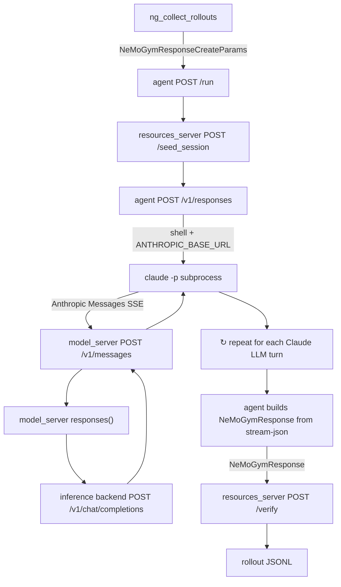
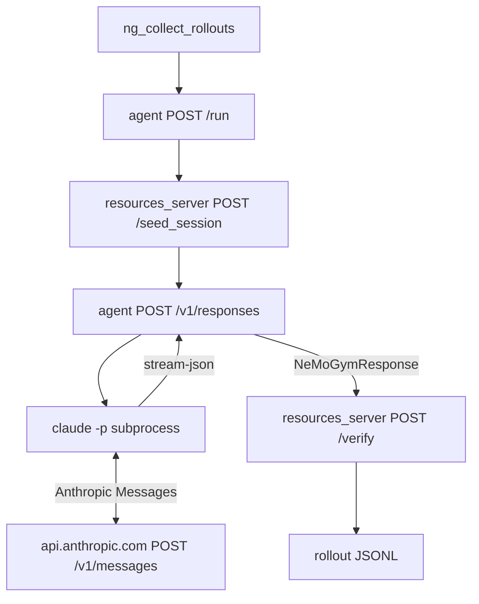
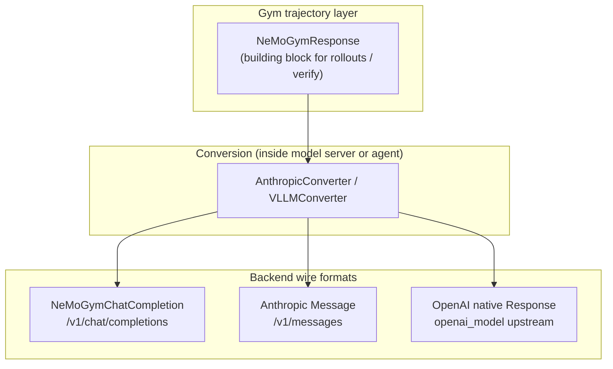

This engineering note summarizes the protocol stack behind the `claude_code_agent` harness: which Gym entities participate in a rollout, which data contracts apply at each hop, what [PR #1627](https://github.com/NVIDIA-NeMo/Gym/pull/1627) added, and where RL metadata lives.

## The four Gym server types

An environment decomposes into four concepts. Each maps to a FastAPI server type:

| Concept | Component | Key endpoints |
| --- | --- | --- |
| Dataset | JSONL rows | `responses_create_params` per task |
| Agent harness | `responses_api_agents/` | `POST /run`, `POST /v1/responses` |
| Verifier + state | `resources_servers/` | `POST /seed_session`, `POST /verify` |
| Model | `responses_api_models/` | `POST /v1/responses`, `/v1/chat/completions`, `/v1/messages` |

The **Claude Code CLI** (`claude -p`) is *not* a Gym server. It is a black-box subprocess spawned by `claude_code_agent` that only speaks the **Anthropic Messages API**.

## Gym's canonical data contracts

Gym standardizes on the **OpenAI Responses API shape** (with NeMo-specific extensions). Two types form the request/response pair:

| Type | Role |
| --- | --- |
| `NeMoGymResponseCreateParamsNonStreaming` | **Request** — input messages, tools, sampling params (from dataset JSONL) |
| `NeMoGymResponse` | **Response** — accumulated trajectory in `output[]`, plus `usage` |

`NeMoGymResponse` is **not** owned exclusively by models or agents. It is Gym's **shared trajectory contract**:

- **Model servers** produce it on `POST /v1/responses`
- **Agents** produce it on `POST /v1/responses`
- **Resources servers** consume it in `POST /verify` (`BaseVerifyRequest.response`)
- **Rollout harness** reads it from agent `/run` results

The trajectory building block is **`NeMoGymResponse.output[]`** — a sequence of messages, tool calls, tool results, and reasoning items.

### Training variants (`*ForTraining`)

RL metadata lives on **individual output items**, not on the top-level response envelope:

```python
class TokenIDLogProbMixin(BaseModel):
    prompt_token_ids: List[int]
    generation_token_ids: List[int]
    generation_log_probs: List[float]
```

Training subclasses (`NeMoGymResponseOutputMessageForTraining`, etc.) mix this in. A rollout JSONL row with RL data looks like:

```json
{
  "output": [
    {
      "type": "message",
      "role": "assistant",
      "content": [...],
      "prompt_token_ids": [1, 2, 3],
      "generation_token_ids": [4, 5, 6],
      "generation_log_probs": [-0.1, -0.2, -0.3]
    }
  ]
}
```

## Alternate wire formats (not the Gym trajectory contract)

Model servers expose **three** HTTP endpoints. Only one returns `NeMoGymResponse` on the wire:

| Endpoint | Wire format | Gym trajectory? |
| --- | --- | --- |
| `POST /v1/responses` | `NeMoGymResponse` JSON | **Yes** |
| `POST /v1/chat/completions` | `NeMoGymChatCompletion` JSON | No — one chat turn; converted internally or by caller |
| `POST /v1/messages` | Anthropic Message JSON or SSE | No — foreign protocol adapter ([PR #1627](https://github.com/NVIDIA-NeMo/Gym/pull/1627)) |

`NeMoGymChatCompletion` is a **backend/wire format** (one assistant turn in `choices[0].message`). `vllm_model` uses it internally: `responses()` converts to chat params, calls `chat_completions()`, then converts back to `NeMoGymResponse.output[]`.

Agents like `simple_agent` call model `POST /v1/responses` directly and never see chat completion. `harbor_agent` calls chat completions directly and converts its trajectory to `NeMoGymResponse` output items at the end.

## What PR #1627 added (and did not add)

[PR #1627](https://github.com/NVIDIA-NeMo/Gym/pull/1627) added a **third spoke** on model servers — not changes to the agent:

**Before:** `SimpleResponsesAPIModel` exposed `/v1/chat/completions` and `/v1/responses` only.

**After:** Every model server also exposes `POST /v1/messages` with a default handler that:

1. Converts Anthropic request → `NeMoGymResponseCreateParams`
2. Delegates to the server's own `responses()` → internal `NeMoGymResponse`
3. Converts `NeMoGymResponse` → Anthropic response (JSON or synthesized SSE)

**Not in PR #1627:**

- `claude_code_agent` itself (from #1336) — already had `model_server` ref and `_resolve_base_url()`
- Default `reasoning_gym_claude_code_agent.yaml` — still points at real Anthropic API
- RL side-channel plumbing — converter explicitly drops token IDs before Anthropic conversion

## End-to-end rollout flow (linear)

This is the full stack when using `reasoning_gym_claude_code_agent_model_server.yaml` + a model server (e.g. `vllm_model`):



### Message types at each hop

| Step | From → To | Format |
| --- | --- | --- |
| 1 | Rollout → agent `/run` | Task row with `responses_create_params` |
| 2 | Agent `/run` → resources `/seed_session` | Same task row |
| 3 | Agent `/run` → agent `/v1/responses` | `NeMoGymResponseCreateParamsNonStreaming` |
| 4 | Agent → Claude subprocess | Shell env (`ANTHROPIC_BASE_URL`, etc.) |
| 5 | Claude ↔ model `/v1/messages` | **Anthropic Messages** (many turns) |
| 6 | Inside model server | Anthropic → `NeMoGymResponse` → Anthropic (internal) |
| 7 | Model server ↔ vLLM | OpenAI Chat Completions (internal) |
| 8 | Claude → agent | **stream-json stdout** (full session) |
| 9 | Agent `/v1/responses` return | **`NeMoGymResponse`** (episode-level, for scoring) |
| 10 | Agent → resources `/verify` | Task row + `NeMoGymResponse` |

## Two NeMoGymResponse lifetimes (model-server path)

This is a common source of confusion. On the model-server path there are **two separate** `NeMoGymResponse` objects:

### Per-turn (internal, inside model server)

Each Claude LLM call triggers:

```
Anthropic request → NeMoGymResponseCreateParams → responses() → NeMoGymResponse
  → stripped → Anthropic response back to Claude
```

This object can carry RL fields when `return_token_id_information=True`, but Claude never sees them and Gym rollouts do not receive them today.

### Episode-level (what Gym scoring uses)

After Claude finishes the full session, the agent parses stream-json and **constructs one** `NeMoGymResponse` in `claude_code_agent.responses()`. That is what `/verify` reads.

Today this episode-level response uses plain `NeMoGymResponseOutputMessage` items — **no RL fields**, even if the model server produced them per turn.

## Direct Anthropic path (shorter)

With the default `reasoning_gym_claude_code_agent.yaml` (`anthropic_base_url: null`), steps involving the Gym model server drop out:



PR #1627 is **invisible** on this path.

## Why Anthropic format for Claude?

Claude Code CLI is hard-wired to `POST /v1/messages`. It cannot call Gym's `/v1/responses` or OpenAI chat completions. When you point Claude at a Gym model server, the server must **speak Anthropic on the wire** even though it implements `responses()` internally.

Think of `/v1/messages` as a **protocol adapter**:

```
Claude (USB-C / Anthropic)  ↔  Gym model server adapter  ↔  vLLM (HDMI / Chat Completions)
```

Gym's rollout pipeline only cares about the final **`NeMoGymResponse`** the agent builds from stream-json — not the per-turn Anthropic exchanges.

## RL metadata: where it exists and where it is lost

| Location | RL fields present? |
| --- | --- |
| `vllm_model` internal `NeMoGymResponse` (`return_token_id_information=True`) | Yes — on `*ForTraining` output items |
| Model server `POST /v1/responses` wire response | Yes (when configured) |
| Model server `POST /v1/messages` wire response | **No** — stripped in `responses_to_anthropic_response()` |
| `claude_code_agent` episode `NeMoGymResponse` | **No** — `parse_stream_json()` builds plain messages |
| Resources server `/verify` | Reads text from `NeMoGymResponse.output[]`; RL fields unused for scoring |

The planned RL path (not yet wired for Claude Code) would **side-channel** per-turn token IDs from the model server's internal `NeMoGymResponse` and merge them into the agent's episode-level `NeMoGymResponse` as existing `*ForTraining` types — not invent a new schema.

## Protocol layers on a model server



## Config cheat sheet

| Config | Model path | PR #1627 involved? |
| --- | --- | --- |
| `claude_code_agent/configs/claude_code_agent.yaml` (template) | Direct Anthropic | No |
| `reasoning_gym_claude_code_agent.yaml` | Direct Anthropic via env vars | No |
| `reasoning_gym_claude_code_agent_model_server.yaml` + `vllm_model.yaml` | Claude → Gym model `/v1/messages` → vLLM | **Yes** |

## Key takeaways

1. **`NeMoGymResponse.output[]` is the trajectory building block** — shared across models, agents, verifiers, and rollouts.
2. **`POST /v1/responses` is the Gym contract boundary** — not `/v1/messages` or `/v1/chat/completions`.
3. **PR #1627 adds an Anthropic adapter on model servers** so Claude Code can target any Gym backend without a separate proxy process.
4. **The agent wraps Claude as a black box** — Gym HTTP stops at `/v1/responses`; Claude's multi-turn loop uses Anthropic internally.
5. **RL metadata is schema-ready** (`*ForTraining` types) but **not yet plumbed** through the Claude Code + `/v1/messages` path.
