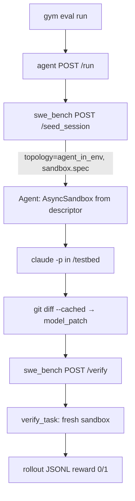

This engineering note documents the **`swe_bench` resources server**: what problem it solves, how it differs from earlier SWE integrations in Gym, and how to run evaluation with a black-box agent server such as `claude_code_agent`.

<Note>
This server ships with `verified: false` — it is a working prototype, not yet baselined on gold patches. See [Adding a Benchmark](/contribute/environments/adding-a-benchmark) for the path to `verified: true`.
</Note>

## Background: why a separate Environment server?

Earlier SWE convergence work ([PR #1738](https://github.com/NVIDIA-NeMo/Gym/pull/1738)) moved grading and sandbox spec **into the agent server** (`responses_api_agents/swe_env/`, inline `verify_task`). That pattern works for a single bundled agent, but it breaks composability:

- **Black-box agent servers** (Claude Code, OpenHands, Harbor, …) should not import SWE grading code or choose docker vs OpenSandbox themselves.
- **The Environment** should own task authority: sandbox spec, benchmark grading, and the `verified:` marker on the resources server.
- **Agents** should connect through a small HTTP contract (`seed_session` → run → `verify`), not an `anyswe`-style wrapper per agent.

The `swe_bench` resources server restores that boundary. Grading harnesses, parsing, and `verify_task` live as **private modules** under [`resources_servers/swe_bench/`](https://github.com/NVIDIA-NeMo/Gym/tree/main/resources_servers/swe_bench) — not under `responses_api_agents/`.

For cluster-scale SWE RL training topology (Apptainer, CPU sizing), see the older [SWE RL Case Study](/infrastructure/engineering-notes/swe-rl-case-study). This note focuses on the **Environment server + agent-server wiring** pattern.

## Three roles (orthogonal)

| Role | Gym component | SWE-bench example |
| --- | --- | --- |
| **Environment** | Resources server | `swe_bench` — `seed_session`, `verify`, benchmark harnesses |
| **Agent server** | `responses_api_agents/` | `claude_code_agent` — runs Claude in the instance sandbox |
| **Sandbox runtime** | `nemo_gym/sandbox/` | Docker provider (OpenSandbox / Apptainer as needed) |

<Warning>
**“Harness” overload.** In Gym docs, *agent harness* means orchestration inside an agent server. In SWE-bench, `swebench.harness` is the upstream eval stack. Under `swe_bench`, **`harness.py` / `harnesses/`** are **benchmark-family plugins** (provision + grade recipes keyed by `task.benchmark`). They are Environment-owned, not agent orchestration.
</Warning>

## What `swe_bench` exposes

The HTTP surface is intentionally thin ([`app.py`](https://github.com/NVIDIA-NeMo/Gym/tree/main/resources_servers/swe_bench/app.py)). Heavy logic stays in private modules.

| Endpoint | Responsibility |
| --- | --- |
| `POST /seed_session` | Build a **`SessionDescriptor`**: placement topology, per-instance `SandboxSpec`, merged `verifier_metadata` |
| `POST /verify` | Grade `verifier_metadata.model_patch` in a **fresh** eval sandbox (hermetic twin) |

### SessionDescriptor (response shape)

`seed_session` returns:

```json
{
  "placement": { "topology": "agent_in_env" },
  "sandbox": { "spec": { "image": "swebench/sweb.eval.x86_64....", "workdir": "/testbed", ... } },
  "egress": { "env": {} },
  "verifier_metadata": {
    "instance_id": "django__django-13741",
    "benchmark": "swe-bench",
    "dataset_name": "princeton-nlp/SWE-bench_Verified",
    "flat_eval": true
  }
}
```

The agent server reads **`placement.topology`** and **`sandbox.spec`** — it never imports `swe_bench.harness` or picks a provider on its own (beyond what its config already declares).

### Topology C (`agent_in_env`)

| Topology | Who owns the working sandbox | Typical agent |
| --- | --- | --- |
| `none` | No in-box work; MCP / host-side tools | Default Claude Code + MCP resources |
| `agent_in_env` | Agent starts the descriptor's sandbox and runs inside it | **`claude_code_swe_bench`** |
| `env_sandboxed` | Environment brokers box lifecycle (future broker RS) | Planned |
| `whole_interaction` | Single box for agent + eval (legacy) | `swe_agents` style |

**Topology C** is the target for SWE-bench Verified with Claude Code:

1. Environment returns image + workdir from the benchmark harness.
2. Agent server starts that sandbox, runs `claude -p` **inside** the instance image.
3. Agent harvests `git diff --cached` as `model_patch`.
4. Environment grades the patch in a **separate fresh container** (no agent pollution).



## Benchmark harness layer (private)

Each SWE dataset family registers a harness under [`harnesses/`](https://github.com/NVIDIA-NeMo/Gym/tree/main/resources_servers/swe_bench/harnesses):

| Registry key | Class | Notes |
| --- | --- | --- |
| `swe-bench` | `SweBenchHarness("swe-bench")` | Uses upstream `swebench` `make_test_spec` + `get_logs_eval` |
| `swe-bench-multilingual` | `SweBenchHarness("swe-bench-multilingual")` | Same class, different family name |
| `swe-bench-ext` | `SweBenchExtHarness` | Extended / fuzzy parsers |
| `swe-rebench` | `SweRebenchHarness` | SWE-rebench family |
| `r2e-gym` | `R2EGymHarness` | R2E-Gym |
| `nv-internal-1` | `NVInternalHarness` | Internal NV format |

The harness contract ([`harness.py`](https://github.com/NVIDIA-NeMo/Gym/tree/main/resources_servers/swe_bench/harness.py)) splits provisioning from grading:

- **Agent-visible:** `build_spec`, `supports_provider`, `materialize`
- **Verifier-only:** `reset_repo`, `run_eval`, `grade` (called only from `verify_task`)

For official SWE-bench instances, grading delegates to the external [`swebench`](https://github.com/SWE-bench/SWE-bench) package — Gym runs the official per-instance `eval_script` in the sandbox and parses logs with `swebench.harness.grading.get_logs_eval`.

## Dataset format

Each JSONL row needs SWE instance metadata in **`verifier_metadata`** (and typically mirrored in `responses_create_params.metadata`):

| Field | Purpose |
| --- | --- |
| `instance_id` | SWE-bench instance key (e.g. `django__django-13741`) |
| `dataset_name` | HuggingFace dataset id (selects harness family) |
| `split` | Usually `test` |
| `problem_statement` | User message / issue text for the agent |
| `instance_dict` | Full SWE-bench instance record (JSON string or object) — required for faithful grading |

Optional per-row `container_formatter` overrides the server default image template.

### Prepare SWE-bench Verified rows

```bash
python resources_servers/swe_bench/prepare.py --limit 5 --no-images
```

This writes `resources_servers/swe_bench/data/swebench_verified.jsonl`. Use `--no-images` for dataset-only smoke tests; full eval needs Docker images `swebench/sweb.eval.x86_64.{tag}` (see `prepare.py` for tag normalization: `__` → `_1776_`, lowercased).

## Configuration

Server config: [`resources_servers/swe_bench/configs/swe_bench.yaml`](https://github.com/NVIDIA-NeMo/Gym/tree/main/resources_servers/swe_bench/configs/swe_bench.yaml)

```yaml
swe_bench:
  resources_servers:
    swe_bench:
      sandbox_provider:
        docker: {}
      container_formatter: swebench/sweb.eval.x86_64.{instance_id}
      eval_timeout_s: 1800
      flat_eval: true
      default_topology: agent_in_env

claude_code_swe_bench:
  responses_api_agents:
    claude_code_agent:
      resources_server:
        type: resources_servers
        name: swe_bench
      sandbox_provider:
        docker: {}
      in_box_timeout_s: 1800
      bare: true
```

Key knobs:

| Config field | Effect |
| --- | --- |
| `sandbox_provider` | Passed to `verify_task` and agent in-box binding |
| `container_formatter` | Docker image template for instance sandboxes |
| `flat_eval` | Host-side grading (runs on any exec-capable provider) |
| `default_topology` | Returned from `seed_session` (`agent_in_env` for topology C) |
| `in_box_timeout_s` | Agent-side Claude run timeout inside the sandbox |

## Quickstart: evaluation rollouts

**1. Install and test the server** (unit tests use a fake sandbox — no Docker required):

```bash
gym env test --resources-server swe_bench
```

**2. Start servers** (Anthropic API key for Claude Code):

```bash
gym env start \
  --resources-server swe_bench \
  --agent claude_code_swe_bench \
  --model-type openai_model
```

**3. Run rollouts** on prepared JSONL:

```bash
gym eval run --no-serve --agent claude_code_swe_bench \
  --input resources_servers/swe_bench/data/swebench_verified.jsonl \
  --output results/swe_bench_rollouts.jsonl
```

The agent passes **`verifier_metadata.model_patch`** (unified diff) on `POST /verify`. The server returns `reward` ∈ `{0.0, 1.0}`, plus `resolved`, `patch_exists`, and optional `error_kind` / `mask_sample` for infra failures.

## Hermetic verify

`verify` **never** reuses the agent's working sandbox. `verify_task`:

1. Selects the harness for `task.benchmark`
2. Acquires a **fresh** sandbox via `acquire_sandbox` (always teardown)
3. Runs `reset_repo` → `materialize(model_patch)` → `run_eval` → `grade`
4. Maps the report to reward (`1.0` if resolved and no `error_kind`)

This mirrors SWE-bench's separation between “agent edits” and “official eval script in a clean tree,” and prevents agent artifacts from affecting the score.

<Accordion title="What if the patch is empty?">
`verify` short-circuits: `patch_exists=false`, `resolved=false`, `reward=0.0` — no eval sandbox spin-up.
</Accordion>

<Accordion title="Relationship to swe_agents / anyswe">
[`responses_api_agents/swe_agents`](https://github.com/NVIDIA-NeMo/Gym/tree/main/responses_api_agents/swe_agents) still shells out to `swebench.harness.run_local_evaluation` inside Apptainer-oriented rollouts. That path bundles agent + grading. **`swe_bench` + `claude_code_agent`** is the composable replacement: one Environment RS wired to many agent servers via the descriptor contract, without per-agent SWE wrappers.
</Accordion>

## Module map

```text
resources_servers/swe_bench/
├── app.py              # HTTP: seed_session, verify
├── harness.py          # SweTask, SweTaskHarness ABC, registry, compute_resolved
├── harnesses/          # Per-family plugins (swebench, r2e-gym, …)
├── verify_task.py      # Fresh-sandbox grading orchestrator
├── sandbox.py          # AsyncSweEnvironment + acquire_sandbox
├── task_builder.py     # JSONL metadata → SweTask
├── prepare.py          # HF dataset → Gym JSONL
└── configs/swe_bench.yaml
```

## Key takeaways

1. **`swe_bench` is the Environment** — it owns benchmark authority, not the agent server.
2. **`seed_session` returns a descriptor**, not opaque session state — agents bind sandboxes from `placement` + `sandbox.spec`.
3. **Topology C** runs Claude inside the instance image; **verify** always uses a hermetic twin sandbox.
4. **`harnesses/`** are benchmark eval plugins aligned with upstream `swebench.harness` — distinct from Gym “agent harness” orchestration.
5. **Any agent server** that implements `/run` → `seed_session` → work → `verify` with `model_patch` can plug in; no SWE-specific wrapper required.

## Related docs

- [Claude Code Agent — Protocol Stack](/infrastructure/engineering-notes/claude-code-agent-protocol-stack) — Responses API, `/v1/messages`, and rollout data contracts
- [SWE RL Case Study](/infrastructure/engineering-notes/swe-rl-case-study) — training-scale Apptainer topology
- [Real-World Environment tutorial](/environment-tutorials/real-world-environment/resources-server-implementation) — `seed_session` / `verify` patterns for resources servers
