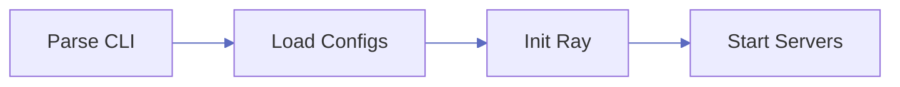
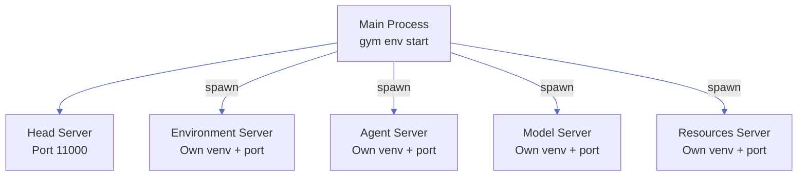
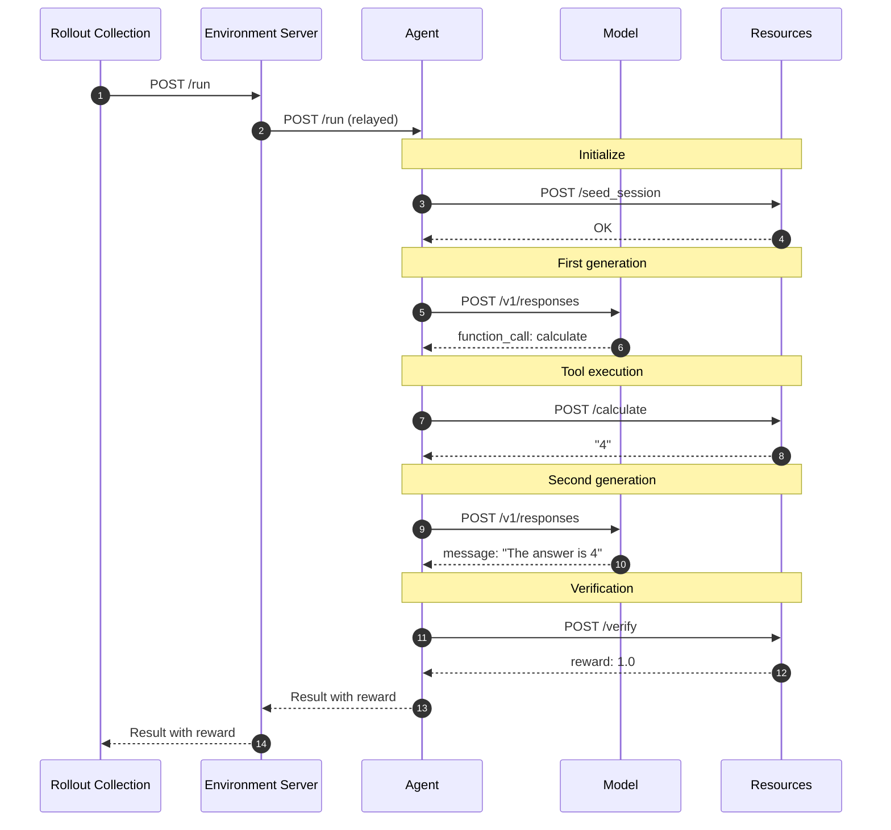
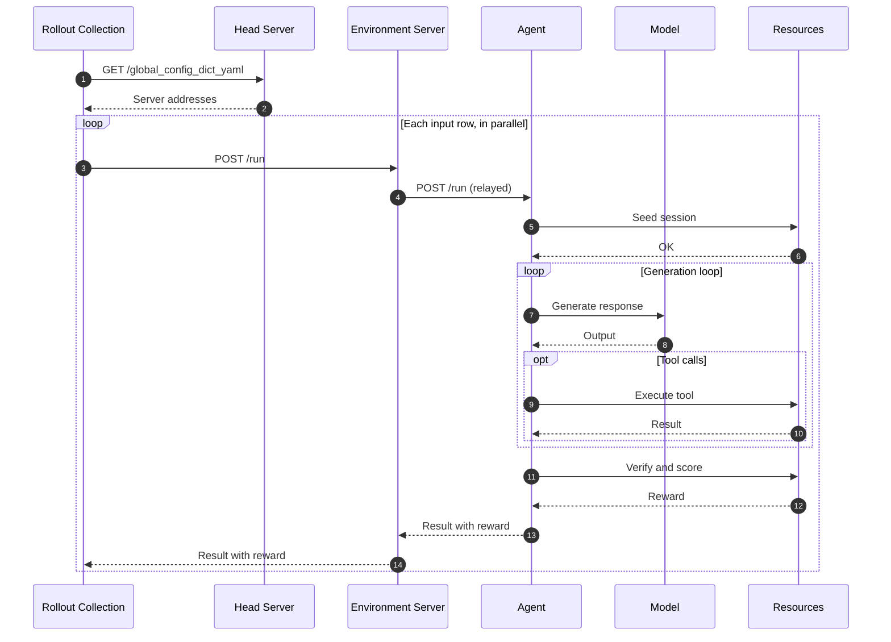

This page describes what happens inside NeMo Gym when you start servers with `gym env start` and collect rollouts with `gym eval run --no-serve`. It covers configuration loading, server startup and readiness, the HTTP calls made during one rollout, and shutdown.

It is written for environment developers who need to debug startup or rollout behavior, and for integrators who connect Gym to an evaluation or training system. For an overview of the server types, see [Environment Components](/about/architecture).

## Control Plane: Server Startup

When you run `gym env start`, the system starts up in four phases:



### Phase 1: Parse CLI

The `gym` CLI accepts two kinds of configuration input, and both become entries in the `config_paths` list.

- Named selectors such as `--resources-server`, `--model-type`, `--agent-type`, `--benchmark`, and `--environment` take a component name. The CLI resolves each name to that component's config file. For example, `--resources-server example_single_tool_call` resolves to `resources_servers/example_single_tool_call/configs/example_single_tool_call.yaml`.
- `--config` takes an explicit file path. It is repeatable, so you can pass several files.

This command uses named selectors:

```bash
gym env start \
    --resources-server example_single_tool_call \
    --model-type openai_model
```

This command loads the same configuration through explicit files:

```bash
gym env start \
    --config resources_servers/example_single_tool_call/configs/example_single_tool_call.yaml \
    --config responses_api_models/openai_model/configs/openai_model.yaml
```

Any argument that is not a `gym` flag is forwarded to Hydra as an override, such as `++policy_model_name=gpt-4.1`. Hydra parses the forwarded overrides, and OmegaConf merges them with the loaded config files. For the full flag list and override syntax, see [CLI Commands](/reference/cli-commands#hydra-overrides-escape-hatch).

### Phase 2: Load and Merge Configs

Gym loads configuration from three sources. A later source overrides an earlier one:

1. YAML files in `config_paths`, including the files that named selectors resolve to.
2. The local `env.yaml` file, which usually holds sensitive values such as API keys.
3. Command-line overrides, which have the highest priority.

A config file can list other files in its own `config_paths`. Two rules decide which value wins among these files:

- A config overrides the files it includes. This holds at any nesting depth.
- Files listed side by side are siblings. A later sibling overrides an earlier one, and it also overrides everything the earlier sibling included.

For example, a benchmark config that includes a shared agent config can redefine one of the agent's fields, and the benchmark's value wins.

When mixing named selectors and `--config`, the CLI uses a fixed flag-category order, not their order on the command line: `--config` files are loaded before `--benchmark` files. To override a benchmark with another file, pass both as explicit paths in order: `--config benchmarks/<name>/config.yaml --config my_overrides.yaml`. To print the merged result without starting servers, run `gym env resolve`.

**Port allocation**: Users can explicitly specify `host` and `port` in their config. If not provided, the framework automatically allocates ports from available system ports, tracking used ports to prevent conflicts.

### Phase 3: Initialize Ray

The system initializes a Ray cluster for distributed coordination. If `ray_head_node_address` is specified, Ray-enabled servers connect to that cluster; otherwise, Gym starts a cluster. Server implementations declaring `ray_enabled = False` do not import or connect to Ray. For how this fits a training cluster, see [Deployment Topology](/infrastructure/deployment-topology).

### Phase 4: Start Servers

Servers are started in two stages:



1. **Head Server**: Started as a background thread in the main process. Provides endpoints for config discovery (`/global_config_dict_yaml`) and server instance listing (`/server_instances`).

2. **Server Subprocesses**: Each configured server is spawned as an independent OS process:
   - Each server has its own Python virtual environment in order to isolate dependencies.
   - Each runs uvicorn with a FastAPI application listening on `http://{host}:{port}`.
   - The global config is passed via environment variable `NEMO_GYM_CONFIG_DICT`.
   - The specific server identity is passed via `NEMO_GYM_CONFIG_PATH`.
   - Server URLs are registered in the global config, allowing other servers to discover and call them.

   The Environment Server is the entry point for each rollout. Rollout collection sends `POST /run` to an Environment Server, not to the agent. The Environment Server's `agent_server` field names the agent it fronts. If an agent has no Environment Server in the config, Gym generates a `legacy_agent` Environment Server for it and prints a deprecation warning. See [Agent Without an Environment Server](/troubleshooting/configuration#agent-without-an-environment-server).

3. **Readiness Check**: The main process waits in two steps.
   - First, it sends an HTTP request to the root URL of each managed server until every server accepts the connection. The response status code is not checked, because many servers have no route at `/`. A server counts as ready when it accepts connections, not when it returns HTTP 200. `server_spinup_timeout_seconds` bounds this wait.
   - Second, it performs a best-effort connection check on upstream model endpoints named in the config, such as `policy_base_url`, retrying refused connections and timeouts. If the first probe cannot resolve a hostname, it prints a warning and skips that endpoint; a ready head therefore does not guarantee that every model endpoint is reachable. This step exists because a Gym model server is a proxy. It accepts connections as soon as it starts, even when no inference server is behind it. `model_endpoint_readiness_timeout_seconds` bounds this wait, and `0` skips it.

   After both steps pass, the head server is marked ready. If either wait times out, `gym env start` stops with an error that names the servers or endpoints that never answered. See [Gym Server Startup Timeout](/troubleshooting/configuration#gym-server-startup-timeout) and [Model Endpoint Unreachable](/troubleshooting/configuration#model-endpoint-unreachable).

## Running State

Once all servers are ready, the system enters steady state:

- The main process sleeps and checks every 60 seconds that each server subprocess is still running.
- Each server process runs its own uvicorn event loop, handling requests asynchronously.
- Servers communicate with each other only via HTTP (no shared memory).
- A session cookie identifies each rollout across multiple calls. The mutable per-rollout state, such as tool state, lives in the Resources Server, which looks it up by that cookie. The cookie does not carry the state itself.

## Shutdown

When the user presses Ctrl+C (or the process receives SIGINT):

1. SIGINT is forwarded to all server subprocesses.
2. The main process waits about one second for each subprocess to exit.
3. A subprocess that is still running after that wait is killed with SIGKILL. Gym prints the names of the killed processes. Work in progress in a killed server is lost, and its cleanup code does not run.
4. The head server thread is stopped, and Gym prints `NeMo Gym finished!`.

A clean exit is not guaranteed. A server that is slow to stop, such as one waiting on a sandbox or an inference call, is force-killed. A killed process can leave Ray error messages in the log. In rare cases, a process that does not exit after SIGKILL remains as a zombie until the main process exits.

---

## HTTP Request Flow: Example

During a single rollout, servers communicate via HTTP. This example shows a math problem with tool use. The Environment Server here is `legacy_agent`, which relays `/run` to an agent that runs the whole episode:



A native Environment Server takes over more of the episode. For example, [`single_agent_turn`](https://github.com/NVIDIA-NeMo/Gym/tree/main/environment_servers/single_agent_turn) seeds the Resources and agent sessions itself, asks the agent for one response, calls `/verify`, and closes both sessions. The agent only generates the response and calls tools.

**Key Design Points:**

- **HTTP-only communication**: All servers communicate via HTTP, enabling language-agnostic implementations and deployment flexibility
- **Environment Server as entry point**: Rollout collection reaches every agent through an Environment Server, which owns the episode protocol
- **Stateless model servers**: Model servers perform single-call generation without memory; the agent maintains conversation state
- **Session state in resources**: Resources servers keep per-rollout state on the server and use the session cookie to find it across multiple tool calls
- **OpenAI API compatibility**: Model servers expose `/v1/responses` endpoints compatible with the OpenAI Responses API
- **uvicorn + FastAPI**: All servers use [uvicorn](https://uvicorn.dev/) as the ASGI server with [FastAPI](https://fastapi.tiangolo.com/) for HTTP routing and request handling

---

## Data Plane: Rollout Collection

When you run `gym eval run --no-serve`, the system collects rollout results by executing rollouts in parallel. The output JSONL holds one trajectory and its reward per rollout. You can use it for evaluation metrics or as training data:



The client first queries the Head Server to discover server addresses from the global config. It then reads the input JSONL and sends one `POST /run` per row to the Environment Server that fronts the row's agent. Completed rollouts are written to output JSONL.

**Concurrency behavior differs by use case:**
- **Standalone rollout collection** (`gym eval run --no-serve`): `num_samples_in_parallel` limits active requests. `max_resident_rollout_tasks` limits how many rollout tasks the driver admits at once. When both are set, active requests cannot exceed the lower of the two limits. When `max_resident_rollout_tasks` is unset, the driver admits the complete workload as before.
- **Training framework integration** (e.g., NeMo RL): The standalone driver's limits above do not apply, because the training framework sends requests itself. Concurrency can still be bounded elsewhere: by the training framework's own settings, by an Environment Server that sets `max_concurrent_episodes`, by the model server, or by the upstream inference endpoint.

For artifact-oriented standalone runs, `retain_results_in_memory=false` writes each completion without keeping the complete return list, and `run_from_config()` returns an empty list. This bounds completed-result residency during collection, but aggregation and rollout upload can still load all applicable records. Set `disable_aggregation=true` and aggregate later when the collection process must avoid that final reload; fully streaming aggregation and upload require separate streaming interfaces.

## Related Pages

- [Deployment Topology](/infrastructure/deployment-topology): how Gym servers, Ray, and a training framework share or separate clusters.
- [Configuration Reference](/reference/configuration): config file locations, server fields, `env.yaml`, and command-line usage.
- [CLI Commands](/reference/cli-commands): every `gym` command, the named selectors, and Hydra override syntax.
- [Observability](/observability): metrics, tracing, and rollout evidence for running servers.
- [Configuration Troubleshooting](/troubleshooting/configuration): startup, validation, and connection errors and how to fix them.
