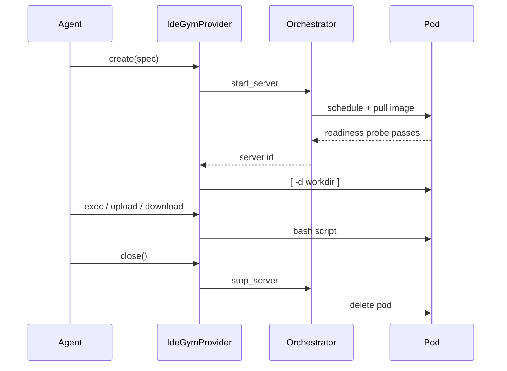

The `idegym` provider runs each sandbox as an [IdeGYM](https://github.com/JetBrains-Research/idegym) *server*: a Kubernetes pod provisioned through the IdeGYM orchestrator and driven over the HTTP API the orchestrator forwards to it. Use it when your evaluation environments already live in IdeGYM — SWE-bench-style repository tasks, IDE-backed environments, or anything else IdeGYM images provide.

It implements the provider-neutral `SandboxProvider` contract, so any sandbox-backed agent or resources server can use it by selecting `idegym` in its sandbox config.

## Setup

Install the optional dependency:

```bash
uv pip install 'nemo-gym[idegym]'
```

Point the provider at your orchestrator:

```bash
export IDEGYM_ORCHESTRATOR_URL=idegym.example.com
export IDEGYM_NAMESPACE=idegym
export IDEGYM_AUTH_USERNAME=...
export IDEGYM_AUTH_PASSWORD=...
```

<Warning>
`spec.image` must be an **IdeGYM server image**. The pod runs the IdeGYM server, and that server exposes the API this provider talks to. A plain benchmark image such as `swebench/sweb.eval.x86_64.*` has none, so it never becomes ready and `create()` fails. See [Images](#images).
</Warning>

```python
import asyncio

from nemo_gym.sandbox import AsyncSandbox, SandboxSpec

provider_config = {
    "idegym": {
        "connection": {"orchestrator_url": "idegym.example.com", "namespace": "idegym"},
        "create": {"run_as_root": True},
    }
}

spec = SandboxSpec(
    image="registry.example.com/idegym/my-env:latest",
    workdir="/testbed",
    resources={"cpu": 2, "memory_mib": 8192, "disk_gib": 30},
    metadata={"instance_id": "django__django-11099"},
)


async def main() -> None:
    async with AsyncSandbox(provider_config, spec) as sandbox:
        await sandbox.start()
        result = await sandbox.exec("python -m pytest -q", timeout_s=600)
        print(result.stdout or result.stderr)


asyncio.run(main())
```

Leaving the `async with` block stops the server and deletes its Kubernetes resources.

## Provider Config

`nemo_gym/sandbox/providers/idegym/configs/idegym.yaml` ships the full block with every knob commented. The essentials:

```yaml
sandbox:
  default_metadata:
    sandbox-api: idegym-client
  idegym:
    connection:
      orchestrator_url: ${oc.env:IDEGYM_ORCHESTRATOR_URL,idegym.test}
      namespace: ${oc.env:IDEGYM_NAMESPACE,idegym}
      username: ${oc.env:IDEGYM_AUTH_USERNAME,null}
      password: ${oc.env:IDEGYM_AUTH_PASSWORD,null}
      # Quota rules match this name by regex; pin it to whatever your rule expects.
      client_name: ${oc.env:IDEGYM_CLIENT_NAME,null}
      max_connections: 64
    create:
      ready_timeout_s: 1200
      run_as_root: true
    exec:
      default_timeout_s: 180
```

Every shipped provider config binds the same instance name `sandbox`, so switching a benchmark to IdeGYM is swapping one config path:

```bash
AGENT=responses_api_agents/mini_swe_agent_2/configs/mini_swe_agent_2.yaml
MODEL=responses_api_models/vllm_model/configs/vllm_model.yaml
gym env start \
    --config $AGENT \
    --config nemo_gym/sandbox/providers/idegym/configs/idegym.yaml \
    --config $MODEL
```

The remaining sections are `verify` (the post-start working-directory check), `files` (transfer chunk
sizes and the download cap), `operations` (status and teardown timeouts and retries), and
`attribution` (how the client name is derived when it is not pinned).

<Note>
Tracing is off unless `connection.tracing_endpoint` is set. The IdeGYM SDK otherwise traces to its own default off-box collector, and NeMo Gym does not send telemetry to a third party implicitly. Point `tracing_endpoint` at your own OTLP HTTP collector to opt in.
</Note>

## SandboxSpec Provider Options

`SandboxSpec.provider_options` carries the IdeGYM pod options that have no neutral equivalent. They are validated before a pod is allocated.

| Option | Notes |
| --- | --- |
| `resource_requests` | Kubernetes *requests*, paired with `spec.resources` as the limits. |
| `runtime_class_name` | e.g. `gvisor` for a sandboxed runtime. |
| `run_as_root` | Overrides `create.run_as_root` for this sandbox. |
| `node_selector` | Node labels for scheduling. |
| `volumes`, `volume_mounts` | Native Kubernetes shapes. |
| `env_from` | ConfigMap/Secret env import — the only way to put environment on the *pod*. |
| `service_account_name` | ServiceAccount for the pod. |
| `pod_overrides` | Partial `V1PodSpec` deep-merged into the generated pod spec (tolerations, affinity, ...). |
| `reuse_strategy`, `server_kind`, `snapshot`, `max_restarts` | Passed through to IdeGYM. |
| `server_name` | Pins the server name IdeGYM's reuse lookup matches on. Otherwise it is derived from the name prefix and metadata hints. |
| `service_port`, `container_port` | Override the configured ports. |

```yaml
mini_swe_agent_2:
  responses_api_agents:
    mini_swe_agent_2:
      sandbox_provider: sandbox
      sandbox_spec:
        ready_timeout_s: 1200
        workdir: /testbed
        resources:
          cpu: 2
          memory_mib: 8192
          disk_gib: 30
        provider_options:
          resource_requests:
            cpu: 0.5
            memory_mib: 2048
          runtime_class_name: gvisor
        metadata:
          instance_id: django__django-11099
```

## Relevant SandboxSpec Fields

| Field | Behavior |
| --- | --- |
| `workdir` | Not a pod setting. Each command `cd`s into it, and `create()` fails early if it does not exist (`verify.check_workdir`). |
| `env` | Exported per command. IdeGYM can only put ConfigMap/Secret env on the pod, via `provider_options.env_from`. |
| `metadata` | Not Kubernetes labels — IdeGYM has no per-server label API. `create.server_name_metadata_keys` folds selected keys (default `instance_id`) into the pod name. |
| `ttl_s` | Not enforced; warns. IdeGYM servers live until stopped, and its watcher reaps servers whose client stops heartbeating. |
| `ports` | Ignored; warns. An IdeGYM pod exposes only its own API port. |
| `entrypoint` | Fails `create()`. The container entrypoint starts the IdeGYM server. |

## Resource Mapping

| `SandboxSpec` field | IdeGYM mapping |
| --- | --- |
| `resources.cpu` | Kubernetes CPU **limit** (`2`, `500m`). |
| `resources.memory_mib` | Memory **limit** (`8192Mi`). |
| `resources.disk_gib` | `ephemeral-storage` **limit** (`30Gi`). |
| `provider_options.resource_requests` | The matching Kubernetes **requests**. |
| `resources.gpu`, `resources.gpu_type` | Not mapped; warns. Request accelerators via `node_selector` or `pod_overrides`. |

IdeGYM's resource quota accounting reads limits first, so `spec.resources` is what counts against your quota rule — not the smaller `resource_requests`.

## Lifecycle



**Create trusts IdeGYM's readiness wait.** The orchestrator reports a server only once its pod passes the Kubernetes readiness probe against the server's health endpoint, so `create()` adds one check of its own: that `spec.workdir` exists. Anything that fails after provisioning stops the server.

**One registered client per process.** IdeGYM's unit of ownership is a *client*: a heartbeating entity that owns N server pods, carries the resource quota keyed on its name, and terminates all of its servers when it stops. Every sandbox with an identical `connection` config shares one, reference-counted; the last release unregisters it, which also cleans up any server never closed. `connection.max_connections` bounds in-flight HTTP across all of them — bounding requests rather than whole operations, so provisioning a new sandbox cannot block execs on sandboxes already running.

**`close()` always deletes** the pod and its Kubernetes resources; it is idempotent, and a server the orchestrator no longer has counts as success.

## Job Attribution

Resource-limit rules are matched by regex against the client name, so set `connection.client_name` to whatever your deployment's rule expects. Left unset, the name is derived from job attribution — `NEMO_GYM_TEAM` / `NEMO_GYM_USER` / `NEMO_GYM_WORKLOAD`, then Slurm job variables — as `nemo-gym-<team>-<user>-<workload>`, so a run is attributable in the IdeGYM dashboard. The run id is deliberately excluded: a name that changes per launch defeats both quota matching and dashboard grouping.

## File Transfer

Uploads and downloads ride base64 over the bash tool, chunked in both directions: uploads to stay inside the ~100 KiB a command may occupy, downloads because each chunk's stdout is persisted as an async-operation result. `files.max_download_bytes` (64 MiB by default) caps a download.

This is fine for the config files, patches, and logs a benchmark moves around, but it is not a bulk channel — have the sandbox fetch large inputs itself.

## Images

Every sandbox image needs an IdeGYM server inside it — that server provides the bash tool this provider runs commands through, and the health endpoint the pod's readiness check polls. Build such images with IdeGYM's image builder, publish them where your cluster can pull them, then map upstream benchmark tags onto them:

```yaml
sandbox_spec:
  image_rewrites:
    - from: "swebench/"
      to: "registry.example.com/idegym-swebench/"
```

Rewrites are ordered and the first matching prefix wins. The provider does not build images.

## User and Runtime Notes

**Commands run as the container's user.** IdeGYM's bash tool has no user field, so `provider_options.run_as_root` decides this at pod level. `exec.user_mode` can wrap commands in `runuser` or `su` for images that ship them; both pin `/bin/bash` rather than inheriting a login shell that may be `/sbin/nologin`.

**Command and output limits.** A command may not exceed roughly 100 KiB once shaped into a script — IdeGYM passes it to the shell as a single `execve()` argument — and an oversized command comes back as a failed `SandboxExecResult` with `error_type="command_too_long"` rather than raising. The executor also strips leading and trailing whitespace from stdout and stderr.

## Unavailable Capabilities

| Capability | Reason |
| --- | --- |
| `sandbox.endpoint(port)` | The orchestrator forwards API requests rather than routing raw TCP to arbitrary container ports. |
| `sandbox.pty` | IdeGYM has no terminal API. |
| `sandbox.serialize()` / `AsyncSandbox.connect()` | A server is only reachable through the registered client that owns it. Front this provider with a sandbox server to share a sandbox across processes. |
