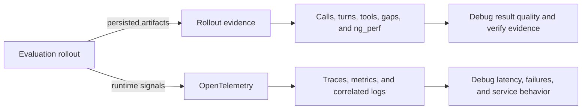

# Observability

NeMo Gym has two complementary observability families. **Rollout evidence** explains what an
agent and its models did in one saved evaluation attempt. **OpenTelemetry** explains how the
distributed Gym services behaved while they ran. Enable either family independently according to
the question you need to answer.

| If you need to answer... | Use | Enable with | Primary output |
| --- | --- | --- | --- |
| Which model calls and tools produced this rollout? Is its evidence complete? | Rollout evidence | `observability_enabled: true` and `model_call_capture_dir` | Attachments in rollout JSONL plus raw `CaptureStore` files |
| Which service was slow or failed? How did a request cross processes? | OpenTelemetry | `telemetry.enabled: true` or `NEMO_GYM_OTEL_ENABLED=1` | Traces, metrics, and optional logs in an OTLP backend or console |

<Note>
The switches and outputs are separate. Enabling `telemetry.enabled` does not create rollout
attachments, and enabling `observability_enabled` does not export OpenTelemetry signals.
</Note>

## Choose a path

<Cards>

<Card title="Rollout evidence" href="/main/observability/rollout-evidence">
Follow evidence from model-call capture and agent observations into `ng_trajectory`, `ng_perf`, and
rollout health checks.
</Card>

<Card title="OpenTelemetry" href="/main/observability/opentelemetry">
Trace requests across Gym services, export runtime metrics, and correlate application logs with
`nemo-lens`.
</Card>

</Cards>
