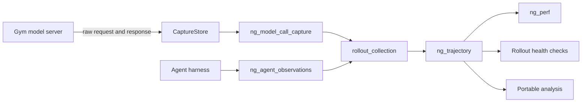

# Rollout evidence

Rollout evidence records what happened inside a saved evaluation attempt. Model servers persist
the exchanges they can see, agent harnesses describe turns and tool activity they can see, and
rollout collection joins those sources without guessing. The result is a canonical normalized
trajectory for analysis, while the original source artifacts remain authoritative for details the
trajectory does not represent.



## The four persisted views

| View | Purpose | Authority and retention |
| --- | --- | --- |
| `CaptureStore` | Append-only raw model-server requests, responses, timings, usage, and errors | Authoritative for the original model exchange; stored outside the rollout JSONL |
| `ng_model_call_capture` | Per-rollout model-call index and aggregate capture metrics | Attachment used by collection; successful projection moves payload copies into `ng_trajectory`, while raw payloads remain in `CaptureStore` |
| `ng_agent_observations` | Harness-observed invocations, model-visible conversation items, tool intervals, compaction, sandbox evidence, and explicit gaps | Authoritative for agent-side details; availability and depth depend on the agent integration |
| `ng_trajectory` | Normalized calls, turns, invocation references, tools, and gaps | Canonical downstream view for portable analysis and health checks; intentionally not a lossless union of both sources |

`ng_perf` is a compact summary derived from `ng_trajectory`. It reports observed turn and tool
counts, token totals for calls owned by reasoning turns, and independently measured rollout
latency. `token_observability_coverage` is the fraction of counted turns that resolve to an owned
model call. The attachment is absent when observability is disabled or no agent invocation was
observed.

## Enable collection

Set both capture fields on the model servers and rollout collector, and resolve the directory to
the same absolute shared path:

```yaml
observability_enabled: true
model_call_capture_dir: /absolute/shared/path/model-calls
```

Then route model requests through a Gym model server with the
`/ng-rollout/<rollout_id>` prefix. Gym's compatible built-in agents preserve this correlation for
their supported paths. Unprefixed calls and calls made directly to an external provider are not
captured at the Gym model-server boundary. See [Model-call capture](/main/model-server/model-call-capture)
for a complete command-line workflow, supported protocols, and storage requirements.

<Warning>
Use a separate capture directory for concurrent evaluation jobs whose task and rollout indices can
overlap. A rollout ID does not include an evaluation-run ID.
</Warning>

## How collection joins the sources

The collector projects evidence only when it can identify the same call exactly:

1. Match the harness reference by `model_call_id` when present.
2. Otherwise, match by the exact pair of `model_ref` and `response_id`.
3. Require exactly one matching captured call.
4. Leave a reference unresolved when it matches zero calls, multiple calls, or conflicts with
   another explicit identity.

List position, timestamps, model name, and payload similarity never establish ownership. This is
especially important when tool calls, subagents, or model requests run concurrently: time-adjacent
events are not necessarily causally related.

| Gap | Meaning |
| --- | --- |
| `model_call_reference_unmatched` | An explicit agent-side reference matched no captured call |
| `model_call_reference_ambiguous` | An explicit reference matched more than one captured call |
| `model_call_reference_conflict` | Explicit identities disagree about the captured call |
| `model_call_ownership_unavailable` | A captured call exists but the available evidence cannot assign it to an invocation |
| `trajectory_projection_failed` | Normalization failed; capture payloads remain attached so evidence is not discarded |

Missing evidence reduces coverage; contradictory evidence is preserved as a conflict. Rollout
health checks apply that distinction when deciding whether a check is unobserved or produces a
finding.

## Payload retention after projection

When projection succeeds, request and response payloads are copied into
`ng_trajectory.model_calls` and removed from the attached `ng_model_call_capture` calls. The raw
records in `CaptureStore` are not modified. If projection fails, the attachment retains its
payloads and records `trajectory_projection_failed`.

The trajectory carries normalized calls, turns, tools, and gaps. It does not currently carry every
compaction or sandbox-observation collection from `ng_agent_observations`; read the source
attachment when those agent-side details matter. Access to rollout JSONL and capture storage should
follow the same controls as access to prompts, responses, and tool outputs.

## Complete joined example

This synthetic record follows one successful model call and one tool execution through every
layer. After projection, the raw payload remains in `CaptureStore` and its normalized copy appears
under `ng_trajectory.model_calls`; the compact capture attachment retains correlation and metrics.

{/* joined-rollout-example:start */}
```json
{
  "ng_model_call_capture": {
    "rollout_id": "0-0",
    "metrics": {
      "tokens_in": 12,
      "tokens_out": 8,
      "tokens_total": 20,
      "latency_total_ms": 750.0,
      "num_calls": 1
    },
    "calls": [
      {
        "model_call_id": "call-1",
        "response_id": "resp-1",
        "model_ref": {"type": "responses_api_models", "name": "policy_model"},
        "tokens_in": 12,
        "tokens_out": 8,
        "tokens_total": 20
      }
    ]
  },
  "ng_agent_observations": {
    "source": "example_agent",
    "records": [
      {
        "kind": "agent_invocation",
        "invocation_id": "root",
        "status": "completed",
        "model_calls": [
          {
            "model_call_id": "call-1",
            "model_ref": {"type": "responses_api_models", "name": "policy_model"},
            "response_id": "resp-1"
          }
        ],
        "conversation": [
          {"type": "function_call_output", "call_id": "tool-1", "output": "42"}
        ]
      },
      {
        "kind": "tool_call",
        "invocation_id": "root",
        "tool_call_id": "tool-1",
        "tool_name": "lookup",
        "started_at": 1786032154.20,
        "completed_at": 1786032154.40,
        "duration_ms": 200.0,
        "timing_source": "harness",
        "status": "completed"
      }
    ],
    "gaps": [
      {"code": "sandbox_resource_usage_unavailable", "invocation_id": "root"}
    ]
  },
  "ng_trajectory": {
    "schema_version": "1.0",
    "task_id": "task-7",
    "rollout_id": "0-0",
    "invocations": [
      {
        "kind": "agent_invocation",
        "invocation_id": "root",
        "status": "completed",
        "model_calls": [
          {
            "model_call_id": "call-1",
            "model_ref": {"type": "responses_api_models", "name": "policy_model"},
            "response_id": "resp-1"
          }
        ]
      }
    ],
    "turns": [
      {
        "invocation_id": "root",
        "task_id": "task-7",
        "rollout_id": "0-0",
        "turn_no": 1,
        "timestamp": 1786032154.75,
        "question": "Look up the answer",
        "answer": "42",
        "resolved": true,
        "step_count": 1,
        "model_calls": [
          {
            "model_call_id": "call-1",
            "model_ref": {"type": "responses_api_models", "name": "policy_model"},
            "response_id": "resp-1"
          }
        ]
      }
    ],
    "model_calls": [
      {
        "model_call_id": "call-1",
        "started_at": 1786032154.00,
        "completed_at": 1786032154.75,
        "duration_ms": 750.0,
        "request": {"input": "Look up the answer"},
        "response": {"id": "resp-1", "output_text": "42"},
        "response_metadata": {
          "response_id": "resp-1",
          "model_ref": {"type": "responses_api_models", "name": "policy_model"},
          "model": "policy",
          "dialect": "responses",
          "status_code": 200,
          "response_status": "completed"
        },
        "token_stats": {
          "prompt_tokens": 12,
          "completion_tokens": 8,
          "total_tokens": 20
        }
      }
    ],
    "tool_calls": [
      {
        "kind": "tool_call",
        "invocation_id": "root",
        "tool_call_id": "tool-1",
        "tool_name": "lookup",
        "started_at": 1786032154.20,
        "completed_at": 1786032154.40,
        "duration_ms": 200.0,
        "timing_source": "harness",
        "status": "completed",
        "output": "42"
      }
    ],
    "gaps": [
      {"code": "sandbox_resource_usage_unavailable", "invocation_id": "root"}
    ]
  },
  "ng_perf": {
    "num_turns": 1,
    "num_tool_calls": 1,
    "token_observability_coverage": 1.0,
    "prompt_tokens": 12,
    "completion_tokens": 8,
    "total_latency_ms": 910.0
  }
}
```
{/* joined-rollout-example:end */}

## Agent-side evidence and custom integrations

Agent observations are collected independently from model-call capture. A supported harness may
emit typed invocations, model-visible conversation items, tool execution intervals, compaction
events, sandbox observations, and gaps. The exact coverage is producer- and path-dependent; consult
the [trajectory capability matrix](/main/reference/trajectory-capabilities) before depending on a
field.

Custom agents must preserve the rollout correlation prefix on model-server calls and emit stable
invocation, call, and tool identities for exact joins. Model-visible tool calls and results belong
in the invocation conversation. Execution timing and outcome belong in tool observations joined by
`(invocation_id, tool_call_id)`. Report unavailable evidence as a gap instead of inferring it from
timestamps or list order.

## Downstream consumers

- [Rollout health checks](/main/evaluation/rollout-health) read only `ng_trajectory`, so results
  remain reproducible after capture files move.
- `ng_perf` summarizes per-rollout activity; `_aggregate_metrics.json` adds `perf_summary` when at
  least one rollout contains `ng_perf`.
- Offline analysis can use the normalized trajectory across agents, then return to
  `ng_agent_observations` or `CaptureStore` for source-specific detail.
