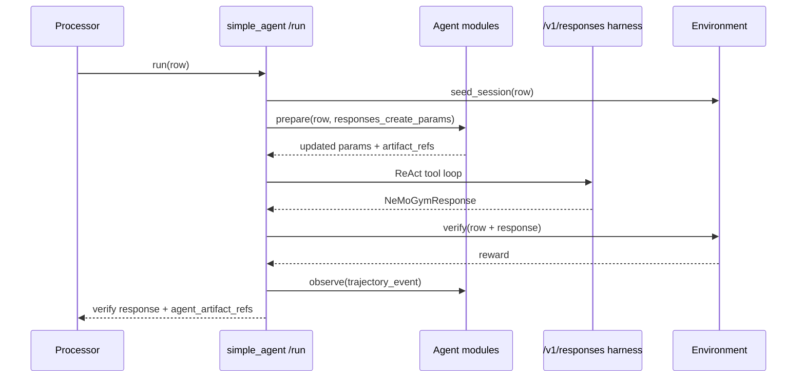

*Research note, 2026-07-08. First-class Agent modules in NeMo Gym: what they are, where they sit relative to the [Agent–Environment boundary](/researchnotes/agent-environment-boundary), and a minimal reference implementation on `simple_agent`.*

## The question

NeMo Gym already has behavior-shaping knobs — `prompt_config` on `gym eval run`, `skills.path` with `skills_ref` provenance ([#1256](https://github.com/NVIDIA-NeMo/Gym/issues/1256)), per-agent harness logic in `app.py`, and optimizer drivers (GEPA/DSPy, ACE/TALES) that treat `/run` as a black box. These pieces work, but they do not share one boundary:

- **Where** does prompt injection happen — Processor preprocess or Agent `prepare`?
- **How** do optimizers know which artifact version was active?
- **What** is trainable policy vs optimizable harness artifact vs Environment reward?

This note proposes **Agent modules**: typed, provenance-stamped components on the **Agent boundary** with a small `prepare` / `observe` / `artifact_refs` lifecycle.

## Terminology discipline

Follow the same three-way split as [The Agent–Environment Boundary](/researchnotes/agent-environment-boundary):

| Term | Meaning | Agent modules |
| ---- | ------- | ------------- |
| **Policy** | Parameterized token distribution being differentiated | Model server weights — *not* a module |
| **Agent** | Architecture + program (harness + model + modules) | Modules shape harness behavior |
| **Environment** | Pushes back with observations and reward | Resources server `seed_session` / `verify` |

"Training the agent" in RL papers usually means training the **policy**. Optimizing a prompt, playbook, or skill library is **Agent module optimization** — same trajectories, different learnable surface.

NeMo Gym implements a **hierarchical** decomposition in practice:

```text
Processor     — rollout scheduling, dataset iteration, persistence
Agent         — harness loop (/v1/responses) + Agent modules (prepare/observe)
Environment   — tools, session state, verify, reward
Model server  — policy (and optional auxiliary roles)
```

Under the **gradient boundary** (Polar-style), the harness is environment relative to the policy; modules are still Agent-owned configuration that the harness reads at runtime. Under the **agent boundary**, modules are unambiguously part of the Agent.

## Reference implementation

The POC lives in `nemo_gym/agent_modules.py` and is wired into `responses_api_agents/simple_agent/app.py`.

### Core types

```python
class AgentModule:
    async def prepare(self, ctx: AgentContext) -> AgentContext: ...
    async def observe(self, event: TrajectoryEvent) -> list[AgentUpdateEvent]: ...
    def artifact_refs(self) -> list[AgentArtifactRef]: ...
```

- **`prepare`** — runs before the policy loop; mutates `responses_create_params` (prompt injection, future: memory, tool policy).
- **`observe`** — runs after `verify`; modules may emit `AgentUpdateEvent`s for optimizers (GEPA, ACE curator).
- **`artifact_refs`** — content hashes stamped on rollout results as `agent_artifact_refs`.

### Module types (phase 1)

| Type | Wraps | `prepare` behavior | `observe` behavior | Provenance |
| ---- | ----- | ------------------ | ------------------ | ---------- |
| `prompt` | `nemo_gym.prompt` | Build or prepend `responses_create_params.input` | — | SHA-256 prefix of prompt YAML |
| `skill_library` | `nemo_gym.skills` | `injection_mode: context` injects `SKILL.md` bodies into system message; `none` is provenance-only | `adaptation.enabled`: append lesson to target skill on failed rollouts | `skills_ref` content hash |

#### Skill library: injection modes

| `injection_mode` | Use when |
| ---------------- | -------- |
| `none` | Native skill runtimes (Claude Code stages via `stage_skills`) |
| `context` | Agents without discovery (`simple_agent`) — Gym injects formatted skill bodies |

#### Skill adaptation (optimizer scaffold)

When `adaptation.enabled` is true and terminal `reward < reward_threshold`, the module appends a lesson section to `target_skill`'s `SKILL.md` **in place**. The directory hash changes, so `agent_artifact_refs` and `skills_ref` distinguish variants — the same contract as skill evaluation ([#1256](https://github.com/NVIDIA-NeMo/Gym/issues/1256)). Optimizers (ACE, EvoSkill, GEPA-over-skills) can replace this rule-based append with richer `observe` logic.

Sample skills: `benchmarks/skills/variant_a/`. **Runnable tutorial:** [Agent Modules Walkthrough](/evaluation-tutorials/agent-modules-walkthrough).

### `simple_agent` rollout flow



`/v1/responses` remains the **ReAct harness** (model ↔ tools until stop). `/run` is Processor orchestration plus module `prepare`/`observe`.

### Agent config example (prompt + skills + adaptation)

```yaml
simple_agent_with_skills_module:
  responses_api_agents:
    simple_agent:
      entrypoint: app.py
      resources_server:
        type: resources_servers
        name: my_resources_server
      model_server:
        type: responses_api_models
        name: policy_model
      modules:
        - type: prompt
          name: answer_format_prompt
          path: benchmarks/prompts/eval/aai/mcq-4choices.yaml
        - type: skill_library
          name: baseline_skills
          injection_mode: context
          adaptation:
            enabled: true
            target_skill: cot_enhanced
            reward_threshold: 1.0
```

Pair with run-level `+skills.path=benchmarks/skills/variant_a` so Processor stamps `skills_ref` on each row.

See `responses_api_agents/simple_agent/configs/simple_agent_with_skills_module.yaml`.

### Rollout result fields

When modules are configured, `/run` responses may include:

```json
{
  "reward": 1.0,
  "response": { "...": "..." },
  "agent_artifact_refs": [
    {
      "type": "prompt",
      "name": "answer_format_prompt",
      "hash": "a1b2c3d4e5f6",
      "path": "benchmarks/prompts/eval/aai/mcq-4choices.yaml"
    }
  ],
  "agent_update_events": []
}
```

`skills_ref` on the row remains the backwards-compatible stamp; `skill_library` modules mirror it into `agent_artifact_refs`.

## Mapping external abstractions

Agent modules are Gym's slot for patterns documented elsewhere:

| External primitive | Gym module type | Notes |
| ------------------ | --------------- | ----- |
| DSPy **Predictor** instruction | `prompt` | GEPA mutates predictor-scoped prompts |
| Claude / OpenAI **Skills** | `skill_library` | Gym stages + provenance; runtime loads |
| ACE **playbook** bullets | `playbook` (planned) | Delta updates via `observe` |
| Letta **core memory** blocks | `memory` (planned) | In-context vs archival tiers |
| OpenAI **guardrails** | `guardrails` (planned) | Distinct from Environment `verify` |
| LangGraph **checkpointer** | Processor session / future `state` | Thread-scoped vs cross-thread store |

Full framework survey: GitHub issue draft `issues/agent-modules-first-class-citizens.md`.

## Migration from Processor knobs

| Today | Target |
| ----- | ------ |
| `prompt_config` on `gym eval run` | `prompt` module on Agent config **or** Processor alias that expands to module + ref |
| `skills.path` + row `skills_ref` | `skill_library` module + same `skills_ref` stamp |
| Optimizer calls `/run` black-box | Optimizer reads `agent_artifact_refs` + `AgentUpdateEvent`s |

Processor preprocess of prompts remains supported during migration. Agent-declared modules run at `prepare` inside `/run` and are the long-term source of truth for provenance.

## What this does not solve yet

- Standardized per-step **trajectory** objects ([#1867](https://github.com/NVIDIA-NeMo/Gym/issues/1867))
- `playbook`, `memory`, `guardrails`, `model_roles` module types
- Processor `run_one` refactor (modules today hook `simple_agent.run` only)
- GEPA/ACE drivers consuming `observe` events in-process

## Related reading

- [The Agent–Environment Boundary](/researchnotes/agent-environment-boundary) — gradient vs agent vs hierarchical RL boundaries
- [System Design](/infrastructure/engineering-notes/system-design) — Processor / Agent / Environment startup and rollout collection
- [Agent Skills](/agent-server/agent-skills) — `skills.path` run knob and `skills_ref` provenance
