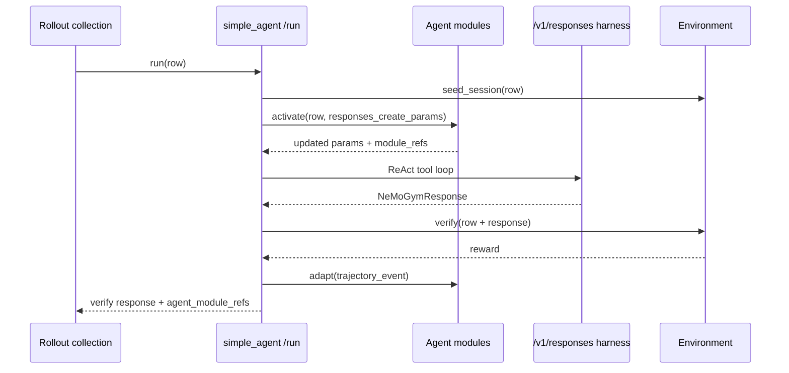

*Research note, 2026-07-08. **Agent modules** in NeMo Gym: typed `AgentModule`s with provenance via `AgentModuleRef`. Reference implementation on `simple_agent`. See [Agent–Environment boundary](/researchnotes/agent-environment-boundary).*

## The question

NeMo Gym already has behavior-shaping knobs — `prompt_config` on `gym eval run`, `skills.path` with `skills_ref` provenance ([#1256](https://github.com/NVIDIA-NeMo/Gym/issues/1256)), per-agent harness logic in `app.py`, and optimizer drivers (GEPA/DSPy, ACE/TALES) that treat `/run` as a black box. These concrete mechanisms implement broader cognitive capabilities such as working memory, skill libraries, long-term memory, planning, reasoning, and control, but they do not share one boundary:

- **Where** does prompt injection happen — run-level preprocessing or Agent `activate`?
- **How** do optimizers know which module version was active?
- **What** is trainable policy vs optimizable module vs Environment reward?

This note proposes **`AgentModule`s**: typed pieces on the **Agent boundary** with an `activate` / `adapt` / `module_refs` lifecycle. Each module has a cognitive capability **`type`** discriminator (`working_memory`, `skill_library`, `planning`, …). More types may be added over time.

## Module types (first cut)

| `type` | Role |
| ------ | ---- |
| `working_memory` | Active context for the current rollout (prompt-backed instructions, scratchpad, compacted context) |
| `skill_library` | Skill packages / reusable operational procedures ([#1256](https://github.com/NVIDIA-NeMo/Gym/issues/1256)) |
| `long_term_memory` | Playbooks, persistent recall, archival stores, summaries |
| `planning` | Plan templates, decomposition, workflows |
| `reasoning` | Deliberation strategies, reflection / critique loops |
| `control` | Guardrails, tool policies, budgets, permissions |

**Run-level vs Environment:** `skills.path` and `prompt_config` are **run-level** knobs handled by rollout collection. Gym **Environment** = resources server (`verify`, reward) only.

## Terminology discipline

Follow the same three-way split as [The Agent–Environment Boundary](/researchnotes/agent-environment-boundary):

| Term | Meaning | Examples |
| ---- | ------- | ---------- |
| **Policy** | Parameterized token distribution | Model server weights |
| **Agent** | Harness + model + modules | Modules shape behavior around the policy |
| **Environment** | Observations and reward | Resources server `seed_session` / `verify` |

Optimizing a prompt, playbook, or skill library is **module optimization** — same trajectories, different learnable surface than weight training.

NeMo Gym implements a practical decomposition:

```text
Rollout collection — dataset iteration, repeats, persistence
Agent         — harness loop (/v1/responses) + Agent modules
Environment   — tools, session state, verify, reward
Model server  — policy (and optional auxiliary roles)
```

Modules are Agent-owned configuration that the harness reads at runtime during `/run`.

## Reference implementation

The POC lives in `nemo_gym/agent_modules.py` and is wired into `responses_api_agents/simple_agent/app.py`.

### Core types

```python
class AgentModule:
    async def activate(self, ctx: AgentContext) -> AgentContext: ...
    async def adapt(self, event: TrajectoryEvent) -> list[AgentUpdateEvent]: ...
    def module_refs(self) -> list[AgentModuleRef]: ...
```

- **`activate`** — runs before the policy loop; mutates `responses_create_params` (prompt injection, future: memory, tool policy).
- **`adapt`** — runs after `verify`; modules may emit `AgentUpdateEvent`s for optimizers (GEPA, ACE curator).
- **`module_refs`** — content hashes stamped on rollout results as `agent_module_refs`.

### Module types (phase 1)

| Type | `activate` | `adapt` | Provenance |
| ---- | --------- | --------- | ---------- |
| `working_memory` | Build/prepend prompt-backed `input` | — | prompt YAML hash |
| `skill_library` | context inject or stage skills | optional adaptation | `skills_ref` hash |

#### Skill library: injection modes

| `injection_mode` | Use when |
| ---------------- | -------- |
| `none` | Native skill runtimes (Claude Code stages via `stage_skills`) |
| `context` | Agents without discovery (`simple_agent`) — Gym injects formatted skill bodies |

#### Skill adaptation (optimizer scaffold)

When `adaptation.enabled` is true and terminal `reward < reward_threshold`, the module appends a lesson section to `target_skill`'s `SKILL.md` **in place**. The directory hash changes, so `agent_module_refs` and `skills_ref` distinguish variants — the same contract as skill evaluation ([#1256](https://github.com/NVIDIA-NeMo/Gym/issues/1256)). Optimizers (ACE, EvoSkill, GEPA-over-skills) can replace this rule-based append with richer `adapt` logic.

Sample skills: `benchmarks/skills/variant_a/`. **Runnable tutorial:** [Agent Modules Walkthrough](/evaluation-tutorials/agent-modules-walkthrough).

### `simple_agent` rollout flow



`/v1/responses` remains the **ReAct harness** (model ↔ tools until stop). `/run` remains the Agent-server rollout endpoint and now includes module `activate`/`adapt` hooks.

### Agent config example (prompt + skills + adaptation)

```yaml
simple_agent_with_skills_module:
  responses_api_agents:
    simple_agent:
      entrypoint: app.py
      resources_server:
        type: resources_servers
        name: my_resources_server
      model_server:
        type: responses_api_models
        name: policy_model
      modules:
        - type: working_memory
          name: answer_format_prompt
          config:
            path: benchmarks/prompts/eval/aai/mcq-4choices.yaml
        - type: skill_library
          name: baseline_skills
          config:
            injection_mode: context
            adaptation:
              enabled: true
              target_skill: cot_enhanced
              reward_threshold: 1.0
```

Pair with run-level `+skills.path=benchmarks/skills/variant_a` so rollout collection stamps `skills_ref` on each row.

See `responses_api_agents/simple_agent/configs/simple_agent_with_skills_module.yaml`.

### Rollout result fields

When modules are configured, `/run` responses may include:

```json
{
  "reward": 1.0,
  "response": { "...": "..." },
  "agent_module_refs": [
    {
      "type": "working_memory",
      "name": "answer_format_prompt",
      "hash": "a1b2c3d4e5f6",
      "path": "benchmarks/prompts/eval/aai/mcq-4choices.yaml"
    }
  ],
  "agent_update_events": []
}
```

`skills_ref` on the row remains the backwards-compatible stamp; `skill_library` modules mirror it into `agent_module_refs`.

## Mapping external abstractions

Agent modules are Gym's slot for patterns documented elsewhere:

| External primitive | Gym module type | Notes |
| ------------------ | --------------- | ----- |
| DSPy **Predictor** instruction | `working_memory` | GEPA mutates prompt-backed active context |
| Claude / OpenAI **Skills** | `skill_library` | Gym stages + provenance; runtime loads |
| ACE **playbook** bullets | `long_term_memory` | Delta updates via `adapt` |
| Letta **core memory** blocks | `working_memory` / `long_term_memory` | In-context vs archival tiers |
| OpenAI **guardrails** | `control` | Distinct from Environment `verify` |
| LangGraph **checkpointer** | Agent harness state / future `long_term_memory` | Thread-scoped vs cross-thread store |

Full framework survey: GitHub issue draft `issues/agent-modules-first-class-citizens.md`.

## Migration from run-level knobs

| Today | Target |
| ----- | ------ |
| `prompt_config` on `gym eval run` | `working_memory` module on Agent config **or** rollout config alias that expands to module + ref |
| `skills.path` + row `skills_ref` | `skill_library` module + same `skills_ref` stamp |
| Optimizer calls `/run` black-box | Optimizer reads `agent_module_refs` + `AgentUpdateEvent`s |

Existing run-level prompt preprocessing remains supported during migration. Agent-declared modules run at `activate` inside `/run` and are the long-term source of truth for provenance.

## What this does not solve yet

- Standardized per-step **trajectory** objects ([#1867](https://github.com/NVIDIA-NeMo/Gym/issues/1867))
- `long_term_memory`, `guardrails`, `planning`, and `reasoning` module types
- Moving seed/verify or `/run` responsibilities out of Agent servers
- GEPA/ACE drivers consuming `adapt` events in-process

## Related reading

- [The Agent–Environment Boundary](/researchnotes/agent-environment-boundary) — where the agent ends and the environment begins
- [System Design](/infrastructure/engineering-notes/system-design) — Agent / Environment startup and rollout collection
- [Agent Skills](/agent-server/agent-skills) — `skills.path` run knob and `skills_ref` provenance
