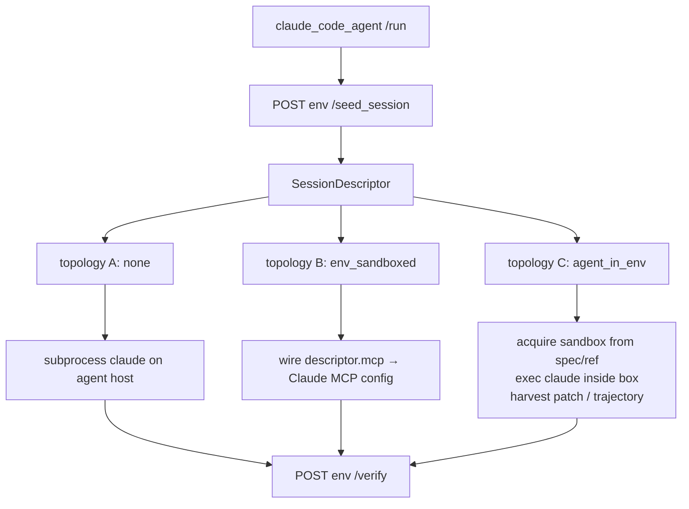
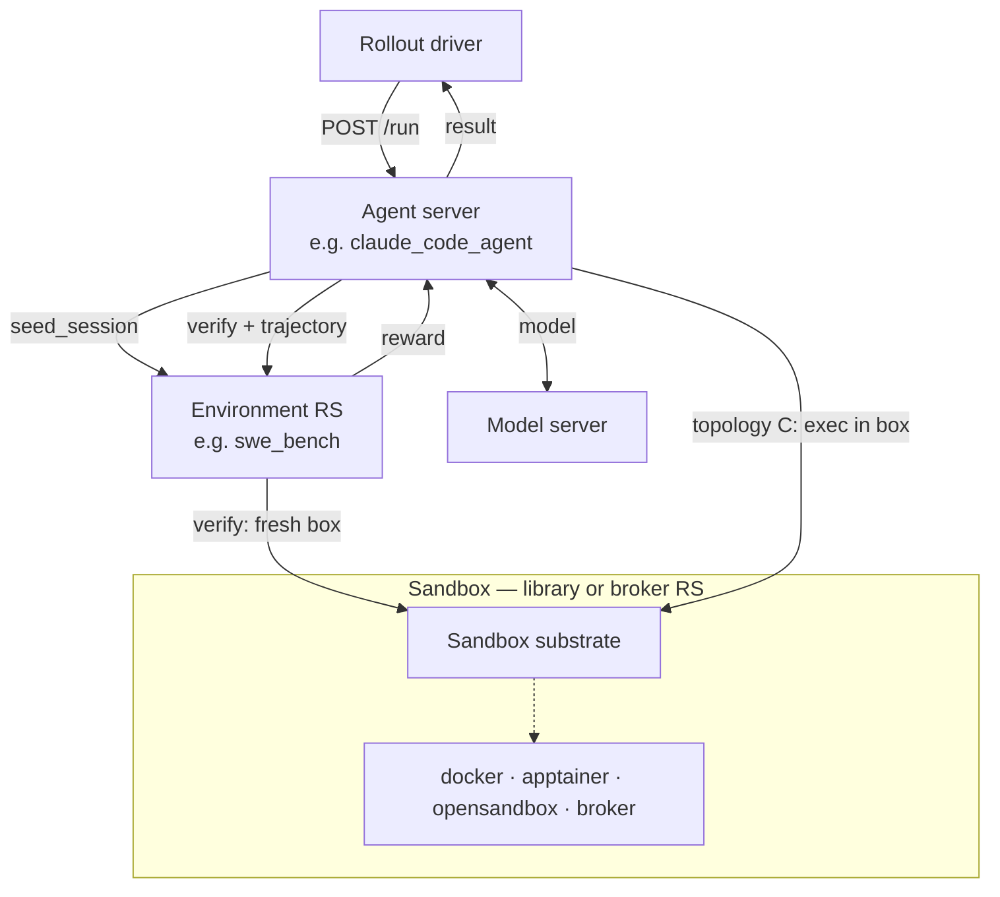

This note is **exploratory** — a target architecture, not what is implemented today. It sets the **training/RL-data half aside** (token-id capture, trajectory stitching; see *Out of scope*). The goal is a design whose boundaries match **RL problem decomposition**, moving from the current codebase (including PR #1738) toward composable agent server × environment × sandbox.

## Why this note

NeMo Gym documents four server types: dataset, **agent server**, resources server, model. That maps cleanly onto RL — except SWE convergence (PR #1738) collapsed the **Environment** into the agent server: inline grading, deleted `resources_servers/swe_env/`, SWE domain code under `responses_api_agents/swe_env/`.

The question is not “should we delete the resources server?” It is:

> How do we keep **agent servers** under `responses_api_agents/` (including those that host blackbox CLIs like Claude Code), restore **Environments as resources servers** (including `swe_bench`), and connect them **without per-pair wrappers** — including when the Environment is **sandboxed**?

## RL mapping

| RL concept | NeMo Gym piece | Responsibility |
|---|---|---|
| **Environment** \(\mathcal{E}\) (S, A, P, R mechanism) | **Resources server** + optional sandbox world | Fixed interaction contract: tools, state semantics, reward via `verify` / optional `step` |
| **Task** \(\tau\) | **Dataset row → typed task value** | One problem instance: initial observation, privileged grading metadata, world-init hints |
| **Episode / rollout** | Agent `/run` + driver | One agent attempt at task \(\tau\); produces trajectory + terminal reward |
| **Task instance** (Gym glossary) | One of \(K\) rollouts at same \(\tau\) | Same task, different stochastic trajectories (pass@\(k\), GRPO groups) |
| **Agent** | **Agent server** (`responses_api_agents/`) | Policy + orchestration; drives the episode loop |
| **State / observation** | Sandbox world, conversation, RS session state | What the agent perceives (often partial — agent does not see privileged task fields) |
| **Action** | Model output → tool call, shell, submission | What the agent emits (high-dimensional, language/tool structured) |
| **Reward** | `verify` (terminal) or optional `step` | Environment authority; usually sparse in agentic benchmarks |
| **Benchmark** (eval product) | Fixed dataset + metric + protocol on an Environment | What gets reported / compared (leaderboard); not a server type |
| **Rollout worker** | Driver + agent server `/run` | Samples task, pairs agent with environment for one episode |
| **Sandbox substrate** | `nemo_gym/sandbox/` (+ optional broker RS) | Isolation and execution host — not reward |

Agentic benchmarks are naturally read as a **contextual MDP** or **MDP with a task distribution**:

\[
\tau \sim p(\tau), \quad \text{then run episode in } \mathcal{E}
\]

SWE-bench Verified: **one** Environment (`swe_bench`), **~500** Tasks (one per `instance_id`). You do not need a new resources server per instance.

Thesis:

> **Five concepts** — **Benchmark**, **Task**, **Environment**, **Agent Server**, **Sandbox** — compose by addition. The agent server does not embed benchmark grading; the Environment does not embed Claude Code; a Task is not the Environment; a Benchmark is not the Environment (it is a measurement contract *on* one).

**Terminology:** In RL, the **Agent** is the full decision-making system — policy model, tools, and whatever orchestration implements learning-relevant behavior (planning loops, critics, value functions, reward models, …). In Gym, an **agent server** is the FastAPI **server type** that hosts and runs an agent (`responses_api_agents/`, `/run`, optional `/v1/responses`). It is not a resources server and not a sandbox. The **model server** is often a separate endpoint the agent calls for inference; the agent may also embed or co-locate model logic depending on design. Colloquial “harness” (e.g. “agent harness” in tutorials) refers to **orchestration inside** an agent server — not a fourth server type. Under `swe_bench`, **`harness.py` / `harnesses/`** are **benchmark eval plugins** (provision + grade recipes) — aligned with upstream `swebench.harness`, not Gym agent harness. Published write-up: `fern/.../engineering-notes/harness-terminology.mdx`.

## Task vs Environment

These are the most commonly conflated concepts in agentic RL. Keeping them separate is what makes composition work.

### Environment = the interaction contract (fixed)

The Environment answers, for **all** tasks in a benchmark family:

1. What world does this benchmark use? (tools, sandbox, session state)
2. How does an episode start given a task? (`seed_session(task)` → episode context)
3. What transitions are legal? (tool calls, optional `step`, MCP)
4. How is success scored? (`verify(task, agent_artifact)` → reward)

In Gym: the **resources server role** (+ sandbox substrate when there is a world). For SWE: `swe_bench` owns harness registry, `verify_task`, hermetic grading, and the HTTP contract. That is **stable** whether the agent is Claude Code, OpenHands, or a custom loop.

### Task = one problem instance (variable)

A **Task** is everything needed to **instantiate one episode** of that Environment:

| Task field (conceptual) | SWE-bench example | Who typically sees it |
|---|---|---|
| **Identity** | `instance_id`, benchmark key (`swe-bench`) | Everyone (logging, metrics) |
| **Initial observation** | `problem_statement` → user message | Agent |
| **Privileged / verifier metadata** | `instance_dict`, `FAIL_TO_PASS`, test patch | Environment only (`verify`) |
| **World init** | image, `base_commit`, workdir | Environment → `SandboxSpec`; agent gets via descriptor |

Prototype encoding: **`SweTask`** in `resources_servers/swe_bench/harness.py`, built from JSONL via `task_builder.py` (`verifier_metadata` + `responses_create_params.metadata`).

Today the **platform** still treats tasks mostly as **JSONL rows** rather than a typed, first-class object end-to-end. That is the gap to close.

### Episode flow (agentic interaction)

```text
Task τ (from dataset)
    │
    ▼
Environment.seed(τ)  →  SessionDescriptor (episode context: topology, sandbox spec, session)
    │
    ▼
Agent loop:  observe → act → observe → …   (many steps; partial observability)
    │
    ▼
Environment.verify(τ, agent_output)  →  reward R(τ, trajectory)
```

Notes for agentic RL:

- **Observations** are conversation + tool results + (maybe) diffs — not a small discrete state vector.
- **Actions** are tokens, tool calls, shell — not a fixed discrete action set.
- **Reward** is usually **sparse and terminal** (SWE: tests pass or not) → `verify`, not dense per-token reward.

The **Agent** (agent server) implements the loop. The **Environment** defines “done” and whether the submission succeeds.

### Task vs dataset vs task instance

| | Dataset | Task | Environment |
|---|---|---|---|
| **Role** | Storage / batch of problems | One problem | Rules + scoring for the whole family |
| **Cardinality** | Many rows | One row | One (or few) RS per benchmark |
| **Agent sees** | Becomes prompt | Public fields | Tools, session, descriptor |
| **Verifier sees** | `verifier_metadata` on row | Privileged fields | Grading implementation |

**Task instance** (Gym glossary): one rollout attempt at a fixed task — e.g. 16 samples for pass@16 or a GRPO group at the same \(\tau\).

### SessionDescriptor is not the Task

`seed_session` accepts a task (today: task row on the wire) and returns a **SessionDescriptor** — placement, optional `SandboxSpec`, MCP, egress, merged `verifier_metadata`. That is the Environment saying: *“I accepted task τ; here is how to run the episode.”* The Task remains the authoritative problem definition; the descriptor is **episode context**.

### Why Task must be first-class

| If task is implicit / merged into environment | Problem |
|---|---|
| One RS per instance | Absurd scale; no composability |
| Task fields only in agent code | Agent owns grading metadata (#1738) |
| No stable task id on rollouts | Hard to swap agents, aggregate pass@\(k\), route multi-env batches |

Target shape:

```text
Task (portable value)
  id, benchmark, initial_observation, verifier_metadata, …

Environment (service)
  seed_session(task) → SessionDescriptor
  verify(task, agent_artifact) → reward + diagnostics
```

Cross-benchmark portable schema is an open question; per-Environment structs (`SweTask`, …) with a shared minimal base is the likely v1.

## Benchmark vs Environment

Gym's eval docs distinguish these ([Environments vs Benchmarks](/about/concepts/evaluation#environments-vs-benchmarks)). This note makes the split explicit for architecture work.

### Environment = what you build and run (engine)

An **Environment** is the **executable system**: resources server (+ sandbox when needed), verifier, tools, state semantics, and the episode contract (`seed_session` → `verify`). It answers:

> *How does an agent interact with this kind of world, and how is an attempt scored?*

Properties:

- **Software** — e.g. `swe_bench` RS, `example_mcp_weather`, math servers
- **Reusable** — training, harness development, or evaluation
- **Task-parameterized** — many tasks, one MDP authority
- **Swappable composition** — change agent server or model without rewriting grading

### Benchmark = what you measure and compare (exam + protocol)

A **Benchmark** is a **repeatable evaluation product** built on top of an Environment (or a curated slice of it). It fixes:

| Benchmark locks | Example (SWE-bench Verified) |
|---|---|
| **Task set** | 500-instance public test split |
| **Metric** | `% resolved` (tests pass after patch) |
| **Protocol** | Same grading, same harness+model comparison rules |
| **Claims** | Leaderboard numbers, baselines, reproducibility |

It answers:

> *What exactly are we measuring, on what data, so two runs are fairly comparable?*

A benchmark is **not** a separate server type. It is a **dataset + metric + protocol + baselines** layered on an Environment.

### How Benchmark, Environment, and Task stack

```text
Benchmark     →  fixed eval suite & protocol     (SWE-bench Verified)
Environment   →  episode engine & grader         (swe_bench RS)
Task          →  one instance in the suite         (django__django-13741)
Episode       →  one agent attempt at that task
```

In RL terms: the **Benchmark** defines the task distribution \(p(\tau)\) and how rollouts are aggregated into reported scores. The **Environment** implements \(\mathcal{E}\). Each **Task** is one draw \(\tau\).

### One Environment, many benchmarks

The same Environment can support multiple named benchmarks without new resources servers:

| Benchmark (proper noun) | Environment | What differs |
|---|---|---|
| SWE-bench Verified | `swe_bench` | Dataset split + 500 tasks |
| SWE-bench Lite | `swe_bench` | Smaller curated subset |
| SWE-bench Multilingual | `swe_bench` | Different tasks + harness key |

Do not conflate the **harness registry key** (`task.benchmark = "swe-bench"`) with the **published benchmark name** (*SWE-bench Verified*). The key selects an eval plugin inside the Environment; the benchmark name is the external eval product.

### Not every Environment is a benchmark

| Use case | Environment? | Benchmark? |
|---|---|---|
| RL training on SWE-Gym-style tasks | Yes | No — no fixed public protocol |
| Internal harness iteration | Yes | No |
| SWE-bench Verified leaderboard eval | Yes | Yes — fixed split + metric + baselines |
| Custom enterprise bug-fix eval | Yes | Maybe — if you lock dataset + protocol |

Building an Environment is **necessary** for a benchmark but **not sufficient**. You still need a fixed task set, explicit metrics, baselines, and (in Gym) the `verified:` workflow.

### Gym signals

| Signal | Meaning |
|---|---|
| `resources_servers/<name>/` | **Environment** implementation |
| Curated JSONL + eval config | **Benchmark** task set for a run |
| `verified: false` | Environment works; not benchmark-grade yet |
| `verified: true` | Gold-patch baseline + review — **benchmark-grade** eval configuration |

## Role 1 — Agent Server (`responses_api_agents/`)

An **agent server** hosts an **Agent**: it runs the episode loop, calls the policy (typically via a model server), routes tools, and may include rich orchestration — planners, critics, value heads, reward models, blackbox CLI hosts (Claude Code), nested sub-agents, and more. It exposes `/run` (and often `/v1/responses`) as a FastAPI server under `responses_api_agents/`.

**Composable agent servers** (planner around coder, best-of-N, orchestration around an untrusted inner agent) remain agent servers or compositions of them. Composability is a property of how agent servers are built, not a reason to relocate blackbox CLI hosts out of `responses_api_agents/`.

### Blackbox CLIs live inside agent servers, not Environments

Claude Code is **not** a Gym server. It is a subprocess spawned by the **`claude_code_agent` agent server**. When SWE-bench measures “Claude Code + model on Verified,” the **unit under evaluation** is the **agent** (hosted by that agent server, including its model) — implementation stays `responses_api_agents/claude_code_agent/`.

The same CLI could appear as an **Environment tool** if another agent server invoked it via MCP. Role follows **what is under test**, not where the binary runs. For SWE-bench, the agent server hosts Claude Code; the Environment is `swe_bench`.

### What an agent server must not do

- Own benchmark grading (`verify_task` inline — PR #1738 pattern).
- Hardcode SWE image names, docker vs OpenSandbox, or per-benchmark provisioning.
- Force every benchmark through an `anyswe`-style outer wrapper agent.

### What an agent server must do

- Implement the agent loop for its kind.
- On `/run`: call Environment **`seed_session`**, bind to the returned descriptor, execute, call **`verify`**.
- Support **placement bindings** (below) driven by the descriptor — not by benchmark-specific subclasses.

## Role 2 — Environment (MDP authority)

The Environment is the **benchmark axis** — the MDP authority for a **family** of tasks. In Gym it is **usually** a single **resources server** (the one wired on the agent server's `resources_server` ref for `seed_session`, tools, and `verify`). That 1:1 mapping covers most benchmarks today (`swe_bench`, `example_mcp_weather`, math servers, etc.).

**Do not confuse Environment with Task.** “django issue #13741” is a **Task**. `swe_bench` is the **Environment** that knows how to grade any SWE-bench Verified instance.

An environment can also be **formed from multiple resources servers**:

| Pattern | Example | Notes |
|---|---|---|
| **Task RS + substrate RS** | `swe_bench` + sandbox broker | Semantics/reward on task RS; box lifecycle on broker RS. `SessionDescriptor` carries spec + ref across the seam. |
| **Facade / composite RS** | One RS delegates internally | Single agent wiring; composition hidden behind one HTTP surface. |
| **Many environments in one run** | Multi-verifier training | Each row routes via `agent_ref` to a different agent+RS pair — **not** one environment made of many RS, but many environments in one batch. |

**Environment** names the role (spec, state, reward). **Resources server(s)** implement it. Do not equate them blindly: sandbox substrate may be a separate RS, a library in-process, or embedded in the task RS depending on deployment.

Required (on the **primary** task/verify RS, or on a facade that exposes the same contract):

- **`seed_session` → SessionDescriptor** (see below).
- **`verify` → reward** — always. Terminal grading for blackbox/in-box agents; optional per-step reward via `step` for env-driven tasks.
- Per-task **state** (session cookie / MCP token scope).
- Optional **MCP tools** (topology B) and optional **`step(action)`** (env-driven).

For SWE, the Environment is **`resources_servers/swe_bench/`** (name TBD), not code living under `responses_api_agents/`. It recovers:

- The **`verified:`** YAML marker and baselining workflow.
- An independently addressable **`/verify`** endpoint.
- Clear **reward authority** separate from any agent server.

Domain logic today in `responses_api_agents/swe_env/` (`verify_task`, harnesses, parsing) **moves into `resources_servers/swe_bench/`** as Environment-owned modules — not owned by the agent tree, and **not** a top-level `nemo_gym/swe/` package unless a second RS or non-HTTP consumer needs the same graders later.

In-box orchestration (provision, egress, exec, harvest) is **agent-server code** using **`nemo_gym/sandbox/`** — not SWE domain code, and not a separate gym-wide `placement/` package unless multiple agents later share the exact same binding. Patch harvest for SWE is part of the verify contract (agent passes patch on `POST /verify`), not generic infrastructure.

### Environment = semantics + substrate (layering)

When a task has a **world** (SWE repo in a container, game state, DB):

- **Semantics** (reward, task definition, what actions mean) → resources server.
- **Substrate** (where state lives, where commands run) → sandbox.

State **S** and transitions **P** live in the box; reward **R** lives in `verify`. The sandbox is not the Environment, but it **implements the stateful half** when a world exists. Stateless tasks (math, MCQ) skip the substrate layer entirely (topology A).

## Role 3 — Sandbox = substrate (+ optional broker)

Implemented today as **`nemo_gym/sandbox/`** — an in-process library, not a Gym server.

| Piece | Purpose |
|---|---|
| `SandboxSpec` | Serializable creation request (image, workdir, env, ttl, resources) |
| `SandboxHandle` | Live binding (`sandbox_id`, `provider_name`, opaque `raw`) |
| `SandboxProvider` | `create / exec / upload / download / status / close` |
| `AsyncSandbox` | Lifecycle wrapper used by callers |
| Backends | `docker`, `apptainer` (local), `opensandbox` (HTTP client to remote service) |

**Problem it solves:** one API and config shape for provisioning boxes across benchmarks and deployment targets, without each agent server reimplementing docker/OpenSandbox wiring.

**What it does not solve yet:** cross-process sharing, central pooling/TTL, or a first-class Gym endpoint. Those motivate an optional **sandbox broker resources server**.

### Broker model

- **Provider seam (always):** pluggable backends; live handle in the process that called `create`.
- **Optional broker RS:** holds handles in its process; clients hold **references** only.

Only **data** crosses HTTP: `SandboxSpec` + `sandbox_ref`. Never `SandboxHandle.raw`.

With a broker, the Environment and the agent server can **co-reference** the same box (topology C, env-owned state, agent drives by ref) — RL-canonical “environment owns state.” Without a broker, the agent server may own the box directly (today's #1738 path) as a degraded but valid mode.

**Hermetic twin unchanged:** `verify` acquires its **own fresh box** (via broker ref or local provider), regardless of topology.

## The connection seam: SessionDescriptor

Today, MCP environments return tool connection metadata from `seed_session`; `claude_code_agent` merges it into Claude's MCP config. That is already **interface-agnostic** at the HTTP layer.

SWE-bench needs a **richer descriptor** because Claude Code does not act through Environment MCP tools during the loop — it edits `/testbed` directly. The fix is to **generalize `seed_session`**, not to merge agent server and Environment.

**Input:** a **Task** (task row / typed value). **Output:** a **SessionDescriptor** — not a replacement for the task.

### Conceptual shape

```yaml
# Returned from Environment POST /seed_session (conceptual)
placement:
  topology: none | env_sandboxed | agent_in_env | whole_interaction

sandbox:                          # omitted for topology A
  spec:                           # WHAT world (SandboxSpec fields)
    image: docker://swebench/...
    workdir: /testbed
    env: { ... }
    ttl_s: 1800
  ref:                            # WHERE / live handle (optional)
    sandbox_id: ...
    provider: sandbox_broker       # null → client acquires locally from run config

mcp:                              # topology B
  server_name: swe_bench
  url_path: /mcp
  transport: http
  headers: { X-NeMo-Gym-Session-Token: ... }

egress:                           # topology C — model reachable from inside box
  anthropic_base_url: ...
  # or resolved model_server endpoint env vars

verifier_metadata: { ... }        # task ground truth for verify
```

The agent server reads **`placement.topology`** and binds accordingly. It never imports `swe_env` or chooses docker vs OpenSandbox itself.

### Agent-server placement bindings

One agent server (`claude_code_agent`), three bindings:



| Binding | When | Mechanism |
|---|---|---|
| **Host** | topology A | Today's path: subprocess on agent server host |
| **MCP** | topology B | Existing `_write_rollout_mcp_config` pattern |
| **In-box** | topology C | `nemo_gym/sandbox` acquire/exec + **agent-specific** launch (e.g. `claude -p` in box); patch on verify request |

The in-box binding uses **`nemo_gym/sandbox/`** plus **agent-specific** launch logic (from `self_drive` / anyswe where applicable) — not a separate agent server, not SWE grading imports, and not a gym-wide `placement/` package until duplication proves it.

## Sandboxing topologies

| Topology | Isolated | Attachment | SWE + Claude Code |
|---|---|---|---|
| **A — None** | nothing | agent server on host; message `verify` | N/A |
| **B — Env-sandboxed** | env world | agent server outside; MCP into box | Possible but not fidelity-preserving for full CLI |
| **C — Agent-in-env** | world + agent execution | agent server inside env box | **Required** for native Claude Code on `/testbed` |
| **D — Whole interaction** | full episode | outer boundary | Untrusted / nested agents |

Requirements called out in discussion:

- *Agent has a sandboxed instance of the environment* → **B** (MCP into env box) or **C** (agent server inside box).
- *Whole iteration isolated* → **D** (nested boxes; provider must advertise nesting).

## Configuration & placement

Two **logical** boxes are different knobs:

- **Agent-isolation box** — sandbox the agent server for safety (even without a task world).
- **Environment-state box** — the task world (SWE per-instance image).

Their relationship **is** the topology (same box → C; separate → B-ish; nested → D).

Three **contributors**, with precedence:

| Contributor | Set at | Answers |
|---|---|---|
| **Agent server config** | startup | Intrinsic defaults (`default_spec`, default topology) |
| **Environment** `seed_session` | per task | **What world** (spec, verifier metadata) |
| **Driver** `ng_collect_rollouts` | per run | **Where/how** (broker URL, backend, topology override, limits, pooling) |

Split:

- **WHAT** (image, files, task) = `env.spec ⊕ agent.default_spec` (env wins on conflict).
- **WHERE/HOW** (backend, broker, topology policy, quotas) = **driver/run config**, overriding agent defaults.

Graceful degradation: no broker → local `docker`/`apptainer` provider; no box → topology A bindings inert.

## Target architecture



Optional broker RS sits in the Sandbox layer; Environment and Agent Server are **peers** that consume it by reference.

## YAML composition (add, don't multiply)

```yaml
responses_api_agents:
  claude_code_agent:
    resources_server:
      name: swe_bench              # Environment axis — swap benchmark here
    # intrinsic defaults (topology, egress expectations)

resources_servers:
  swe_bench:
    # verify, seed_session, verified: true
    sandbox_broker: sandbox_rs     # optional; null → local docker

sandbox_topology: agent_in_env    # driver may override
sandbox_backend: docker            # or opensandbox / sandbox_rs ref
```

No `anyswe_claude_code` wrapper config — same `claude_code_agent` entrypoint for math (env A), weather (env B), SWE (env C).

## Where PR #1738 sits

#1738 usefully extracts **`SandboxProvider`**, **`verify_task`**, and self-drive provisioning — but stops at the wrong boundary:

| Aspect | #1738 | Target |
|---|---|---|
| Grading | Inline in `anyswe_agent` | `swe_bench` `/verify` |
| Task vs Environment | Agent server builds `SweTask`; grading inline | **Task** from dataset; **Environment** owns spec + `verify` |
| SWE domain code | `responses_api_agents/swe_env/` | `resources_servers/swe_bench/` modules |
| Claude Code | Dropped in box by anyswe | **`claude_code_agent`** + descriptor topology C |
| `verified:` marker | Lost | On Environment RS |

**`anyswe` is a stepping-stone**, not the destination. Keep its good idea (run an agent in the task box); move spec and grading **out** of the wrapper agent server.

## What exists today (inventory)

| Component | Location | Role today |
|---|---|---|
| Sandbox library | `nemo_gym/sandbox/` | Provider seam + `AsyncSandbox` |
| SWE task value (prototype) | `resources_servers/swe_bench/harness.py` (`SweTask`) | Per-instance problem; built from JSONL — **Task**, not Environment |
| SWE domain code / Environment | `resources_servers/swe_bench/` (from `swe_env/`) | Grading, harnesses, parsing — **Environment** implementation |
| In-box binding | `swe_env/self_drive`, `anyswe_agent` | → **agent server** + `nemo_gym/sandbox/` (agent-specific; extract shared bits into sandbox only if duplicated) |
| SWE convergence agent | `responses_api_agents/anyswe_agent/` | Wrapper + inline verify — **interim** |
| Claude Code agent server | `responses_api_agents/claude_code_agent/` | Host subprocess + MCP env attach — **correct home** |
| OpenSandbox | `sandbox/providers/opensandbox/` | Remote broker **client**, not Gym RS |
| MCP Environment example | `resources_servers/example_mcp_weather/` | Topology B reference |
| SWE Environment RS | `resources_servers/swe_env/` | **Deleted** in #1738 — to restore as `swe_bench` |

## Work plan (implementation-facing)

1. **First-class Task** — document Task vs Environment; stabilize wire shape and per-Environment types (`SweTask` as SWE reference); task identity on every rollout log line.
2. **SessionDescriptor** — schema + `seed_session` / consumer in `claude_code_agent`.
3. **`swe_bench` resources server** — thin HTTP surface (`app.py`) over relocated modules (`harnesses/`, `verify_task.py`, …); gold-patch baseline → `verified: true` for benchmark-grade SWE-bench Verified eval.
4. **In-box binding** — topology C in `claude_code_agent` via `nemo_gym/sandbox` + agent-specific exec/harvest; add peers (hermes, etc.) when needed — reuse anyswe loopback pattern per agent or extract tiny shared helper into `nemo_gym/sandbox/` if duplicated.
5. **Sandbox broker RS** — optional; `RemoteSandboxProvider` for clients.
6. **Driver/run config** — topology and backend overrides; one rollout identity object.
7. **Deprecate `anyswe` wrapper** once descriptor + `swe_bench` + in-box binding land.

## Open questions

- **Cross-benchmark Task schema** — shared minimal base vs fully portable type across math, SWE, MCP envs?
- **Benchmark packaging** — is a benchmark always (Environment RS + frozen JSONL + eval YAML + metric script), or do we need a first-class Benchmark registry beyond `verified:`?
- **`step()` investment** — worth first-class env-driven stepping, or terminal `verify` only for v1?
- **Topology C ownership with broker** — Environment owns state-box lifecycle vs agent-owned fallback (#1738).
- **Broker ops** — reaping, TTL per rollout, pool warm-up for two-box grading at scale.
- **In-box binding API surface** — how much of harvest (git diff vs `output.jsonl`) is agent-server-specific vs descriptor-hint?

## Out of scope

Training / RL-data: recording model calls, dialect conversion, token-id/logprob capture at served layer, capture store, trajectory stitching — see *Blackbox agent integration*. Those boundaries plug in **after** Environment / Agent Server / Sandbox contracts are stable.

## Related docs

- `fern/.../swe-bench-environment-server.mdx` — `swe_bench` Environment RS, topology C, hermetic verify.
- `fern/.../claude-code-agent-protocol-stack.mdx` — wire formats for `claude_code_agent` today.
- `nemo_gym/sandbox/providers/apptainer/README.md` — local provider usage.
- `resources_servers/example_mcp_weather/` — MCP Environment (topology B) reference implementation.
