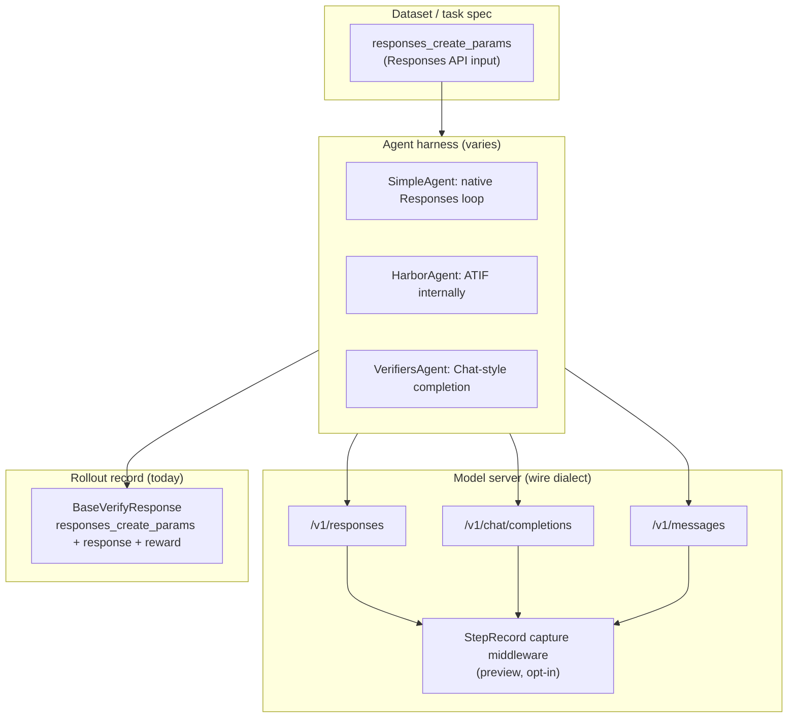
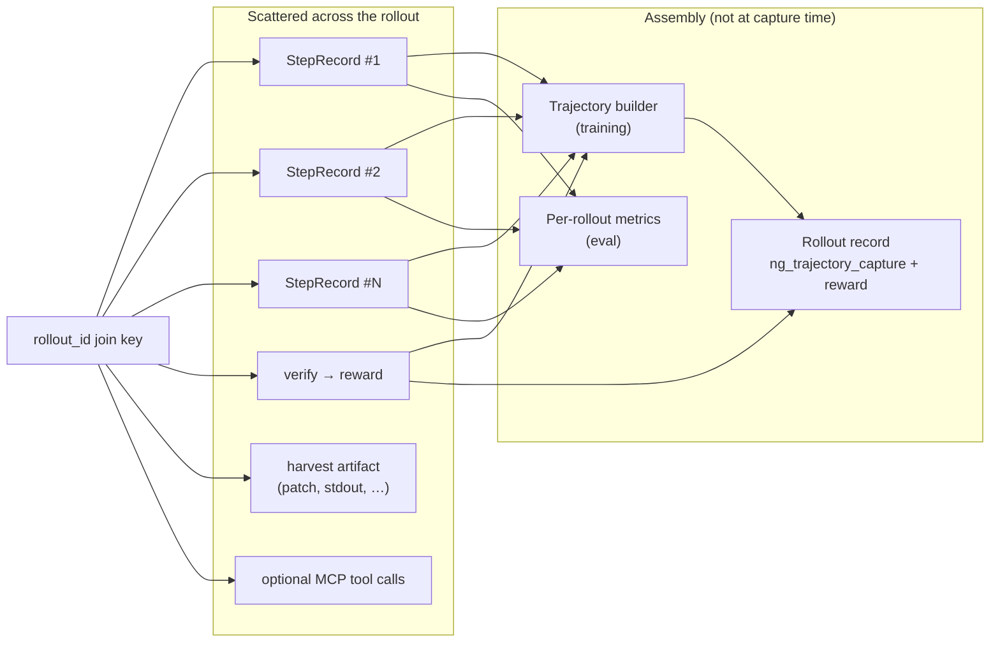

# GitHub issue #1822 — trajectory data contracts (full body)

## Title

Trajectory data contracts are fragmented across model-call capture, agent rollouts, and interchange formats

---

## Summary

NeMo Gym today standardizes **rollout collection** on an extended **OpenAI Responses API** contract (`responses_create_params` + `response` + `reward`). A separate **model-server trajectory capture** feature (StepRecord / #1715) records **per-LLM-call** observability in wire-native dialects. These answer different questions, live at different layers, and are **not automatically unified**.

For **blackbox agents** (Claude Code, Codex, etc.) the gap is acute: the only reliable signal is intercepted model calls, yet training and eval still expect a coherent rollout/trajectory artifact joined with **reward** and (optionally) **environment/tool** context. The intended architecture (capture store + trajectory builder + verify) is described in internal design discussions and preview docs, but the pieces are at different maturity levels and the contract boundaries are easy to conflate.

This issue tracks clarifying the problem, documenting contract relationships/gaps, and driving the missing assembly layer.

---

## What NeMo Gym produces today (confirmed)

NeMo Gym standardizes on **NeMo Gym Responses API** types, which wrap OpenAI’s Responses API:

- `NeMoGymResponseCreateParamsNonStreaming` — copy of OpenAI `ResponseCreateParamsNonStreaming` with server-side validation (`nemo_gym/openai_utils.py`)
- `NeMoGymResponse` — extends OpenAI `Response` with Gym output item types and usage details

The **rollout record** written by rollout collection is a verify response:

- `BaseRunRequest.responses_create_params` — task input
- `BaseVerifyRequest.response` — accumulated agent trajectory as `NeMoGymResponse`
- `BaseVerifyResponse.reward` — verifier score

(`nemo_gym/base_resources_server.py`)

So each rollout JSONL row is essentially:

| Field | Meaning |
|-------|---------|
| `responses_create_params` | Task input (messages, tools, sampling params) |
| `response` | Accumulated agent trajectory as a `NeMoGymResponse` (`output` item list + `usage`) |
| `reward` | Verifier score |
| + agent-specific extras | e.g. Harbor’s `instance_id`, error flags |

Datasets also use this contract — docs explicitly say rows require `responses_create_params` following the [OpenAI Responses API schema](https://platform.openai.com/docs/api-reference/responses/create).

**Gym extensions on top of OpenAI Responses API:**

- `*ForTraining` variants add `prompt_token_ids`, `generation_token_ids`, `generation_log_probs`, optional `routed_experts` (for RL)
- Structured reasoning as separate `type: "reasoning"` items instead of `<think>` in message text
- Tool loop uses `function_call` + `function_call_output` items (not Chat Completions `tool` role messages)

See also the repo’s [Responses API evolution engineering note](https://github.com/NVIDIA-NeMo/Gym/blob/main/fern/versions/v0.3.0/pages/infrastructure/engineering-notes/responses-api-evolution.mdx).

**There is no single unified trajectory format inside Gym today:**

- **SimpleAgent** — native Responses loop
- **HarborAgent** — ATIF internally → converted to Responses via `HarborAgentUtils.trajectory_to_responses()`
- **VerifiersAgent** — Chat-style completion → Responses
- **BrowsecompAgent** — custom JSONL event log (agent-specific)

All converge to Responses at the rollout boundary, but via different adapters.

**StepRecord / `trajectory_capture` is not in main** — it lives in preview docs / #1715.

---

## Where the formats sit (different layers)



**Key insight:** NeMo Gym’s rollout contract is **agent-assembled content** in Responses API form. StepRecord is **model-server middleware** that logs each LLM HTTP call in its native wire dialect. They are complementary, not the same thing.

---

## Problem statement

### What users expect

When running agentic rollouts — especially **external / opaque agents** we cannot instrument — we want:

1. **Complete interaction history** for debugging, eval, and visualization
2. **Per-call efficiency metrics** (tokens, latency, cache, turns)
3. **Training-ready trajectories** (sampled token ids, logprobs, loss mask) without re-tokenizing from text
4. **Verifier reward** attached to the same rollout attempt
5. **Harness-agnostic** collection (same shape whether the agent is native Gym, Harbor/ATIF, or a CLI in a sandbox)

### What we have today

Multiple overlapping “trajectory” concepts with **no single canonical assembly path**:

| Layer | Contract | Granularity | In main today? |
|-------|----------|-------------|----------------|
| Rollout record | `BaseVerifyResponse`: `responses_create_params` + `NeMoGymResponse` + `reward` | One assembled transcript per trial | Yes |
| Model-call capture | `StepRecord` in capture store JSONL | One record per HTTP model call | Preview / #1715 (not in main) |
| Harbor harness | ATIF `trajectory.json` | Agent steps + observations + metrics | Yes (Harbor agent only) |
| NAT runtime | ATOF events → ATIF v1.7 | Scope/event stream | External (NeMo Agent Toolkit) |
| Interchange target | ATIF | Standard agent trajectory | Ecosystem (Harbor) |

### Why this is a problem now

1. **Blackbox agents cannot populate training fields in `response`**
   For opaque CLIs (Anthropic Messages dialect), token ids exist only momentarily inside the model server after conversion to the **served** format; they are **dropped** before the response returns to the CLI (e.g. `responses_to_anthropic_response()` intentionally drops token-id fields). The agent’s parsed stdout / `NeMoGymResponse` is a **text view for scoring**, not an authoritative training trajectory.

2. **StepRecord does not subsume agent-level information**
   Capture records the **model-call portion** only. It does **not** capture:
   - Tool execution inside an opaque CLI shell (unless routed via Gym MCP)
   - Harvest artifacts (e.g. git patch) sent to verify
   - Reward from the resources server
   - Harness-specific error flags

3. **StepRecord alone does not subsume full agentic trajectories**
   Rollout `response` lacks reliable multi-turn stitching and token-id alignment for blackbox paths; ATIF includes observations but is not Gym-native; ATOF normalizes to ATIF, not Responses.

4. **No documented join contract in main**
   Preview trajectory-capture docs describe folding capture into rollout records as `ng_trajectory_capture = {rollout_id, metrics, steps}` (sanitized; raw req/resp stay in capture store). The **trajectory builder** that stitches captures into masked training trajectories (prefix matching, loss mask, sub-agent forests) is **designed but not shipped**.

5. **Terminology collision**
   “Rollout”, “trajectory”, “StepRecord”, “record”, and “step” mean different things across Gym, capture middleware, Harbor ATIF, and internal design docs — causing mismatched expectations.

---

## Contract-by-contract comparison

### 1. OpenAI Responses API ↔ NeMo Gym Responses API

| Aspect | OpenAI Responses API | NeMo Gym |
|--------|---------------------|----------|
| Core shape | `Response` with typed `output[]` items | Same, via `NeMoGymResponse` |
| Input | `ResponseCreateParams.input` | `NeMoGymResponseCreateParamsNonStreaming` |
| Reasoning | `reasoning` items | `NeMoGymResponseReasoningItem` |
| Tools | `function_call` / `function_call_output` | Same names |
| Training extras | Not in standard API | `*ForTraining` items with token IDs / logprobs |
| Scope | End-to-end agent transcript (when agent builds it) | Same — Gym’s **canonical rollout format** |

**Gap:** Gym is a **superset** for RL. Plain OpenAI Responses consumers won’t expect `generation_token_ids` etc.

---

### 2. Anthropic Messages API (`/v1/messages`)

| Aspect | Anthropic Messages | NeMo Gym |
|--------|-------------------|----------|
| Structure | `messages[]` with content blocks (`text`, `tool_use`, `tool_result`, `thinking`) | Flat `input`/`output` item list with different type names |
| Multi-turn | Role-based message array | Interleaved typed items |
| Conversion | — | `AnthropicConverter` bidirectionally maps Gym ↔ Anthropic |

Every Gym model server exposes `/v1/messages` by default, mapping Messages ↔ Responses around its own `responses()` implementation — so blackbox harnesses that require an Anthropic endpoint (e.g. Claude Code CLI) can target any model server directly (`nemo_gym/base_responses_api_model.py`).

**Gap:** Anthropic is a **wire dialect** at the model server. Gym agents speak Responses API internally; StepRecord would store `dialect: "messages"` with raw Anthropic payloads; Gym rollouts are Responses-shaped after conversion.

---

### 3. Chat Completions (`/v1/chat/completions`)

| Aspect | Chat Completions | NeMo Gym |
|--------|-----------------|----------|
| Unit | One assistant message per call (+ optional `tool_calls`) | Multiple typed output items per “response” |
| Tool results | `role: "tool"` messages | `function_call_output` items |
| Reasoning | Often embedded in `content` string | Separate `reasoning` items |
| In Gym | Used internally by some backends/agents | Converted via `ResponsesConverter` at model-server boundary |

**Gap:** Chat is still widely used (Verifiers agent, many OSS models). Gym **normalizes to Responses** at the agent output boundary, but StepRecord captures the **actual wire format** per call (`dialect: "chat"`).

---

### 4. StepRecord (preview trajectory capture)

From [Trajectory Capture docs](https://nvidia-preview-feat-model-server-observability.docs.buildwithfern.com/nemo/gym/model-server/trajectory-capture):

| Aspect | StepRecord | NeMo Gym rollout (today) |
|--------|-----------|--------------------------|
| Granularity | **One record per model HTTP call** | **One assembled transcript per trial** |
| Content | Full `request` + `response` per dialect | Typed `output[]` items; raw HTTP omitted |
| Tool execution | **Not captured** (model-call portion only) | `function_call_output` from agent/env |
| Turn semantics | `turn_index` from user-message boundaries (naive) | Implicit in item sequence |
| Token IDs | In raw response; **excluded** from `assemble_rollout` eval view | Explicit in `*ForTraining` items |
| Harness | Agnostic (black-box CLI works via URL prefix) | Agent must assemble Responses output |
| Storage | Per-rollout JSONL (`<rollout_id>.capture.jsonl`) | Rollout collection JSONL |
| Opt-in | `observability_enabled: true` on model server | Always (for agents that implement `/run`) |

**Terms from trajectory capture docs:**

| Term | Meaning |
|------|---------|
| **Trial** | A single attempt at completing a task |
| **Turn** | Boundary where the agent hands control back to the user; `turn_index` derived from user-message boundaries in captured requests |
| **Step** | One micro-cycle inside the agent's loop (model generates → tool runs → observation); capture records the **model-call portion** of each step |
| **Trajectory** | Ordered sequence of step records produced during a trial |

**Gap:** StepRecord is **observability/eval at the inference boundary**. Gym rollouts are **training/eval at the agent boundary**. StepRecord sees every LLM call even from opaque harnesses; Gym rollouts only see what the agent chooses to expose (unless capture is folded into the rollout record).

**Reading captured data (preview API):**

```python
from nemo_gym.trajectory_capture import (
    CaptureStore,
    aggregate_rollout_metrics,
    assemble_rollout,
    assemble_step_records,
)

store = CaptureStore("/data/trajectories")
steps = assemble_step_records(store, rollout_id)
totals = aggregate_rollout_metrics(store, rollout_id)
items = assemble_rollout(store, rollout_id)
```

When rollouts are collected with capture enabled, `rollout_collection` folds each rollout's captured trajectory into its record as `ng_trajectory_capture = {rollout_id, metrics, steps}` — same shape for every agent harness; raw request/response remain in the capture store.

---

### 5. ATIF (Harbor)

From [Harbor’s ATIF docs](https://www.harborframework.com/docs/agents/trajectory-format):

| Aspect | ATIF | NeMo Gym |
|--------|------|----------|
| Purpose | Standard agent trajectory interchange (debug, viz, SFT, RL) | RL rollout + verification |
| Steps | `source: user/agent/system` with `message`, `tool_calls`, `observation`, `metrics` | Responses API item types |
| Observations | First-class `Observation.results[]` | `function_call_output` |
| Subagents | `subagent_trajectories`, `trajectory_id` (v1.7) | Not in base contract |
| Metrics | Per-step `Metrics` + `final_metrics` | Aggregated in `response.usage` |
| Token IDs | Optional in step metrics | Required for training variants |

**In-repo bridge:** Harbor writes `agent/trajectory.json` (ATIF), then `HarborAgentUtils.trajectory_to_responses()` converts to NeMo Gym Responses output — each agent step becomes assistant message + function_call(s) + function_call_output(s).

**Gaps ATIF → Gym conversion:**

- User/system steps become `responses_create_params.input`, not `output`
- Reasoning merged into message text with `<think>` tags (training alignment), not separate `reasoning` items
- ATIF `final_metrics` maps to `usage`, but per-step metrics can be lossy
- No native ATIF in rollout JSONL — only after Harbor conversion

---

### 6. ATOF (NeMo Agent Toolkit)

From [NAT’s ATOF→ATIF converter](https://docs.nvidia.com/nemo/agent-toolkit/1.8/api/nat/atof/scripts/atof_to_atif_converter/index.html):

| Aspect | ATOF | StepRecord | ATIF | Gym |
|--------|------|-----------|------|-----|
| Model | Event stream (`ScopeEvent`, `MarkEvent`) | Per-LLM-call record | Step sequence | Responses item list |
| Scope | Full runtime (agent, llm, tool, dispatcher scopes) | LLM calls only | Agent interaction history | Agent-assembled transcript |
| Hierarchy | UUID/parent scope tree → subagent embedding | Flat per-call + rollout correlation | `subagent_trajectories` (v1.7) | Flat item list |
| Wire format | `data_schema` + pluggable extractors | Raw request/response by dialect | Normalized steps | Responses API |
| Target | Convert → **ATIF v1.7** | Eval observability + on-policy RL input | Interchange standard | Training rollouts |

**Gap:** ATOF is the **broadest runtime telemetry** format (NAT workflows). It normalizes to ATIF, not directly to Gym Responses API. There is no in-repo ATOF→Gym path today; the chain would be ATOF → ATIF → (Harbor-style conversion) → Responses API.

---

## Summary: relationships

```
OpenAI Responses API  ──extends──▶  NeMo Gym Responses API  ◀── agent output contract (rollout jsonl)
        ▲                                      ▲
        │ ResponsesConverter                   │ HarborAgentUtils (ATIF → Responses)
        │                                      │
Chat Completions                          ATIF (Harbor trajectory.json)
        ▲                                      ▲
        │ AnthropicConverter                   │ NAT atof_to_atif_converter
        │                                      │
Anthropic Messages                        ATOF (event stream)

StepRecord: orthogonal capture at model-server middleware (all dialects above)
```

---

## Main gaps

1. **No single trajectory format inside Gym today.** Simple agents emit Responses natively; Harbor uses ATIF internally; Verifiers uses Chat-style completion. All converge to Responses at the rollout boundary — but via different adapters.

2. **StepRecord vs rollout record answer different questions.** StepRecord = “what did the model server see on each HTTP call?” Rollout = “what transcript + reward does training/eval consume?” Tool results and env state live in rollouts (or ATIF), not in StepRecord.

3. **Turn/step semantics don’t align.** StepRecord’s `turn_index` is server-derived and explicitly “naive”; ATIF steps are agent-centric with observations attached; Gym `output[]` is a flat item stream.

4. **Training token IDs are Gym-specific.** StepRecord’s assembled eval view deliberately omits raw req/resp and token IDs; on-policy RL is a separate pipeline consuming capture. Gym puts token IDs on `*ForTraining` output items when the model server provides them.

5. **ATIF/ATOF are interchange standards, not Gym natives.** Harbor already bridges ATIF→Responses. ATOF→Gym would need ATOF→ATIF→Responses (or a new converter). StepRecord could eventually **backfill** opaque harness trajectories without agent cooperation.

6. **Preview vs shipped.** Trajectory capture (`StepRecord`, `ng_trajectory_capture`, `assemble_rollout`) is documented on the preview branch but not present in main — so today you only get the Responses API rollout contract from agents.

---

## Joining StepRecord with agent-level information

For blackbox agents, **StepRecord capture and agent-level information must be joined** — but not by merging into one schema at capture time. The intended model is **layered assembly** with a shared join key.

### Two separate artifacts

| Artifact | What it is | Who produces it |
|----------|------------|-----------------|
| **Records** (StepRecord / CompletionRecord) | Per-model-call observability | Model-server capture middleware (#1715) |
| **Trajectory** | Trainable rollout record (messages, token ids, loss mask, logprobs, reward) | **Trajectory builder** reading the capture store + reward from verify |

Per internal design terminology: one rollout can yield more than one trajectory (prefix-consistent segments). Per-call observability records are kept separately and called **records**.

StepRecord is **not** the final rollout contract. It is the **authoritative substrate for model calls**; agent-level info fills in what capture cannot see.

### Scattered records joined at read time

A rollout's record is scattered — many model calls, a verify, and (for training) an assembled trajectory — across processes and time. Nothing in an opaque CLI's request says which rollout a call belongs to.

**Join key:** rollout id from `(task_index, rollout_index)`, carried on:

1. **Model calls** — `/ng-rollout/<rollout_id>/v1` URL prefix (opaque CLIs) or `x-nemo-gym-rollout-id` header (Gym-orchestrated callers)
2. **Verify** — same rollout identity on the resources server session
3. **MCP tool calls** — session token tied to the same rollout (#1682)



> **Do not merge StepRecord + agent metadata into one blob at capture time.** Union happens at **read time** by consumer (eval rollup, training builder, debug).

### What each layer contributes

**StepRecord / capture store (model-server layer):**

- Full request/response per dialect (after conversion to **served** format internally)
- Token stats, latency, cache, tool calls in model payload, reasoning, errors
- Model-call portion only — not tool execution inside an opaque CLI shell
- #1715 scope: eval/observability substrate; token ids for RL are a **downstream consumer** of the same capture

**Agent-level (run-in-box / harness layer):**

- Sandbox lifecycle (create → launch CLI → harvest → teardown)
- Harvest result sent to verify (e.g. `git diff HEAD`)
- Parsed CLI stdout (`harness.parse()`) — **eval-only fallback** when there is no recording layer; **not** training source when capture exists
- Error flags (timeout, OOM, context length)
- `NeMoGymResponse`-shaped return — for Claude Code **has no token ids** by construction

**Resources-server layer:**

- **Reward** (authoritative for RL)
- Optional **MCP tools** the CLI can call mid-loop (observable + verifiable)
- Optional **sandbox spec** for task-specific worlds
- **Grading box** (fresh container for verify, separate from working box)

**Trajectory builder (the actual “union” for training):**

- Reads StepRecords from capture store keyed by `rollout_id`
- **Prefix matching** on served requests (critical for stateless Anthropic Messages where each turn resends full history)
- Builds **loss mask** (learn from generated tokens, not re-fed history or tool output)
- Handles **sub-agent forests** when prefix chains break
- Attaches **reward** from verify

### Anthropic / multi-turn stitching (the hard case)

Anthropic Messages is stateless: every turn the CLI resends the whole conversation so far plus the latest tool results.

Flow for Claude Code (hardest case):

```
Anthropic request (full conversation so far)
│ anthropic_request_to_responses()
▼
served request ──► inference engine ──► served response
# carries token ids + logprobs (the *ForTraining items)
│ responses_to_anthropic_response()  # token-id / logprob fields dropped here
▼
Anthropic response ──► back to the CLI   # no token ids on the wire — by construction
```

Training assembly requires:

- Capture at **served** layer (after `anthropic_request_to_responses`)
- **Deterministic conversion** so turn N’s served request extends turn N−1 by a token-id prefix
- Loss mask: generated tokens = 1; re-fed history and tool tokens = 0
- Broken prefix (sub-agent, compaction) → new chain in a **forest** of trajectories

Token ids **cannot** flow back through the CLI; capture must happen inside the model-server proxy/gateway.

Prefix matching only works if the Anthropic→served conversion is deterministic — the same conversation prefix must produce the same served token ids every turn.

### Rollout JSONL vs capture store

| Data | Capture store | Rollout record (`BaseVerifyResponse`) |
|------|---------------|--------------------------------------|
| Raw HTTP req/resp per call | Yes | No (preview: excluded from `ng_trajectory_capture`) |
| Per-step model metrics | Yes | Partial (`response.usage` aggregates) |
| Assembled message/tool view | Via `assemble_rollout` | `response.output[]` (agent-built today) |
| Token ids / logprobs (training) | Served layer (RL consumer) | `*ForTraining` when agent controls loop |
| Reward | No | Yes |
| Task-specific fields | No | Agent/env extras |

### Two external-agent shapes (same join logic)

| | Launched CLI (blackbox) | In-process library |
|--|-------------------------|-------------------|
| Loop | Inside container | Inside agent server |
| Model calls | Egress to model server | In-process client → model server |
| Recording | Capture middleware primary | Capture or inline |
| Sandbox | Usually required | Only if task requires |

Both use `seed_session` (optional spec) + `verify`; harness-specific code is confined to install/launch/harvest.

### Intended end state for a rollout record

```
rollout record =
  task/run metadata
+ reward (from resources server verify)
+ ng_trajectory_capture (from capture store, eval view)
+ [training] trajectories (from trajectory builder, reference/handoff)
```

**Not:**

```
StepRecord ⊕ agent response  →  one schema at capture time
```

| Consumer | Join mechanism | Output shape |
|----------|----------------|--------------|
| Eval / rollout jsonl | Fold capture into rollout as `ng_trajectory_capture = {rollout_id, metrics, steps}` + existing `reward` | Gym rollout record |
| Training | Trajectory builder over capture store + reward | Masked trajectories (may be multiple per rollout) |
| Debug | Raw capture JSONL + trial artifacts | Full fidelity |

### Recording placement: middleware vs gateway

Both are proxy-layer options (separate from the inference engine):

- **Middleware (#1715):** opt-in FastAPI middleware on the Gym model server; records in place; harness-agnostic; scoped to observability/eval; token ids deferred to RL consumer
- **Gateway:** standalone FastAPI service; dialect detect, convert, inject token-id params, capture, convert back, synthesize streaming; used when no model-server-like proxy exists elsewhere

For training, recording may need to inject token-id params and assemble masked trajectories — whether that lives in middleware or a dedicated gateway is an open architectural choice; the capture store substrate is shared either way.

At high concurrency, all of one rollout's calls must reach the same capture (sticky routing by join key, or shared store keyed by rollout id).

---

## Implementation maturity

| Component | Status |
|-----------|--------|
| Responses API rollout contract | **Have** (main) |
| `/v1/messages` dialect converter | **Have** (#1627, main) |
| StepRecord capture store | **In flight** (#1715) |
| `ng_trajectory_capture` rollout fold-in | **Preview docs** |
| Trajectory builder (prefix stitch + loss mask) | **To build** |
| Generic run-in-box + harness adapter | **To build** |
| Sandbox provider abstraction | **In flight** (#1377) |

| Concern | Today (main branch) | Target |
|---------|---------------------|--------|
| Rollout record | `responses_create_params` + `response` + `reward` assembled **by the agent** | Same verify envelope; `response`/trajectory for blackbox from **capture + builder**, not CLI parse |
| Model calls | Not centrally captured | StepRecord in capture store (#1715) |
| Token ids for RL | On `*ForTraining` items when agent controls the loop | Captured at **served layer** inside model server |
| Tool observations | In Responses `function_call_output` (native agents) or ATIF (Harbor) | Inside opaque CLI: **invisible** unless exposed via MCP |
| Eval metrics | From `response.usage` | From capture store aggregates (turns, latency, cache) |

---

## Practical mental model

| If you need… | Use… |
|--------------|------|
| RL training data / rollout collection | **NeMo Gym Responses API** (`responses_create_params` + `response` + `reward`) |
| Cross-harness agent logs (Harbor ecosystem) | **ATIF** |
| NAT workflow runtime telemetry | **ATOF → ATIF** |
| Model-call observability across any harness (including black-box CLI) | **StepRecord** (preview / #1715) |
| Raw provider wire format | StepRecord `request`/`response` per `dialect`, or model-server converters |

---

## Proposed direction (for discussion)

1. **Treat StepRecord/capture store as authoritative for model calls** (all dialects, keyed by rollout id).
2. **Treat verify reward as authoritative for scoring** (resources server).
3. **Introduce/document a trajectory builder** that reads capture + reward and emits:
   - Eval: sanitized steps/metrics (`ng_trajectory_capture` shape)
   - Training: masked trajectories (possibly multiple per rollout)
4. **Keep rollout JSONL envelope** (`responses_create_params`, `reward`, …) but clarify **`response` provenance**:
   - Native agents: agent-assembled Responses (current)
   - Blackbox agents: derived from capture (+ optional eval text view from harness parse, not for training)
5. **Publish a contract map** (Responses ↔ StepRecord ↔ ATIF ↔ ATOF) and which conversions exist vs are gaps.
6. **Clarify terminology** in docs: rollout vs trajectory vs record vs step.

---

## Acceptance criteria (suggested)

- [ ] Architecture doc (Fern or engineering note) describing layers, join key, and what each contract is/isn't authoritative for
- [ ] Clear statement in trajectory-capture docs: relationship to `BaseVerifyResponse` and blackbox agents
- [ ] Trajectory builder spec (inputs: capture store + reward; outputs: training trajectories + eval rollup)
- [ ] Rollout collection integration: when capture enabled, populate `ng_trajectory_capture` (or successor field) consistently
- [ ] Harbor/ATIF path documented as one **agent-side** adapter, not a second canonical capture path
- [ ] Tests or fixtures showing multi-turn Anthropic prefix stitching expectations

---

## References

- [NeMo Gym — Trajectory Capture (preview)](https://nvidia-preview-feat-model-server-observability.docs.buildwithfern.com/nemo/gym/model-server/trajectory-capture)
- [Harbor — Agent Trajectory Format (ATIF)](https://www.harborframework.com/docs/agents/trajectory-format)
- [NAT — ATOF to ATIF converter](https://docs.nvidia.com/nemo/agent-toolkit/1.8/api/nat/atof/scripts/atof_to_atif_converter/index.html)
- [Gym — Responses API evolution (engineering note)](https://github.com/NVIDIA-NeMo/Gym/blob/main/fern/versions/v0.3.0/pages/infrastructure/engineering-notes/responses-api-evolution.mdx)
- [OpenAI Responses API reference](https://platform.openai.com/docs/api-reference/responses/create)
- Related issues: #1249, #1377, #1627, #1682, #1715, #1572, #1677, #1707

---

## Open questions

1. Should eval rollouts **require** capture for blackbox agents, or keep harness `parse()` as fallback indefinitely?
2. Is `ng_trajectory_capture` the long-term field name, or should we align eval rollup shape with ATIF for cross-ecosystem tooling?
3. Where should trajectory builder live — `nemo_gym` library, model server, or separate service (gateway vs middleware)?
4. For native Gym agents, do we dual-write capture + agent `response`, or treat agent `response` as sufficient when the loop is observable?
5. How do MCP tool calls (session-bound, #1682) appear in the unified trajectory — ATIF-like observations or Responses `function_call_output` synthesized from MCP logs?
