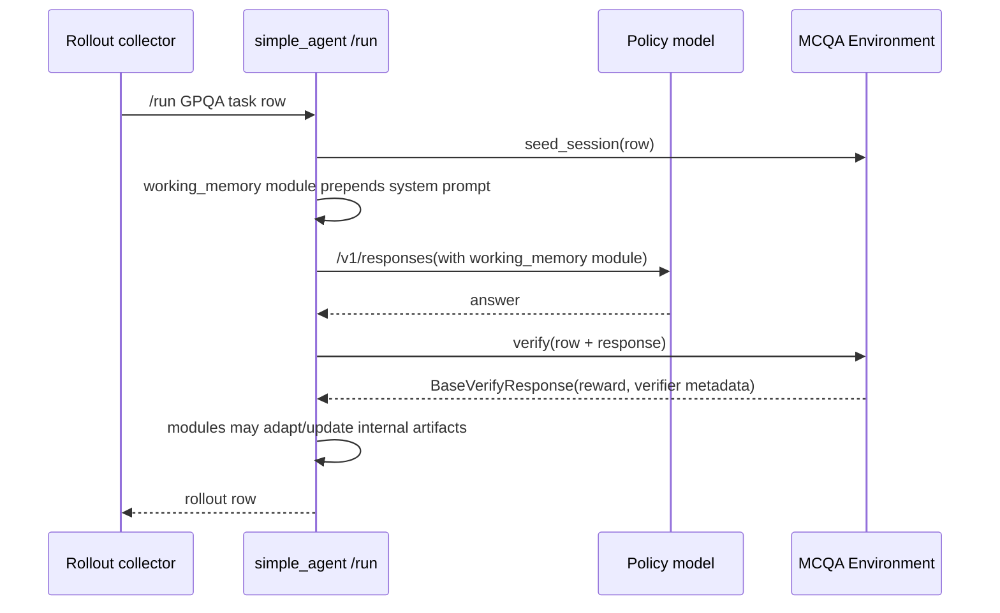

# Agent module end-to-end stress test

This is a concrete slice of the Agent module wiring inside the existing `/run` rollout surface.

**Reference implementation (2026-07):** `nemo_gym/agent_modules.py` + `simple_agent` `/run` wiring.
See Fern research note [Agent Modules](/researchnotes/agent-modules).

## What the example runs

`responses_api_agents/simple_agent/configs/simple_agent_with_prompt_module.yaml` composes:

- A resources server + policy model (placeholders in yaml).
- `simple_agent` with a `prompt` Agent module that injects the GPQA answer-format instruction.

`benchmarks/gpqa/config_with_prompt_module.yaml` (planned) would wire GPQA MCQA end-to-end.

`benchmarks/gpqa/config_with_gepa_module.yaml` (planned) would swap in a
`gepa_prompt` Agent module. With reflection model fields unset, it behaves like a static prompt
artifact. When `reflection_model`, `reflection_base_url`, and `reflection_api_key` are provided, it
can adapt from verified trajectories and update the prompt artifact.

The intended data/control flow is:

## What this covers from PR #1551

PR #1551 wants DSPy/GEPA to adapt a prompt using GPQA reward. This example does not implement GEPA itself, but it creates the right framework slot:

- Prompt is an Agent module/artifact.
- Rollout collection runs the normal Agent `/run` path.
- Environment returns reward through `verify`.
- Agent receives a terminal `TrajectoryStep` (`kind="terminated"` or `kind="truncated"`) through `/adapt`.

The remaining PR #1551 gap is swapping the module's internal reflection/update loop for the actual
DSPy `GEPA` teleprompter while preserving the same AgentModule boundary.

## What this covers from PR #1706

PR #1706 wants an ACE/TALES agent with playbook and memory updates across episodes. The framework slice adds an `ace_playbook` module scaffold:

- Playbook is an Agent module/artifact.
- Agent modules can inject playbook state into the Agent loop.
- Agent modules can adapt from `TrajectoryStep`s and update state.

The remaining PR #1706 gaps are:

- A TALES-specific Agent loop that emits the full trajectory, not only a final synthetic response.
- A real ACE update algorithm that emits/consumes playbook update events.
- Memory module integration, probably as a separate Agent module.
- Explicit reset/persist/snapshot policy for playbook and memory artifacts.
- Model-role config for reasoner, reflector/summarizer, and embedder.
- ATIF-compatible trajectory serialization for the multi-step TALES interaction.

## Framework gap exposed

The current implementation proves the basic wiring, but it still lacks:

- A first-class `Trajectory` object.
- A recorder/event log for `UpdateEvent`s emitted by Agent modules.
- Artifact materialization lifecycle hooks beyond the type scaffold.
- A step-wise trajectory protocol for agents that should not run to completion internally.
