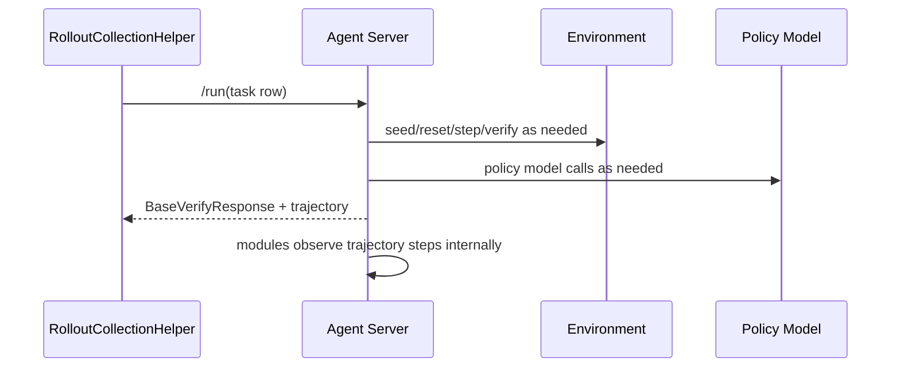
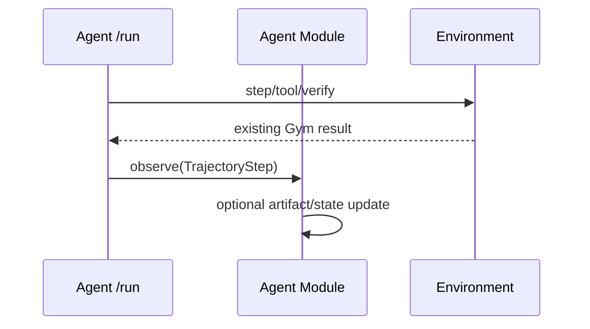

# Preserve Agent `/run` and add Agent observation hooks

## Summary

This note proposes a smaller refactor than moving `/run` out of Agent servers.

Keep the current Agent `/run` behavior intact, but add an optional Agent-side observation hook:

```text
POST /observe
```

The purpose of `/observe` is to let Agent modules update internal state/artifacts from trajectory steps without changing the main `/run` control flow.

This preserves current Agent harness behavior while still creating a clean place for adaptive Agent modules such as:

- GEPA/DSPy prompt modules
- ACE playbook modules
- memory modules
- `SKILL.md` modules
- model/checkpoint/adaptor modules

## Motivation

The current `SimpleResponsesAPIAgent` API has:

```python
POST /v1/responses
POST /run
POST /aggregate_metrics
```

`/run` is already the executable Agent entrypoint used by rollout collection. Many Agent implementations have meaningful behavior inside `/run`, not just framework orchestration:

- `simple_agent.run()` is mostly orchestration around `/v1/responses` and Environment `/verify`.
- `gymnasium_agent.run()` owns a step loop over Environment observations and rewards.
- `claude_code_agent.run()` owns native runtime setup, skills staging, subprocess execution, and stream parsing.
- SWE/terminal agents often wrap external harnesses.
- `verifiers_agent.run()` combines Agent and Environment semantics in-process.

Because `/run` is already the stable execution surface, moving it immediately may create more disruption than clarity.

Instead, we can preserve `/run` and add an optional observation path for Agent modules.

## Proposed Shape



For agents that want explicit observation events:



The Agent owns when and how to call its modules' `observe()` methods. The Processor/RolloutCollection layer does not need to know whether adaptation happened.

## Agent API

Keep:

```python
async def responses(...)
async def run(...)
async def aggregate_metrics(...)
```

Add optional:

```python
async def observe(self, step: TrajectoryStep) -> None:
    return None
```

Default behavior is no-op. Agents that do not need online adaptation ignore it.

## TrajectoryStep

`TrajectoryStep` is a typed envelope around existing Gym contracts. It should not replace existing contracts.

```python
class TrajectoryStep(BaseModel):
    kind: Literal["response", "tool_result", "terminated", "truncated", "custom"]
    payload: NeMoGymResponse | NeMoGymResponseOutputItem | NeMoGymFunctionCallOutput | BaseVerifyResponse | dict
    metadata: dict = {}
```

Examples:

```python
TrajectoryStep(kind="response", payload=model_response)
TrajectoryStep(kind="tool_result", payload=function_call_output)
TrajectoryStep(kind="terminated", payload=verify_response)
TrajectoryStep(kind="truncated", payload=verify_response)
TrajectoryStep(kind="custom", payload={"ace_playbook_item": "..."})
```

The naming aligns with an ATIF-style trajectory: the event is a step in the interaction history.

## Agent Modules

Agent modules are internal Agent components. They are not top-level framework roles.

Examples:

- `PromptArtifactModule`
- `GepaPromptModule`
- `AcePlaybookModule`
- `MemoryModule`
- `SkillModule`

Module interface:

```python
class AgentModule:
    def apply_to_responses_create_params(self, body):
        return body

    async def observe(self, step: TrajectoryStep) -> None:
        return None

    def artifact_refs(self) -> list[AgentArtifactRef]:
        return []
```

The Agent decides:

- which modules are loaded
- when modules alter input/context
- which trajectory steps modules observe
- how module artifacts are persisted or emitted

## GEPA/DSPy Fit

GEPA/DSPy is one Agent module implementation over a prompt artifact.

It should not own rollout execution. It should observe trajectory steps produced by normal Agent `/run` executions and update the Agent's prompt artifact when configured to do so.

For a full GEPA candidate-search workflow, a script or higher-level driver can still run many Agent `/run` calls over different prompt artifacts. The important point is that the adaptive algorithm is an Agent module; `/run` remains the normal execution surface.

## ACE/TALES Fit

ACE playbook learning is an Agent module over a playbook artifact.

For TALES:

- Environment owns TALES state, steps, reward, and admissible-command configuration.
- Agent `/run` owns the TALES-specific agent loop.
- `AcePlaybookModule.observe(...)` can update playbook state from terminal or custom trajectory steps.

This preserves the rich Agent loop while making playbook state a named Agent module/artifact.

## Benefits

- Minimal disruption to existing agents.
- No need to migrate every `/run` implementation immediately.
- Supports online Agent adaptation without changing rollout collection.
- Keeps Agent-specific loops inside Agents.
- Gives GEPA/ACE/memory/skills a common module interface.
- Keeps Environment reward and verification ownership unchanged.
- Still allows future Processor extraction if needed.

## Open Questions

- Should `/observe` be an HTTP endpoint, an internal method, or both?
- Should `Agent.run()` automatically call module `observe()` internally, or should the framework route steps to `/observe`?
- How should Agent modules emit artifact provenance: return values, logs, `UpdateEvent`s, or rollout metadata?
- Should GEPA's candidate search be a script, a module method, or a rollout collection driver?
- How closely should `TrajectoryStep` match ATIF `Step`?

