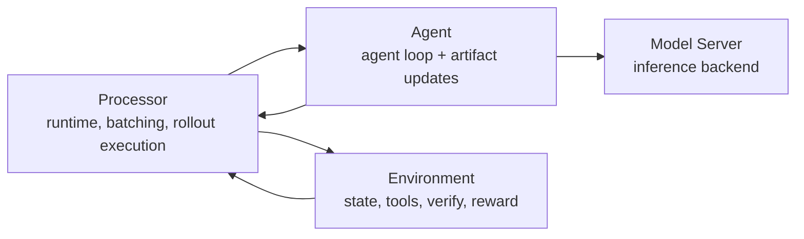
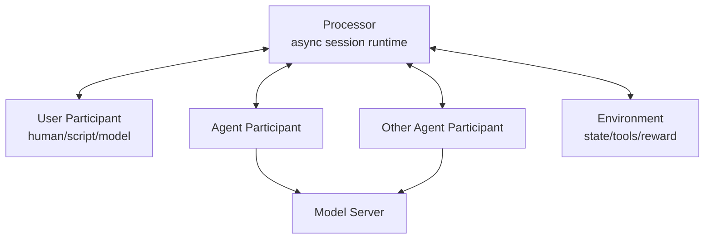
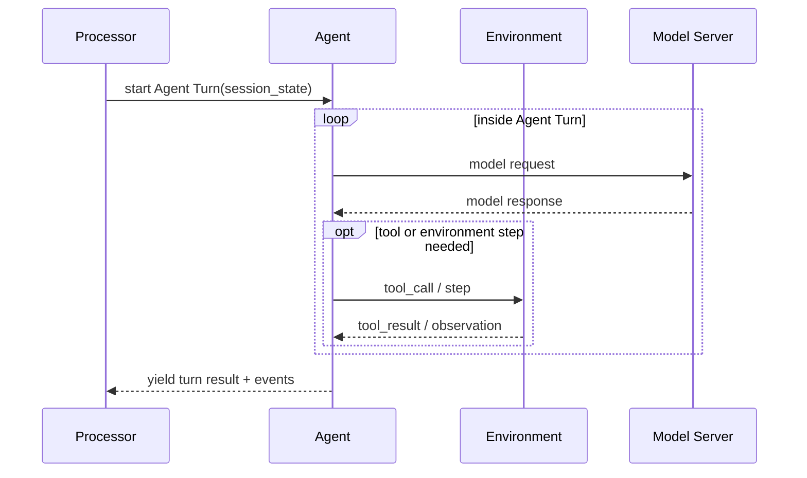
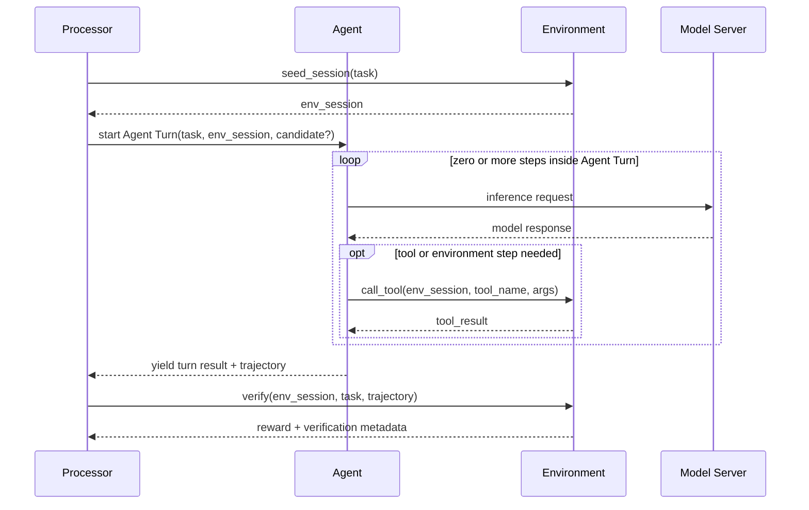
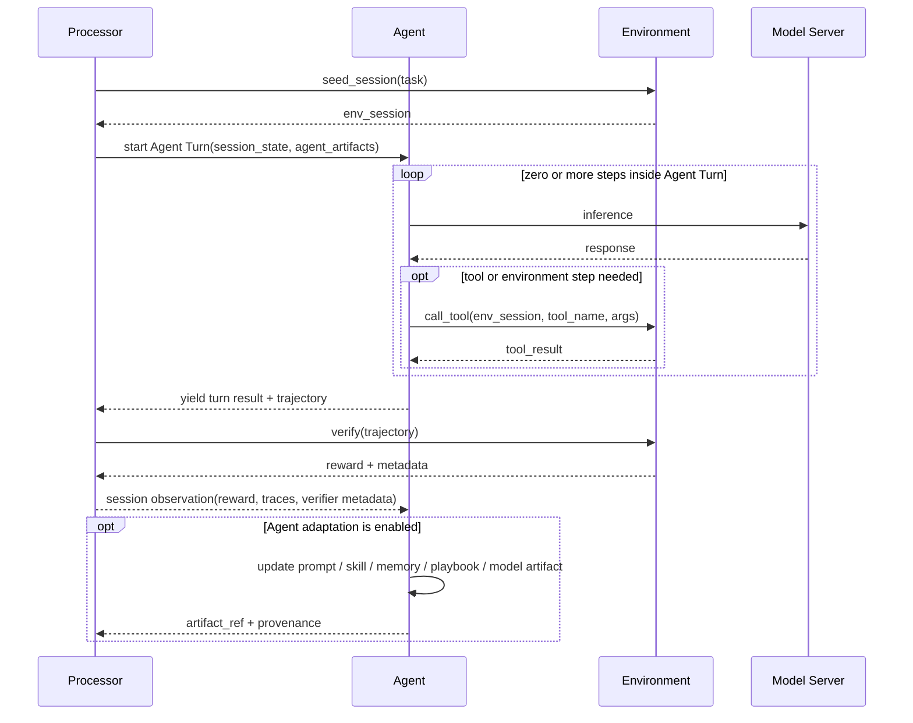
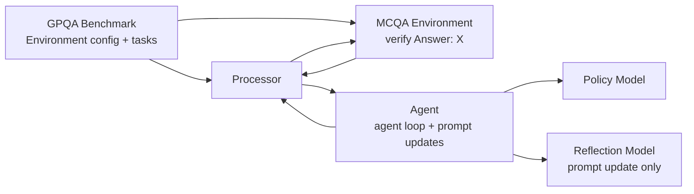
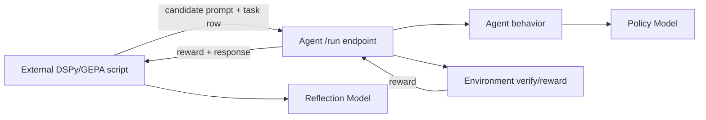
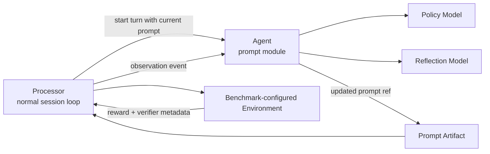
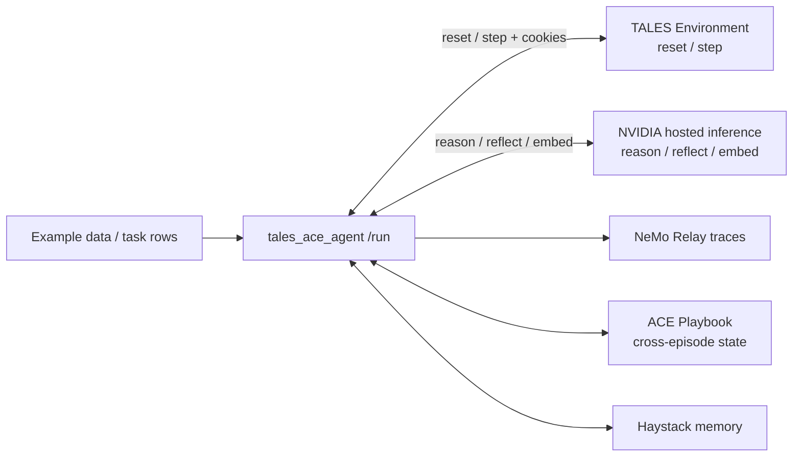
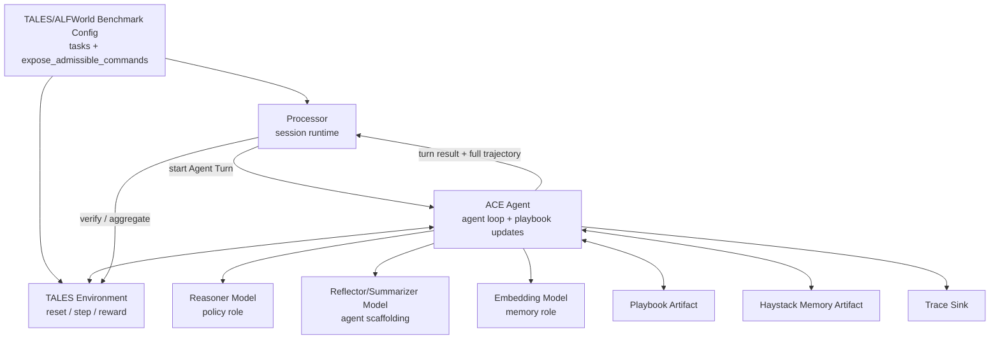

# Refactor Gym architecture around Processor, Agent, and Environment

## Summary

Gym's current architecture makes it easy to conflate the Agent with the Environment because the Agent Server often owns the `/run` endpoint and coordinates the rollout. Coordination does not make the Agent the Environment. The framework should make this boundary explicit by refactoring around three first-class roles:

1. **Processor**: framework-owned runtime that executes and records rollouts.
2. **Agent**: policy/program that acts and may update its own artifacts from observations.
3. **Environment**: task, state, tools, verification, reward, and metrics.

Benchmarks are treated as specific Environment configurations that define or select Tasks, often through datasets.

This issue proposes an architectural direction for clarifying those roles, with special attention to optimizer workflows such as DSPy/GEPA and ACE. Adaptation should be implemented by Agent modules, not as a separate execution path: an Agent may adapt its policy model, prompt, skills, memory, playbook, or other artifacts while the Processor continues to run the same Agent-Environment interaction loop. Rewards and verification remain owned by the Environment.

The proposal should use the current architecture where it helps, but should not be constrained by today's interfaces. Existing Responses API agents, resources-server endpoints, and rollout collection machinery are useful migration anchors. If a cleaner target architecture requires new primitives, the design should introduce them deliberately rather than preserving compatibility for its own sake.

## Motivation

Today, the Agent Server is often the HTTP surface that external clients call for `POST /run`. Internally, that endpoint coordinates calls to the resources server and model server:

- seed/reset environment session
- call the policy model
- route tool calls to the environment
- ask the environment to verify the trajectory
- return reward and rollout metadata

That makes the Agent look like a reward-returning module from the outside, even when the actual environment state and reward live in the resources server. This is especially visible in benchmark flows such as GPQA over MCQA, where the agent coordinates the rollout but the MCQA resources server owns answer extraction and reward.

This becomes more confusing when optimizer recipes are implemented as external scripts that call the Agent's `/run` endpoint as a black-box objective. In that shape, the optimizer treats the Agent URL as if it were the environment. A cleaner architecture would represent optimization and learning as Agent modules exercised through the same interaction loop as ordinary evaluation.

## What Agent `/run` Mixes Today

The current `SimpleResponsesAPIAgent.run(...)` abstraction is doing two jobs at once:

1. It exposes the **Agent's executable behavior** to rollout collection.
2. It performs **Processor-style orchestration** around that behavior.

The cleanest example is `responses_api_agents/simple_agent/app.py`:

```text
SimpleAgent.run(row)
  -> resources_server /seed_session
  -> self /v1/responses
  -> resources_server /verify
  -> return reward + response
```

Only the middle step is the Agent's behavior. The first and last steps are framework/environment orchestration:

| Current `run()` responsibility | Better owner |
| --- | --- |
| Receive one materialized task row | Processor / rollout collection |
| Seed or reset Environment session | Processor calling Environment |
| Invoke Agent behavior | Processor calling Agent |
| Agent model/tool loop | Agent |
| Environment tool/step execution | Agent or Processor depending on protocol; Environment implements tools/steps |
| Verify final trajectory and compute reward | Environment, invoked by Processor |
| Persist trajectory/reward/metadata | Processor / rollout collection |

This explains why `/run` feels confusing: the endpoint is physically on the Agent server, but much of its work is not Agent semantics.

Other implementations show why the migration must be careful:

- `simple_agent.run()` is mostly Processor orchestration and is the easiest extraction target.
- `gymnasium_agent.run()` mixes a Processor-like reset/step/reward loop with Agent-specific observation-to-model-input logic.
- `claude_code_agent.run()` wraps a native Agent runtime: staging skills, building `CLAUDE_CONFIG_DIR`, launching Claude Code, parsing stream output. That should mostly remain Agent-loop logic.
- SWE-style agents often delegate to external harnesses and are best treated as run-to-completion Agent loops during early migration.
- `verifiers_agent.run()` currently combines Agent and Environment semantics in-process, so it needs a longer migration path.

### Agent-Type Comparison

| Agent type / examples | Current `/run` shape | Processor-like responsibilities today | Agent-loop responsibilities today | Suggested migration |
| --- | --- | --- | --- | --- |
| **Simple Responses API agents**<br/>`simple_agent`, `non_executing_simple_agent`, `cvdp_agent` | Seed resources server, call Agent `/v1/responses`, verify on resources server. | Session seeding, invoking Agent behavior, verification, returning rollout row. | Model call loop, tool-call handling, converting tool results into `NeMoGymResponse` output. | Extract `/run` orchestration into `Processor.run_one(...)` first. Keep `/v1/responses` as Agent behavior. |
| **MCQA/GPQA-style benchmark agents**<br/>`gpqa_mcqa_simple_agent` config | Same as `simple_agent`, with benchmark-configured MCQA verifier and dataset/prompt config. | Benchmark task materialization, processor invocation, verification/reward collection. | Answer-generation behavior and prompt/artifact modules. | Treat GPQA as Benchmark config of MCQA Environment. Agent instance should not be benchmark-specific unless behavior truly is. |
| **Gymnasium-style step agents**<br/>`gymnasium_agent` | Reset Environment, loop model call -> Environment `/step`, accumulate reward, stop on terminated/truncated. | Reset/step scheduling, termination/truncation handling, reward accumulation, trajectory assembly. | How observations become model input, how action/tool outputs are represented, policy model call. | Introduce a step-wise Processor protocol. Do not force everything into run-to-completion `/v1/responses`. |
| **Claude Code / native runtime agents**<br/>`claude_code_agent` | Stage per-run config, optionally stage skills, launch Claude Code subprocess, parse stream-json, verify. | Environment seed/verify and rollout persistence. | Runtime setup, `CLAUDE_CONFIG_DIR`, skills materialization, MCP config, subprocess lifecycle, stream parsing. | Keep native runtime lifecycle in Agent. Processor should wrap the turn/session boundary and record trajectory/provenance. |
| **SWE / terminal harness agents**<br/>`mini_swe_agent`, `mini_swe_agent_2`, `swe_agents`, `opencode_agent`, `anyterminal_agent`, `stirrup_agent` | Delegate to an external harness or containerized task runtime, then convert result to `BaseVerifyResponse`. | Dispatch, timeout/retry/persistence, environment verification where separate. | Harness-specific execution, sandbox/container/tool access, log parsing, result conversion. | Treat as run-to-completion Agent loops initially. Add trajectory normalization/ATIF export before deeper refactor. |
| **LangGraph / graph agents**<br/>`langgraph_agent` variants | Graph controls multi-step behavior, then verifies through resources server. | Session envelope and verification. | Graph state transitions, reflection/orchestration inside graph, model calls. | Keep graph execution as Agent loop; Processor invokes graph as a turn participant. |
| **Tool-simulation agents**<br/>`tool_simulation_agent` | Simulate tool execution or route tool calls with custom behavior. | Standard rollout envelope if verifier separate. | Tool-simulation behavior and response shaping. | Decide per implementation whether tool loop is Agent-owned or Processor-routed. Preserve explicit ownership. |
| **Verifiers-backed agents**<br/>`verifiers_agent` | Loads Prime Intellect/verifiers environment in-process; reward comes from response object. | Currently Agent and Environment are colocated. | In-process env loading, model call path, reward extraction. | Longer migration. Either split verifier env into Environment abstraction or mark as combined legacy Agent+Environment harness. |
| **Domain-specialized agents**<br/>`finance_agent`, `browsecomp_agent`, `speed_bench_agent`, `proof_refinement_agent`, `pi_agent`, `critpt_agent`, `scicode_agent` | Usually customize input preparation, tool use, judge/model calls, or verification wiring. | Any generic seed/invoke/verify/persist flow. | Domain-specific turn logic, extra model roles, special verifier/judge interaction. | Migrate case-by-case after `simple_agent` and `gymnasium_agent` establish the Processor interfaces. |

This comparison suggests a staged migration:

1. **Extract the thin orchestration case first**: `simple_agent.run()` -> Processor library.
2. **Support both Agent-loop modes**: run-to-completion Agent behavior and step-wise Agent/Event protocols.
3. **Keep native harnesses inside Agents** until trajectory recording and artifact provenance are robust.
4. **Handle combined Agent+Environment agents last**, because they require conceptual separation, not just code movement.

The goal is not to delete every Agent `/run` immediately. The goal is to make the boundary explicit:

> Agent `/run` exists today because it is the only executable surface rollout collection can call. Processor extraction gives the framework a neutral place for the orchestration parts, while preserving Agent-specific loops where they are real behavior.

## Proposed Architecture

Refactor the framework around three explicit roles:



## Consolidated Decisions

The concrete implementation should follow these decisions:

- **Processor owns the per-task/session run primitive**. In the near term this can be a library abstraction used by `RolloutCollectionHelper`; a Processor server is an optional deployment wrapper, not a required new server class.
- **Agent owns the agent loop**: how it builds context, calls the policy model, handles tools, uses memory, invokes submodules, and decides when an Agent Turn is complete.
- **Environment owns task semantics**: state, tools, step results, verification, reward, metrics.
- **Benchmark is an Environment configuration**: it defines/selects Tasks, often through datasets, plus verifier settings and comparability knobs.
- **Trajectory is the data contract**: the framework should converge on typed `TrajectoryStep`s that wrap existing Gym contracts and can map to ATIF.
- **Adaptation is implemented by Agent modules**: DSPy/GEPA, ACE, skill mutation, memory updates, and model/checkpoint updates are Agent modules that observe trajectory steps and may update Agent-owned artifacts.
- **Agent artifacts are internal Agent modules/state**: prompts, `SKILL.md` bundles, memory indexes, ACE playbooks, policy model adapters/checkpoints, model-role routing config.
- **Observation is not a new parallel schema**: the Agent observes typed trajectory steps whose payloads reuse existing Gym contracts (`NeMoGymResponse`, `NeMoGymFunctionCallOutput`, environment step results, `BaseVerifyResponse`, or custom serialized schemas).
- **Async/disaggregated first**: Processor, Agent, Environment, Model roles, memory, tracing, and artifact stores may be local or remote. The Processor abstraction should work in-process first and be wrappable as a remote service later.


### Processor

The Processor is the framework-owned execution layer. It combines the responsibilities that are currently spread across driver/runtime lifecycle, rollout collection, and single-rollout coordination.

The Processor does not have to start as a new server category. The first implementation should probably be a reusable library layer extracted from and used by `RolloutCollectionHelper`. A Processor server can be added later as a thin FastAPI wrapper when we need remote/disaggregated Processor workers or external clients.

Responsibilities:

- Load resolved run configuration.
- Start or connect to agents, environments, and model servers.
- Iterate over datasets and repeats.
- Schedule rollouts with concurrency limits, timeouts, and retry policy.
- Execute the rollout boundary: seed environment session, invoke the Agent, verify the Agent trajectory.
- Persist rollout records and artifacts.
- Aggregate results and record Agent artifact changes emitted during the interaction loop.

The Processor is not the Agent and is not the Environment. It is the framework component that mediates their interaction.

As part of this refactor, `/run` should stop being an Agent semantic. Conceptually it belongs to the Processor: process one task/session with an Agent and Environment. Implementation-wise, that may initially be an in-process `Processor.run_one(...)` called by `RolloutCollectionHelper`; if we need a remote endpoint, `POST /run` can be exposed by a Processor server wrapper.

The Processor should not assume one universal tool-loop ownership model. Tool use can be internal to an Agent Turn, driven step-by-step by the Processor, or mediated by the Environment depending on the task and agent protocol. The important requirement is that ownership is explicit for each processor/agent/environment combination.

### Processor Library Versus Processor Server

Near-term shape:

```text
RolloutCollectionHelper
  -> Processor.run_one(row)
     -> Environment seed/reset
     -> Agent /v1/responses or Agent step protocol
     -> Environment verify
     -> Agent /observe(TrajectoryStep)
  -> persist rollout JSONL
  -> aggregate metrics
```

Optional remote shape:

```text
RolloutCollectionHelper
  -> POST processor_server/run
     -> same Processor.run_one(row)
```

This keeps the core abstraction independent of deployment topology. The same Processor logic can run:

- in-process inside rollout collection,
- in a separate local server,
- on remote workers,
- or behind a distributed scheduler.

Use a Processor server only when the deployment needs it:

- remote/disaggregated Processor workers,
- external clients calling a Processor directly,
- persistent Processor/session state,
- multi-agent session runtime exposed as an API,
- distributed scheduling separate from the rollout collector process.

## Turns and Participants

A more general framing is that the Processor owns an async **session runtime**. A session is composed of turns from participants:

- **User Turn**: human, scripted user, model-backed user, or another service producing input.
- **Agent Turn**: one agent gets control and may produce a response, request tools, call other services, or run multiple internal steps before yielding.
- **Environment Turn**: the environment may emit observations, tool results, state updates, verification results, or rewards.
- **Other Agent Turn**: multi-agent systems can schedule additional agents as participants.

The User can be modeled as another Agent-like participant. That keeps human-in-the-loop, simulated users, and multi-agent workflows in the same architecture.




An **Agent Turn** is not necessarily one model call. It may be composed of one or more model calls and zero or more Environment tool calls/steps before the Agent yields control back to the Processor.




The Processor should be async-first. Participants may be local objects, colocated FastAPI servers, remote services, Ray actors, or separate nodes. The design should avoid assuming in-process calls or synchronous control flow.

### Agent

The Agent owns behavior and adaptation. In the current codebase, `act()` is close to the agent's Responses API implementation: `POST /v1/responses` takes `responses_create_params` and returns a `NeMoGymResponse`. That is a useful bridge, but the target API does not need to be identical if a cleaner contract emerges.

One possible target shape:

```python
class Agent:
    async def act(
        self,
        task: Task,
        trajectory: Trajectory,
        *,
        variant: AgentVariant | None = None,
    ) -> AgentOutput:
        ...

    async def observe(self, step: TrajectoryStep) -> None:
        ...

    async def materialize_artifacts(self, refs: list[AgentArtifactRef]) -> None:
        ...
```

`act()` is the inference-time API. For existing Responses API agents, this can be implemented by adapting the same logic currently behind `responses()`. The current `NeMoGymResponse` already contains assistant messages, function calls, tool call outputs, usage, incomplete details, and output text; it can either remain the agent output type or be adapted into a smaller Gym-native `AgentOutput`.

If an Agent uses tools, the tool loop may live inside an Agent Turn, but that should be a protocol choice rather than a hard architectural rule. Some agents should run to completion internally; others should yield one action at a time so the Processor can route turns among a User, other Agents, and the Environment.

However, if the refactor benefits from a smaller or more framework-native action type, that can be introduced as the internal Agent contract, with adapters for Responses API compatibility.

`observe()` is the hook for typed trajectory steps on the normal path. The Processor calls Agent `/observe` with a `TrajectoryStep` whenever there is a trajectory step the Agent may learn from. A `TrajectoryStep` wraps existing NeMo Gym contracts such as an environment step result, a tool result, a `NeMoGymResponse` item, or a `BaseVerifyResponse`-style session outcome. `observe()` may be a no-op, or it may optimize prompts, mutate skills, update memory/playbooks, learn from traces, or produce a new prompt/config/skills/checkpoint artifact. `materialize_artifacts()` gives each Agent a place to load/reload/restart whatever native runtime state is needed for a requested artifact version.

Important ownership rule:

> Adaptation belongs to Agent modules and artifacts, but reward still belongs to the Environment.


### Environment

The Environment owns task semantics, state, tools, verification, reward, and metrics. This mostly exists today as the resources server API, but the target Environment contract can be cleaned up if the current HTTP shape is too tied to implementation details.

One possible current-compatible shape:

```python
class Environment:
    async def seed_session(self, body: BaseRunRequest) -> BaseSeedSessionResponse:
        ...

    async def call_tool(self, tool_name: str, args: dict, cookies: dict) -> Any:
        ...

    async def verify(self, body: BaseVerifyRequest) -> BaseVerifyResponse:
        ...

    async def aggregate_metrics(self, body: AggregateMetricsRequest) -> AggregateMetrics:
        ...
```

For GPQA/MCQA, this means answer extraction, grading mode, expected-answer comparison, reward, and aggregate metrics remain environment-owned.

### Benchmark

A Benchmark should be modeled as a specific configuration of an Environment, not as a fourth peer role next to Processor, Agent, and Environment.

In this framing:

- The **Environment type** defines the general interaction and reward semantics.
- The **Benchmark** specializes that Environment with a task distribution, verifier settings, prompt/task formatting, repeats, and metric expectations.
- The **Tasks** are configured by the Benchmark, often through datasets.
- A **Dataset** is one common source of Tasks, but not the only possible source. Tasks may also be generated, sampled, or produced interactively.

```mermaid
flowchart TD
    EnvType[Environment Type<br/>MCQA / terminal / game / web]
    Benchmark[Benchmark Configuration<br/>GPQA, MMLU, SWE-bench, ...]
    Dataset[Dataset(s)<br/>jsonl, generated, sampled]
    Tasks[Tasks<br/>per-session inputs + metadata]

    EnvType --> Benchmark
    Benchmark --> Dataset
    Dataset --> Tasks
    Benchmark --> Tasks
```


The Processor consumes Tasks from the configured Environment/Benchmark and runs sessions against Agents. The Agent should not need to know whether a Task came from a benchmark JSONL file, a generated task source, a user, or another agent.

## Single-Rollout Dataflow




This makes the boundary explicit: the Processor owns the run/session envelope, the Agent owns its agent loop, and the Environment evaluates the outcome. The Processor may also schedule User Turns or other Agent Turns between Agent Turns for interactive or multi-agent tasks.

## Adaptation In The Common Interaction Loop

Adaptation should not require a separate Processor path such as `run_adaptation`. The Processor should run sessions the same way whether Agent modules are no-ops or actively changing Agent artifacts.

The common path is always:

> Processor runs a session over Tasks, Agent Turns, Environment interactions, and verification. During or after those turns, the Agent may update one or more of its own artifacts.

Examples of Agent artifacts:

- prompt / system instructions
- `SKILL.md` directory or skill bundle
- memory index
- ACE playbook
- policy model checkpoint or adapter
- routing/config metadata for model roles

The Processor records which Agent artifact versions were used and produced. The Environment does not need to know whether the Agent adapted.




Under this design, DSPy/GEPA/MIPRO, ACE, skill mutation, and memory updates are Agent modules over Agent artifacts:

- Sometimes adaptation is a no-op.
- Sometimes the Agent updates prompt text.
- Sometimes the Agent stages a new `SKILL.md` bundle.
- Sometimes the Agent updates memory or an ACE playbook after each episode.
- Sometimes the Agent updates or selects a policy model artifact.

The external command-line interface may still exist, but it should invoke the normal orchestration path over Processor `/run` calls with an Agent configured to observe and adapt, rather than owning a separate Agent-specific rollout loop itself.

## Example: GPQA over MCQA

GPQA should be understood as a Benchmark configuration of the MCQA Environment.

- **Environment type**: MCQA resources server.
- **Benchmark configuration**: GPQA, which selects GPQA data, prompt formatting, grading mode, repeats, and metrics.
- **Tasks**: GPQA question rows, usually loaded from `benchmarks/gpqa/data/gpqa_diamond_benchmark.jsonl`.
- **Agent**: answers each configured task using a policy model.
- **Processor**: runs sessions/rollouts and records results.




For a DSPy/GEPA recipe:

- `Agent.run_turn()` answers one GPQA Task.
- The Agent's prompt module may update the system prompt for the GPQA Benchmark configuration.
- The orchestration layer evaluates candidate prompts by running normal Processor `/run` calls over Tasks.
- The MCQA Environment returns reward using GPQA-specific verifier settings.
- If a benchmark has tools, those tool calls may happen inside an Agent Turn or through a step-wise Processor protocol, depending on the agent/environment contract.

This avoids the misleading pattern where a script calls the Agent's `/run` endpoint and implicitly treats the Agent as the environment.

## Stress Tests From Open PRs

Two open PRs exercise different parts of this proposed architecture and are useful tests for whether the abstractions are right.

### PR #1551: DSPy/GEPA Prompt Optimization

PR #1551 adds `scripts/dspy/optimize.py`, `scripts/dspy/plot.py`, and a README recipe. The implementation is intentionally external to Gym:

- It launches against an already-running Gym Agent URL.
- It calls `POST {agent_url}/run` for each candidate prompt.
- It injects candidate prompts into `responses_create_params.input`.
- It uses returned `reward` as the DSPy/GEPA metric.
- It writes `gepa_results.json` and plots the optimization curve.

Current shape:




Stress on the design:

- The optimizer treats the Agent `/run` endpoint as the objective function, which makes the Agent look like the Environment from the outside.
- The optimizer is really adapting an Agent artifact: the system prompt.
- The Processor should provide the ordinary session/evaluation loop that produces observations, reward, and traces.
- The Agent should expose a prompt module that can consume observations from those sessions.
- The Environment owns reward regardless of whether the Agent is adapting.

Target shape:




Design implication:

> PR #1551 should become an Agent prompt module, or a thin CLI wrapper that runs the normal Processor session loop with that module enabled. It should not be a separate script that calls Agent `/run` as a black-box environment.

The emitted artifact should be an Agent artifact/version, such as:

```json
{
  "type": "prompt",
  "system_prompt": "...",
  "optimizer": "dspy_gepa",
  "scores": {
    "train_mean_reward": 0.72,
    "validation_mean_reward": 0.68
  }
}
```


### PR #1706: TALES ACE Agent With Haystack Memory

PR #1706 adds `responses_api_agents/tales_ace_agent`, a TALES/ALFWorld integration with:

- ACE-style persistent playbook learning.
- DSPy + Haystack memory.
- NeMo Relay tracing.
- Direct NVIDIA hosted inference calls for reasoning/reflection/embeddings.
- Existing `resources_servers/tales` as the Environment.
- Admissible-command action selection, requiring `expose_admissible_commands: true`.
- Playbook state that persists across `/run` calls.

Current shape described by the PR:




This PR stresses more of the architecture than PR #1551:

- **Agent Turn complexity**: one Agent Turn may include many reasoning calls, memory updates, environment steps, admissible-command selections, and trace writes.
- **Persistent Agent artifacts**: the ACE playbook is not a dataset field or environment state. It is Agent state/artifact that can persist across episodes.
- **Benchmark semantics**: `expose_admissible_commands: true` changes the TALES/ALFWorld task setting, making the Benchmark a specific Environment configuration with different comparability properties.
- **Trajectory fidelity**: the rollout result should preserve the real multi-step trajectory, not just the last action or an external trace file.
- **Model roles**: reasoner, reflector/summarizer, and embedder are different model roles. The reasoner is policy; reflector and embedder may be agent scaffolding.
- **Async/disaggregated execution**: the agent currently calls hosted inference directly. The design should support remote model roles while keeping the policy path compatible with Gym Model Servers where possible.
- **Reproducibility**: cross-episode learning makes evaluation order and reset boundaries part of the Benchmark/Agent-variant definition.

Target shape:




Design implications:

1. **Agent Turn is the right unit.** The ACE agent should be allowed to run a rich turn that contains multiple environment steps and model calls before yielding to the Processor.
2. **Agent artifacts need lifecycle semantics.** The playbook and Haystack memory should be explicit Agent artifacts with reset/persist policies:
  - reset per episode
  - persist for an ordered evaluation run
  - persist across training/adaptation runs
  - snapshot for provenance
3. **Benchmark config must capture comparability knobs.** `expose_admissible_commands: true` changes the task regime and should be part of the Benchmark/Environment configuration, not an incidental agent detail.
4. **Model roles should be named.** The reasoner is the policy model. Reflection/summarization and embedding models are adaptation/scaffolding roles. These can be local, remote, or direct endpoints, but should be config-driven.
5. **The rollout JSONL should remain the trajectory of record.** Relay traces can be supplemental, but Processor results should carry enough events/usage/reward metadata for profiling and training.
6. **Cross-episode learning must be explicit.** If ACE playbook learning across episodes is intended, the Processor must know the ordering/reset boundary and the output should record the playbook artifact hash/version used.


### Combined Requirements From Both PRs

Together, PR #1551 and PR #1706 suggest the target architecture needs these concepts:

- **Common Processor path**: run sessions and produce observations without making optimizers own rollout execution.
- **Agent variant/artifact**: prompt, skill directory, ACE playbook, memory index, checkpoint, or any combination.
- **Agent artifact lifecycle**: materialize, reload/restart, persist, reset, snapshot, hash.
- **Turn/event trajectory**: a rollout/session result should include the actual events used for reward and profiling.
- **Benchmark-as-Environment-config**: GPQA-over-MCQA and TALES-with-admissible-commands are both Environment configurations that define Task semantics.
- **Async-first remoting**: Agent, Environment, Model roles, memory, tracing, and artifact stores may live on different nodes/services.
- **Multiple model roles**: policy/reasoner, reflector, summarizer, embedder, and judge should be explicit config refs where possible.

These PRs also show why the design should not hard-code one tool-loop location:

- PR #1551's GPQA case is close to one run-to-completion Agent Turn with no environment tools.
- PR #1706's TALES/ACE case is a rich Agent Turn with repeated Environment steps, memory updates, reflection, and persistent Agent state.
- Other multi-agent or user-interactive cases may need the Processor to schedule one action/event at a time.


## Concrete Example: DSPy/GEPA as an Agent Module

In the new architecture, DSPy/GEPA should be implemented as an Agent module over a prompt artifact. The optimizer should not call Agent `POST /run` directly and should not own rollout execution. Instead, the normal orchestration path invokes Processor `/run` and sends observations to the Agent; the Agent's prompt module decides whether to update the prompt artifact.

The important shape is:

```python
class GPQAPromptOptimizingAgent:
    def __init__(self, policy_model, reflection_model, seed_prompt: str):
        self.policy_model = policy_model
        self.reflection_model = reflection_model
        self.prompt_artifact = PromptArtifact(system_prompt=seed_prompt)
        self.optimizer = DSPyGEPAOptimizer(reflection_model=reflection_model)

    async def act(self, task, env_session, *, variant=None):
        # This is a run-to-completion Agent Turn. A different agent could instead
        # yield one action/event at a time for the Processor to route.
        prompt = (variant or self.prompt_artifact).system_prompt
        messages = [{"role": "system", "content": prompt}] + task.messages
        trajectory = []

        while True:
            response = await self.policy_model.responses(input=messages + trajectory, tools=task.tools)
            trajectory.extend(response.output)

            tool_calls = [output for output in response.output if output.type == "function_call"]
            if not tool_calls:
                return AgentRunOutput(response=response, trajectory=trajectory)

            for tool_call in tool_calls:
                tool_result = await self.environment.call_tool(
                    env_session,
                    tool_call.name,
                    tool_call.arguments,
                )
                trajectory.append(tool_result)

    async def observe(self, event):
        # Called on the same path as normal interaction, after the Environment
        # verifies a turn/session. This may be a no-op depending on config.
        candidate = self.optimizer.update(
            current=self.prompt_artifact,
            trajectory=event.payload.response.output,
            reward=event.payload.reward,
            verifier_metadata=event.metadata,
        )
        if candidate is not None:
            self.prompt_artifact = candidate
            self.emit_update_event(
                {"type": "prompt", "hash": candidate.hash, "system_prompt": candidate.system_prompt}
            )
```

The Processor still owns session execution:

```python
class Processor:
    async def run_sessions(self, agent, environment, tasks):
        results = []
        for task in tasks:
            env_session = await self.environment.seed_session(task)
            # The Agent Turn may be local or remote, and may be run-to-completion
            # or internally stream events back to the Processor.
            agent_output = await agent.act(task, env_session)
            verify_result = await self.environment.verify(env_session, task, agent_output.trajectory)
            await agent.observe(
                TrajectoryStep(
                    kind="truncated" if getattr(verify_result, "truncated", False) else "terminated",
                    payload=verify_result,
                )
            )
            results.append(
                RolloutResult(
                    task=task,
                    trajectory=agent_output.trajectory,
                    response=agent_output.response,
                    reward=verify_result.reward,
                    verifier_metadata=verify_result.metadata,
                )
            )

        return results
```

This example keeps the ownership boundaries clear:

- DSPy/GEPA is an Agent module that updates a prompt artifact from observations.
- The prompt is an Agent artifact that may update after observations.
- The Processor runs the same session loop regardless of whether adaptation happens.
- The Agent owns its agent loop. Tool-loop execution may be internal to the Agent Turn or exposed step-wise to the Processor.
- The Environment still owns tool implementations, verification, and reward.
- The policy model is used by `act()`.
- The reflection model is used only by the Agent's adaptation module.

For GPQA, a GEPA candidate is just a different system prompt. The Environment remains the MCQA/GPQA verifier that extracts `Answer: X` and returns reward.

## Suggested API Shape


### Agent API

```python
class Agent:
    async def run_turn(
        self,
        session: SessionState,
        *,
        variant: AgentVariant | None = None,
    ) -> AgentTurnResult:
        """Run one Agent Turn. The turn may contain multiple internal steps."""

    async def step(
        self,
        session: SessionState,
        *,
        variant: AgentVariant | None = None,
    ) -> AgentEvent:
        """Optional step-wise API for processors that own fine-grained routing."""

    async def observe(self, step: TrajectoryStep) -> None:
        """Optionally update Agent internals after a trajectory step."""

    async def materialize_artifacts(self, refs: list[AgentArtifactRef]) -> None:
        """Load/reload/restart native runtime state for requested Agent artifacts."""
```

`AgentAction`, `AgentArtifactRef`, `AgentTurnResult`, `TrajectoryStep`, `UpdateEvent`, and `AgentEvent` are not required names, but the concepts may still be useful if the target design starts from cleaner primitives rather than the current Responses API surface. The current codebase already has concrete contracts that can serve as adapters or migration paths:

- `NeMoGymResponseCreateParamsNonStreaming` for agent input.
- `NeMoGymResponse` for agent output, including tool calls and final messages.
- `NeMoGymFunctionCallOutput` for tool/environment results in a trajectory.
- Environment-specific step results such as Gymnasium `EnvStepResponse`.
- `BaseVerifyResponse` and subclasses for session/episode outcomes.
- Config paths, prompt files, skills refs, checkpoint paths, and output JSON artifacts for durable agent variants.

The refactor should decide explicitly whether the target internal contract is:

- **Current-compatible first**: `run_turn()` adapts to `NeMoGymResponseCreateParamsNonStreaming` and returns `NeMoGymResponse`.
- **Clean-core first**: `run_turn()` consumes a Gym-native session context and returns a completed turn result, while `step()` optionally supports fine-grained routing among User, Agent, other Agents, and Environment.

Either direction is valid. The issue should not assume compatibility is more important than a clean architecture.

### Agent Artifact And Observation Hooks

The Processor should not need to know whether an Agent is adapting a prompt, skill directory, memory module, playbook, or model checkpoint. It should run the common session loop and deliver typed `TrajectoryStep`s that wrap existing Gym events/results. The Agent decides whether those steps produce new artifacts.

```python
class TrajectoryStep:
    kind: Literal["response", "tool_result", "terminated", "truncated", "custom"]
    payload: NeMoGymResponse | NeMoGymResponseOutputItem | NeMoGymFunctionCallOutput | BaseVerifyResponse | dict
    metadata: dict


class AgentArtifactRef:
    type: str  # prompt, skills, memory, playbook, model, ...
    uri: str | None
    hash: str
    metadata: dict
```

This keeps adaptation on the normal interaction path: the same Processor loop runs whether `observe()` receives a per-step Environment result, a tool result, or a session-level `BaseVerifyResponse` wrapped in a `TrajectoryStep`. `observe()` does not need to return anything; any Agent artifact changes are internal to the Agent. If framework-level provenance is needed, the Agent can emit a separate `UpdateEvent` to a recorder/event log.

For a longer-term unified data contract, the framework should map these existing events/results into an ATIF-like trajectory:

- `NeMoGymResponse` output items map to Agent steps, messages, tool calls, and tool call outputs.
- Environment step results map to observations/results on the trajectory.
- `BaseVerifyResponse` maps to session outcome, reward, verifier metadata, and final metrics.
- User turns and multi-agent turns become additional trajectory steps.

### Environment API

```python
class Environment:
    async def seed_session(self, body: BaseRunRequest) -> BaseSeedSessionResponse:
        ...

    async def call_tool(self, tool_name: str, args: dict, cookies: dict) -> Any:
        ...

    async def verify(self, body: BaseVerifyRequest) -> BaseVerifyResponse:
        ...
```


## Migration Plan

1. **Name and document the roles**
  - Introduce `Processor`, `Agent`, and `Environment` terminology in architecture docs.
  - Clarify that `/run` is a Processor API, not an Agent API.
2. **Extract shared session/rollout execution logic**
  - Extract the common `seed_session -> agent execution -> verify` envelope into a framework-owned Processor library used by `RolloutCollectionHelper`.
  - Support both run-to-completion Agent Turns and step-wise Agent/Event protocols.
  - Keep all execution APIs async-first so participants can be local or disaggregated/remote.
  - Keep `POST /run` available through the rollout collection/orchestration path; add a Processor server wrapper only when deployment needs a remote endpoint.
3. **Introduce Agent Turn APIs**
  - Adapt existing response-agent implementations to expose a turn boundary internally.
  - Preserve `/v1/responses` compatibility where needed.
4. **Introduce Agent observation/artifact hooks**
  - Add an observation hook for optimizers such as DSPy/GEPA, ACE, skill mutation, memory updates, and model artifact updates.
  - Ensure adaptation happens on the normal Processor session path rather than through an external script that owns rollout execution.
5. **Move optimizer recipes behind Agent modules**
  - Convert external optimizer scripts into either:
    - Agent modules that observe events/outcomes and update artifacts, or
    - thin CLI wrappers that run the normal Processor session path with those modules enabled.
6. **Preserve environment ownership of reward**
  - Keep answer extraction, reward, verifier metadata, and aggregate metrics in environments/resources servers.
  - Avoid moving benchmark grading into agents.


## Non-Goals

- This proposal does not require removing model servers.
- This proposal does not require changing every existing agent immediately.
- This proposal does not require changing environment reward logic.
- This proposal does not require preserving every current interface if a cleaner replacement is justified.


## Acceptance Criteria

- Architecture docs define Processor, Agent, and Environment as separate roles.
- Benchmarks are modeled as Environment configurations that define/select Tasks.
- GPQA/MCQA can be explained as a GPQA Benchmark configuration of the MCQA Environment, without saying the Agent is the Environment.
- `/run` semantics are owned by the Processor abstraction, not by Agent Server.
- Processor logic is available as a library path used by `RolloutCollectionHelper`; a Processor server is optional.
- Processor supports turn-based sessions with User, Agent, Environment, and multi-agent participants.
- Execution APIs are async-first and compatible with local or remote/disaggregated participants.
- Optimizer recipes are represented as Agent modules/artifact updates on the common interaction path.
- The framework records observations and, when emitted, Agent update events/artifact refs for provenance.
- Environment verification and reward remain environment-owned.
- Existing benchmark/evaluation flows keep working during migration.


## Open Questions

- When do we need to introduce a Processor server wrapper versus keeping Processor as an in-process library?
- What is the minimal Agent Turn interface that can support existing simple, tool-using, terminal, and LangGraph agents?
- Which agents should expose run-to-completion turns, step-wise events, or both?
- What artifact format should Agent observation hooks return for prompts, skills, memories, playbooks, checkpoints, or learned policies?
- How should optimized artifacts be versioned and referenced in rollout records?
- Should Agent artifact updates happen synchronously after observations, asynchronously with run IDs, or only through CLI jobs initially?


## Design Principle

> The Processor runs and records interactions.  
> The Agent decides how to act and whether/how to update its artifacts from observations.  
> The Environment defines the task, tools, state, verification, reward, and metrics.

