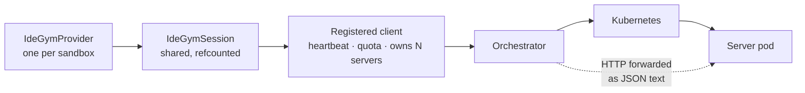

# IdeGYM Sandbox Provider — Design Decisions

## The shape of the integration

A NeMo Gym sandbox is one *server pod*, but nothing addresses that pod directly. Everything goes
through the orchestrator, and the orchestrator will only talk to a pod on behalf of a registered
*client*.

Two properties of that chain shape most of what follows.

The **client is the unit of ownership**: it holds the heartbeat, it carries the resource quota, and
it owns every server it started — so its lifetime, not any single sandbox's, decides when pods go
away. That is why the session is shared and counted rather than created per sandbox.

The **orchestrator relays rather than proxies**: a request is stored and replayed as JSON text, not
carried over a socket held open to the pod. That rules out streaming binary, raw TCP to a container
port, and anything resembling an interactive terminal — hence base64 file transfer and the
capabilities gaps at the end of this document.

## Choices with real alternatives

### How `SandboxSpec.image` is resolved

An IdeGYM sandbox is a pod running the **IdeGYM server**, and that server exposes the API the
orchestrator forwards commands to. A plain benchmark image does not boot one, so the image cannot
simply be a SWE-bench tag.

| Option | Decision |
| --- | --- |
| **Pass pre-built IdeGYM images through, and document `image_rewrites` for mapping benchmark images onto them** | **Chosen** |
| Build and push a wrapped image on demand, using IdeGYM's image builder | Deferred: needs a registry, cluster build permissions, and a build-cache story |
| Accept any image that serves the same health endpoint, without an IdeGYM server behind it | Not yet workable. The image change is the small part: a server counts as alive only while requests to it keep completing, so an idle sandbox would be reaped mid-run unless the deployment's inactivity timeout is raised to roughly an hour. It would also lose the bash tool the whole provider is built on |

`spec.image` is therefore normalized (`docker://` stripped) and checked against IdeGYM's OCI
reference pattern, and nothing more. The provider does not try to detect a wrong image: one without
an IdeGYM server never reports ready, so `start_server` fails instead of handing back a sandbox that
cannot run commands.

### What `close()` does

IdeGYM distinguishes `stop_server` (delete the pod and its Kubernetes resources) from `finish_server`
(mark the server free, keep the pod warm for reuse).

| Option | Decision |
| --- | --- |
| `stop_server` only | **Chosen** |
| `stop` by default, with `finish` + reuse behind a config knob | Not implemented in this milestone |
| `finish` by default | Not chosen: keeps pods warm, but leaks them whenever a run dies |

So `close()` always deletes. Reuse stays reachable — pin `provider_options.server_name` and set
`reuse_strategy` to opt into IdeGYM's own matching — but the provider manages no warm pool, and
`operations` has no `close_action` knob to get wrong. Pod startup cost is paid per task; if that
becomes the bottleneck on long benchmarks, a `finish`-based warm pool is the follow-up.

### Where the SDK dependency lives

| Option | Decision |
| --- | --- |
| Opt-in extra `nemo-gym[idegym]`, imported lazily, with an actionable `ModuleNotFoundError` | **Chosen** |
| Core dependency alongside `opensandbox` / `daytona` / `boto3` | Not chosen: IdeGYM is a third-party control plane, and its SDK should not sit in installs that will never talk to one |

This follows the `nemo-gym[openshell]` precedent. CI installs the extra alongside the other sandbox
extras so the SDK-gated tests run rather than skip.

One consequence worth knowing: `uv.lock` resolves all extras together, so adding this one raises two
locked versions for every install, not just for IdeGYM users — `hydra-core` 1.3.2 → 1.3.5 (required
by `idegym-common-utils`) and `pyyaml` 6.0.2 → 6.0.3 pulled in behind it. Both are patch bumps inside
the range `pyproject.toml` already allows. Declaring the extra conflicting in `[tool.uv]` would keep
the resolution untouched, at the cost of a second resolution to maintain.

## Implementation decisions

### One registered client per process, not per sandbox

A *client* is a registered, heartbeating entity that owns N server pods, carries the resource quota
(matched by regex against its **name**), and terminates all of its servers when it stops.

Registering one per sandbox looked simpler but does not survive a benchmark fan-out: registrations
are serialized on the orchestrator, heartbeats multiply by the concurrency, and one job's pods scatter
across many owners in the dashboard. A session is therefore shared by every sandbox with an identical
`connection` config, and reference-counted across providers.

The refcount is correctness, not efficiency: unregistering a client **terminates all of its servers**,
so releasing early would kill live sandboxes belonging to other providers.

### The shared client runs on a private event loop

The SDK client owns an httpx session and a heartbeat task, so it belongs to the loop that created it.
NeMo Gym drives sandboxes from two directions: `AsyncSandbox` on the caller's loop, and the sync
`Sandbox` facade — which gives *every sandbox its own* loop in its own thread, and is what
`mini_swe_agent_2` uses. Binding the shared client to whichever loop created it first would tie one
registration's lifetime to one sandbox's.

For the same reason the provider's own session guard is a `threading.Lock`, never an `asyncio.Lock`:
one provider can be reached from two loops, and an `asyncio.Lock` cannot span them without
deadlocking. Nothing is awaited while it is held, so a racing acquirer simply returns its spare
reference.

Alternative considered: key sessions on `(connection, running loop)`. Simpler, and correct for the
async case, but it degenerates to one registration per sandbox under the sync facade — exactly the
case that motivated sharing.

### Tracing is off unless configured

`IdeGYMClient` ships a default OTLP endpoint, so constructing it with no `otel_config` sends traces
off-box to a third party. The session always passes an explicit `OTELConfig`, and
`connection.tracing_endpoint` is `null` by default. Opting in is a config change.

### The SDK's httpx transport is replaced

`AGENTS.md` requires async HTTP to go through aiohttp — httpx's connection pool is O(n²) at high
concurrency — and says to swap the transport when wrapping a library that uses httpx internally. The
IdeGYM client builds its own `httpx.AsyncClient` and exposes no hook, so the swap reaches into
`client._http_client._transport`. That private access is isolated in one function, degrades to a
warning plus the SDK's own transport if the shape changes, and is guarded by a test.

### Files move as base64 over the bash tool

IdeGYM's server has a filesystem API, but not one reachable here: its read endpoint streams raw bytes
while the orchestrator forwards requests by storing and replaying them as JSON *text*, so binary
content does not survive; and its typed file endpoints only write UTF-8. base64 over the bash tool is
binary-safe both ways and needs nothing but coreutils.

Both directions are chunked, for different reasons, and the numbers are not arbitrary:

- **Uploads** embed the payload in the script, which the executor passes as a single `execve()`
  argument. Linux caps that at `MAX_ARG_STRLEN` (128 KiB) and fails with `E2BIG`, so a raw chunk must
  stay under ~96 KiB once base64 inflates it by 4/3. The default is 48 KiB, and the config rejects
  anything that could not fit.
- **Downloads** come back as a command's stdout, which the orchestrator persists as the text result of
  an async operation, so a whole-file read would put an inflated copy of the file through its database.

The download chunk script deliberately does *not* set `pipefail`: `head -c` closes the pipe as soon as
it has its bytes, so `tail` normally dies of SIGPIPE and would make a perfectly good chunk look like a
failure. The decoded-length check is the real guard.

### Command context is expressed in the script

IdeGYM's bash tool takes a command, a timeout and a graceful-termination timeout — no working
directory, environment or user. So `cwd` becomes `cd -- ... || exit 1`, `env` becomes `export`, and
the whole thing is wrapped in one `{ ... }` group because the executor runs
`source <bash-integration> && <script>` and `&&` binds only to the first statement.

`user` has no equivalent at all. Rather than dropping it silently, `exec.user_mode` makes the behavior
explicit: `ignore` (default) warns once per provider, while `runuser` and `su` wrap the script for
images that ship those tools — both pinning `/bin/bash` rather than inheriting a login shell that may
be `/sbin/nologin`. `create.run_as_root` defaults to `true` in the shipped config, which makes
`exec(user="root")` — what `mini_swe_agent_2` passes — a no-op rather than a lie.

### `create()` checks only the workdir

IdeGYM does not report a server until `wait_for_pods_ready` sees its pod `Running` with every
container ready, and that readiness probe is an HTTP GET against the IdeGYM server's own health
endpoint on the port the bash tool is served from. A provider-side readiness probe would only re-ask
the question, so `create()` adds the one check the orchestrator cannot make: that `spec.workdir`
exists, because otherwise every later command fails on `cd` and reads like a broken agent rather than
a mis-set path.

### Capabilities stands in for a status endpoint

IdeGYM has no per-server status endpoint. `list_capabilities` is the cheapest call that validates the
server's database record *and* reaches the pod, which is exactly the liveness question `status()`
asks. Its answers map cleanly: 404 (unknown client/server) and 410 (terminal state) mean gone;
anything else that fails leaves the status `unknown`.

### HTTP status is recovered by parsing exception text

The SDK collapses every HTTP failure into a plain `RuntimeError` whose message embeds the status and
body. Telling "the sandbox is gone" from "the control plane is busy" from "the command timed out"
needs that status, so the parsing lives in `errors.py` — one module, both message shapes, covered by
tests — rather than spread across the provider. If the SDK ever raises typed errors, that is the only
place to change.

### Transport failures are classified by httpx's hierarchy, not Python's

The SDK lets httpx's exceptions through unwrapped, and none of them are builtins: `httpx.ConnectError`
is *not* a `ConnectionError` and `httpx.ReadTimeout` is *not* a `TimeoutError`. Classifying on the
builtins alone would leave the most common transient failure — the orchestrator being briefly
unreachable — unretried, so `is_retryable` checks `httpx.TransportError` explicitly. `ConnectTimeout`
is excluded from the *command*-timeout check: failing to reach the orchestrator is a connectivity
problem, not a slow command.

### `ready_timeout_s` is a deadline for the whole create, not per attempt

`_start_server` tracks a deadline across retries and hands each attempt only the remaining budget,
because the config documents `ready_timeout_s` as bounding the whole call. Per-attempt budgets would
let a *late* retryable failure — a 503 after 1100s of a 1200s wait — start a fresh full-length
attempt, up to 80 minutes on the shipped default. A bare `TimeoutError` is additionally never retried:
the SDK raises it only after spending the budget it was given.

### Concurrency is bounded by the HTTP pool, not by serializing operations

The obvious way to bound load is a semaphore around each session operation, and it is the wrong one
here. A create polls for as long as the readiness timeout, so holding a slot for the whole operation
would let provisioning block the exec calls of sandboxes already running, and queue teardown behind
provisioning. What actually needs bounding is in-flight *requests*, which is what
`connection.max_connections` does — both transports honor it, and the aiohttp bridge maps it onto the
connector's `limit`.

### Failure paths get the same fidelity as success paths

Three places where the SDK's or the shell's failure behavior is not the obvious one, each covered by a
test:

- `stop_server` reports a failed delete by *returning* an `ErrorResponse` rather than raising, so the
  return value is checked; an unchecked one records a live pod as stopped.
- A server leaves the session's bookkeeping only once it is really stopped. Dropping it on failure
  would make the caller's own retry look like "already stopped" and leave the pod running.
- The generated script opens with `:` so the brace group is never empty: a blank or comment-only
  command would otherwise fail with a bash syntax error attributed to the caller.

An `exec` failure the classifier does not recognize is logged with its traceback before being turned
into a return value, because that return value is the only other place it would ever appear.

### Failures are classified on structure, not on substring

An orchestrator error relays the sandbox's own output in its `body`, so both the status and the
timeout patterns are anchored to the surrounding message. Searching the whole string would let tool
output like `curl failed: status=404` mark a healthy sandbox as gone, or `pytest ... timed out after
30s` read as a command timeout.

### Server names are not made unique

The provider sends `<prefix>-<metadata hints>` and stops there. IdeGYM appends its own autoincrement
id to derive `generated_name`, and that is the name Kubernetes sees and the only one the database
keeps unique (`server_name` is an unconstrained column). A random suffix on top would buy no
uniqueness, cost 9 of the 63 name characters that instance ids need, and make pod names harder to read.

It would also mislead: a suffix looks like it prevents unintended reuse, but reuse is skipped entirely
unless `reuse_strategy` is `RESTART`/`RESET`, and even then only servers left `FINISHED` qualify —
while this provider always *stops* the ones it creates, which marks them `STOPPED`.

The same reasoning applies to retries, which keep the name rather than re-rolling it: an attempt whose
response was lost may have landed anyway, but that orphan gets its own `generated_name` and is reaped
by the watcher once the client stops heartbeating. Renaming would only break the name matching that a
pinned `provider_options.server_name` exists to drive.

### Metadata cannot become labels

On OpenSandbox, `SandboxSpec.metadata` becomes queryable Kubernetes labels. IdeGYM has no per-server
label API — `pod_overrides` is a partial `V1PodSpec`, not object metadata — so metadata is used for
naming instead: `create.server_name_metadata_keys` folds selected keys (default `instance_id`) into
the pod name, and job attribution names the registered client, which is what the dashboard groups by
and what quota rules match. The run id is deliberately excluded from the client name: it changes per
launch, and a name that changes per launch defeats both quota matching and dashboard grouping.

## Capabilities deliberately not claimed

| Capability | Why not |
| --- | --- |
| `SupportsSandboxEndpoint` (`endpoint()`) | The orchestrator forwards API requests through an async-operation indirection; it does not route raw TCP to arbitrary container ports, so there is no honest URL to hand back. |
| `SupportsSandboxPty` | IdeGYM has no terminal API. |
| `ConnectableProvider` (`serialize()` / `connect()`) | A server is reachable only through the registered client that owns it. Attaching from another process would mean a client with no registration and no heartbeat, and tearing one down cleanly is not expressible through the SDK's public surface without also stopping the client — which would kill the original process's sandboxes. Sharing a sandbox across processes is possible by fronting this provider with a sandbox server. |
