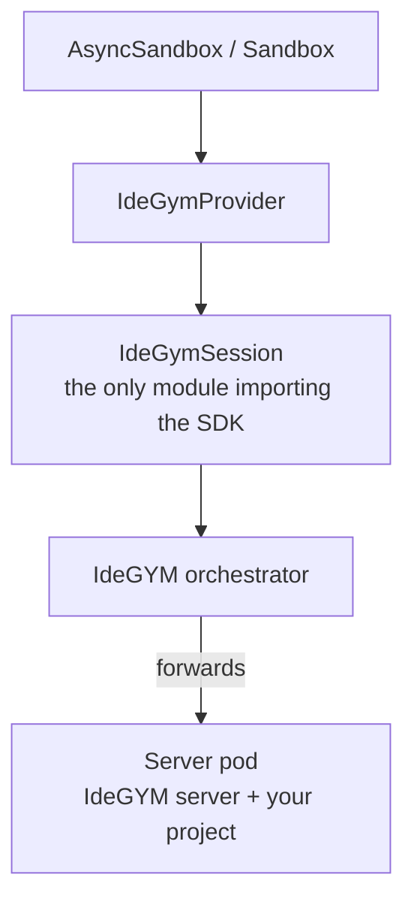
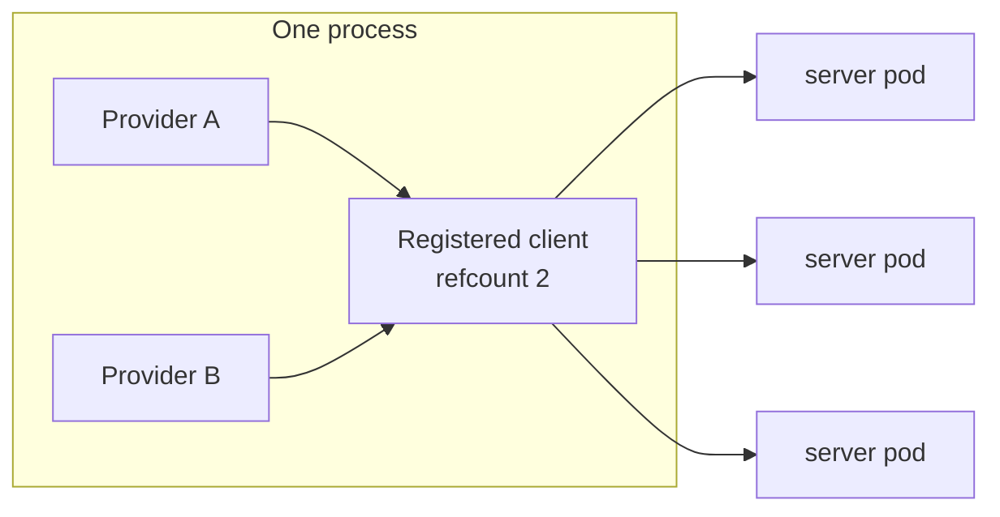

# IdeGYM Sandbox Provider

Runs each NeMo Gym sandbox as an [IdeGYM](https://github.com/JetBrains-Research/idegym) *server*: a
Kubernetes pod provisioned through the IdeGYM orchestrator and driven over the HTTP API the
orchestrator forwards to it. Use it when your environments already live in IdeGYM — SWE-bench-style
repository tasks, IDE-backed environments, anything else IdeGYM images provide.

It implements the provider-neutral `SandboxProvider` contract, so any sandbox-backed agent (for
example `mini_swe_agent_2`) can use it by pointing at this provider's config.

## Requirements

- A reachable IdeGYM orchestrator, and Basic auth credentials for it.
- The client SDK: `uv pip install 'nemo-gym[idegym]'`.
- **An IdeGYM server image.** The easy one to miss: the pod runs the IdeGYM server, and that server
  is what exposes the API the orchestrator forwards commands to. A plain benchmark image such as
  `swebench/sweb.eval.x86_64.*` does not boot one and never passes readiness. See [Images](#images).
- `base64`, `wc`, `tail` and `head` in the image. File transfer uses them; coreutils covers it.

## Quick start

```bash
export IDEGYM_ORCHESTRATOR_URL=idegym.example.com
export IDEGYM_NAMESPACE=idegym
export IDEGYM_AUTH_USERNAME=...
export IDEGYM_AUTH_PASSWORD=...

AGENT=responses_api_agents/mini_swe_agent_2/configs/mini_swe_agent_2.yaml
MODEL=responses_api_models/vllm_model/configs/vllm_model.yaml
gym env start \
    --config $AGENT \
    --config nemo_gym/sandbox/providers/idegym/configs/idegym.yaml \
    --config $MODEL
```

Every shipped provider config binds the same instance name `sandbox`, so moving a benchmark from
Docker or OpenSandbox to IdeGYM is swapping that one config path. No agent edit.

Directly from Python:

```python
import asyncio

from nemo_gym.sandbox import AsyncSandbox, SandboxSpec

provider_config = {
    "idegym": {
        "connection": {"orchestrator_url": "idegym.example.com", "namespace": "idegym"},
        "create": {"run_as_root": True},
    }
}

spec = SandboxSpec(
    image="registry.example.com/idegym/my-env:latest",
    workdir="/testbed",
    resources={"cpu": 2, "memory_mib": 8192, "disk_gib": 30},
    provider_options={"resource_requests": {"cpu": 0.5, "memory_mib": 2048}},
    metadata={"instance_id": "django__django-11099"},
)


async def main() -> None:
    async with AsyncSandbox(provider_config, spec) as sandbox:
        await sandbox.start()
        result = await sandbox.exec("python -m pytest -q", timeout_s=600)
        print(result.stdout or result.stderr)


asyncio.run(main())
# leaving the `async with` block stops the server and deletes its Kubernetes resources
```

Leave `connection.username` and `connection.password` unset and the SDK reads
`IDEGYM_AUTH_USERNAME` / `IDEGYM_AUTH_PASSWORD`. That is the normal way to pass them.

## Selecting and configuring the provider

`configs/idegym.yaml` is the shipped block, with every knob commented — it is the reference for
individual settings. The constructor takes one section per concern:

| Section | Purpose |
| --- | --- |
| `connection` | Orchestrator URL, namespace, auth, client name, HTTP pooling, tracing. |
| `create` | Readiness budget, retries, generated server names, pod defaults, polling backoff. |
| `exec` | Default command timeout, client-side overhead, how `exec(user=...)` is honored. |
| `verify` | The post-start working-directory check. |
| `files` | Upload and download chunk sizes, and the download size cap. |
| `operations` | Status and teardown timeouts and retries. |
| `attribution` | How the registered client name is derived when it is not pinned. |

`SandboxSpec.provider_options` carries the per-sandbox Kubernetes options that have no neutral
equivalent — `runtime_class_name`, `node_selector`, `volumes`, `env_from`, `pod_overrides` and the
rest — validated before a pod is allocated. The
[provider docs](https://docs.nvidia.com/nemo/gym/latest/infrastructure/sandbox/idegym) list them all.

### Spec fields that behave differently here

| Field | Behavior |
| --- | --- |
| `image` | Must run the IdeGYM server. `docker://` is stripped; the rest must be a valid lowercase OCI reference. |
| `workdir` | Not a pod setting — each command `cd`s into it, and create fails early if it is missing (`verify.check_workdir`). |
| `env` | Exported per command. IdeGYM can only put ConfigMap/Secret env on the pod, via `provider_options.env_from`. |
| `resources` | Kubernetes **limits**; `provider_options.resource_requests` supplies the requests. Quota accounting reads the limits, so `spec.resources` is what counts against your rule. |
| `metadata` | Not labels — IdeGYM has no per-server label API. `create.server_name_metadata_keys` folds selected keys into the pod name; the rest is diagnostics. |
| `ttl_s`, `ports`, `resources.gpu` | Unsupported; each warns once. `entrypoint` is rejected outright, since the entrypoint starts the IdeGYM server. |

## How it works



`IdeGymProvider` is the composition point; the pieces around it each turn one neutral concept into
IdeGYM's shape:

| Module | Turns |
| --- | --- |
| `spec.py` | a `SandboxSpec` into a start-server request |
| `naming.py` | a prefix, metadata and attribution into RFC-1035 server and client names |
| `shell.py` | `cwd` / `env` / `user` into one bash script |
| `transfer.py` | files into base64 over the bash tool |
| `errors.py` | an SDK exception into "gone" / "busy" / "timed out" |

**One registered client per process.** IdeGYM's unit of ownership is a *client*: a heartbeating
entity that owns N server pods, carries the resource quota keyed on its name, and terminates all of
its servers when it stops. Every sandbox with an identical `connection` config shares one, reference
counted across providers — the last release unregisters it, cleaning up anything never closed.



**That client runs on a private event loop** in a daemon thread. The SDK client is loop-bound — an
httpx session plus a heartbeat task — while NeMo Gym drives sandboxes both from the caller's loop
(`AsyncSandbox`) and from one loop per sandbox (the sync `Sandbox` facade). A private loop lets one
registration serve every sandbox whichever loop asks.

**Commands are shaped into a script.** IdeGYM's bash tool takes a command and nothing else — each
call is a fresh `bash -c` in the server's project directory with a cleaned environment — so `cwd`,
`env` and `user` are expressed inside the generated script. That script is emitted as one `{ ... }`
group, because IdeGYM runs `source <bash-integration> && <script>` and `&&` binds only to the first
statement.

**Create trusts IdeGYM's readiness wait.** The orchestrator reports a server only once its pod
passes the Kubernetes readiness probe against the server's health endpoint, so `create()` adds one
check of its own: that `spec.workdir` exists. Anything that fails after provisioning stops the server.

**Files ride base64 over bash.** IdeGYM's filesystem API is not reachable through the orchestrator:
its read endpoint streams raw bytes while the orchestrator forwards requests as JSON text, and its
typed file endpoints only write UTF-8. Uploads are chunked to stay under the shell's argument limit;
downloads because each chunk's stdout is persisted as an async-operation result.

**Status** uses the capabilities call, the cheapest one that validates the server's database record
*and* reaches the pod. A 404 or 410 means gone; any other failure leaves the status `unknown` rather
than guessing.

## Images

`spec.image` must run the IdeGYM server. Build those with IdeGYM's own image builder, publish them
where your cluster can pull them, then map upstream benchmark tags onto them with `image_rewrites`:

```yaml
mini_swe_agent_2:
  responses_api_agents:
    mini_swe_agent_2:
      sandbox_provider: sandbox
      sandbox_spec:
        image_rewrites:
          - from: "swebench/"
            to: "registry.example.com/idegym-swebench/"
```

Rewrites are ordered and the first matching prefix wins. The provider does not build images.

## Limitations

- **No `endpoint()`.** The orchestrator forwards API requests rather than routing raw TCP to
  arbitrary container ports, so a long-lived service inside the sandbox cannot be reached this way.
- **No PTY sessions.** IdeGYM has no terminal API, so `sandbox.pty` is unavailable.
- **No `serialize()` / `connect()`.** A server is reachable only through the registered client that
  owns it; sharing one across processes needs a sandbox server in front of this provider.
- **No user switching by default.** IdeGYM's bash tool has no user field, so commands run as the
  container's user, which `provider_options.run_as_root` sets at pod level. `exec.user_mode` can wrap
  commands in `runuser` or `su` for images that ship them.
- **Command and output sizes.** A command may not exceed ~100 KiB once shaped into a script, and the
  executor strips leading and trailing whitespace from stdout and stderr.
- **`ttl_s` is not enforced**, so a crashed process leaks pods until its client stops heartbeating
  and the watcher reaps them.

## Development

```bash
uv pip install 'nemo-gym[idegym]'
pytest tests/unit_tests/test_idegym_provider.py tests/unit_tests/test_idegym_session.py
```

The tests need no orchestrator. They run against a fake session, and the file-transfer and
command-shaping tests execute the generated scripts with local `bash`. The tests that bind against
real SDK signatures skip when `idegym-client` is not installed.

See [DESIGN-DECISIONS.md](DESIGN-DECISIONS.md) for the choices behind this layout and the
alternatives rejected along the way.
