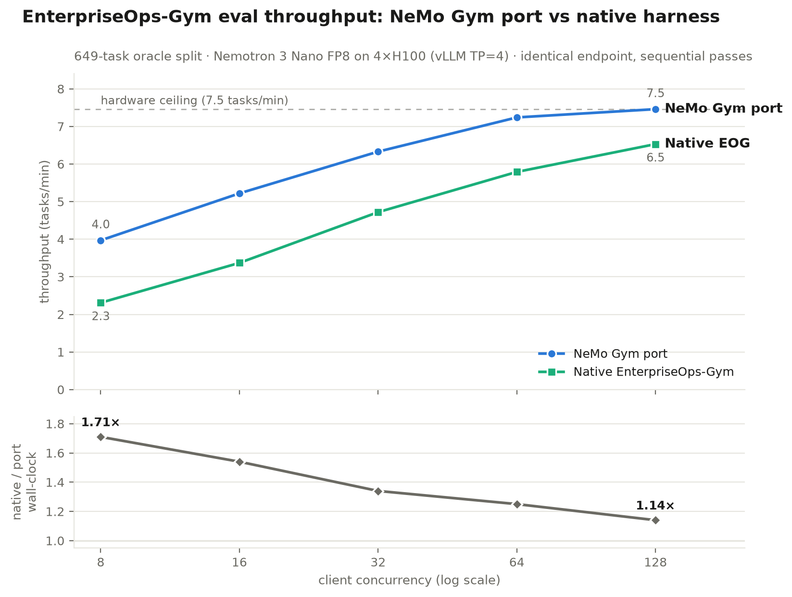

# Performance: NeMo Gym Port vs Native EnterpriseOps-Gym at Scale

Companion to [PARITY.md](PARITY.md) (score equivalence). This document reports the
high-concurrency throughput comparison on dedicated GPU serving.

## Setup

- **Box**: 4× H100-80GB (TP=4), 124 vCPU, 720 GB RAM (Brev/Hyperstack)
- **Model**: `nvidia/NVIDIA-Nemotron-3-Nano-30B-A3B-FP8` on vLLM (`--max-model-len 131072`,
  reasoning enabled; ~13k output tokens/task), served locally — both harnesses hit the
  identical `/v1/chat/completions` endpoint (port via the `vllm_model` server), removing
  the API-serving-path confound identified in the parity work
- **Workload**: full oracle public split (649 tasks, 8 domains incl. hybrid), temperature 0,
  max 16384 output tokens, identical task order
- **Protocol**: sequential passes; full MCP-container-fleet + vLLM restart before every
  pass (fd-leak reset, no prefix-cache carryover); one pass per (harness, concurrency)
- **Agents**: port = `simple_agent`; native = ReAct orchestrator (its equivalent loop)

## Results

| c | Port wall | Native wall | Native/Port | Port tasks/min | Native tasks/min |
|---:|---:|---:|---:|---:|---:|
| 8 | 2h 44m | 4h 40m | **1.71×** | 3.97 | 2.31 |
| 16 | 2h 04m | 3h 12m | **1.54×** | 5.22 | 3.37 |
| 32 | 1h 42m | 2h 17m | **1.34×** | 6.33 | 4.72 |
| 64 | 1h 30m | 1h 52m | **1.25×** | 7.24 | 5.79 |
| 128 | 1h 27m | 1h 39m | **1.14×** | 7.46 | 6.53 |

All 10 passes completed: port 649/649 tasks at every level with zero retries; native 647
at every level (2 tasks/pass silently dropped by its runner — known upstream bug).
Success rates were 22–25% for both harnesses at every level (within single-run noise of
each other per the k=5 calibration in PARITY.md): the throughput gap costs no accuracy.

## Interpretation

1. **At matched concurrency the port is 1.14–1.71× faster**, with the largest gap at the
   low concurrency levels closest to the native harness's documented defaults (4–5).
2. **Concurrency-equivalence: native needs roughly 4× the client concurrency** to match
   the port — native's best (c=128) lands between the port's c=32 and c=64 results.
3. **Hardware efficiency: the port saturates the box at c=64** (within 3% of the c=128
   throughput floor); **native never reaches the floor** in the tested range (still +14%
   at c=128). On this hardware the native harness cannot extract full machine throughput.
4. **Cost framing**: one full-split eval = 1h 27m (port, c≥64) vs 4h 40m (native, c=8) of
   4×H100 time — a 3.2× GPU-hour difference at deployed-as-documented settings.

## Mechanism

GPU utilization read 97–99% with ~75 GB KV in use for *every* pass, while client CPU
peaked at 18 of 124 cores — yet wall-clocks differ by up to 71% on identical silicon.
`nvidia-smi` utilization measures kernel-busy time, not batch occupancy: the native
harness's per-request connection setup, per-task MCP handshake + tool re-discovery, and
sequential verifier execution insert dead time between agent turns, shrinking vLLM's
continuous batch. The port's pooled connections, persistent MCP sessions, and concurrent
verifiers keep the queue fed. (Queue-depth sampling was not captured in this run; the
mechanism is inferred from the GPU-busy + wall-gap + CPU-idle triad.)

The trend direction is the signature: as client concurrency rises, both harnesses
asymptote toward the same GPU-bound floor and the ratio narrows (1.71× → 1.14×) —
client-side overhead is amortized by parallelism but never fully hidden.

## Caveats

- One pass per (harness, level); per the k=5 variance study, single-run success rates
  carry ±1.5–3pp noise — but the wall-clock ratio is monotone across all five levels,
  which no plausible noise process produces.
- The c=16 level ran ~1 day after the others (session loss; each level is self-contained
  behind fleet+vLLM restarts) and lands exactly on the trend curve.
- Native's 2 dropped tasks/pass mean it performed ~0.3% less work — negligible, and in
  native's favor.

Raw artifacts: `timings.csv`, per-pass rollout JSONLs / result dirs, GPU/CPU sampler CSVs
(retained offline; see the benchmark kit's `analyze_results.py`).
