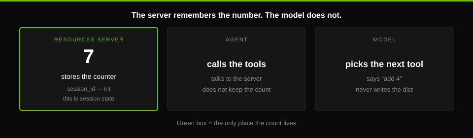
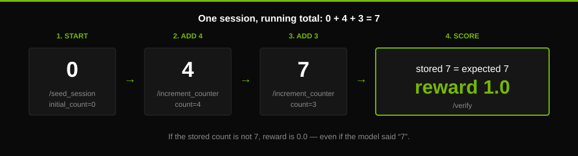
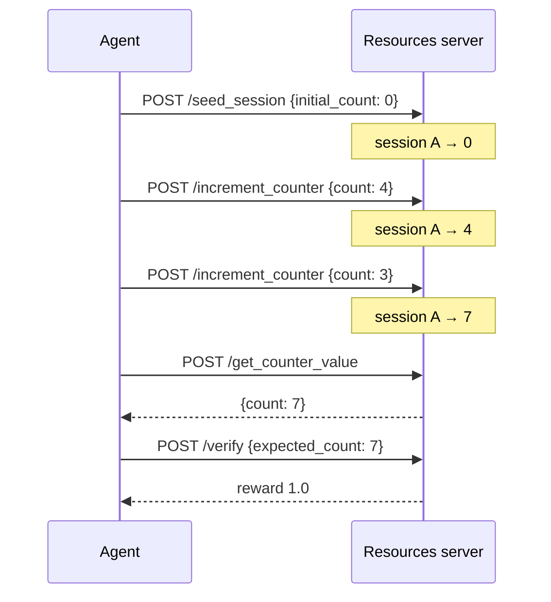
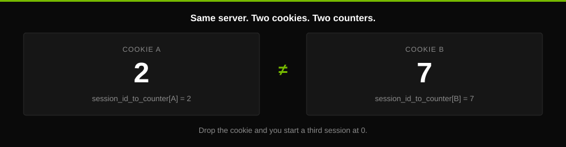
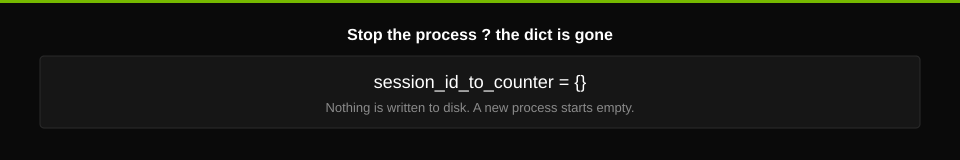

# example_session_state_mgmt

<p align="center">
  
</p>

<p align="center">
  <strong>In-memory session state</strong> for a NeMo Gym resources server<br/>
  <sub>session id → counter · Apache 2.0 · <a href="https://docs.nvidia.com/nemo/gym/main/environment-tutorials/stateful-environment">tutorial</a></sub>
</p>

A tiny environment with a counter. The **server** remembers the number. The
**model** does not. Each episode gets a session id (an HTTP cookie). That id
maps to one integer. Tools add to it; `/verify` checks it.

Think of it like a gym locker: the cookie is your tag, the counter is what
you stored. Someone else’s tag cannot open your locker.

```text
cookie  →  request.session[SESSION_ID_KEY]  →  session_id_to_counter[session_id]  →  int
```

## Contents

- [What it demonstrates](#what-it-demonstrates)
- [Demos](#demos)
- [How it works](#how-it-works)
- [When to use this pattern](#when-to-use-this-pattern)
- [Code walkthrough](#code-walkthrough)
- [How to run it](#how-to-run-it)
- [How to test it](#how-to-test-it)
- [Further reading](#further-reading)

## What it demonstrates

Session state basics: the environment keeps memory **between tool calls** in
one episode.

| Idea | In this example |
|---|---|
| Several tools, one user message | `increment_counter`, then `get_counter_value` |
| Memory per episode | `session_id_to_counter: dict[str, int]` |
| Episodes do not mix | Different cookies → different counters |
| Scoring uses that memory | `reward = 1.0` if the stored count equals `expected_count` |

Without that dict, “add 4” would not change what “get the count” returns.

Earlier examples (tools, no session store):
[single-step](https://docs.nvidia.com/nemo/gym/main/environment-tutorials/single-step-environment),
[multi-step](https://docs.nvidia.com/nemo/gym/main/environment-tutorials/multi-step-environment).

## Demos

This counter is the toy. Same session idea, bigger rooms in this repo:

| Demo | What the session holds |
|------|------------------------|
| [Workplace Assistant](../workplace_assistant/README.md) | Five office DBs (email, calendar, CRM, …). Used to GRPO-train [Nemotron Nano 9B v2](https://docs.nvidia.com/nemo/gym/tutorials/training-tutorials/nemo-rl-grpo/about-workplace-assistant). Dataset: [`nvidia/Nemotron-RL-agent-workplace_assistant`](https://huggingface.co/datasets/nvidia/Nemotron-RL-agent-workplace_assistant) |
| [ToolSandbox](../toolsandbox/README.md) | Contacts, messages, reminders, device settings. Port of [Apple ToolSandbox](https://github.com/apple/ToolSandbox) |
| [Calendar](../calendar/README.md) | The event list itself. Prompts from [`nvidia/Nemotron-Personas-USA`](https://huggingface.co/datasets/nvidia/Nemotron-Personas-USA) |
| [ns_tools](../ns_tools/README.md) | A live Python interpreter (NeMo Skills), kept for the whole rollout |
| [Harbor agent](../../responses_api_agents/harbor_agent/README.md) | A real terminal. Tasks from [`Nemotron-Terminal-Synthetic-Tasks`](https://huggingface.co/datasets/nvidia/Nemotron-Terminal-Synthetic-Tasks) |

Each rollout still gets its own locker. The payload is just no longer one integer.

## How it works

**Session ID → counter.** One dictionary, one integer per session.

Gym’s session middleware (`nemo_gym/server_utils.py`, installed by
`SimpleResourcesServer`) puts a UUID on the cookie. This folder does not
create ids. Every handler reads the same key:

```python
session_id = request.session[SESSION_ID_KEY]
```

Send the cookie again → same counter. Leave it off → new session, counter
starts fresh. That is how two rollouts on one server stay separate.

<p align="center">
  
</p>

`client.py` (start at 0, expect 7):

| Step | Request | Counter after |
|---|---|---|
| Start | `POST /seed_session` `{"initial_count": 0}` | `0` |
| Add | `POST /increment_counter` `{"count": 4}` | `4` |
| Add | `POST /increment_counter` `{"count": 3}` | `7` |
| Read | `POST /get_counter_value` | `{"count": 7}` |
| Score | `POST /verify` `{"expected_count": 7}` | `reward = 1.0` |

Example data can start at a non-zero value. First row of `data/example.jsonl`:
`initial_count = 3`, user says “add 1 then add 2”, `expected_count = 6`.



Reward uses the **stored** number. If the model says “7” but the counter is
5, reward is still `0.0`.

<p align="center">
  
</p>

Same server, two keys:

```text
session_id_to_counter = {"<id-A>": 2, "<id-B>": 7}
```

Cookie A always sees 2. Cookie B always sees 7. No cookie → a third session.
`tests/test_app.py` checks exactly that.

## When to use this pattern

**In-memory state:** a Python `dict` on this process. Simple and fast. Gone
when the server stops.

<p align="center">
  
</p>

| Use it | Don’t use it |
|---|---|
| Small state (a counter, a few flags) | Large or long-lived world state |
| One resources-server process | Several replicas that must share state |
| Tutorials, unit tests, local eval | Restarts must not lose the episode |

For shared or durable state, use a database or sandbox disk. Do not keep the
count only in the model’s text.

## Code walkthrough

| File | What it is |
|------|------|
| [`app.py`](app.py) | Server: tools, dict, seed, verify |
| [`task_data.py`](task_data.py) | Required row fields: `initial_count`, `expected_count` |
| [`configs/example_session_state_mgmt.yaml`](configs/example_session_state_mgmt.yaml) | Wires this server + `simple_agent` + datasets |
| [`data/example.jsonl`](data/example.jsonl) | Five example tasks |
| [`create_examples.py`](create_examples.py) | Writes `example.jsonl` |
| [`client.py`](client.py) | One live run (`expected_count`: 7) |
| [`tests/test_app.py`](tests/test_app.py) | Two sessions, no model |
| [`graphics/`](graphics/) | Diagrams + [`gym.html`](graphics/gym.html) |

In `app.py` (`StatefulCounterResourcesServer`):

1. **`setup_webserver`** — parent class adds `/seed_session`, `/verify`, and cookies. This class adds `/increment_counter` and `/get_counter_value`.
2. **Every handler** — `session_id = request.session[SESSION_ID_KEY]`.
3. **`seed_session`** — `setdefault(session_id, initial_count)`. A second seed on the same session does **not** overwrite.
4. **`increment_counter`** — start at `0` if missing, then add `body.count`.
5. **`get_counter_value`** — return the stored int (or `0`).
6. **`verify`** — `reward = 1.0` only if this session is in the dict **and** the int equals `expected_count`.

`gym eval run --agent` uses the name `example_session_state_mgmt_simple_agent`
from the YAML.

## How to run it

From the **Gym repo root**. Set `policy_base_url`, `policy_api_key`, and
`policy_model_name` in `env.yaml`
([quickstart](https://docs.nvidia.com/nemo/gym/main/get-started)).

This starts three servers: resources, agent, and model.

```bash
gym env start \
    --resources-server example_session_state_mgmt \
    --model-type openai_model
```

Second terminal — run the example tasks:

```bash
source .venv/bin/activate
gym eval run --no-serve \
    --agent example_session_state_mgmt_simple_agent \
    --input resources_servers/example_session_state_mgmt/data/example.jsonl \
    --output results/session_state_rollouts.jsonl
```

`--no-serve` means servers are already running. Check `reward` in the output
under `results/`.

Optional — rebuild example rows:

```bash
python resources_servers/example_session_state_mgmt/create_examples.py
```

## How to test it

No model needed.

```bash
pytest resources_servers/example_session_state_mgmt/tests/test_app.py
```

```bash
gym env test --resources-server example_session_state_mgmt
```

The test turns off automatic cookies, then:

1. Session A: get count `0`, add `2`, get count `2`. Save A’s cookie.
2. Session B (no cookie): add `4`, then `3`, get count `7`.
3. Use A’s cookie again: still `2`.

If step 3 returned `7`, sessions would be leaking. That is what the test
guards against.

## Further reading

- [Stateful Environment tutorial](https://docs.nvidia.com/nemo/gym/main/environment-tutorials/stateful-environment)
- [Getting started](https://docs.nvidia.com/nemo/gym/main/get-started)
- [`graphics/gym.html`](graphics/gym.html)

# Licensing information
Code: Apache 2.0
Data: Apache 2.0

Dependencies
- nemo_gym: Apache 2.0
