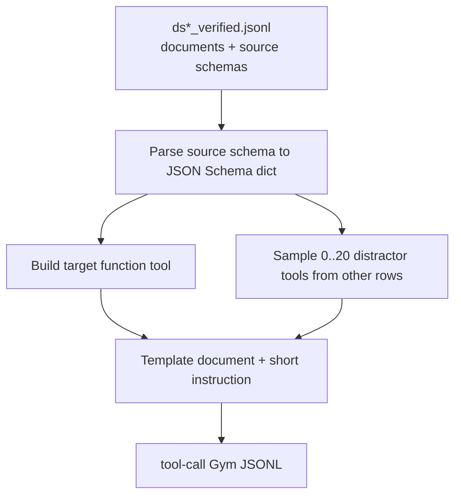

# Structured Outputs v4 Tool-Call SDG Pipeline

## Overview

This pipeline generates Gym-ready RL data for schema adherence through OpenAI
Responses API tool calls. Unlike v3, the prompt does not show the schema or ask
for JSON, YAML, XML, TOML, or CSV text. The model sees a document, a short task
instruction, and one or more function tools. The target structured output must
be returned as function-call arguments.

## Data Flow



## Input

The input is the same verified data shape used by v3. Each row should include:

| Field | Description |
|---|---|
| `document` | Source text to extract from |
| `structured_schema` | Source schema in JSON/YAML/TOML/XML/CSV-backed representation |
| `target_output_format` | Source schema representation format |
| `metadata.record_id` | Optional stable source id |

The existing `messages` and `target_output` fields may be present but are not
used for v4 prompt construction.

## Output

Each generated row has a Responses API tool definition and verifier metadata:

```json
{
  "responses_create_params": {
    "input": [{"role": "user", "content": "Extract the relevant structured information from the document.\n\nDocument:\n..."}],
    "tools": [
      {
        "type": "function",
        "name": "extract_record",
        "description": "Submit structured information extracted from the document.",
        "parameters": {"type": "object", "properties": {"field": {"type": "string"}}, "required": ["field"], "additionalProperties": false},
        "strict": true
      }
    ],
    "tool_choice": "required",
    "parallel_tool_calls": false
  },
  "schema_str": "{\"type\":\"object\",...}",
  "schema_type": "json",
  "response_mode": "tool_call",
  "problem_type": "direct_tool_call",
  "tool_name": "extract_record",
  "tool_schema_mode": "direct",
  "tool_payload_key": null,
  "tool_name_style": "semantic",
  "distractor_style": "none",
  "tool_union_mode": null,
  "num_tools": 1,
  "num_distractors": 0,
  "has_distractors": false,
  "instruction_layout": "user_instruction_before_document",
  "source_schema_type": "json",
  "source_record_id": "DS1-..."
}
```

## Prompt Templates

Prompts intentionally contain only document/task language. They do not include:

- schema strings
- schema representation names
- source target format names such as JSON, YAML, XML, TOML, or CSV
- examples of the expected output syntax

The instruction is randomly placed in layouts such as system prompt, before the
document, after the document, split system/user, or compact single-user message.

## Tool Argument Shapes

The target schema is converted to an OpenAI function `parameters` schema. The
default argument-shape mix is:

| Mode | Probability | Shape |
|---|---:|---|
| `direct` | 40% | Use the object schema directly as function parameters |
| `extraction_wrapper` | 25% | Wrap under required key `extraction` |
| `random_wrapper` | 35% | Wrap under a sampled key such as `output`, `result`, `record`, `data`, `answer`, or `summary` |

If the validation schema is not object-shaped, wrapper mode is forced because
OpenAI function parameters must be object-shaped.

## Tool Names

Tool names are varied. The default semantic pool keeps the original names:

- `submit_structured_output`
- `extract_record`
- `record_answer`
- `summarize_document`
- `populate_schema`

It also adds shorter and domain-generic names such as `extraction`, `extract`,
`summary`, `structured_output`, `document_summary`, and
`extract_structured_data`.

Some rows use numbered tool names instead, for example `extraction_tool_1`,
`extraction_tool_2`, or `structured_output_tool_3`. This is controlled by
`--tool-name-style-weights`.

## Distractor Tools

Rows can include distractor schemas sampled from other source rows. The target
is tracked by `tool_name` and, when needed, `tool_payload_key`.

The default distractor-count distribution is:

- 30%: no distractors
- 70%: sample 1..20 distractors from a truncated geometric distribution

This gives a decreasing tail: small numbers of distractors are common, while
large 15..20 distractor cases are rare but present.

For rows with at least one distractor, the default style weights are balanced
across the six distractor renderings below.

Distractors are rendered in several styles:

| Style | Behavior |
|---|---|
| `none` | No distractors; emit only the target function tool |
| `separate_tools` | Target and distractors are separate function tools with semantic names |
| `numbered_tools` | Target and distractors are separate function tools named like `extraction_tool_1` |
| `single_tool_oneof` | One function tool whose parameters use inline `oneOf` branches |
| `single_tool_anyof` | One function tool whose parameters use inline `anyOf` branches |
| `single_tool_defs_oneof` | One function tool whose parameters use `$defs` plus `oneOf` |
| `single_tool_defs_anyof` | One function tool whose parameters use `$defs` plus `anyOf` |

For single-tool union styles, each branch uses a different payload key such as
`extraction`, `summary`, `structured_output`, `record`, or `document_info`.
The verifier only accepts the target branch key. Union styles are used only when
there is at least one real distractor branch; no-distractor rows use a plain
single target tool.

## CLI Examples

```bash
# Small smoke run
python resources_servers/structured_outputs/misc/data_generation/structured_outputs_v4/260424_tool_call_sdg.py \
    -i /path/to/ds1_verified.jsonl \
    -o /tmp/structured_outputs_v4_smoke.jsonl \
    --max-total 20

# Generate one sample for every loaded source row
python resources_servers/structured_outputs/misc/data_generation/structured_outputs_v4/260424_tool_call_sdg.py \
    -i /path/to/ds1_verified.jsonl \
    -o resources_servers/structured_outputs/data/ds1_tool_call_train.jsonl

# Generate multiple variants per source row
python resources_servers/structured_outputs/misc/data_generation/structured_outputs_v4/260424_tool_call_sdg.py \
    -i /path/to/ds1_verified.jsonl \
    -o resources_servers/structured_outputs/data/ds1_tool_call_train_large.jsonl \
    --samples-per-record 3

# Heavier distractor setting
python resources_servers/structured_outputs/misc/data_generation/structured_outputs_v4/260424_tool_call_sdg.py \
    -i /path/to/ds1_verified.jsonl \
    -o resources_servers/structured_outputs/data/ds1_tool_call_hard.jsonl \
    --no-distractor-ratio 0.15 \
    --distractor-geometric-p 0.15 \
    --max-distractors 20

# Force union-style distractors only
python resources_servers/structured_outputs/misc/data_generation/structured_outputs_v4/260424_tool_call_sdg.py \
    -i /path/to/ds1_verified.jsonl \
    -o /tmp/union_tools.jsonl \
    --distractor-style-weights "single_tool_oneof:0.5,single_tool_defs_anyof:0.5"

# Force numbered tool names
python resources_servers/structured_outputs/misc/data_generation/structured_outputs_v4/260424_tool_call_sdg.py \
    -i /path/to/ds1_verified.jsonl \
    -o /tmp/numbered_tools.jsonl \
    --tool-name-style-weights "numbered:1"

# Change argument-shape mix
python resources_servers/structured_outputs/misc/data_generation/structured_outputs_v4/260424_tool_call_sdg.py \
    -i /path/to/ds1_verified.jsonl \
    -o /tmp/tool_modes.jsonl \
    --tool-schema-mode-weights "direct:0.25,extraction_wrapper:0.25,random_wrapper:0.50"
```

## Verifier Behavior

`resources_servers/structured_outputs/app.py` supports both text and tool-call
responses. For v4 rows, `response_mode` is `tool_call`, so verification:

1. finds a `function_call` whose `name` matches `tool_name`
2. JSON-decodes the function-call `arguments`
3. unwraps `tool_payload_key` when the row uses a wrapper mode
4. validates the resulting object against `schema_str`

Failure types include `missing_tool_call`, `wrong_tool_name`,
`tool_arguments_parse_error`, `missing_tool_payload_key`, `schema_error`, and
`validation_error`.

## Metrics

The resource server keeps the existing v3 breakdowns and adds v4-specific
reward means by:

- `response_mode`
- `tool_schema_mode`
- `source_schema_type`
- `num_tools`
- `has_distractors`
- `instruction_layout`
- `tool_name_style`
- `distractor_style`
- `tool_union_mode`

## Scope Difference from v3

v4 is intentionally direct-generation-only. Translation, error correction,
schema-only generation, and multistep categories depend on showing or editing
schema/text outputs in the prompt, which is not the point of this tool-call
setting. This pipeline focuses on whether the model can choose the right tool
and produce arguments that conform to that tool schema.
