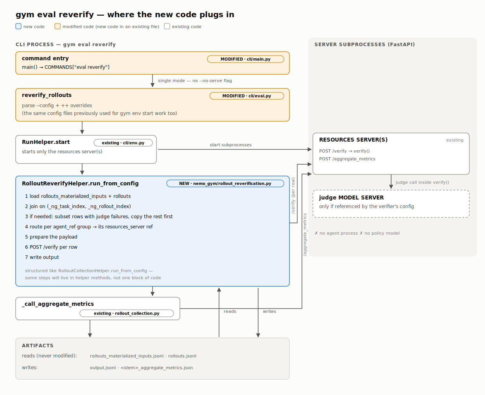

epic: recompute rewards from existing rollouts — `gym eval reverify` (#987)

Author: Martyna Patelka
GitHub: https://github.com/NVIDIA-NeMo/Gym/issues/987
Linear: —

# Version history

Jul 7, 2026 - Initial draft for review.
Jul 7, 2026 - Peer-comparison pass against [05-how-peers-address-pp02-pp04.md](05-how-peers-address-pp02-pp04.md):
adopted previous-reward stamping, replay resume, and an e2e CI test; added extensions and the
assessment section at the bottom.
Jul 7, 2026 - Promoted "Alternatives considered" from an appendix note to a full section (four
alternatives with rejection rationale; the agent-side skip was the close call).
Jul 8, 2026 - Adversarial audit pass (RFC critique + code census of all agents and resources
servers): multi-agent rollout files now handled per-group; simple_agent failure persistence made
collector-opt-in so direct `/run` callers (training) are untouched; failures-sidecar selection and
replay-resume semantics fully specified; `--keys` subset replay added for soft judge failures;
verifier-config fingerprint stamped on replayed rows; bookkeeping keys namespaced `_ng_`;
`/seed_session` made opt-in; three more alternatives; replayability census and requirements
coverage added.
Jul 8, 2026 - Implementability cross-check of every mechanism against the code (config caching,
dummy merge, start filter, flag transport, failure payload all confirmed, several empirically).
Five corrections: the serve-mode ref walk must be recursive (nested refs exist in shipped
configs); the `--no-serve` hard error narrowed to server-instance overrides; `--carry-fields`
needs a bracketed-list flag; the `_ng_` profile-skip applies at both numeric loops; the
fingerprint hashes the config block minus launch-time host/port with secret fields masked. Plus
one pre-existing collector bug adopted into scope: failure rows contaminate in-run aggregate
metrics.
Jul 8, 2026 - Architecture section rewritten as a numbered end-to-end walkthrough (config parse →
server startup → collection → agent loop → verify → persistence → metrics) with function names and
file paths for every step.
Jul 8, 2026 - Provenance completed: replay artifact contract spelled out (no new materialized
inputs — the original file stays the join partner; replay outputs must never feed
`gym eval run --output`), and a third stamp `_ng_verified_at` added so replayed rows are
distinguishable from copied ones even under an unchanged config (same-config `--failures-only`
recovery has identical fingerprints).
Jul 8, 2026 - **All three per-row bookkeeping stamps dropped** (`_ng_previous_reward`,
`_ng_verifier_fingerprint`, `_ng_verified_at`) per review: replay output rows are now
byte-compatible with collector rows (identity keys only). A/B and provenance move to file level
(original file untouched, join on identity keys, one output per variant); the mixed-config
limitation of merged subset outputs is documented instead of stamped, and row-level provenance is
recorded as open question 3. The `reward_profile` `_ng_`-skip stays — it is independently required
by the collector-stamped `_ng_persist_verify_failures` flag that response-`extra="allow"` servers
echo into rollout rows.
Jul 8, 2026 - Payload construction upgraded per review: declared-but-missing verify request fields
are now topped up from the rollout row automatically, driven by the target server's own
`/openapi.json` schema (FastAPI publishes the `VerifyRequest` type). This auto-covers stirrup's
`deliverables_dir` with zero flags and is duplicate-kwarg-safe by construction (request-declared
fields only); `--carry-fields` demoted to a manual override for undeclared extras or disabled
schemas.
Jul 8, 2026 - `--verifier` manual override dropped per review: target resolution is config-driven
only (`agent_ref` → agent block → `resources_server` ref, per group); a group whose agent block is
absent from the merged config is a clean error, fixed by supplying the collection-time config.
Jul 8, 2026 - `--keys` (user-supplied key lists) replaced by `--judge-failed-only` per review:
in-flight companion work stamps every main-file verify response with `judge_failed` /
`judge_failure_reason`, so soft-failure selection keys on a first-class field instead of jq over
`judge_evaluations`. Open question 4 updated — that work is implementing it; the remaining
questions are base-schema placement and the contract with the sidecar path.
Jul 8, 2026 - Command renamed `gym eval verify` → **`gym eval reverify`** (open question 1
resolved): unambiguous about re-running verification, no "validate my files" misreading.
Dispatcher and targets renamed (`_eval_reverify`, `reverify_rollouts`/`e2e_reverify_rollouts`);
diagram updated; document filename and internal module name (`verify_replay.py`) unchanged.

# Background

## Pain points

### 1. Rewards are frozen at collection time; any verifier change re-pays all policy inference

Rollout collection fuses two very differently priced halves into a single `/run` request: the
expensive half (policy inference + the multi-step agent loop) and the cheap half (the verifier
scoring the finished trajectory). The reward is written into `rollouts.jsonl` at collection time.
If you then change a verifier hyperparameter — a grading mode, a threshold, a judge prompt — the
only supported way to get new rewards is to re-run `gym eval run`, which re-pays all of the policy
inference. At 6 samples this is an annoyance; at 5,000 tasks × 16 repeats against a paid endpoint
it is the difference between a 10-second iteration loop and an hours-long, dollars-expensive one.
Worse, with `temperature > 0` the new trajectories are *different* trajectories, so the comparison
is confounded by sampling noise. Full walkthrough:
[02-recompute-rewards-from-existing-rollouts.md](02-recompute-rewards-from-existing-rollouts.md).

The data needed to re-verify is already on disk (`rollouts.jsonl` + `*_materialized_inputs.jsonl`),
and every resources server exposes a plain HTTP `/verify` — but there is no command that replays
stored rows through it. `gym eval profile` sounds like re-scoring but only re-aggregates the frozen
`reward` field; `--resume` only skips already-completed rows, reusing their frozen rewards.

### 2. There is no verifier-only startup path

Shipped configs bundle an agent whose `model_server` ref hard-fails config parsing without a model
instance (`ServerRefNotFoundError`). To stand up just the verifier you must hand-write a stripped
YAML with the agent and model removed. There is no `--no-model` flag and no way to start a subset
of the servers in a merged config — `gym env start` launches every server block it finds.

### 3. A hard judge failure crashes the run and discards the completed inference

In LLM-judge environments the judge is called *inside* `verify()`, synchronously at the tail of the
same `/run` request that produced the policy inference. If the judge call fails hard (bad key,
unreachable endpoint), the exception propagates up and kills the entire `gym eval run` process. The
completed inference for that row existed only in memory inside the agent's `/run` handler — no row,
no failure marker, nothing to re-score later. The failures sidecar
(`<stem>_failures.jsonl`) exists in the collector, but `simple_agent` never stamps
`_ng_failure_class`, so nothing routes there. Soft judge failures (judge answered but rendered no
verdict) land in the main file as `reward: 0.0`, indistinguishable from "judge said wrong" without
digging into `judge_evaluations`. Full walkthrough:
[04-judge-only-resume.md](04-judge-only-resume.md).

### 4. Resume granularity is whole-rollout

`gym eval run --resume` diffs materialized inputs against the output file and re-dispatches every
missing row through the **full agent loop** — seed_session + policy inference + verify. There is no
"inference done, judge pending" state. For a 10k-sample run where 200 judge calls failed, resume
re-buys 10k inferences (and 9.8k redundant judge calls) to retry 200 judge calls.

### 5. No peer ships this for RL training, but eval harnesses show the pattern works

Across 11 peer frameworks, no RL-training peer has first-class support for either pain point; the
mature patterns live in eval harnesses — Inspect AI's `inspect score log.eval --scorer new_scorer.py`
is the closest analogue to what we propose (generation writes an artifact, scoring is a separate,
re-runnable phase). See [05-how-peers-address-pp02-pp04.md](05-how-peers-address-pp02-pp04.md).

## Architecture

End-to-end: how config becomes running servers, and how a dataset row becomes a saved, scored
rollout. (Line numbers verified against the working tree on 2026-07-08; they drift as code moves,
the function names don't.)

### Stage A — one merged config for everything

1. **CLI entry.** `gym env start` / `gym eval run` land in `main()`
   ([nemo_gym/cli/main.py:619-662](../nemo_gym/cli/main.py#L619)). Each flag's
   `translate_to_hydra` turns argparse values into Hydra `+key=value` tokens (`_value_flag` /
   `_bool_flag`, [main.py:81-100](../nemo_gym/cli/main.py#L81)); `dispatch()`
   ([main.py:73-78](../nemo_gym/cli/main.py#L73)) rewrites `sys.argv` to exactly those tokens and
   calls the target function. For `eval run`, the `_eval_run` dispatcher
   ([main.py:273-275](../nemo_gym/cli/main.py#L273)) picks
   `nemo_gym.cli.eval:collect_rollouts` (`--no-serve`) or
   `nemo_gym.cli.eval:e2e_rollout_collection` (default, starts servers itself).
2. **Config merge.** The target calls `get_global_config_dict()`
   ([nemo_gym/global_config.py:768-808](../nemo_gym/global_config.py#L768)) →
   `GlobalConfigDictParser.parse()` ([global_config.py:544-729](../nemo_gym/global_config.py#L544)):
   `--config` YAMLs merge in order, then `env.yaml`, then CLI overrides (last wins).
   `validate_and_populate_defaults()`
   ([global_config.py:313-363](../nemo_gym/global_config.py#L313)) validates every
   `is_server_ref`-shaped field of every server instance against the instance list
   (`ServerRefNotFoundError`, [global_config.py:342-345](../nemo_gym/global_config.py#L342)) and
   assigns each instance its `host`/`port`
   ([global_config.py:347-361](../nemo_gym/global_config.py#L347)). The result is cached in a
   module global — every later `get_global_config_dict()` call in the process returns this dict.

### Stage B — server startup (`RunHelper.start`, [nemo_gym/cli/env.py:149-258](../nemo_gym/cli/env.py#L149))

3. **Infrastructure first.** `initialize_ray()`
   ([nemo_gym/server_utils.py:404-433](../nemo_gym/server_utils.py#L404)), then
   `HeadServer.run_webserver()` ([server_utils.py:722-739](../nemo_gym/server_utils.py#L722)) — a
   FastAPI app on a daemon thread (default port 11000) serving `/global_config_dict_yaml`
   ([server_utils.py:741-742](../nemo_gym/server_utils.py#L741)) and `/server_instances`
   ([server_utils.py:716-720](../nemo_gym/server_utils.py#L716)). This is the discovery point for
   every later client.
4. **One subprocess per server block.** The launch loop
   ([env.py:174-230](../nemo_gym/cli/env.py#L174)) walks every non-reserved top-level config key
   whose inner dict has an `entrypoint`. For each, `setup_env_command()`
   ([nemo_gym/cli/setup_command.py:103-172](../nemo_gym/cli/setup_command.py#L103)) builds the
   shell prefix — `uv venv` + install that server's `requirements.txt` + activate (the per-server
   dependency isolation) — and the child is spawned by `run_command()`
   ([setup_command.py:175-212](../nemo_gym/cli/setup_command.py#L175)) as
   `NEMO_GYM_CONFIG_DICT=<full merged yaml> NEMO_GYM_CONFIG_PATH=<top-level key> python app.py`
   ([env.py:198-201](../nemo_gym/cli/env.py#L198)). **The entire merged config is snapshotted into
   the child's environment at `Popen` time** — the root cause of pain point 2's restart-per-change.
5. **Inside each child.** `app.py`'s `__main__` guard calls `<ServerClass>.run_webserver()` →
   `SimpleServer.run_webserver()` ([server_utils.py:616-700](../nemo_gym/server_utils.py#L616)):
   re-reads the snapshot from `NEMO_GYM_CONFIG_DICT`
   ([global_config.py:793-800](../nemo_gym/global_config.py#L793), no re-validation), selects its
   own slice by `NEMO_GYM_CONFIG_PATH` via `BaseServer.load_config_from_global_config()`
   ([server_utils.py:369-379](../nemo_gym/server_utils.py#L369)), builds its `ServerClient`,
   registers routes in `setup_webserver()` — resources server: `/seed_session`, `/verify`,
   `/aggregate_metrics` ([nemo_gym/base_resources_server.py:132-141](../nemo_gym/base_resources_server.py#L132));
   agent: `/v1/responses`, `/run`, `/aggregate_metrics`
   ([nemo_gym/base_responses_api_agent.py:44-53](../nemo_gym/base_responses_api_agent.py#L44)) —
   and serves with uvicorn, no reload.
6. **Health.** `wait_for_spinup()` ([env.py:313-342](../nemo_gym/cli/env.py#L313)) →
   `check_http_server_statuses()` ([env.py:406-418](../nemo_gym/cli/env.py#L406)) polls each
   instance with `ServerClient.poll_for_status()`
   ([server_utils.py:340-355](../nemo_gym/server_utils.py#L340)) until every server answers.

### Stage C — rollout collection (`gym eval run`)

7. **Collector setup.** `collect_rollouts()`
   ([nemo_gym/cli/eval.py:405-410](../nemo_gym/cli/eval.py#L405)) validates
   `RolloutCollectionConfig`
   ([nemo_gym/rollout_collection.py:165-240](../nemo_gym/rollout_collection.py#L165)) and runs
   `RolloutCollectionHelper.run_from_config()`. Server discovery: `setup_server_client()`
   ([rollout_collection.py:711-722](../nemo_gym/rollout_collection.py#L711)) →
   `ServerClient.load_from_global_config()`
   ([server_utils.py:261-280](../nemo_gym/server_utils.py#L261)) — an HTTP GET of
   `/global_config_dict_yaml` from the running head server; from then on
   `ServerClient.post(server_name=...)` resolves names to `http://{host}:{port}` via
   `get_first_server_config_dict()` ([global_config.py:829-835](../nemo_gym/global_config.py#L829)).
8. **Row preprocessing — everything is baked before anything runs.**
   `_preprocess_rows_from_config()`
   ([rollout_collection.py:254-407](../nemo_gym/rollout_collection.py#L254)) per input row:
   `agent_ref` defaulted from `+agent_name` (rows may carry their own — one file can mix agents,
   [rollout_collection.py:336-338](../nemo_gym/rollout_collection.py#L336)); prompt template
   rendered into `responses_create_params.input` by `apply_prompt_to_row()`
   ([nemo_gym/prompt.py:89-104](../nemo_gym/prompt.py#L89), called at
   [rollout_collection.py:321-324](../nemo_gym/rollout_collection.py#L321)); CLI sampling
   overrides dict-merged into `responses_create_params`
   ([rollout_collection.py:344-347](../nemo_gym/rollout_collection.py#L344)); `_ng_task_index`
   assigned/deduped ([rollout_collection.py:358-359](../nemo_gym/rollout_collection.py#L358)); one
   deep copy per repeat with `_ng_rollout_index`
   ([rollout_collection.py:373-378](../nemo_gym/rollout_collection.py#L373)) and optional
   per-repeat seed into `metadata.extra_body`
   ([rollout_collection.py:380-384](../nemo_gym/rollout_collection.py#L380)).
9. **The first artifact.** The finalized rows are written verbatim to
   `<output_stem>_materialized_inputs.jsonl`
   ([rollout_collection.py:492-494](../nemo_gym/rollout_collection.py#L492); path property
   `materialized_jsonl_fpath`,
   [rollout_collection.py:237-240](../nemo_gym/rollout_collection.py#L237)). A fresh (non-resume)
   run deletes any old output file
   ([rollout_collection.py:496](../nemo_gym/rollout_collection.py#L496)).
10. **Dispatch.** `run_examples()`
    ([rollout_collection.py:675-709](../nemo_gym/rollout_collection.py#L675)) →
    `_post_subroutine()`: an `asyncio.Semaphore` bounds concurrency
    ([rollout_collection.py:688](../nemo_gym/rollout_collection.py#L688)) and each row is POSTed
    whole to its own agent —
    `server_client.post(server_name=row["agent_ref"]["name"], url_path="/run", json=row)`
    ([rollout_collection.py:689](../nemo_gym/rollout_collection.py#L689)). The collector never
    calls `/verify` itself.

### Stage D — one rollout inside the agent (`SimpleAgent.run()`, [responses_api_agents/simple_agent/app.py:176-208](../responses_api_agents/simple_agent/app.py#L176))

11. **Seed.** POST `/seed_session` on the configured resources server
    (`self.config.resources_server.name` — a single static ref, `SimpleAgentConfig`,
    [simple_agent/app.py:44-48](../responses_api_agents/simple_agent/app.py#L44)) with cookie
    capture ([app.py:179-186](../responses_api_agents/simple_agent/app.py#L179)).
12. **The policy loop — where all the money goes.** `SimpleAgent.responses()`
    ([app.py:66-174](../responses_api_agents/simple_agent/app.py#L66)): per step, POST the model
    server's `/v1/responses` ([app.py:87-96](../responses_api_agents/simple_agent/app.py#L87));
    every `function_call` the model emits is POSTed to the *same* resources server at
    `/{tool_name}` ([app.py:148-153](../responses_api_agents/simple_agent/app.py#L148)); cookies
    are threaded through both channels
    ([app.py:80-81](../responses_api_agents/simple_agent/app.py#L80),
    [168-170](../responses_api_agents/simple_agent/app.py#L168)); the loop ends on a message-only
    step, `incomplete_details`, or `max_steps`.
13. **The weld.** In the same `/run` request, the verify request is built as
    `SimpleAgentVerifyRequest.model_validate(body.model_dump() | {"response": ...})`
    ([app.py:197-199](../responses_api_agents/simple_agent/app.py#L197)) — the run request's
    fields flow through because the models are `extra="allow"`
    ([app.py:51-60](../responses_api_agents/simple_agent/app.py#L51)) — and POSTed to the
    resources server's `/verify` ([app.py:201-207](../responses_api_agents/simple_agent/app.py#L201)).
14. **Scoring.** The resources server's `verify()` (abstract at
    [base_resources_server.py:146-148](../nemo_gym/base_resources_server.py#L146), route
    registered at [base_resources_server.py:138](../nemo_gym/base_resources_server.py#L138))
    computes the reward; judge environments POST their judge model server from inside it
    (`LLMJudgeResourcesServer.verify`,
    [resources_servers/equivalence_llm_judge/app.py:461-465](../resources_servers/equivalence_llm_judge/app.py#L461)).
    The verify response is returned verbatim as the `/run` result
    ([simple_agent/app.py:208](../responses_api_agents/simple_agent/app.py#L208)). A hard verify
    exception propagates 500 → the collector's `await future` has no try/except
    ([rollout_collection.py:511](../nemo_gym/rollout_collection.py#L511)) → the whole run dies —
    pain point 3.

### Stage E — persistence and metrics

15. **Row routing.** Back in `run_from_config()`'s consume loop
    ([rollout_collection.py:510-554](../nemo_gym/rollout_collection.py#L510)): the `/run` JSON is
    restamped with `_ng_task_index`/`_ng_rollout_index`/`agent_ref`/`skills_ref`
    ([rollout_collection.py:513-517](../nemo_gym/rollout_collection.py#L513)), then routed:
    `_ng_no_persist` → written nowhere
    ([rollout_collection.py:527-530](../nemo_gym/rollout_collection.py#L527));
    `_ng_failure_class` → appended to `<output_stem>_failures.jsonl` (`_failures_path_for`,
    [rollout_collection.py:110-112](../nemo_gym/rollout_collection.py#L110), write at
    [531-534](../nemo_gym/rollout_collection.py#L531)); otherwise → appended to the main
    `rollouts.jsonl` ([rollout_collection.py:536-539](../nemo_gym/rollout_collection.py#L536)).
    The reward is now frozen — nothing downstream re-enters `verify()`.
16. **Aggregate metrics.** `_call_aggregate_metrics()`
    ([rollout_collection.py:586-673](../nemo_gym/rollout_collection.py#L586)): group results by
    `agent_ref.name` ([600-606](../nemo_gym/rollout_collection.py#L600)), strip heavy fields
    keeping only `response.usage` ([610-618](../nemo_gym/rollout_collection.py#L610)), POST each
    group to that agent's `/aggregate_metrics`
    ([620-625](../nemo_gym/rollout_collection.py#L620)). `SimpleAgent.aggregate_metrics()` proxies
    to the resources server ([simple_agent/app.py:210-218](../responses_api_agents/simple_agent/app.py#L210)),
    whose `SimpleResourcesServer.aggregate_metrics()`
    ([base_resources_server.py:150-160](../nemo_gym/base_resources_server.py#L150)) runs the pure
    `compute_aggregate_metrics()` ([nemo_gym/reward_profile.py:623-702](../nemo_gym/reward_profile.py#L623)).
    Result: `<output_stem>_aggregate_metrics.json`
    ([rollout_collection.py:669-671](../nemo_gym/rollout_collection.py#L669)).
17. **Resume, for completeness.** `_load_from_cache()`
    ([rollout_collection.py:409-462](../nemo_gym/rollout_collection.py#L409)) gates keys on
    `successes ∪ terminal ∪ maxed-out-attempts` and re-dispatches everything else through the full
    `/run` — which is why resume can never re-verify (pain point 4).

**Artifacts on disk after a run** (for output `rollouts.jsonl`):

| File | Written by | Contents |
|---|---|---|
| `rollouts_materialized_inputs.jsonl` | step 9 | final `/run` request rows, all grading fields included |
| `rollouts.jsonl` | step 15 | one verify response per rollout + identity keys — the frozen rewards **and** the expensive `response` |
| `rollouts_failures.jsonl` | step 15 | one row per failed attempt (`_ng_failure_class`), today fed only by stirrup_agent |
| `rollouts_aggregate_metrics.json` | step 16 | per-agent metrics |

### The verify contract

Three schemas on every resources server
([base_resources_server.py:83-92](../nemo_gym/base_resources_server.py#L83)):

```python
class BaseRunRequest(BaseModel):
    responses_create_params: NeMoGymResponseCreateParamsNonStreaming

class BaseVerifyRequest(BaseRunRequest):
    response: NeMoGymResponse

class BaseVerifyResponse(BaseVerifyRequest):
    reward: float
```

So the two artifacts together contain everything a stateless verifier needs, joined losslessly on
`(_ng_task_index, _ng_rollout_index)`:

| `/verify` request field | Where it lives after collection |
|---|---|
| `responses_create_params` | both files |
| `response` | `rollouts.jsonl` only — the expensive artifact |
| per-server grading fields (e.g. mcqa `options`, `grading_mode`) | `*_materialized_inputs.jsonl` only — verify responses silently drop undeclared extras |

### Why the resources server must stay a real subprocess

(i.e. why we don't call `verify()` in-process from the CLI):

- every resources server runs in its own uv venv with its own requirements; several have heavy
  module-level imports (ether0 → rdkit, grl_sokoban → gym-sokoban, longmt_eval → torch) that would
  `ImportError` in the core CLI venv, and there is no registry mapping configs to server classes —
  only `python app.py` as a subprocess;
- LLM-judge verifiers POST a judge model server from *inside* `verify()`
  ([equivalence_llm_judge/app.py:461-465](../resources_servers/equivalence_llm_judge/app.py#L461)),
  so a live model server and Gym's name→host/port resolution are needed regardless;
- `model_post_init` startup hooks (external-tool auto-install, DB setup) are part of the verify
  contract.

### What exists to build on

`RewardProfiler.align_rows_and_results` ([reward_profile.py:62-89](../nemo_gym/reward_profile.py#L62),
the exact-join utility over the two artifacts), the failures-sidecar routing in the collector
(step 15), the resources server's own `/aggregate_metrics` endpoint (step 16 — reachable without
any agent), `NO_MODEL_GLOBAL_CONFIG_DICT`
([global_config.py:165-172](../nemo_gym/global_config.py#L165), used by `env validate` to parse
configs without a model), and — the strongest evidence that the need is real — `stirrup_agent`'s
bespoke `judge_only` mode, explained below.

### The stirrup precedent: one team already built this, privately

`stirrup_agent` is the harness for GDPVal-style environments: the model spends a long, expensive
multi-step session producing deliverable *files* (documents, spreadsheets), which the `gdpval`
resources server then judges against a rubric with an LLM judge. Exactly the economics of pain
points 1 and 3–4 — costly generation, cheap-but-flaky judging — and the stirrup team solved it for
themselves with three config flags on the agent (`execute_only`, `judge_only`, `rerun_incomplete`,
[stirrup_agent/app.py:821-858](../responses_api_agents/stirrup_agent/app.py#L821)) that split one
environment's run into the two phases this RFC proposes for all of them:

- **Expensive phase.** With `persist_deliverables_dir` set, every rollout writes its deliverables
  to `<dir>/task_<task_id>/repeat_<rollout_index>`
  ([app.py:1196-1203](../responses_api_agents/stirrup_agent/app.py#L1196)); `execute_only: true`
  additionally skips judging entirely — generate now, score later.
- **Cheap phase.** A later run with `judge_only: true` re-dispatches the *same dataset* through the
  normal collector, but `run()` short-circuits
  ([app.py:1220-1258](../responses_api_agents/stirrup_agent/app.py#L1220)): no `/seed_session`, no
  policy loop. It locates the stored deliverables for each `(task_id, rollout_index)`, fabricates a
  placeholder `NeMoGymResponse` because the verify schema requires one
  (`_build_judge_only_response`,
  [app.py:1465-1503](../responses_api_agents/stirrup_agent/app.py#L1465)), and POSTs `/verify`
  with `deliverables_dir` — the gdpval server re-reads the files from disk and re-judges them under
  whatever judge config is now live. Missing deliverables become typed skip rows in the failures
  sidecar; with `rerun_incomplete`, already-judged rollouts short-circuit from an on-disk verify
  cache keyed by reference subset
  ([app.py:1417-1463](../responses_api_agents/stirrup_agent/app.py#L1417)).

That is a working judge-only resume and verifier-iteration loop — for exactly one agent/environment
pair. Its limits are what make it a precedent rather than a solution: the replay contract is
stirrup's private deliverables tree (you must have set `persist_deliverables_dir` *before* the
original run — nothing recovers a run that didn't), not the rollout artifacts every Gym run already
writes; the whole dataset is still re-dispatched through the full stack (agent + model server
configured, dispatcher paying a `/run` round-trip per row) just to reach the skip inside `run()`;
and none of it — the phase split, the placeholder response, the verify cache — is reusable by the
other ~30 agents or ~90 environments. `gym eval reverify` is the same two-phase idea generalized:
keyed on `rollouts.jsonl` + `*_materialized_inputs.jsonl` (retroactive for any past run), no agent
or model server in the loop, one implementation for every replayable environment.

# Proposed solution

## New command: `gym eval reverify`

Replay stored rollouts through resources-server `/verify` and write a fresh rollouts file plus
recomputed aggregate metrics — zero policy inference. Dual-mode like `gym eval run`: serve mode
(default) starts only the servers verification needs; `--no-serve` targets an already-running stack.

Where the new code plugs into the flow from the Architecture walkthrough (blue = new code,
orange = modified, gray = existing; the artifact join and the direct `/verify` POST both live in
the one new module):



Iterate on a verifier hyperparameter (pain point 1) — one command, one terminal:

```bash
gym eval reverify \
  --config resources_servers/mcqa/configs/mcqa.yaml \
  "++mcqa.resources_servers.mcqa.grading_mode=lenient_boxed" \
  --inputs results/rollouts_materialized_inputs.jsonl \
  --rollouts results/rollouts.jsonl \
  -o results/rollouts_lenient.jsonl
```

This starts **only** the mcqa resources server with the overridden config — no model server, no
agent, no `INFERENCE_KEY` — replays every stored rollout, writes
`rollouts_lenient.jsonl` + `rollouts_lenient_aggregate_metrics.json`, and shuts down.
`gym eval profile` works on the new file unchanged.

The same iteration against a **running stack** (`--no-serve`) splits the roles: the verifier
override moves to the `gym env start` side — config is frozen into server processes at spawn — and
the reverify invocation becomes a pure client. Terminal 1 runs the normal full stack, exactly as
for collection (note `gym env start` has no `NO_MODEL` injection, so the model config is genuinely
required here), with the knob applied where the servers are born:

```bash
gym env start \
  --config resources_servers/mcqa/configs/mcqa.yaml \
  --config responses_api_models/vllm_model/configs/eccn-llama-3.1-8b.yaml \
  "++mcqa_simple_agent.responses_api_agents.simple_agent.model_server.name=eccn-llama-3.1-8b-instruct" \
  "++mcqa.resources_servers.mcqa.grading_mode=lenient_boxed"
```

Terminal 2 replays against it — artifacts plus run-control only:

```bash
gym eval reverify --no-serve \
  --inputs results/rollouts_materialized_inputs.jsonl \
  --rollouts results/rollouts.jsonl \
  -o results/rollouts_lenient.jsonl \
  --concurrency 16 \
  ++allow_partial_rollouts=True
```

Routing comes free from the normally-started stack: each row's `agent_ref`
(`mcqa_simple_agent`) resolves through the running config's agent block to `resources_server:
mcqa`; the model server is up but never touched (nothing calls `/run` or `/v1/responses`), so one
stack can serve collection and re-verification side by side. Rejected forms, by design:

```bash
gym eval reverify --no-serve --config resources_servers/mcqa/configs/mcqa.yaml ...    # config selector
gym eval reverify --no-serve "++mcqa.resources_servers.mcqa.grading_mode=..." ...     # server-instance override
```

(Combining `--no-serve` with config selectors, or with `++` overrides that address a
**server-instance key** of the running stack, is a **hard error** on this command: the running
stack's config wins and a silently ignored `grading_mode` override would produce old-config
rewards a user has no way to notice. Run-control overrides — `++allow_partial_rollouts`,
`++disable_aggregation`, `++head_server.port` for a non-default head port — remain valid. (These
are raw Hydra tokens, not argparse flags, so they never appear in `--help`: every gym command
passes unrecognized non-dash tokens through to the Hydra parse — `parse_known_args` at
[main.py:621-629](../nemo_gym/cli/main.py#L621) — and the `--help` flags are themselves sugar for
the same tokens, e.g. `--limit 5` → `+limit=5`. The repo documents the channel in its own error
messages: "Use `++allow_partial_rollouts=True` …",
[reward_profile.py:85](../nemo_gym/reward_profile.py#L85).) The
check lives in the no-serve target: it reads the raw override tokens from `sys.argv` after
dispatch and compares their root keys against the server-instance top-level keys of the
head-server-fetched config.)

Hard judge failures (pain points 3–4) — after fixing the judge, re-score exactly the failed rows:

```bash
gym eval reverify \
  --config resources_servers/equivalence_llm_judge/configs/equivalence_llm_judge.yaml \
  --model-type vllm_model \
  --failures-only \
  --inputs results/rollouts_materialized_inputs.jsonl \
  --rollouts results/rollouts.jsonl \
  -o results/rollouts_recovered.jsonl
```

Successful rows are copied through verbatim; only recoverable failure-sidecar rows (which carry the
paid-for `response`) are re-verified. The judge environment needs its judge model server, so a model
config is passed — the start set picks it up automatically (see below).

Soft judge failures — rows that sit in the **main** file with `reward: 0.0` because the judge
never rendered a usable verdict — are selected by the per-row judge status:

```bash
gym eval reverify ... --judge-failed-only -o results/rollouts_rejudged.jsonl
```

`--judge-failed-only` replays exactly the main-file rows carrying `judge_failed: true` and copies
every other row through verbatim — the merged output plus recomputed metrics comes out of one
command, not a hand-rolled filter/merge script. This builds on in-flight companion work (WIP at
the time of writing) that stamps every verify response in the main rollouts file with
`judge_failed: bool` and `judge_failure_reason: str` — giving judge failures a first-class,
per-sample marker instead of requiring users to mine `judge_evaluations[].verdict_label` with jq.
Until those fields land, soft-failure subsetting means manually pre-filtering the two JSONLs.

## Replay semantics

**Join and selection.** Load `--inputs` and `--rollouts`, join on
`(_ng_task_index, _ng_rollout_index)` using the existing aligner. Partial rollouts are allowed by
default (a crashed run is precisely the recovery input); matched/missing counts are printed up
front. Rollout rows with no matching input remain a hard error (mismatched files). With
`--judge-failed-only` or `--failures-only`, non-selected rows are **copied through to the output
first, then** the selected rows are replayed — this ordering is what makes `--resume` after a
mid-replay crash sound.

**Failure-sidecar selection (`--include-failures` / `--failures-only`).** The collector's sidecar
contains one row **per attempt**, plus rows flagged terminal (`_ng_failure_terminal` — timeouts,
skips, no usable response), and it is appended to across runs (a fresh collection never truncates
it). Selection is therefore specified as: latest attempt per key wins; rows with a null/absent
`response` or a terminal/no-persist flag are skipped; keys that later succeeded into the main file
are skipped; keys absent from the materialized inputs are skipped with a warning (stale sidecar
from an earlier run). `--failures-only` implies `--include-failures`; passing `--judge-failed-only`
together with `--failures-only` is an error (two different selection sources: main-file judge
status vs the failures sidecar).

**Verify payload.** The replay must reconstruct, per row, the exact request the agent sent to
`/verify` during collection. For the `simple_agent` family that request is literally
`body.model_dump() | {"response": ...}`, where `body` is the `/run` request — i.e. the
materialized input row ([simple_agent/app.py:197-199](../responses_api_agents/simple_agent/app.py#L197);
the collector POSTs each row to `/run` verbatim,
[rollout_collection.py:689](../nemo_gym/rollout_collection.py#L689)). So the replay rebuilds it
from the two artifacts:

```python
payload = input_row | {"response": rollout_row["response"]}
```

Each piece comes from the only file that reliably has it:

- **Everything except `response` comes from the materialized input row** — not the rollout row —
  for two verified reasons. (1) Rollout rows are *lossy*: a verify response keeps only its declared
  fields, so mcqa's `MCQAVerifyResponse(**body.model_dump(...))` silently drops the request's
  `options`/`grading_mode` (response model declares neither,
  [mcqa/app.py:65-67](../resources_servers/mcqa/app.py#L65), construction at
  [322-327](../resources_servers/mcqa/app.py#L322)) — those grading fields survive only in the
  inputs file. (2) Rollout rows are *poisoned* for 27 servers: their request models are
  `extra="allow"` and their `verify()` spreads `**body.model_dump()` into the response constructor
  alongside explicit `reward=...` kwargs, so re-POSTing a stored row that already carries
  `reward`/`judge_evaluations` 500s with a duplicate-kwarg `TypeError`
  ([equivalence_llm_judge/app.py:322-330](../resources_servers/equivalence_llm_judge/app.py#L322);
  offender list in the hardening sweep below). The input row has neither problem — it is the
  pristine `/run` request. (The agent additionally round-trips the payload through Pydantic, which
  materializes defaults; semantically equivalent for any verifier that doesn't distinguish
  absent-from-default fields.)
- **`response` comes from the rollout row** — or, under `--include-failures`/`--failures-only`,
  from the failure-sidecar row. It is the expensive artifact; it exists nowhere else.
- **Declared-but-missing request fields are topped up from the rollout row automatically, driven
  by the server's own schema.** Every resources server is a FastAPI app, so the exact input type
  of its `verify()` is machine-readable at replay time: `GET /openapi.json`, take the request-body
  schema of `POST /verify` (FastAPI derives it from the subclass's `VerifyRequest` annotation —
  the route is registered from the typed method at
  [base_resources_server.py:138](../nemo_gym/base_resources_server.py#L138)). The rule:

  ```python
  declared   = request_schema_fields(target_server)          # from /openapi.json, per agent group
  auto_carry = {k: rollout_row[k] for k in declared
                if k not in input_row and k in rollout_row and k != "response"}
  payload    = input_row | auto_carry | {"response": rollout_row["response"]}
  ```

  This handles the one concrete enrichment case from the agent census with zero flags:
  `stirrup_agent` computes `deliverables_dir` — the on-disk folder its rollout wrote deliverables
  into — during the rollout
  ([stirrup_agent/app.py:1196-1203](../responses_api_agents/stirrup_agent/app.py#L1196)) and
  injects it into its verify request
  ([app.py:1376-1379](../responses_api_agents/stirrup_agent/app.py#L1376)); the gdpval verifier
  declares it ([gdpval/app.py:244](../resources_servers/gdpval/app.py#L244)) and reads deliverable
  files from it ([gdpval/app.py:395-406](../resources_servers/gdpval/app.py#L395)) — silently
  judging `response.output_text` instead if the dir is missing. Since `GDPValVerifyResponse`
  subclasses the request model ([gdpval/app.py:253](../resources_servers/gdpval/app.py#L253)), the
  dir was echoed into every rollout row, and the schema top-up copies it back. The input-row-first
  priority keeps this safe: fields declared on both request and response (mcqa's
  `expected_answer`, where the response value is server-computed) are never overwritten, because
  they already exist in the input row.

  Every field `verify()` needs has an *origin* (dataset vs. computed by the agent mid-rollout) and
  a *persistence fate* (echoed into rollout rows by the response model, or dropped). That 2×2
  determines coverage — and shows input row + auto-carry is sufficient, with no flags, for every
  replayable in-tree environment:

  | Field origin | In inputs file? | In rollouts file? | Replay source | Example |
  |---|---|---|---|---|
  | dataset, echoed | ✅ | ✅ | input row (default) | equivalence `expected_answer` |
  | dataset, dropped | ✅ | ❌ | input row (default) | mcqa `options` |
  | agent-computed, echoed | ❌ | ✅ | schema auto-carry | gdpval `deliverables_dir` |
  | agent-computed, dropped | ❌ | ❌ | **nothing — unreplayable** | scicode `solutions` |

  The fourth row is a data-availability limit, not a mechanism limit: scicode's `solutions` *is*
  declared on its request model ([scicode/app.py:60](../resources_servers/scicode/app.py#L60)),
  but its response model omits it on purpose ("intentionally not carried through to keep rollout
  rows small", [scicode/app.py:67-69](../resources_servers/scicode/app.py#L67)) — auto-carry and a
  manual `--carry-fields solutions` fail identically, because the value exists nowhere on disk.
  That environment stays out of replay scope unless its server chooses to echo the field. One
  structural blind spot remains: for `extra="allow"` request models the schema enumerates only
  *declared* fields, so a verifier dynamically reading an **undeclared agent-added** key would be
  invisible to auto-carry. The census found no such field in-tree — undeclared *dataset* extras
  are harmless (they ride in via the input row; equivalence's undeclared `template_metadata` is
  the live example), and the one undeclared agent-added field (stirrup's `elapsed_seconds`) is
  dropped at request parsing and never read by `verify()`. So `--carry-fields <names>` is retained
  purely as insurance for out-of-tree or future servers — and for one with `/openapi.json`
  disabled (no in-tree server disables it; if the schema fetch fails, the replay warns and
  proceeds with the plain two-part payload).

**Per-agent routing.** A rollouts file may mix rows from several agents. During collection the
row→verifier mapping is two hops across two processes: the dispatcher POSTs each row to *its own*
agent (`server_name=row["agent_ref"]["name"]`,
[rollout_collection.py:689](../nemo_gym/rollout_collection.py#L689)), and each agent *instance*
then forwards to the single verifier named in its own config block
(`self.config.resources_server.name`,
[simple_agent/app.py:201-206](../responses_api_agents/simple_agent/app.py#L201) — two instances of
the same agent code resolve this to different servers). With no agent in the replay loop, the
command reproduces hop 2 statically: group rows by `agent_ref.name`, look up each group's agent
block in the merged config, read its `resources_server` ref, and replay each group against **its
own** resources server — otherwise a mixed file would be misrouted (mcqa rows graded by the
equivalence judge, and vice versa). Every agent group in the file must resolve **up front**: if
any group's agent block is absent from the merged config (or its `resources_server` ref is
missing) — e.g. only server-only YAMLs were passed for a multi-agent file — the command errors
cleanly, naming the unresolvable group(s), before any request is sent. The fix is supplying the
environment config(s) the rollouts were collected with. The agent block is the **only** routing
ground truth: there is deliberately no name-similarity fallback
(`aalcr_benchmark_simple_agent` → `aalcr_benchmark_resources_server`, backed by directory `aalcr`,
already defeats any heuristic). Hand-stripped server-only YAMLs are both insufficient (no routing
info) and obsolete for this command (`NO_MODEL` parsing is what made passing the bundled
environment YAML free — the agent block parses, routes, and is never started).

**Per-row calls.** POST `/verify` directly; `/seed_session` is **not** called by default — for the
overwhelming majority of replayable verifiers the call is pure overhead that doubles the request
count and allocates server-side sessions with no teardown. `--seed-session` opts in (POST the
input row to `/seed_session`, carry the cookies to `/verify`) for the one session shape it can
faithfully reconstruct: **seed-derived state**, where what `verify()` reads from the session is a
pure function of the input row. The concrete case is newton_bench — its `verify()` 400s without a
session ([newton_bench/app.py:268-272](../resources_servers/newton_bench/app.py#L268)), but the
session holds only task parameters copied from the seed request
(`module_name`/`difficulty`/`system`/`noise_level`/`law_version`,
[app.py:200-214](../resources_servers/newton_bench/app.py#L200)), so re-seeding from the input row
is exact. What no flag can reconstruct is **rollout-accumulated state** — counters incremented by
the model's tool calls (`example_session_state_mgmt`), MCP-call tallies (`example_mcp_weather`),
`/step`-accumulated rewards (openenv, aviary): re-seeding recreates the *initial* state where
verify needs the *final* one, turning a crash into a silently wrong reward — which is exactly why
the flag is opt-in and those environments are out of replay scope regardless. Concurrency is
semaphore-bounded (`--concurrency`).

**Output row contract.** Each replayed row is the verify response restamped with
`_ng_task_index`/`_ng_rollout_index`/`agent_ref` (+`skills_ref`) — exactly the shape the collector
writes, with **no additional bookkeeping keys**. Provenance is handled at file level: the input
rollouts file is never modified and identity keys are preserved, so old-vs-new verifier A/B is a
join of the two files on `(_ng_task_index, _ng_rollout_index)`, one output file per variant.
Documented caveat that follows: a merged `--judge-failed-only`/`--failures-only` output mixes rows scored under
the collection-time config with rows scored under the replay-time config, and **nothing in the
rows marks which is which** — when that distinction matters, re-verify the whole file rather than
a subset, or keep the subset output as its own file instead of treating the merge as canonical.
(Judge environments leak partial provenance incidentally: each `judge_evaluations` entry embeds
the judge's raw response with its `created_at` and `model`. Effective judge *sampling* parameters
are recorded nowhere row-side — the embedded judge request carries
`model: null`/`temperature: null` because the judge model server fills those from its own config
downstream — they exist only in the server config.)

`RewardProfiler`'s numeric pickup will skip `_ng_`-prefixed keys at **both** of its numeric loops
(`rollout_info_from_result` and `profile_from_data`'s DataFrame filter). This is
behavior-preserving today — the two index keys, the only `_ng_` numerics that currently reach main
files, are excluded by name in the first loop and neutralized structurally in the second
(explicitly re-seeded, then dropped or consumed as group-by keys) — and it is required by landable
unit 2: the collector-stamped `_ng_persist_verify_failures` flag gets echoed into rollout rows as
a bool by servers whose *response* models are `extra="allow"` (equivalence_rule, hotpotqa_qa) and
must not surface as a metric column. Note: the output contains exactly
what `/verify` returns plus the identity keys — fields the *agent* added to the original `/run`
result (e.g. `turns_used`, `finished_naturally` in the CLI-agent family) are not regenerated;
`--carry-fields` copies them over when needed.

**Failure tolerance and resume.** A per-row verify error never crashes the replay: it is classified
transient/legitimate (classification lifted from stirrup) and routed to
`<output_stem>_verify_failures.jsonl` — a **distinct suffix** from the collector's
`_failures.jsonl`, so a later `gym eval run --resume` can never misread replay failures as rollout
attempts (the two sidecars have different contracts). `--resume` (hydra key `+resume_replay`,
deliberately not `resume_from_cache` — the collector's resume has attempt-cap semantics this one
does not) skips keys already present in `--output`; re-invoking after fixing the cause re-attempts
the failed keys. Without `--resume`, an existing output file is an error (never silently mixed).

**What a replay writes — and deliberately does not.** Outputs are `<output>.jsonl`,
`<output_stem>_verify_failures.jsonl` (only if some replays failed), and
`<output_stem>_aggregate_metrics.json`. All three input files (`--inputs`, `--rollouts`, and the
collector's `_failures.jsonl` sidecar) are read-only. No new materialized-inputs file is written:
the request rows are unchanged by construction, so the **original** `--inputs` file remains the
join partner for the replay output (pass it to `gym eval profile` alongside the new rollouts
file). One consequence to respect: the collector derives its materialized path from the output
stem ([rollout_collection.py:237-240](../nemo_gym/rollout_collection.py#L237)), and a
`gym eval run --resume` pointed at a replay output finds no
`<output_stem>_materialized_inputs.jsonl`, falls through to the fresh-run path, and **deletes the
file** ([rollout_collection.py:475-481, 496](../nemo_gym/rollout_collection.py#L475)). Replay
outputs feed `profile`/`aggregate`/training consumers — never `gym eval run --output`. The command
prints this pairing (output ↔ original inputs) in its closing artifact summary to make the
contract visible.

**Aggregate metrics.** After the replay, results are grouped by `agent_ref.name` — exactly as the
collector does — heavy fields are stripped the same way (drop `response`/`responses_create_params`,
keep `response.usage`), and each group is POSTed to **that group's resources server**
`/aggregate_metrics`, producing a `<output_stem>_aggregate_metrics.json` with the same agent-keyed
shape as collection output. (The target-server resolver parameter on the shared helper is not
optional polish: the helper's default POSTs to the *agent* server by name, and agents are not
running in serve mode.) Parity caveat, verified across all agents: for the `simple_agent`
family the agent endpoint is a pure proxy to the resources server, so numbers match by
construction; agents using the base-default endpoint with default metrics also match; agents with
*custom* metrics logic on either side (scicode's in-agent `subtask_accuracy`, critpt's server-side
custom aggregation) will differ — documented per family, acceptable for v1.

Note: replay is only *correct* for verifiers that are pure functions of (request body, server
config). Judge verifiers re-pay judge inference at replay time — still far cheaper than policy
inference — and non-zero-temperature judges make exact reproduction impossible by nature. See
"Scope and boundaries" for the full census; v1 prints a loud caveat naming the known-stateful
families.

## Serve mode starts only the verification slice

1. Parse the config with `NO_MODEL_GLOBAL_CONFIG_DICT` (as `env validate` does), so the bundled
   agent's `model_server: policy_model` ref resolves without a model config — no more hand-written
   stripped YAMLs. Consequence: the user may pass **either** the shipped environment YAML alone
   (the common case — the placeholder satisfies the agent's ref at parse time and is never
   started) **or** the full collection-time config including the model (the placeholder is then
   replaced by the real config via the existing dummy-merge, and the policy model still isn't
   started unless the verifier's own ref graph reaches it). A model config becomes mandatory only
   when the verifier itself consumes a model — the judge case in step 3.
2. Compute the start set: the **union over all agent groups** in the rollouts file of each resolved
   resources server plus the servers it references transitively. The walk applies `is_server_ref`
   **recursively over nested dicts and lists**, not just direct fields — config validation's own
   scan is direct-fields-only, but shipped configs nest refs deeper (ns_tools and rdkit_chemistry
   hold `ResourcesServerRef`s inside a `verifiers:` sub-dict, consumed at verify time; a
   direct-field walk would start ns_tools without its delegated `math_with_judge` verifier and
   fail at the first `/verify`). Only entrypoint-bearing blocks are included.
3. Fail fast on the placeholder: `responses_api_models/dummy_model/` does not exist on disk. If a
   judge ref resolves to the injected dummy (meaning no real model config was supplied), error with
   an actionable message ("pass `--model-type`/`--config` or override the ref") instead of failing
   later.
4. Pass the set to `RunHelper.start(..., only_top_level_paths=...)` — a new optional filter on the
   per-server launch loop (today it starts every entrypoint block in the merged config). The head
   server still serves the full merged config, so `ServerClient` name→host/port resolution is
   untouched. Replay, then `shutdown()` in a `finally`, exactly like `e2e_rollout_collection`.

`--no-serve` is a pure client: it discovers the running stack via the head server, like
`gym eval run --no-serve` (and, per above, rejects config arguments outright).

**Iteration-cost honesty.** Config is frozen into server processes at spawn, so each hyperparameter
change in serve mode pays a verifier restart (venv activation with `+skip_venv_if_present=true`,
`model_post_init` hooks, health poll) — seconds to tens of seconds for typical verifiers, not the
former hours of re-inference, but not free either. For high-frequency sweeps the per-request
`verifier_overrides` proposal (#1415) is the natural companion: one running server, N override
sets, `gym eval reverify` per set. This RFC deliberately does not depend on it.

## Persist inference on verify failure (simple_agent) — collector-opt-in

The replay command alone cannot recover hard judge failures — their responses are never persisted.
Wrap only the verify tail of `simple_agent.run()` in try/except; on failure return the
verify-request payload (which contains the completed, paid-for `response`) plus failure metadata:

```python
except Exception as exc:
    if not body_requests_failure_persistence:   # _ng_persist_verify_failures stamped by the collector
        raise
    failure_class = classify_verify_failure(exc)   # "transient" | "legitimate"
    payload = verify_request.model_dump()          # includes the completed response
    payload["reward"] = 0.0
    payload["error_message"] = f"verify failed: {type(exc).__name__}: {exc}"
    payload["_ng_failure_class"] = failure_class
    return SimpleAgentVerifyResponse.model_validate(payload)
```

**The guard is the important line.** `/run` has callers other than the rollout collector — a NeMo RL
trainer driving rollouts, user harnesses — and only the collector interprets `_ng_failure_class`.
Unconditionally converting a judge crash into HTTP 200 + `reward: 0.0` would let a training run
with a dead judge key silently train on all-zero rewards. So the behavior is opt-in per request:
the collector stamps `_ng_persist_verify_failures: true` onto every materialized row (the models
are `extra="allow"`, so it flows through untouched — verified end-to-end: underscore-prefixed
extras survive FastAPI request validation, and the failure payload survives FastAPI's
response-model re-serialization on the `extra="allow"` response model), and any caller that
doesn't stamp it gets today's loud crash. With the flag, the collector's existing sidecar routing
lands the failure row in `<stem>_failures.jsonl` — the eval run completes, the inference survives,
and `gym eval reverify --failures-only` re-scores exactly those rows. `stirrup_agent` already
implements the persistence pattern; the classifier is lifted into `nemo_gym/server_utils.py` (it
depends only on aiohttp/asyncio exception types, already imported there) so the agent and the
replay loop share it.

Mechanics pinned down by the implementability review:

- The `try` wraps **only the verify tail** (the POST, `raise_for_status`, and response validation)
  — it must begin after `verify_request` is built, or the handler references an unbound variable.
- The flag is stamped **at materialization time**, so resuming a run whose materialized file
  predates the upgrade proceeds without persistence — degrading to today's loud-crash behavior,
  never to silent zeros.
- The flag also flows into the `/verify` request; a handful of servers whose *response* models are
  `extra="allow"` and spread the request back (equivalence_rule, hotpotqa_qa) will echo it into
  rollout rows as a bool. Harmless: the `_ng_` profile-skip ships in landable unit 1, before this
  change.
- **Adopted pre-existing bug fix:** the collector's in-memory results list feeds the end-of-run
  `/aggregate_metrics` call *unfiltered* ([rollout_collection.py:522-523,577](../nemo_gym/rollout_collection.py#L522)),
  so failure rows' placeholder `reward: 0.0` already contaminates in-run aggregate metrics for
  stirrup today — and would for every simple_agent benchmark after this change. Landable unit 2
  filters `_ng_failure_class`/`_ng_no_persist` rows out of the in-run aggregation (the persisted
  files were always clean; the stale comment claiming so for the in-run path gets fixed too).
- Dual recovery paths coexist without shared state, but diverge: after
  `gym eval reverify --failures-only` recovery, treat the replay output as canonical — a subsequent
  `gym eval run --resume` on the *original* output path doesn't know about the recovery and will
  re-run those keys through full inference (attempt-capped).

## Replay-safety hardening in resources servers

The duplicate-kwarg replay hazard is not one server's bug: **27 resources servers** combine an
`extra="allow"` request model with `Response(**body.model_dump(), reward=..., ...)`, so any
replayed payload that already contains the computed fields 500s with a `TypeError`
(equivalence_llm_judge is merely the documented case,
[app.py:326-330](../resources_servers/equivalence_llm_judge/app.py#L326)). The proposed payload
construction never triggers it (input rows lack computed fields, and the schema top-up carries
request-declared fields only — computed fields like `reward` live on response models, so auto-carry
is hazard-safe by construction), but a manual `--carry-fields` and any
direct re-POST can. The hardening sweep therefore adds a small base-class helper (build the
response from `body.model_dump()` minus the response model's own computed field names) and applies
it to the worst offenders, starting with equivalence_llm_judge.

## Possible extensions

**Replayability declaration (`supports_offline_verify` guard, generalized).** Instead of a
docs-only caveat, servers should *declare* reverifiability — and the census shows a boolean is not
enough: replayability comes in shapes (`pure` / `requires_seed_session` (newton_bench) /
`requires_artifacts` (gdpval) / `unsupported`), so the declaration should be that enum. Three
candidate mechanisms, weighed:

1. **Class attribute + GET endpoint** —
   `offline_reverify: ClassVar[Literal["pure","requires_seed_session","requires_artifacts","unsupported"]] = "pure"`
   on `SimpleResourcesServer`, a `GET /reverify_support` route, 404-tolerant client check.
   *Pros:* lives where the truth lives (next to `verify()`); default covers ~80 servers with zero
   changes; gymnasium subclasses inherit `unsupported` for free; fits the CLI-never-imports-servers
   constraint. *Cons:* optimistic default for unaware out-of-tree authors; a base-contract change;
   not statically auditable.
2. **Config field in server YAML, pre-commit-enforced** — a `BaseResourcesServerConfig` field read
   straight from the merged config (no HTTP change, works against already-running old servers in
   both modes); the existing `add-verified-flag` pre-commit hook is the exact enforcement
   precedent. *Pros:* zero contract change; greppable/auditable; the docs replayability table can
   be *generated* from it; per-instance overridable. *Cons:* the flag lives far from the code it
   describes — editing `verify()` gives no reminder, classic drift; duplication across N:1
   benchmark configs.
3. **Runtime capability probe (no declaration)** — watch the first replayed rows for known failure
   signatures (HTTP 400 "Session not initialized" → hint `--seed-session`; all-zero rewards on
   rows that originally scored > 0 → abort with the stateful warning), plus an equality canary
   over a reward-stratified sample *when the config is unchanged*. *Pros:* trusts behavior, not
   declarations — catches lying flags and deployment-state problems no declaration can know
   (gdpval with deleted `deliverables_dir`). *Cons:* the canary is unsound for the primary
   use case (changed config — reward differences are the goal) and for nonzero-temperature judges;
   heuristic, not proof.

Recommendation: **1 as the source of truth + 3's failure-signature watch as the safety net**
(the two catch disjoint failure classes); fall back to 2 with pre-commit stamping if the base
contract must stay frozen. Deferred from v1 per review discussion, but the peer evidence points
the other way: the live-env verdict boundary is industry-wide (Inspect's sandbox scorers can't
replay; AgentBench's per-sample verdicts die with the container), and doc 05's conclusion is that
servers should declare replayability rather than have the tool assume it. The census (9 stateful
servers, several failing *silently* with reward 0) strengthens the case. Recommended for v1.1.

**Re-grade from stored judge evidence.** SWE-bench splits its verifier into evidence production
(running tests → `test_output.txt`, expensive) and grading (parsing that output → `report.json`,
cheap), and `--rewrite_reports` replays only the second stage. Gym's judge environments already
persist the analogous evidence — `judge_evaluations` carries the judge's full raw response in every
rollout row — so a change to verdict *parsing* or label aggregation (not the judge prompt) could
re-grade from stored evidence without re-paying any judge inference. Needs a verifier-side hook
(accept pre-computed evaluations in the request); out of v1, natural v2.

**`gym eval run --no-verify`.** Inspect's `eval --no-score` makes generation and scoring two
explicit phases end to end. The Gym analogue — collect rollouts with verification deferred, then
score with `gym eval reverify` — falls out almost for free once the replay command exists, and is
the right shape for expensive-judge workflows (batch all judging, control its concurrency
separately).

## CLI surface

| Flag | Hydra key | Notes |
|---|---|---|
| `--config` / `--benchmark` / `--environment` / `--resources-server` / `--model-type` / `--search-dir` | shared selectors | serve-mode config assembly, identical to `eval run`; **rejected** under `--no-serve` |
| `--no-serve` | (raw argparse) | replay against a running stack |
| `--inputs` | `+materialized_inputs_jsonl_fpath` | matches `eval profile` |
| `--rollouts` | `+rollouts_jsonl_fpath` | matches `eval profile` |
| `--output` / `-o` | `+output_jsonl_fpath` | never the same path as `--rollouts`; must not exist unless `--resume` |
| `--concurrency` | `+num_samples_in_parallel` | matches `eval run` |
| `--judge-failed-only` | `+judge_failed_only` | copy successes, replay only main-file rows with `judge_failed: true` (requires the in-flight per-row judge-status fields) |
| `--include-failures` | `+include_failures` | also replay recoverable sidecar rows |
| `--failures-only` | `+failures_only` | copy successes, replay only sidecar rows (implies `--include-failures`; exclusive with `--judge-failed-only`) |
| `--carry-fields` | `+carry_fields=[...]` | manual override on top of the schema-driven auto-carry (rarely needed: declared request fields are topped up from rollout rows automatically); bespoke `Flag` emitting a bracketed list (the `--config` precedent) — a bare `+carry_fields=k1,k2` token is a Hydra ChoiceSweep grammar error |
| `--seed-session` | `+seed_session` | opt-in `/seed_session` before each `/verify` |
| `--resume` | `+resume_replay` | skip keys already in `--output` (crashed-replay recovery); distinct key from the collector's `resume_from_cache` on purpose |

`++allow_partial_rollouts` (default true here) and `++disable_aggregation` remain plain overrides.
Because `VerifyReplayConfig` subclasses `BaseNeMoGymCLIConfig`, `gym eval reverify +help=true`
self-documents the complete parameter set (docstring + every field with type, description, and
default — the existing config-help channel, [config_types.py:41](../nemo_gym/config_types.py#L41)),
including the flag-less override-only fields.

## Scope and boundaries (verified census)

Replay targets environments whose verification happens in a resources server's `/verify`. The
census of all 95 resources servers and all agents, done for this RFC:

- **52 servers** are pure functions of (request body, server config) — replayable as-is (mcqa,
  code_gen, bird_sql, ifbench, …).
- **28 servers** additionally call a judge/model server from inside `verify()` — replayable when
  the referenced model server runs (the serve start-set walk picks it up from config refs).
- **9 servers** are session/state-dependent, in three distinct shapes: **seed-derived state** is
  replayable with `--seed-session` (newton_bench — verify 400s without a session, but the session
  holds only task parameters copied from the seed request, so re-seeding from the input row is
  exact); **rollout-accumulated state** cannot replay by any means (example_session_state_mgmt,
  example_mcp_weather, openenv, aviary — state built by the model's tool calls or `/step`s;
  re-seeding recreates the initial state, verify needs the final one → silently wrong rewards);
  and **cross-request/live-system coupling** (genrm_compare and critpt hang awaiting cohorts/
  batches, speed_bench scrapes live server metrics, gdpval replays only while its
  `deliverables_dir` artifacts still exist on disk — silently mis-scoring otherwise).
- **6 servers** (gymnasium family) have no `/verify` at all.

On the agent side: the `simple_agent` family and most CLI agents build the verify request exactly
as this replay does — faithful. Agents that *enrich* the verify request with rollout-computed
fields split two ways: stirrup's `deliverables_dir` is a declared request field echoed into rollout
rows, so the schema-driven auto-carry recovers it automatically; scicode's accumulated `solutions`
are intentionally dropped from rows by its server — not recoverable, out of replay scope. Finally,
a whole family of **fully self-contained agents never calls `/verify` at all** (swe_agents,
mini_swe, harbor, tau2, verifiers_agent, anyterminal; gymnasium accrues reward per `/step`
instead): they wrap third-party harnesses with built-in scoring, compute `reward` inside `run()`
(e.g. `reward=1.0 if metrics.resolved`,
[swe_agents/app.py:2183-2186](../responses_api_agents/swe_agents/app.py#L2183)), and their config
classes declare no `resources_server` ref at all — because the verdict is welded to an execution
substrate only the agent owns (tests running inside the rollout's own container/workspace).
**Out of replay scope structurally**: there is no `/verify` endpoint anywhere to replay against,
and per-agent routing fails these files with the clean missing-ref error rather than guessing. If
re-scoring for this family is ever wanted, the path is agent-side evidence re-grading (upstream
SWE-bench's own `--rewrite_reports` pattern; `mini_swe` rows already persist
`metadata=eval_report`), never resources-server replay. v1 documents all of this as a per-environment
replayability table in the docs page, prints the loud caveat at runtime, and the
`supports_offline_verify` extension turns the table into enforcement.

The docs deliverable also ships the verifier-iteration cost ladder from
[03-no-cohesive-verifier-iteration-workflow.md](03-no-cohesive-verifier-iteration-workflow.md) —
"what changed → is a unit test, an override + `gym eval reverify`, or a re-collection sufficient" —
so the command lands with its decision guidance, and describes the baselining loop: collect once,
calibrate the verifier with `gym eval reverify` + `gym eval profile` iterations, and only then mark
the environment `verified: true`.

# Alternatives considered

## 1. Agent-side verify-only path: skip inference when a response is already present

Teach `simple_agent.run()` to detect a `response` already embedded in the (extra-allowing) run
request and skip the policy loop, going straight to the verify POST. OpenAI Evals does exactly this
for its model-graded evals (the "three-line skip", `classify.py:64-66`), and
[04-judge-only-resume.md](04-judge-only-resume.md) §5 sketches it as one of two options. Resume
then reuses the existing dispatcher unchanged: failure rows get re-dispatched through `/run` and
verify without paying inference.

**Why rejected — a close call.** This was the closest call in the design. It reuses the entire
existing dispatch/resume/sidecar machinery, needs no new command, and would give trainer-driven
flows a replay path for free. Two things tipped it: it requires the full stack to be up (agent
running, model server present in the config even though never called), which defeats the goal of
iterating with only the verifier alive; and its replay input is a hand-crafted hybrid — a dataset
row with a stored response transplanted into it — rather than the artifacts every run already
writes. The CLI command covers both pain points with no agent in the loop. The skip remains
compatible as a later agent-side addition if a `/run`-shaped replay is ever needed (e.g. driven by
a trainer).

## 2. Verify-only dispatch mode inside the existing collector

Not via the agent, but via the **collector**: a `gym eval run --verify-only` that keeps
`RolloutCollectionHelper`'s machinery (semaphore, resume with attempt caps, sidecar routing,
`_call_aggregate_metrics`) and swaps the per-row POST target from the agent's `/run` to the
resources server's `/verify`, merging in the stored response per row.

**Why rejected — the maintenance argument cuts both ways.** The appeal is avoiding a parallel
helper that could drift from the collector's semantics. But the collector's contract is
row→`/run` dispatch with attempt-based resume over a *dataset*; the replay needs a two-file join,
per-row payload synthesis, per-agent-group target resolution, and presence-based resume over an
*output* — grafting those onto `run_from_config` means forking its behavior behind a mode flag,
which is drift with worse ergonomics (a "run" that must not run anything). Instead the replay
helper **imports** the collector's building blocks — the semaphore/dispatch pattern, the sidecar
constants, the parameterized `_call_aggregate_metrics`, the identity-stamping — so the shared
semantics live in shared code, and the differing semantics are visibly different classes rather
than branches. Close on philosophy, clear on mechanics.

## 3. A server-side batch endpoint: `/verify_batch` or `/reverify` on the resources server

Push the loop into the server: POST it file paths (or row batches) and let it re-verify
server-side, halving HTTP round-trips and giving the server a natural place to refuse when not
replayable.

**Why rejected.** It moves file I/O and the join into 95 server processes that may not share a
filesystem with the CLI (multi-node runs), changes the base server contract for every existing and
out-of-tree server, and duplicates orchestration (concurrency, failure routing, resume) per server
instead of once in the CLI. The per-row HTTP overhead it saves is already mitigated by skipping
`/seed_session` by default and by connection pooling; if profiling ever shows the transport
dominating, a batch endpoint can be added later without changing the user-facing command. The
"natural place to refuse" half survives as the `supports_offline_verify` extension — an endpoint
that declares, rather than executes.

## 4. In-process `verify()`: import the server's `app.py` and call it directly

No servers at all: the CLI imports the resources server class, instantiates it with the merged
config, and awaits `verify()` per row — exactly what every server's own test suite does with a
mocked `ServerClient`.

**Why rejected.** It cannot be the general mechanism. All ~95 resources servers run in isolated
per-server uv venvs, and servers with heavy module-level imports (ether0 → rdkit, longmt_eval →
torch) would `ImportError` inside the core CLI venv; there is no registry mapping a config to a
server class; judge verifiers call their judge model server through `ServerClient` from inside
`verify()`; and `model_post_init` startup hooks (external-tool auto-install, DB setup) are part of
the verify contract. Honest caveat: for the many servers with no extra dependencies this *would*
work and would be simpler — but shipping two replay mechanisms (in-process for light servers, HTTP
for heavy ones) doubles the behavior surface for no user-visible gain, and the HTTP path covers
all of them.

## 5. Extend `gym eval profile` instead of adding a new subcommand

Add a `--reverify` option to the existing offline profiling command, since it already loads exactly
these two files.

**Why rejected.** `profile` has a load-bearing guarantee worth protecting: it is pure file I/O —
zero servers, zero side effects, safe to run on anything. The iteration-ladder documentation leans
on that distinction ("profile re-slices, never re-scores"). A profile that sometimes starts servers
and re-runs judges blurs the one command whose semantics are currently easy to state. A separate
verb keeps both crisp; `verify` output feeds `profile` unchanged.

## 6. Documentation only: a verifier-only YAML recipe plus a reference replay script

The minimal fix: document the stripped-config pattern and ship the ~25-line replay script from
[02-recompute-rewards-from-existing-rollouts.md](02-recompute-rewards-from-existing-rollouts.md)
§2 as an example. Zero core changes.

**Why rejected — not close.** The failure modes are precisely the undocumented sharp edges users
should not have to rediscover per server: grading fields silently dropped from verify responses,
duplicate-kwarg 500s on 27 `extra="allow"` servers, identity restamping, aggregate-metrics
recomputation, multi-agent routing. A script that must be adapted per server is a recipe, not a
fix — and the peer analysis shows every framework that stopped at "scriptable" (rLLM, slime, Agent
Lightning) still owns the pain point. It also does nothing for the crashed-run half (pain points
3–4). The script is still worth shipping inside the docs page as a debugging fallback.

## 7. Change the iteration model instead: per-request `verifier_overrides` or config hot-reload

Rather than replaying stored rollouts, make verifier hyperparameters cheap to change on a live
server: an optional `verifier_overrides` field on the verify request, or an `/update_config`
mutation endpoint (both sketched in
[01-config-iteration-feels-like-new-server.md](01-config-iteration-feels-like-new-server.md) §5).

**Why rejected here.** Neither replays anything — they reduce the cost of *future* collections but
cannot re-score rollouts already paid for, so they address pain point 1's restart half and none of
pain points 3–4. They are complementary rather than competing: combined with `gym eval reverify`,
per-request overrides would turn a hyperparameter sweep into a loop over one running server with N
override sets (ART's hyperparameters-as-call-arguments contract, the cleanest of the direct
peers) — which is why the iteration-cost note above names #1415 as the companion RFC for sweep
workflows. Hot-reload additionally carries multi-worker consistency and re-init-hook hazards — the
largest blast radius of all the options.

# Open questions

1. Naming — **resolved: `gym eval reverify`**. Plain "verify" matched the endpoint it drives but
   read as "validate my files"; "reverify" says exactly what happens. Accepted wrinkle: with the
   future `gym eval run --no-verify` extension, first-time scoring of never-verified rollouts goes
   through a command named "re"-verify — cosmetic.
2. Aggregate-metrics parity: the per-family behavior is now specified (proxy agents match by
   construction; custom-metrics agents/servers differ). Is documenting the mismatch acceptable for
   v1, or should the replay optionally target a running agent's `/aggregate_metrics` for those
   families?
3. Row-level provenance. Per-row bookkeeping stamps (previous reward, a verifier-config
   fingerprint, a verified-at timestamp) were considered and **dropped** from this proposal to keep
   replay output rows byte-compatible with collector output rows. The costs are documented: merged
   subset outputs carry no per-row marker of which config scored which row, and
   `gym eval run --resume` still silently mixes old- and new-verifier rewards in one file. If
   those bite in practice, a verifier-config fingerprint stamped at collection *and* replay time
   is the natural fix — separate proposal.
4. Judge-failure marker: in-flight companion work already adds `judge_failed: bool` +
   `judge_failure_reason: str` to every verify response in the main rollouts file (WIP; this RFC's
   `--judge-failed-only` selects on it). Remaining questions: should the fields live on
   `BaseVerifyResponse` (ecosystem-wide, every environment) rather than per judge environment, and
   how do they interact with the sidecar path — a judge failure that produces a marked main-file
   row should presumably *not* also be a `_ng_failure_class` sidecar row, so the simple_agent
   hardening and the judge-status fields need one agreed contract for judge environments.
5. N-variant sweep tooling: outputs carry no per-row variant identity (see question 3), so
   comparing variants means one file per variant joined on the identity keys by hand. Is a
   `gym eval compare` (or a profile mode over multiple rollouts files) worth a follow-up RFC?

# Appendix: implementation notes

Kept for implementers; not needed to review the proposal.

**File map:**

| Change | Where |
|---|---|
| `VerifyReplayConfig` + `VerifyReplayHelper` + pure helpers (payload build, restamp, failure-row selection, judge-failed selection, per-agent-group resolution, start-set walk, copy-through merge) | new `nemo_gym/verify_replay.py` (mirrors the `reward_profile.py` config+helper pattern; imports the collector's semaphore/dispatch pattern, sidecar constants, and `_call_aggregate_metrics`) |
| `reverify_rollouts` / `e2e_reverify_rollouts` thin targets | `nemo_gym/cli/eval.py` (beside `collect_rollouts` / `e2e_rollout_collection`, [eval.py:327-410](../nemo_gym/cli/eval.py#L327)) |
| `_eval_reverify` dispatcher + `COMMANDS["eval reverify"]` | `nemo_gym/cli/main.py` (beside `_eval_run`, [main.py:273-275](../nemo_gym/cli/main.py#L273); registry [main.py:508-538](../nemo_gym/cli/main.py#L508)) |
| `only_top_level_paths` filter on `RunHelper.start` | `nemo_gym/cli/env.py` (launch loop [env.py:166-189](../nemo_gym/cli/env.py#L166)) |
| `classify_verify_failure` | `nemo_gym/server_utils.py` (lifted from [stirrup_agent/app.py:278-294](../responses_api_agents/stirrup_agent/app.py#L278)) |
| parameterize `_call_aggregate_metrics` with a target-server resolver | `nemo_gym/rollout_collection.py` ([586-673](../nemo_gym/rollout_collection.py#L586)) |
| skip `_ng_*` keys in numeric metric pickup | `nemo_gym/reward_profile.py` (numeric filters at [151-157](../nemo_gym/reward_profile.py#L151), [229-233](../nemo_gym/reward_profile.py#L229); behavior-preserving today) |
| guarded verify-failure persistence (`_ng_persist_verify_failures`) + collector stamping | `responses_api_agents/simple_agent/app.py` (verify POST [app.py:201-208](../responses_api_agents/simple_agent/app.py#L201)); stamping beside the identity keys in `_preprocess_rows_from_config` |
| duplicate-kwarg-safe response helper + apply to worst offenders | `nemo_gym/base_resources_server.py` + `resources_servers/equivalence_llm_judge/app.py` first ([app.py:326-330](../resources_servers/equivalence_llm_judge/app.py#L326)); 27 affected servers cataloged |
| docs: CLI reference section + verifier-iteration workflow page (cost ladder, per-environment replayability table, baselining loop) | `fern/versions/latest/pages/` |

**Key mechanics (verified against the working tree):** join utility
[reward_profile.py:62-89](../nemo_gym/reward_profile.py#L62); identity restamping mirrors
[rollout_collection.py:513-517](../nemo_gym/rollout_collection.py#L513); sidecar attempt/terminal
semantics [rollout_collection.py:409-462](../nemo_gym/rollout_collection.py#L409) (sidecar is
append-only across runs — [rollout_collection.py:504-509](../nemo_gym/rollout_collection.py#L504));
aggregate-metrics grouping and stripping
[rollout_collection.py:600-625](../nemo_gym/rollout_collection.py#L600); resources server
`/aggregate_metrics` [base_resources_server.py:139](../nemo_gym/base_resources_server.py#L139);
`NO_MODEL_GLOBAL_CONFIG_DICT` [global_config.py:165-172](../nemo_gym/global_config.py#L165); ref
scan [global_config.py:326-345](../nemo_gym/global_config.py#L326) via
[config_types.py:133-137](../nemo_gym/config_types.py#L133); head-server discovery for `--no-serve`
[server_utils.py:261-280](../nemo_gym/server_utils.py#L261); materialized rows are final (prompt
templates, sampling overrides, seeds baked pre-write)
[rollout_collection.py:489-494](../nemo_gym/rollout_collection.py#L489); gymnasium non-verify
[gymnasium/base.py:114-115](../resources_servers/gymnasium/base.py#L114).

**Landable units:** (1) core command + RunHelper filter + classifier + profile `_ng_` skip (both
numeric loops) — delivers pain point 1 end-to-end (`--judge-failed-only` ships with it but is
inert until the judge-status fields land); (2)
simple_agent guarded hardening + collector stamping + the in-run aggregation filter for
failure/no-persist rows (fixes the pre-existing stirrup contamination) — completes pain points 3–4
with `--failures-only`; (3) server hardening sweep (duplicate-kwarg helper + worst offenders) +
docs replayability table.

**Tests:** pure functions unit-tested in `tests/unit_tests/test_verify_replay.py` (payload build,
restamp, schema-driven auto-carry against a mocked `/openapi.json` (declared-field top-up,
input-row priority, fetch-failure fallback), sidecar selection incl. stale-key and
latest-attempt cases, per-agent-group resolution incl. multi-server files and the
missing-agent-block error,
start-set union, judge-failed selection and copy-through merge ordering); `VerifyReplayHelper`
with a mocked `ServerClient`
(happy path, per-row failure routing to `_verify_failures.jsonl`, `--failures-only` copy-then-
replay, `--resume` skip, `--no-serve`+overrides rejection, output==rollouts refusal); CLI dispatch
tests mirroring `eval run`'s; agent tests asserting the persistence guard (no
`_ng_persist_verify_failures` → raise; with it → sidecar-shaped payload); judge-server replay
tests. Coverage ≥96% by keeping logic in module-level functions and marking only the two thin CLI
targets `# pragma: no cover`. Additionally one **e2e functional test in CI** that runs the real
command against a real in-repo resources server over committed example rollouts — doc 05's verl
finding (a shipped offline re-scorer that regressed to crashing on its own stock config, with no CI
catching it) is the cautionary tale for exactly this command.

**Implementation notes confirmed against the code** (implementability review, Jul 8): the
NO_MODEL-first config-parse-then-`RunHelper.start(None)` sequence works because
`get_global_config_dict` returns its module-level cache unconditionally — the exact pattern
`list_benchmarks`/`prepare_benchmark` already use; the dummy merge replaces the injected
`dummy_model` whenever a real model config is present regardless of its top-level key
(`vllm_model.yaml`'s key *is* `policy_model`); filtering `top_level_paths` in `RunHelper.start` is
sufficient (health polling, shutdown, and the head server all operate on the filtered structures
or the full cached config, and host/port are assigned at parse time for started and unstarted
servers alike); the zero-config local parse in `--no-serve` mode is the live `eval profile`
precedent. One naming edge to guard at startup: a *collection* output named `X_verify.jsonl` owns
sidecar `X_verify_failures.jsonl`, which collides with the replay-failures file of a replay writing
to `X.jsonl` — the replay errors if its failures path already exists and isn't its own.

**Out of scope for v1:** W&B upload; arbitrary row *predicates* or user-supplied key lists —
subset selection is flag-based (`--failures-only` over the sidecar, `--judge-failed-only` over the
main-file judge status); any other subset means manually pre-filtering the two JSONLs; comparison
tooling across variant outputs (open question 5); per-request `verifier_overrides` and config
hot-reload (#1415 — complementary, separate RFC).

**Requirements coverage** (verifier-iteration requirements → design element):

| Requirement | Where addressed |
|---|---|
| Updated rewards/pass rates/aggregate metrics without re-invoking policy | core command; agent-keyed aggregate recomputation; `gym eval profile` on output |
| Fair A/B of verifier variants on identical trajectories | input file never modified + identity keys preserved → old-vs-new is a two-file join on `(_ng_task_index, _ng_rollout_index)`, one output file per variant; no per-row stamps (dropped — open question 3); judge nondeterminism documented; N-way compare tooling = open question 5 |
| Fast local iteration; know when unit tests / overrides / re-runs suffice | serve mode single command; iteration-cost honesty note (+#1415 companion for sweeps); docs ship the doc-03 cost ladder |
| Profiling/baselining without re-collection; calibration before `verified: true` | replay output is a standard rollouts file; baselining loop documented in the docs deliverable |
| Re-score stored trajectories for training-adjacent uses without discarding data | output preserves the stored `response` verbatim (token-ID information survives — relabeled data stays training-grade); persistence guard keeps the training `/run` path crash-loud, answering the training-impact question |
| Clear stateful-env boundaries; lighter path than full re-rollout | verified census (52/28/9/6 + agent families) + per-environment docs table + runtime caveat; lighter paths: `--judge-failed-only`, schema-driven auto-carry (`--carry-fields` as manual override), judge-evidence re-grade extension; enforcement via `supports_offline_verify` in v1.1 |

# How this proposal compares to the 11 peers (assessment)

Verdict against [05-how-peers-address-pp02-pp04.md](05-how-peers-address-pp02-pp04.md): the
proposed design lands in doc 05's strongest category — **method A, two-phase by design, with a
shipped command** — which today only the eval harnesses (Inspect AI, OpenCompass, SWE-bench) reach
and no direct RL-training peer does. After the modifications adopted across revisions (replay
resume, the e2e CI test), I believe the proposal matches or beats each peer method on its own
terms, with three honest structural gaps noted at the end.

**Against doc 05's six synthesis recommendations:**

1. *`inspect score` is the exact spec* — matched: artifact in, re-run scorer with overridden
   hyperparameters, per-sample output + recomputed metrics. Gym's config override happens via
   `++` at server start rather than per-call flags (Inspect's `-S threshold=0.5`); same effect,
   one extra server restart. ART's cleaner contract (hyperparameters as call arguments) is what
   the per-request `verifier_overrides` idea from
   [01](01-config-iteration-feels-like-new-server.md) would add — deliberately a separate RFC.
2. *SWE-bench's two-tier evidence/grade split* — partially adopted: added as the "re-grade from
   stored judge evidence" extension. Not v1, because it needs a per-server contract change; the
   evidence (`judge_evaluations`) is already persisted, so nothing is lost by deferring.
3. *Per-sample durability before scoring* — adopted with a guard (simple_agent try/except behind
   the collector-stamped `_ng_persist_verify_failures` flag; the Agent Lightning property that a
   judge failure can never destroy paid inference, without silently changing `/run` semantics for
   trainers).
4. *Typed failure sidecar* — already Gym plumbing (`_ng_failure_class` → `_failures.jsonl`);
   this RFC lifts it into `simple_agent`, closing the gap doc 05 calls the biggest.
5. *The three-line skip* (agent skips inference when `response` is already present) — deliberately
   NOT adopted as the primary path. The CLI→resources-server replay needs no agent and no model
   server at all, which is strictly cheaper than re-entering `/run`; `--failures-only` covers the
   recovery flow the skip was for. The skip remains compatible as a later agent-side addition if a
   `/run`-shaped replay is ever needed (e.g. driven by a trainer).
6. *Anti-patterns* — all four avoided by construction: no silent fallback scoring (rLLM), no
   swallowed groups (ART — failures are typed rows, never dropped), no unbounded blind retries
   (classification distinguishes transient from legitimate), and the verl regression lesson is
   turned into an explicit e2e CI test.

**Where the proposal is stronger than the peer catches:**

- **Retroactive by default.** lm-eval replays only if `--use_cache` was set at collection time and
  never for sampled generations; slime only if `--save-debug-rollout-data` was on. Gym's two
  artifacts are always written by every `gym eval run` — any past run is replayable, including
  `temperature > 0` runs (which are exactly the runs where re-collection is confounded by
  sampling noise).
- **Per-sample output, not aggregates.** verl's `main_eval` prints means and writes nothing
  re-usable; this proposal writes a full rollouts file that `gym eval profile`, `gym eval
  aggregate`, and training consumers can read.
- **No stale-file traps.** OpenCompass's `-r` silently *skips* already-scored datasets until you
  delete result files. Here the fresh-`--output` rule plus explicit `--resume` makes "skip" an
  opt-in, and the input rollouts file is never touched.
- **Failed-subset economics.** Inspect's `eval-retry` re-pays inference for errored samples
  (unless checkpointing was on); lm-eval re-judges *all* samples. `--failures-only` re-scores
  exactly the hard-failed subset and `--judge-failed-only` the soft-failed one (selecting on the
  per-row judge-status fields), with zero inference —
  SWE-bench's acceptance-criteria bar, reached with an LLM judge in the loop.

**Honest gaps that remain:**

- **Two-file join vs self-sufficient artifact.** Inspect's `.eval` log and rLLM's Episode JSON are
  single self-contained artifacts; Gym needs `rollouts.jsonl` joined with
  `*_materialized_inputs.jsonl` because verify responses drop undeclared request fields. The
  command hides the join, but losing one file still strands the other. The structural fix is the
  `verifier_metadata` standardization already proposed in the dataset-preparation epic (#1338) —
  once grading inputs live under one declared key that verify responses echo, a rollout row
  becomes a valid verify request on its own and `--inputs` becomes optional.
- **Replayability is asserted, not declared (v1).** Doc 05's cross-cutting finding is that every
  framework hits the live-state boundary and the honest ones surface it per scorer. Our v1 ships
  a warning plus a documented census; AgentBench/Inspect evidence says the
  `supports_offline_verify` declaration should follow quickly (v1.1 recommendation above).
- **No per-row score history.** Inspect's `--action append` keeps old and new scores side by side
  in one log, and ART preserves the prior reward in `metrics["independent_reward"]`. Per-row
  stamps were considered and dropped here to keep replay rows byte-compatible with collector rows
  (open question 3) — so A/B lives at file level (join the two files on the identity keys), and a
  merged subset output carries no per-row marker of which config scored which row.

Net: with this RFC Gym would be the only framework in the direct-peer category with first-class
support for both pain points, and the design cherry-picks the strongest mechanism from each of the
three eval harnesses that solved them first.
